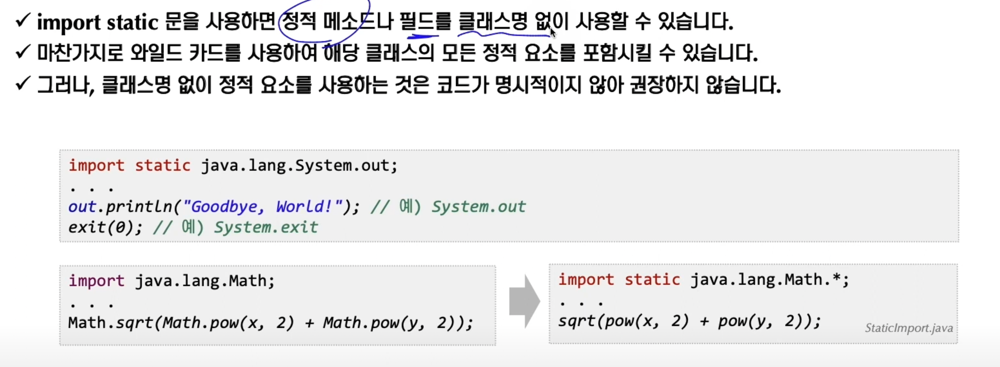

### 1. 자바 기초 정리
#### 1. static과 final 개요(1/2)

현재는 가장 기본적인 static과 final에 대해서만 학습하고 추후 상속과 inner 클래스에 들어가면 더 깊게 학습하겠다

<b style="color:aquamarine">static 키워드는 정적 키워드로 정적 필드, 정적 메소드를 선언할 대 사용한다</b>

<b style="color:dodgerblue">정적 필드, 정적 메소드 vs 인스턴스 필드, 인스턴스 메소드</b>

final 키워드는 필드에 정의할 경우 초기 한번의 초기화만 이루어지며 이후에는 다른 값을 대입할 수 없다.

static, final 키워드는 어느 위치에 있느냐에 따라 조금씩 달라지니까 확인해보자

final 키워드 위치에 따른 효과

1. 클래스에 final이 붙은 경우 : 상속이 불가

2. 메소드에 final이 붙은 경우 : 오버라이딩 금지

위 부분은 상속을 배운 이후 더 자세하게 배워보자

final 필드의 초기화 방식은 필드 선언 시점의 초기화, 초기화 블록, 생성자를 통한 초기화 방법 3가지가 있다

필드 초기화, 생성자 초기화를 주로 사용하며 순서는 필드 초기화가 가장 빠르다

메소드에서 전달 받을때 public void showMessage(final String message)를 받을수 있는데 전달 받은 파라미터에 다른 값을 넣거나 변경할 수 없다는 뜻이다

static 키워드가 적용된 필드를 정적 필드 혹은 클래스 변수라고 부른다

정적 필드(클래스변수, static 변수)는 모든 인스턴스 객체들이 공유하는 변수이며 이런 의미가 바로 클래스 변수이다

정적 필드는 객체의 인스턴스화 없이 APP이 기동될때 static 메모리에 할당되는 방식

메모리 영역은 크게 3가지로 구분이 된다(static, stack, heap)

Sudent.nextId는 static 메모리에 할당

main메소드 기준으로 Student s1 = new Student();를 하게되면

s1은 main메소드에 로컬변수이기에 stack 메모리 공간에 할당

마지막 new Student(); 객체 부분은 Heap 메모리 공간에 할당

<b style="color:dodgerblue">여기서 중요한점은 static 키워드의 경우에는 static에 할당되며 Student객체가 몇개가 생성이 되든 공통적으로 사용된다</b>

#### 2. static과 final 개요(2/2)

사용자 정의 상수 : static과 final이 동시에 적용된 필드

사용자가 마치 상수처럼 정의해서 사용하는 경우(final 키워드를 적용하여 변경이 불가능 하고, static 키워드를 붙여서 프로그램이 시작부터 끝까지 사용할 수 있게 정의)

<b style="color:aquamarine">한번 초기화 해서 변경 불가능 하며 클래스 생성없이 APP 실행부터 끝까지 사용할 수 있게 해준다</b>

Math.PI의 경우 기본으로 JAVA에서 제공

변경이 불가능 하지만 어디서든지 상수처럼 사용이 가능함

위 사용시 네이밍 규칙은(대문자로 사용 + 단어와 단어사이 _ 사용)

ex) INIT_NAME

메소드에 static으로 선언된 메소드는 인스턴스 없이 호출 할 수 있음

정적 메소드는 언제 사용할까?

1. static method에서 static field에 접근 OK

2. instance method에서 static field에 접근 OK

static field의 경우 가장 먼저 생성이 되기 때문에 static method, instance method 모두 참조 가능

3. static method에서 instance field에 접근 NO

static method는 프로그램 시작시 사용가능 하지만 instance field는 객체가 생성된 이후에 잡히기 때문에 접근 불가

4. instance method에서 당연히 instance field 접근 가능 OK

#### 3. 간단한 TravelClub 실습

[기초상식] UUID : 분산 네트워크 환경에서 고유한 값을 가질수 있도록 해주는 것

Universal Unique ID(기본으로 제너레이션 해준다)

그 다음 날짜 작업 진행

이렇게 하면 우리가 원하는 데이터 포맷에 맞게 날짜가 나오도록 클래스를 만들어보자

#### 4. 패키지 사용 이유

패키지를 통해 관련 있는 클래스들을 그룹화 한다

패키지를 사용하는 가장 큰 이유는 클래스 이름에 대한 유일성을 보장할 수 있다

클래스를 만들고 클래스의 관계를 구성하는것

기존에 제공하는 자바의 클래스를 얼마나 잘 활용하는가 도 중요하다

자바에서 제공하는 클래스(String), 우리가 만드는 별도의 클래스(String)이라고 만들면 이 두개는 이름은 동일하지만 구분 할 수 있는 이유는 패키지가 다르기 때문에 우리는 아 이게 시스템 제공이구나, 우리가 만든 클래스구나 확인 가능

패키지는 보통 도메인을 뒤집어서 만든다

<b style="color:aquamarine">static import는 정적 메소드나 필드를 클래스명 없이 사용할 수 있다</b>

import static java.lang.System.out;

...

out.println("GoodBye, World!!");

주로 TestCode Assertions.assertThat()에서 import static으로 자주 사용

컴파일을 하게 되면 패키지 구조에 따라서 /bin 하위에 동일한 패키지 구조가 생기며 바이트코드(.class)파일들이 똑같이 생기는 것을 확인 할 수 있다

참고 
 1. [[JAVA]JDK/JRE/JVM 개념&구성원리 - 티스토리 블로그](https://inpa.tistory.com/entry/JAVA-%E2%98%95-JDK-JRE-JVM-%EA%B0%9C%EB%85%90-%EA%B5%AC%EC%84%B1-%EC%9B%90%EB%A6%AC-%F0%9F%92%AF-%EC%99%84%EB%B2%BD-%EC%B4%9D%EC%A0%95%EB%A6%AC)
