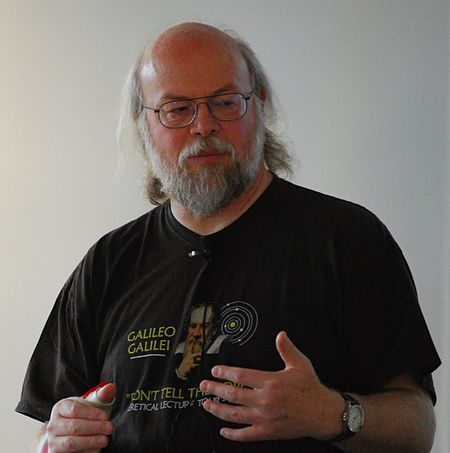

### JAVA 기초 용어 및 개념 설명 #1

#### 1장. 자바 언어의 기원

JAVA언어는 1991년 6월 셋톱(가전제품 탑재) 프로젝트를 위해 제임스 고슬링(James Gosling)이 만들었다. 
처음에는 자바의 경우 제임스 고슬링의 사무실 밖에 있던 오크 나무를 보고 오크(Oak = 한국[참나무])라고 불렀는데, 나중에 팀원들과 아무말 대잔치를 하면서 나온 단어중에 Java가 마음에 들어 선택했다고 한다. 

참고로 자바(JAVA)의 어원은 유명한 커피 재배지인 인도네시아 섬 이름인 자바섬에서 따왔다고 한다.

<b>제임스 아서 고슬링(James Arthur Gosling)</b>

자바를 최초 개발한 자바의 아버지

 
 

#### 2장. 자바의 철학

자바 언어의 5가지 철학
1. 객체 지향 방법론을 사용해야 한다.
2. 같은 프로그램(바이트코드)이 여러 운영 체제(마이크로프로세서)에서 실행될 수 있어야 한다.
3. 컴퓨터 네트워크 접근 기능이 기본으로 탑재되어 있어야 한다.
4. 원격 코드를 안전하게 실행할 수 있어야 한다.
5. 다른 객체 지향 언어들의 좋은 부분만 가지고 와서 사용하기 편해야 한다.

자바는 같은 코드로 어떤 마이크로프로세서에서나 실행되기를 원했다. 따라서 <b>자바만의 실행 코드인 바이트코드</b>라는 중간 코드를 컴파일러에 의해 생성한다. 
그리고 자바 가상 머신(JVM)에 의해 해석되어 실행되는데, C/C++ 코드로 작성되어 생성된 코드보다 일대일 상황이면 실행 속도가 느리다. 
그러나 장점은 같은 코드로 다양한 플랫폼이나 운영 체제에서 실행될 수 있다는 점이다.

 
 

#### 3장. 자바 실행 코드 생성 
> C/C++ : 특정 CPU의 기계어 코드를 직접 생성 → 기계어 코드가 메모리에 적재되어 바로 실행
> 따라서 CPU가 달라지면 컴파일러가 달라져야 한다.(gcc 컴파일러, x86컴파일러 등) 

같은 코드를 사용하여 다른 CPU에서 실행되도록 하기 위해 직접 CPU의 기계코드를 생성해서는 안된다.
그 대신 자바는 바이트코드(Java bytecode)라는 것을 생성하는데, 이것을 자바 가상 머신(JVM)이 해석을 하며 실행하게 된다.
자바 가상 머신이 인터프리터가 되어 코드 해석 방식의 실행을 함으로써, 같은 바이트코드를 가지고 여러 가진의 CPU에서 실행이 가능해진다.

> JAVA : java source file(.java)  → [javac(자바컴파일러)] → java bytecode files(.class/.jar) -> JVM → OS에 맞는 기계어

> javac HelloWorld.java → java HelloWorld(.class)[bytecode] → Hello World 출력

C언어의 경우 CPU에 따라 컴파일러가 달라져야 하며 자바는 JVM이 Bytecode를 알아서 CPU에 맞게끔 동작시켜 주기 때문에 컴파일러가 달라질 필요가 없다.

 
 

#### 4장. 자바 용어(JVM)
JVM : Java Virtual Machine 의 약자

JAVA라는 프로그래밍 언어가 인기있는 이유 > JVM을 사용함으로써 모든 플랫폼에서 제약 없이 동작 가능하도록 할 수 있다.

하지만 JVM은 각 언어에 종속되어 있기때문에 CPU에 맞는 JVM을 설치해주어야 한다.

장점 : 멀티 플랫폼 제약 X
단점 : 두번의 컴파일로 인한 속도의 문제, 상대적으로 느렸다. 현재는 하드웨어가 발전하면서 속도도 개선되었다.

 
 

#### 5장. 자바용어(JDK)
JDK : Java Development Kit의 약자
개발자들이 자바로 개발하는데 사용되는 SDK 키트로, JDK 안에는 자바 개발 시 필요한 라이브러리들과 javac, javadoc 등의 개발도구를 포함하고 있고, 개발에 필요한 자바프로그램 실행을 할 수 있게 해주는 JRE(Java Runtime Environment)도 포함되어 있다.

SDK란? 
 Software Development Kit로 프로그래밍 언어 제작사가 제공하는 툴

> JDK 버전 표기
> 자바의 버전을 표현할 때에는 보통 JDK 또는 Java SE버전으로 나타낸다.
> 초기 버전인 1.0/1.1 버전에서는 JDK 1.0 / JDK 1.2 이런식으로 버전 표기를 사용했지만, 2006년 JDK 1.6부터 JAVA SE(Java Standard Edition)로 변경된다.

Java SE(Java Standard Edition) : 가장 기본이 되는 표준 에디션의 자바 플랫폼으로 자바 언어의 핵심 기능을 제공

 - 가장 기본적인 클래스 패키지로 구성
 - PC용 어플리케이션, 애플릿개발, 응용프로그램개발, 웹개발, 안드로이드개발
 - PC에 설치해서 사용할 수 있는 모든 프로그램 개발에 관련된 것

Java EE(Java Enterprise Edition) : 대규모 기업용 에디션. SE확장판
 - 기업환경을 위한 대규모 솔루션 개발, 모바일폰, 셋탑 박스, 차량용 텔레매틱스 시스템 개발
 
JavaFX : 가볍고 예쁜 그래픽 사용자 인터페이스(GUI)를 제공하는 에디션
 - 고성능의 하드웨어 그래픽 가속과 미디어 엔진 API를 제공해주어서 프로그램의 성능에 신경을 써야 하는 분야에서 사용

버전 확인 방법 : ex) Java SE 11. 0. 2 (LTS)
 - 주버전(11) : 자바 언어에 많은 변화가 있을 경우 증가
 - 개선 버전(0) : 주 버전에서 일부 사항이 개선될 때 증가
 - 업데이트 버전 : 1~3개월 주기로 버그가 수정될때마다 증가
 - LTS : 장기 지원 서비스(Long Term Support)를 받을 수 있는 버전

JDK 종류
> 종류가 나눠져 있는 큰 이유중 하나는 라이센스 때문이다.
> 
Java 소스코드 자체는 오픈소스이다. 그래서 오픈소스인 Java 소스코드를 빌드하여 사용하는 것에는 거의 제약이 없지만 Oracle에서 제공하는 설치버전의 JDK에는 NFTC 라이센스가 적용되어 회사에서는 사용할 수 없게 된다.(돈을 내면 사용O)

하지만 여러 회사에서 다양한 JDK 종류를 출시하게 되었고 아래와 같이 유명한 JDK 종류가 있다.
1. Oracle JDK[유료] : Oracle에서 제공하는 JDK, 구독을 통해 유료 라이센스를 구매할 수 있따.
2. Open JDK [무료]: 유명한 무료 JDK. 하지만 OpenJDK를 직접 사용하는것 보다는, OpenJDK 기반으로 빌드된 JDK 사용을 추천
3. Azul Zulu[무료] : 인지도가 높은 JDK 중 하나이며, Mac 등에서 쉽게 사용할 수 있는 바이너리를 제공하는 것이 특징
4. Amazon Corretto[무료] : AWS에서 제공하는 JDK,  AWS에서 쉽게 사용 가능하며, AWS가 아니더라도 사용 가능
5. Temurin[무료] : Eclipse 에서 제공하는 JDK, Eclipse를 사용한다면 Temurin 설치를 추천

JDK 사용시에 돈을 내지 않기 위해서 라이센스를 확인해야 하며, 업데이트 지원(LTS)  JDK 사용 하는것이 바람직하다.
 
JDK 디렉토리 구성요소

 
 

#### 5장. 자바용어(JDK)

참고 
 1. [[JAVA]JDK/JRE/JVM 개념&구성원리 - 티스토리 블로그](https://inpa.tistory.com/entry/JAVA-%E2%98%95-JDK-JRE-JVM-%EA%B0%9C%EB%85%90-%EA%B5%AC%EC%84%B1-%EC%9B%90%EB%A6%AC-%F0%9F%92%AF-%EC%99%84%EB%B2%BD-%EC%B4%9D%EC%A0%95%EB%A6%AC)
