 
###  Spring Cloud로 개발하는 마이크로서비스 애플리케이션 #1

Service Discovery Netflix Eureka 사용

#### 1장. Eureka Service Discovery - 프로젝트 생성

강의 버전에서는 스프링 부트 2.4.x 버전을 사용하지만 현재는 2.7.11버전 사용 예정

자바 버전은 동일하게 11

패키징은 Jar로 선택하고 Dependency에 아래와 같이 Eureka Server만 등록

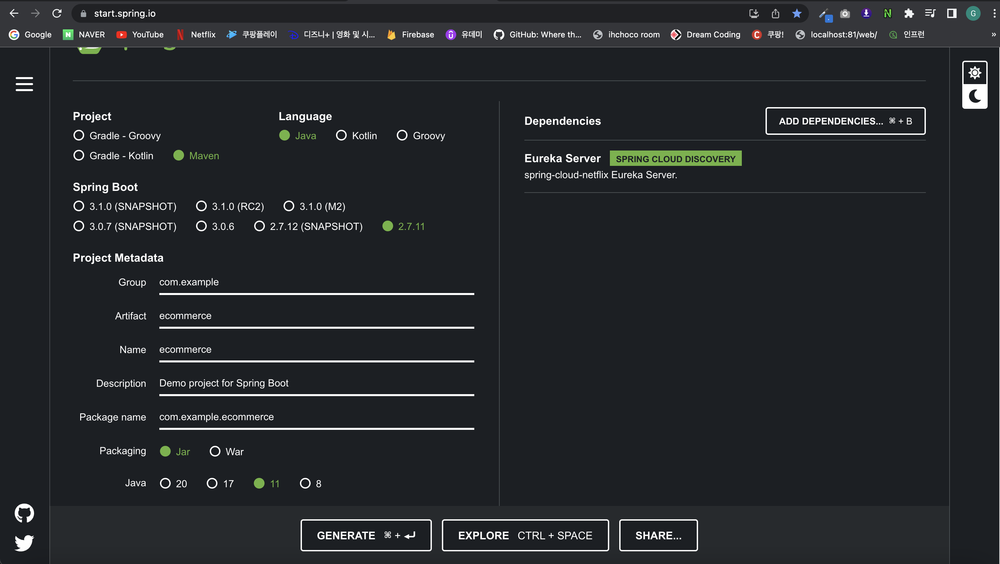

Generate 클릭 후 프로젝트를 다운받아서 zip파일을 풀어주고 인텔리제이로 OPEN

> 만약 에러가 발생하면 인텔리제이 JDK버전을 11로 맞춰줘야한다(project structure 부분 확인)

> JDK 11버전으로 맞춰주고 MAVEN Reload를 해주기


처음에는 application.properties를 application.yml로 변경해주고 아래 설정내용을 추가해주자

```yml
server:
  port: 8761

spring:
  application:
    name: discoveryservice

eureka:
  client:
    register-with-eureka: false
    fetch-registry: false
```

1. server-port : 원하는걸로 지정
2. spring-application-name : 원하는걸로 지정(ID값이라고 생각)
3. eureka-client-register-with-eureka : 기본으로 true지만 false 설정
4. eureka-client-fetch-registry : 기본으로 true지만 false 설정

<b style="color:yellow">eureka = 전화번호부 책</b>

마이크로 서비스들의 주소, ID값등을 미리 등록한다음 사용자의 요청이 왔을때 eureka에서 등록된 서비스중에 어떤 서비스로 보내야하는지 찾은다음 그쪽으로 보내주는 역할을 수행

[eureka는 웹서비스라고 생각하자]

이렇게 추가해주고 EcommerceApplication에 @SpringBootApplication 아래에 @EnableEurekaServer를 추가해주면 정상적으로 Eureka Server 기동이 되는것을 확인 할 수 있다

```java
package com.example.ecommerce;

import org.springframework.boot.SpringApplication;
import org.springframework.boot.autoconfigure.SpringBootApplication;
import org.springframework.cloud.netflix.eureka.server.EnableEurekaServer;

@SpringBootApplication
@EnableEurekaServer
public class EcommerceApplication {

	public static void main(String[] args) {
		SpringApplication.run(EcommerceApplication.class, args);
	}

}
```

> http://localhost:8761/ 

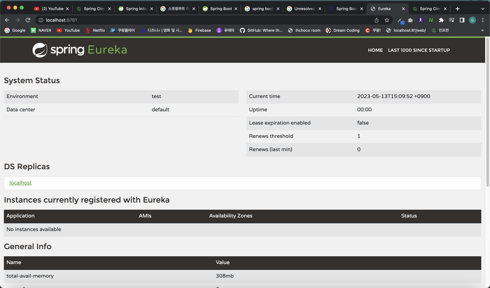


#### 2장. User Service - 프로젝트 생성

유레카 서버를 만들었으니까 이번에는 유레카 서버에 등록할 마이크로 서비스 만들기(User Service)

강의 버전에서는 스프링 부트 2.4.x 버전을 사용하지만 현재는 2.7.11버전 사용 예정

자바 버전은 동일하게 11

패키징은 Jar로 선택하고 Dependency에 아래와 같이 Eureka Discovery Client 선택(유레카 서버에 등록할 클라이언트라서)

추가로 개발시 편안하게 사용할 Dependency를 더 추가

- Eureka Discovery Client 
- Spring Boot DevTools
- Lombok
- Spring Web
  

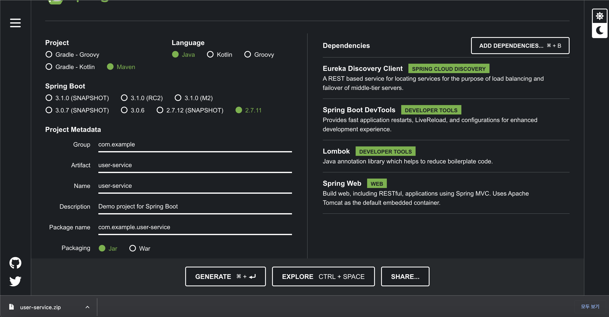

인텔리제이로 프로젝트를 오픈한다음 UserServiceApplication을 확인하고 @EnableDiscoveryClient를 위와 같이 추가해준다

@EnableEurekaClient 사용이 아니라 @EnableDiscoveryClient 사용

```java
package com.example.userservice;

import org.springframework.boot.SpringApplication;
import org.springframework.boot.autoconfigure.SpringBootApplication;
import org.springframework.cloud.client.discovery.EnableDiscoveryClient;
import org.springframework.cloud.netflix.eureka.EnableEurekaClient;

@SpringBootApplication
@EnableDiscoveryClient
@EnableEurekaClient
public class UserServiceApplication {

	public static void main(String[] args) {
		SpringApplication.run(UserServiceApplication.class, args);
	}

}
```

이렇게 추가해준다음 application.yml(application.properties)에 아래 내용을 추가해준다

```yml
server:
  port: 9001

spring:
  application:
    name: user-service

eureka:
  client:
    register-with-eureka: true
    fetch-registry: true
    service-url:
      defaultZone: http://127.0.0.1:8761/eureka
```

eureka.client.fetch-registry=true 는 유레카 서버로부터 인스턴스들의 정보를 주기적으로 가져올 것인지 설정하는 속성.

true로 설정하면 갱신된 정보를 받겠다는 설정이다.

service-url : 이부분의 경우는 유레카 클라이언트 등록할 때 서버의 위치가 어디인지 그 항목을 지정하는 곳


위와 같이 application.yml 설정이 끝나면 프로젝트 실행 시작

Eureka 서버와 User-Service 프로젝트를 동시에 시작해두고 다시한번 브라우저에서 Eureka 서버 접속

> http://localhost:8761/

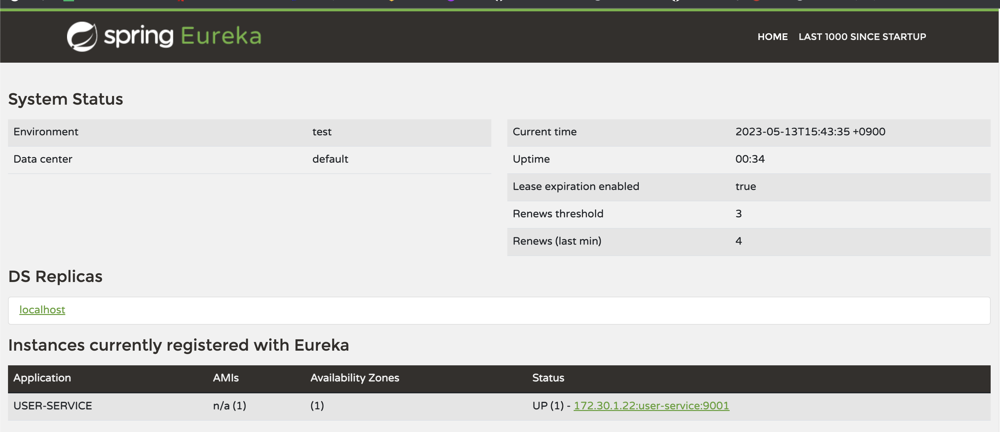

이렇게 보면 아까는 없었던 USER-SERVICE가 정상적으로 등록되는 것을 확인 할 수 있다

Availability Zones에는 몇개가 실행되고 있는지 확인 가능

Status에는 up상태일 경우 동작중, down상태일 경우 동작중지 상태 표시

```yml
...
eureka:
  client:
    register-with-eureka: true
    fetch-registry: true
    service-url:
      defaultZone: http://127.0.0.1:8761/eureka
```
아까 이 부분에서 defaultZone을 Eureka서버를 등록해두어서 위와 같이 정상적으로 서비스가 등록 되었던 것을 확인 가능

#### 3장. User Service - 등록

이번에는 User Service를 한개만 실행하는게 아니라 동일한 걸 여러개 만들어서 등록해서 사용

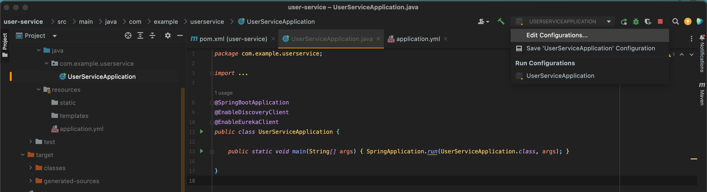

먼저 프로젝트를 실행하고 화면에 보이는 Edit Configuration 클릭

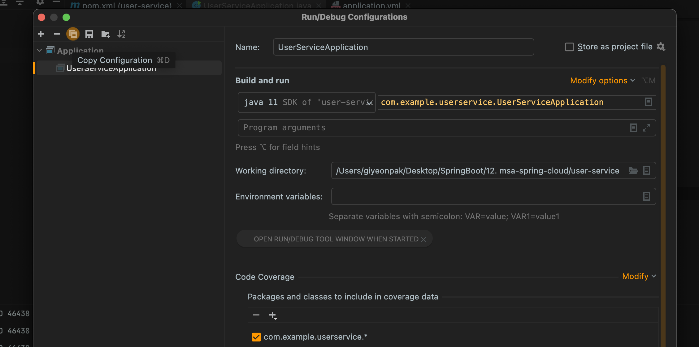

여기서 실행환경을 설정할 수 있는데 하나 더 만들기 위해서는 위에 카피를 클릭해서 동일하게 만들어주도록 하자

이렇게 하면 동일한게 하나더 생기게 되고 이름은 끝에 (1)이 생기게 되지만 보기 안좋으니 오른쪽처럼 UserServiceApplication-2 로 변경해주자


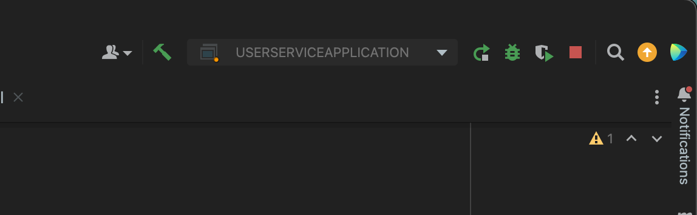

기존 UserServiceApplication의 경우에는 실행중이이라서 재실행 버튼이 보이지만 아래 새로만든걸 보면 시작할 수 있게 버튼이 활성화 되어 있음

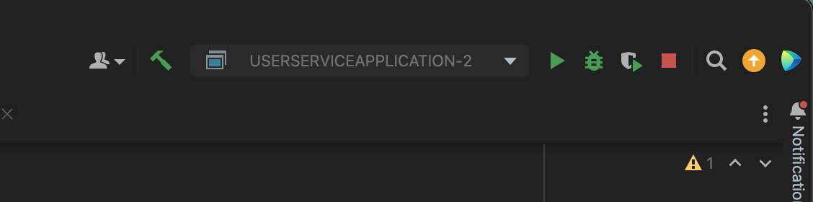

그럼 실행 버튼을 클릭해서 하나 더 실행 시켜주도록 하자

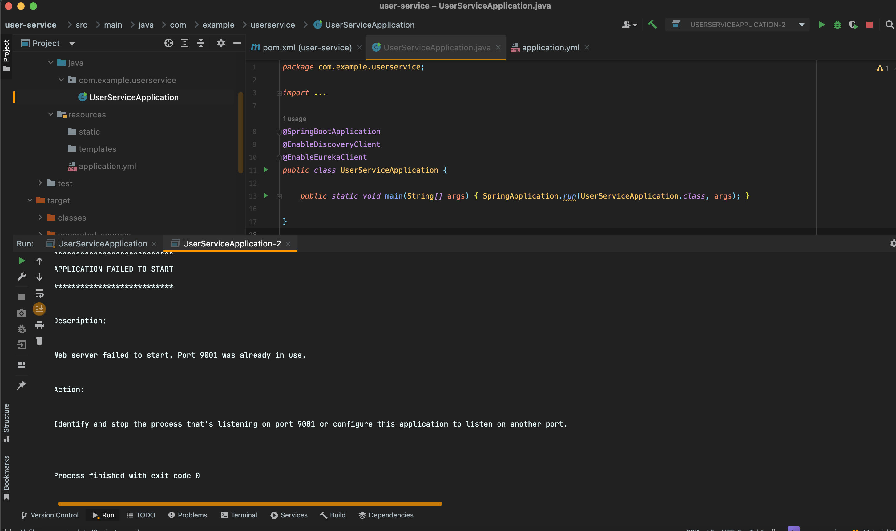

이렇게 해주면 Port 충돌이 발생하는것을 확인 할 수 있다

이미 기존에 9001 포트를 사용하기 때문에 이번에는 9002를 사용해주고 싶다

하지만 코드를 직접 바꿔주게 되면 계속 할떄마다 변경이 필요하니 불편


다시 한번 아까 실행환경 Edit 쪽으로 이동

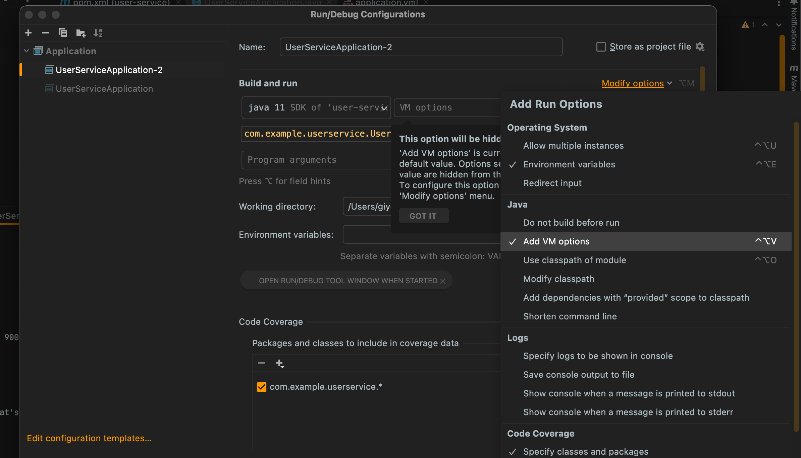

Modify options 클릭 후 Add VM Option 클릭 후 아래처럼 추가

> -Dserver.port=9002

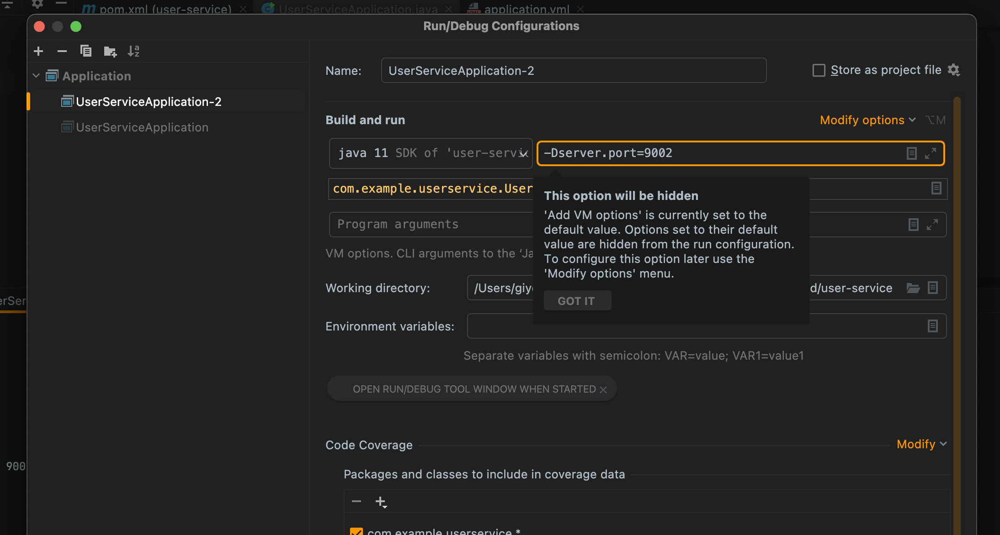

설정 추가후 apply > 확인 클릭 후 실행하면 아래 처럼 9002 포트로 동적으로 할당되어 정상 실행되는것을 확인 가능

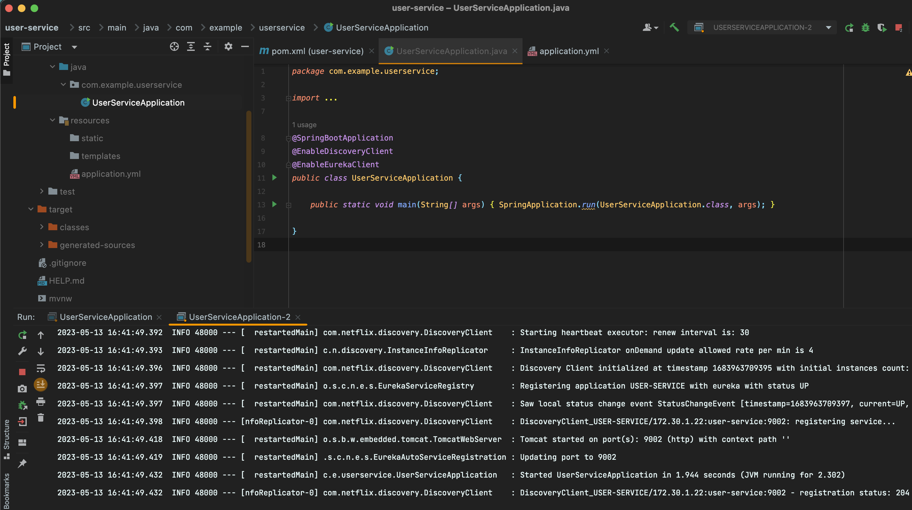

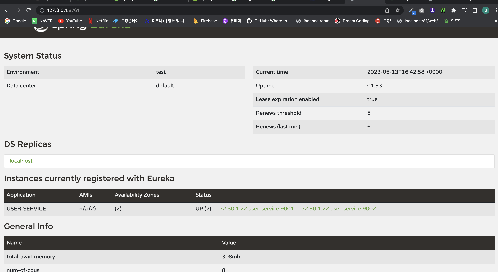

> http://127.0.0.1:8761/ 

유레카 서버에 접속해보면 위와 같이 User-Service가 하나 더 추가되어 있음

<b style="color:yellow">터미널에서 새로 추가해서 동작 시키는법(java, javac, mvn 설치 필요)</b>

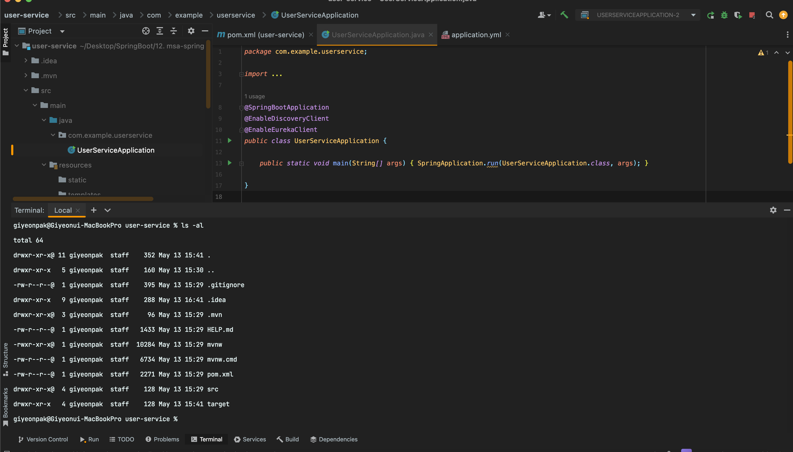

터미널 클릭하면 자동으로 해당 프로젝트로 이동되어 있고 여기서 ls -al 눌렀을때 pom.xml이 보이는 경로이면 정상적으로 작업 진행 가능

> mvn spring-boot:run -Dspring-boot.run.jvmArguments='-Dserver.port=9003'


위 명령어를 수행하기 위해서는 java -version, javac -version, mvn --version 명령어 입력했을때 모두 나와야 하는데 현재 개발 PC에 mvn이 설치되어 있지 않아 이 부분은 참고만 하자

추가로 동일 경로에서 아래 명령어 입력시 실행도 가능

```
mvn clean
//프로젝트 클린으로 만들어줌

mvn compile package
//이렇게 하면 target이라는 새로운 폴더가 생성이 된다
//만들어진 파일(.jar)은 target 폴더 아래에 user-service-0.0.1-SNAPSHOT.jar 로 생성

java -jar -Dserver.port=9004 ./target/user-service-0.0.1-SNAPSHOT.jar
//이렇게 실행해주면 터미널로 직접 jar 파일 실행 가능

```

이렇게 할때마다 포트 변경은 하기가 쉽지 않다.(불편)

스프링에서 제공해주는 편리한 기능을 사용해보자

#### 4장. User Service - Load Balancer

User Service를 여러개 만들어 보았지만 할때마다 포트번호를 지정하면 불편함

스프링에서 제공하는 랜덤포트 방식을 사용해보자

[user-service 프로젝트] application.yml

```yml
server:
  port: 9001

spring:
  application:
    name: user-service

eureka:
  client:
    register-with-eureka: true
    fetch-registry: true
    service-url:
      defaultZone: http://127.0.0.1:8761/eureka
```

여기서 port번호를 0으로 일단 변경

```yml
server:
  port: 0

spring:
  application:
    name: user-service

eureka:
  client:
    register-with-eureka: true
    fetch-registry: true
    service-url:
      defaultZone: http://127.0.0.1:8761/eureka
```

포트를 0으로 해주게 되면 자동으로 랜덤으로 포트를 할당 하겠다는 뜻(포트 충돌 방지 가능)

기존에 만들었던 UserServiceApplication-2는 필요가 없기 때문에 아래처럼 삭제 진행

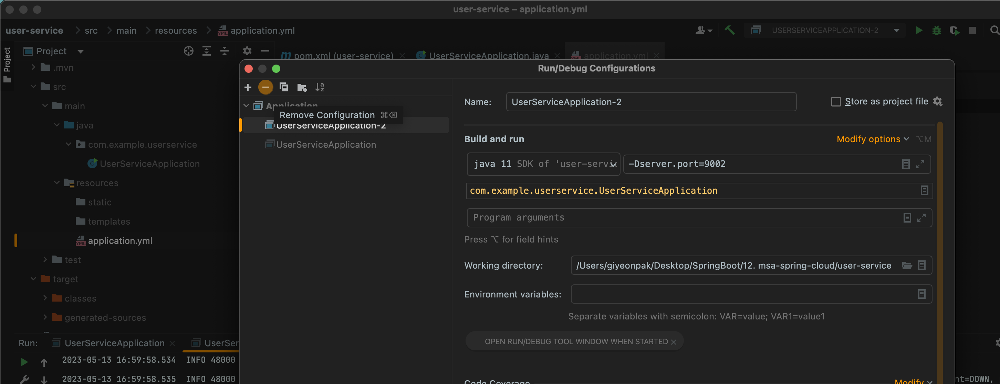

다시 실행하면 아래와 같이 확인 가능하고 화면 왼쪽 하단에 보면 63834 같은 랜덤포트가 할당되는것을 확인 할 수 있다

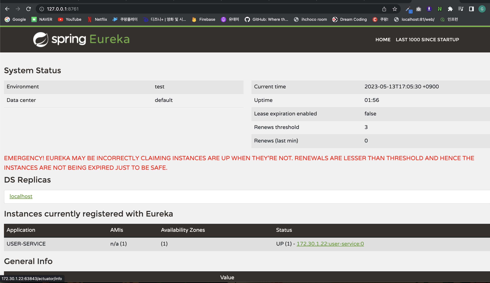

다시한번 터미널로 가서 mvn spring-boot:run을 입력하게 되면 정상적으로 서비스가 동작되는것을 확인 가능

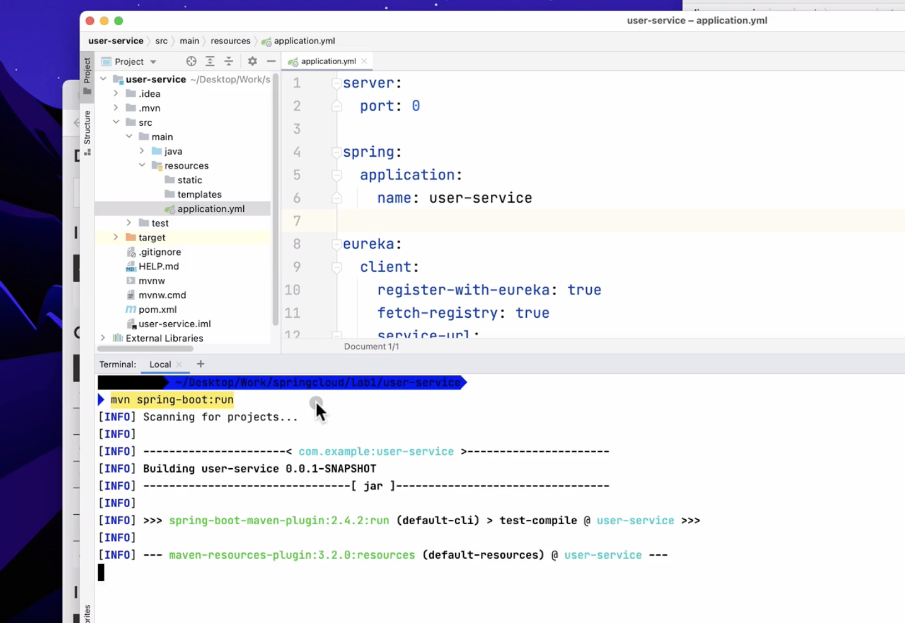

이렇게 하나더 추가하고 유레카를 확인해봤는데 분명 2개가 떠있어야 하지만 0번 하나만 떠있는걸로 보인다

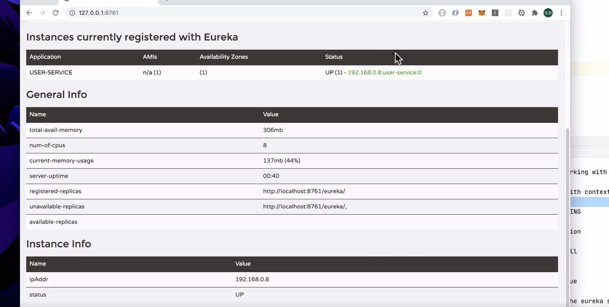

위에 보여지는 포트는 실제 포트가 아니라 application.yml에 할당되어 있는 포트정보를 보여주도록 되어있어서 저렇게 1개로만 표시

그런데 저렇게 보이면 안되니까 정상적으로 보이게 설정을 조금 수정

아래 내용 추가

```yml
eureka:
  instance:
    instance-id: ${spring.cloud.client.hostname}:${spring.application.instance_id:${random.value}}
```


application.yml[기존]
```yml
server:
  port: 0

spring:
  application:
    name: user-service

eureka:
  client:
    register-with-eureka: true
    fetch-registry: true
    service-url:
      defaultZone: http://127.0.0.1:8761/eureka
```
application.yml[수정]
```yml
server:
  port: 0

spring:
  application:
    name: user-service

eureka:
  client:
    register-with-eureka: true
    fetch-registry: true
    service-url:
      defaultZone: http://127.0.0.1:8761/eureka
```

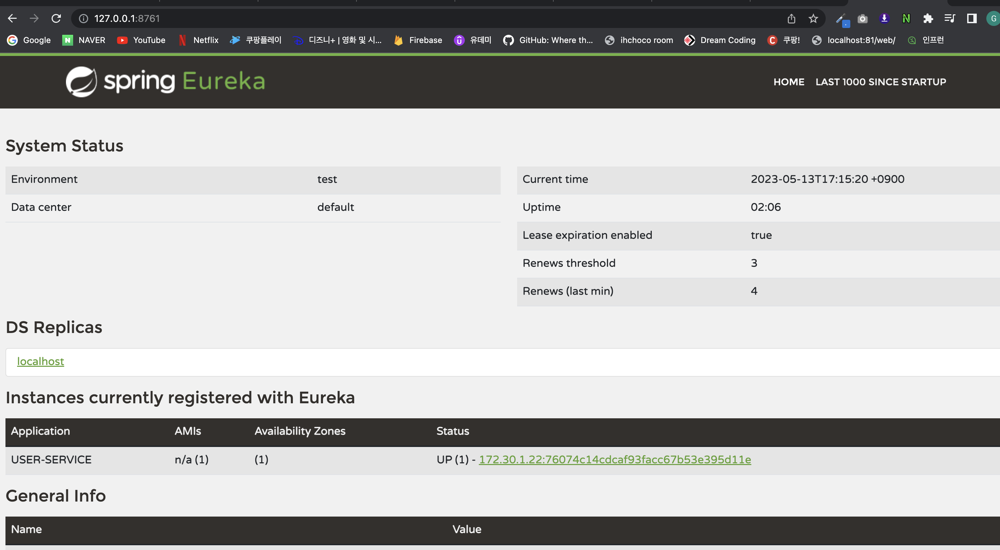

위 처럼 기존에 0번 포트가 아니라 설정한 대로 변경되서 보여지는것을 확인 가능

>현재는 mvn이 설치되어 있지 않아 한개로만 실행하였지만 터미널에서 아래 명령어를 입력해서 여러개 띄울수 있음

```
//경로는 user-service 프로젝트(ls -al 했을때 pom.xml 보이는 경로)
mvn spring-boot:run 
```

이렇게 해주면 서비스를 하나 더 띄울수 있음

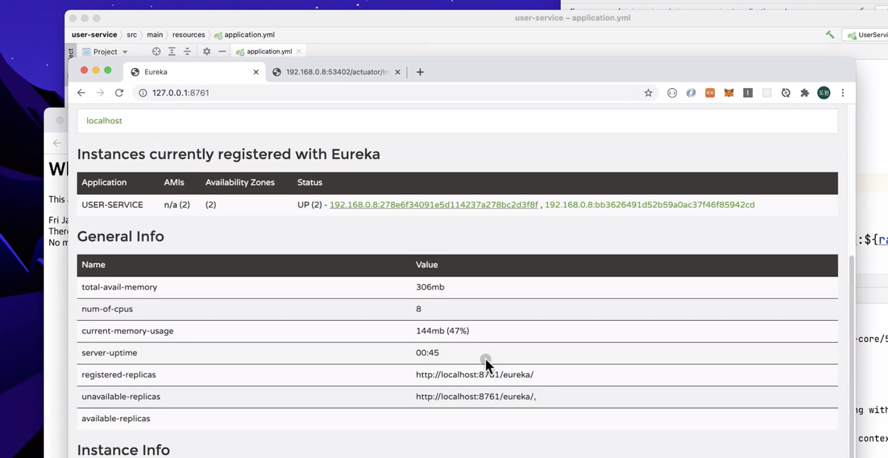

<b style="color:yellow">자동으로 포트가 부여되고 여러개 인스턴스가 만들어지며 각각의 서비스들은 유레카 서비스에 등록</b>

<b style="color:aqua">라우팅서비스와 게이트웨이에 의해 필요한 서비스가 호출되는 로들밸런싱 수행 가능</b>

<br>    
<br>


참고  
 1. [Spring Cloud로 개발하는 마이크로서비스 애플리케이션(MSA)](https://www.inflearn.com/course/%EC%8A%A4%ED%94%84%EB%A7%81-%ED%81%B4%EB%9D%BC%EC%9A%B0%EB%93%9C-%EB%A7%88%EC%9D%B4%ED%81%AC%EB%A1%9C%EC%84%9C%EB%B9%84%EC%8A%A4/dashboard)
