 
###  Spring Cloud로 개발하는 마이크로서비스 애플리케이션 #2

API Gateway 사용

#### 1장. API Gateway란?

기존의 전통적인 방식에서는 모바일APP, WebAPP에서 해당 Microservice의 주소를 참조하며 사용하였지만 이럴경우 새롭게 마이크로서비스가 추가되는 경우 모바일APP, WEBAPP에 새롭게 추가된 Microservice 엔드포인트를 같이 추가하여 수정후 배포해야한다

> 하지만 중간에 진입로를 두고 모바일APP, 웹APP 한 곳을 바라보고 있다면 새롭게 Microservice가 추가되어도 클라이언트는 별도로 수정한다음 배포할 필요는 없다

<b style="color:yellow">즉 클라이언트는 API GATEWAY만 바로보고 신경쓰면 되고 그 뒤에 대해서는 추가가되든 삭제가 되든 신경 X</b>


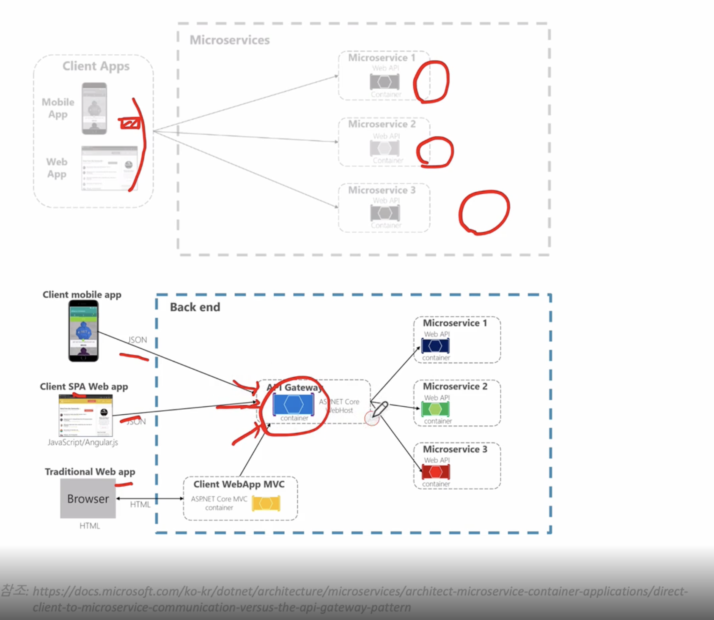

API GATEWAY 장점
1. 인증 및 권한 부여(단일로 작업 가능)
2. 서비스 검색 통합
3. 응답캐싱
4. 정책, 회로차단기 및 QoS 다시 시도(일괄적으로 정책 지정도 가능)
5. 속도제한
6. 부하분산(로드밸런싱)
7. 로깅(ELK), 추적, 상관관계
8. 헤더, 쿼리 문자열 및 청구 변환
9. IP 허용 목록에 추가

API Gateway를 구현하기 전에 잠깐 Netflix Ribbon에 대해서 알아보기

스프링클라우드에서 MSA 내부에 마이크로서비스 사이에 통신하는 방법은 

1. RestTemplate
2. Feign Client

대표적으로 2가지 방식이 있다

RestTemplate 예시는 보통 아래와 같다(전통적으로 자주 자바에서 다른 AP서버와 통신할 때 사용)

```java
RestTemplate restTemplate = new RestTemplate();
restTemplate.getForObject("http://localhost:8080/", User.class, 200);
```

스프링 클라우드에서는 Feign Client를 이용해서 호출할 수 있다

```java
@FeignClient("stores")
public interface StoreClient{
  @RequestMapping(method = RequestMethod.GET, value = "/stores")
  List<Store> getStores();
}
```
특정한 인터페이스를 만들고 앞에 있는 인터페이스에서 호출하고 싶은 이름을 등록(FeignClient)

이렇게 하면 RestTemplate처럼 IP,Port 없이 Microservice 이름만 가지고 호출 할 수 있다

User라는 서비스에서 FeignClient 등록하고 Stores가 호출하겠다고 하면 그냥 원래 자기 안에 있었던 메소드인것처럼 바로 사용 할 수 있다

문제는 로드밸런서를 어디에 구축하는지가 문제였음 => 해결하기 위해 Netflix Ribbon이 만들어짐

<b style="color:aqua">Ribbon : Client Side Load Balancer </b>

리본은 클라이언트 사이드 로드 밸런서이므로 특정 가운데 서버에 설치되는것이 아니라 클라이언트 쪽에 Ribbon 에이전트가 설치되는 방식으로 진행된다

<b style="color:yellow">최근에는 Ribbon이 잘 사용되지 않는다(비동기 지원 X 등 문제)</b>

Ribbon 사용 장점
1. 서비스 이름으로 호출가능
2. Health Check 가능

 
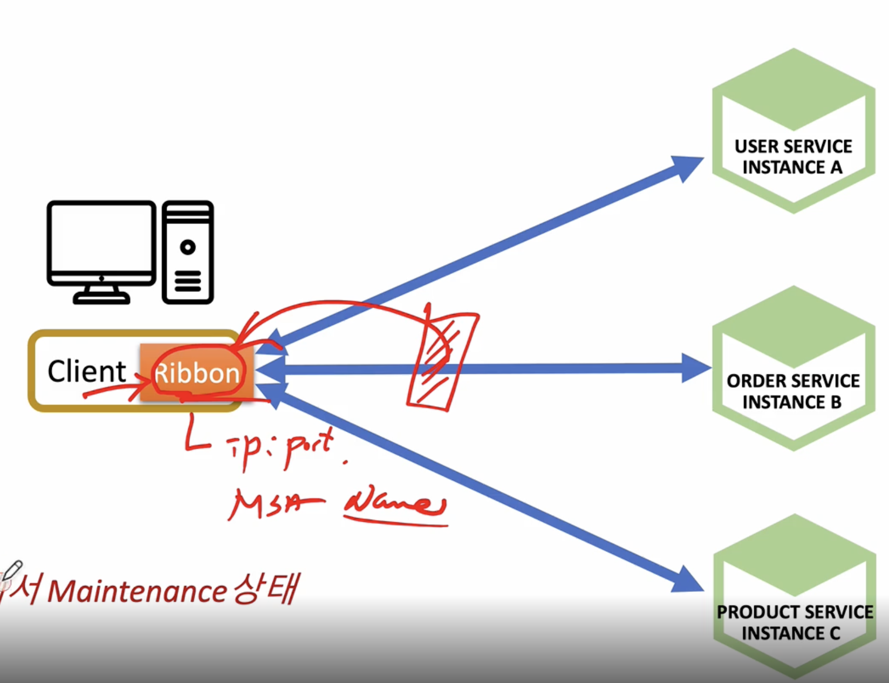

위 처럼 API Gateway가 있지 않고 Ribbon이 클라이언트 쪽에 설치되서 API Gateway처럼 역할을 수행

IP, Port없이 그냥 Service Name으로 바로 통신 가능한 장점

- Spring Cloud Ribbon은 Spring Boot 2.4에서 Maintenance 상태

<b style="color:aqua">스프링부트 2.4 이상부터는 Ribbon 사용 대신 Spring Cloud Loadbalancer를 사용 권장</b>

 


Ribbon을 대체할 다른 방법

<b style="color:aqua">Netflix Zuul(API Gateway) 구현</b>

클라이언트는 Netflix ZUUL에 대해서만 신경쓰고 데이터 요청하고 Netflix ZUUL이 First Service, Second Service로 보내줄 수 있다

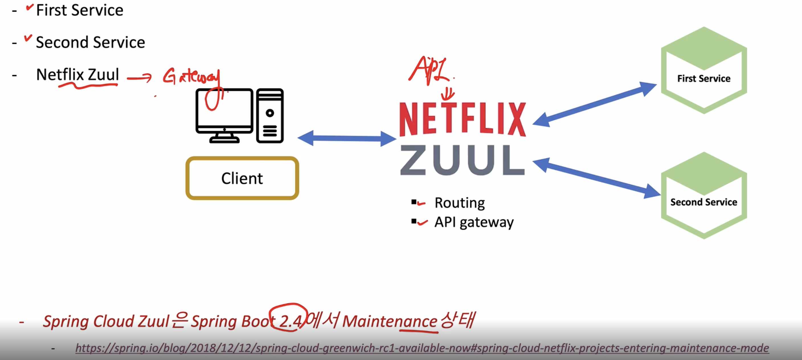

- 마찬가지로 Maintenance 상태

<b style="color:aqua">스프링부트 2.4 이상부터는 ZUUL 사용 대신 Spring Cloud Gateway를 사용 권장</b>

#### 3장. Netflix Zuul - 프로젝트 생성

Zuul을 사용하기 위해서 스프링 버전 2.3.8 필요함(해당 내용은 참고용으로 보기)

하지만 first-service, second-service의 경우는 프로젝트 생성 필요(start.spring.io)

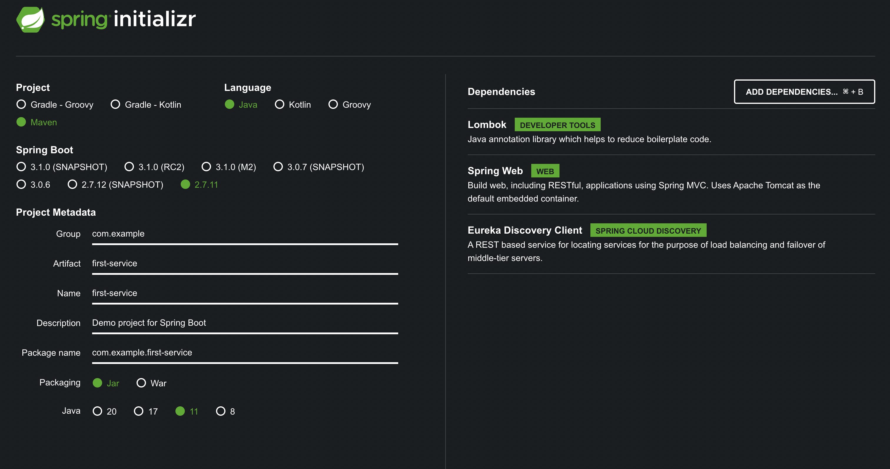

second-service도 Artifact만 바꿔서 만들어주기

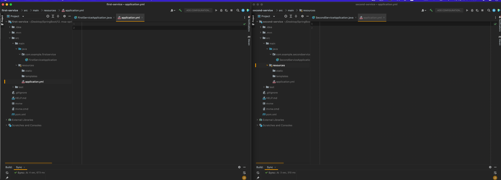

두 개 프로젝트 만들어서 인텔리제이로 실행

추가로 간단한 컨트롤러 만들어주기(FirstServiceController, SecondServiceController)

경로는 FirstServiceApplication이랑 동일 경로에 새로운 클래스 추가해서 아래 내용 추가

```java
package com.example.firstservice;

import org.springframework.boot.SpringApplication;
import org.springframework.boot.autoconfigure.SpringBootApplication;

@SpringBootApplication
public class FirstServiceApplication {

	public static void main(String[] args) {
		SpringApplication.run(FirstServiceApplication.class, args);
	}
}
```

```yml
server:
  port: 8081

spring:
  application:
    name: my-first-service

eureka:
  client:
    fetch-registry: false
    register-with-eureka: false
```

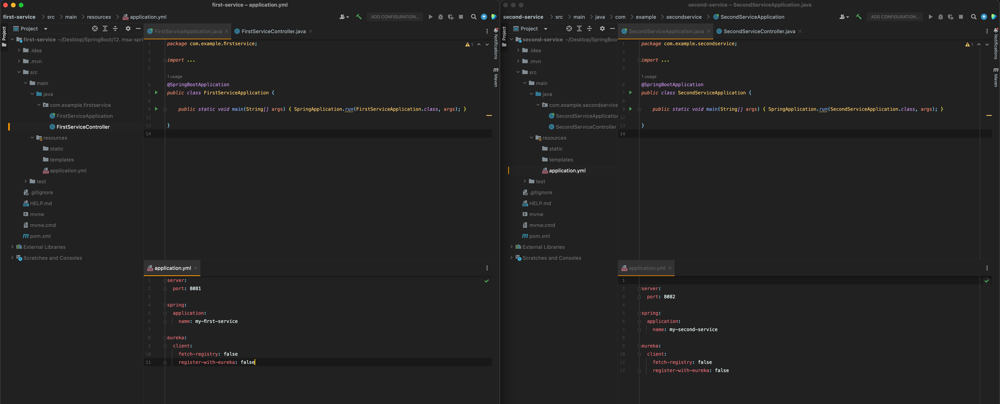

SecondService에도 동일하게 작업 필요(대신 Port는 8082번으로 변경)

return 내용도 first, second 구분될수 있도록 하기

추가로 ZUUL 프로젝트 생성 및 filter 방법의 경우는 이미 버전이 낮아 사용하지 않을것 같구 그냥 참고용으로 알아만 두기 위해서 별도로 블로그에는 글을 남기지 않겠음

대신 Spring Cloud Gateway는 필요하니 학습내용 기록 필요

#### 4장. Spring Cloud Gateway 란?

> Zuul 1버전은 비동기 지원 X, 2버전부터 지원
>
> Spring Cloud Gateway는 비동기 지원함(최신 트렌드에 맞음 - 현재는 아닐수도..)

설정법의 경우 ZUUL과 유사함

<br>

#### 5장. Spring Cloud Gateway - 프로젝트 생성

새로운 프로젝트 생성(Spring Cloud Gateway) - start.spring.io

디펜던시
1. DevTools
2. Eureka Discovery Client
3. Gateway

자바 버전 : 11
패키징 : jar
빌드도구 : Maven
artifact : apigateway-service

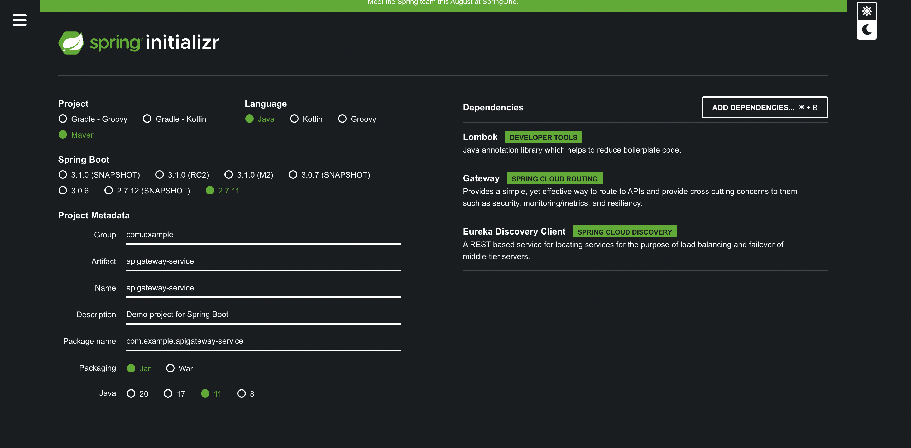

프로젝트 생성 후 인텔리제이로 오픈한 다음 application.yml에 들어가서 아래 설정을 추가해준다

(현재는 Eureka 서버에 등록하지 않기 위해서 아래 설정에 false로 지정하였음)

```yml
server:
  port: 8000

eureka:
  client:
    register-with-eureka: false
    fetch-registry: false
    service-url:
      defaultZone: http://localhost:8761/eureka

spring:
  application:
    name: apigateway-service
  cloud:
    gateway:
      routes:
        - id: first-service
          uri: http://localhost:8081/
          predicates:
            - Path=/first-service/**
        - id: second-service
          uri: http://localhost:8082/
          predicates:
            - Path=/second-service/**
```

여기서 gateway를 보면 id값이 들어오면 해당 uri로 전달하겠다는 뜻이고 Predicates의 경우 조건절이라고 생각하면 된다


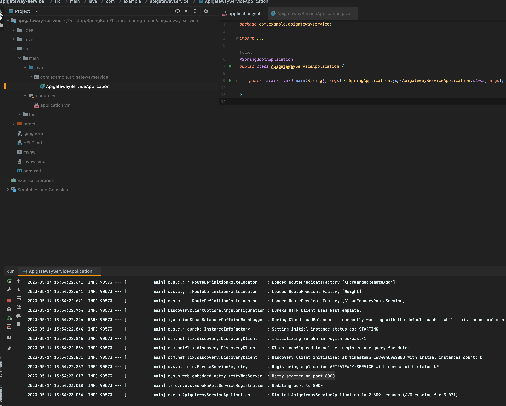

실행하면 정상적으로 서버가 기동이 되는데 여기서 보면 Tomcat이 아니라 Netty 서버가 기동되는 것을 확인 할 수 있다(비동기 처리)

<b style="color:yellow">API-Gateway = 비동기서버(Netty)사용</b>

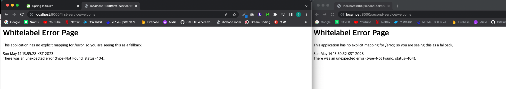

그런데 이렇게 하고 아래 URL을 입력하면 404 에러 발생

> http://localhost:8000/first-service/welcome

> http://localhost:8000/second-service/welcome

<br>
<br>

<b>http://localhost:8081/welcome 우리가 만든 프로젝트가 받기로 한 URI</b>

<br>

<b>하지만 API-GATEWAY를 통해서 전달받을 때에는 http://locahost:8081/first-service/welcome 이렇게 받기 때문에 에러가 발생</b>

그래서 이 문제를 해결하기 위해서는 기존에 만들었던 FirstService, SecondService의 컨트롤러 부분을 수정해주면 해결할 수 있다

[FirstServiceController] Before
```java
package com.example.firstservice;

@RestController
@RequestMapping("/")
public class FirstServiceController {
    @GetMapping("/welcome")
    public String welcome(){
       return "Welcome to the First Service";
    }
}
```

[FirstServiceController] After
```java
//http://localhost:8081/welcome 우리가 만든 프로젝트가 받기로 한 URI
//하지만 API-GATEWAY를 통해서 전달받을 때에는 http://locahost:8081/first-service/welcome 이렇게 받기 때문에 에러가 발생
//그러면 받는 URI처럼 /first-service를 모두 받을수 있게 처리
@RestController
@RequestMapping("/first-service") //요기 변경
public class FirstServiceController {
    @GetMapping("/welcome")
    public String welcome(){
       return "Welcome to the First Service";
    }
}
```

위에처럼 변경해주고 Second-Service도 동일하게 작업해주면 아래처럼 정상적으로 동작하는것을 확인 가능

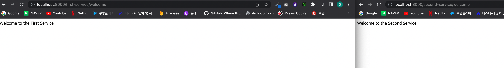

<b>만약 Page NotFound가 나오는 경우에는 ApiGateWay에 설정한 uri + predicates(/first-service 등) 정보도 같이 넘어가니 이 점 유의해서 구현하면 정상적으로 동작할 것</b>


<br>    
<br>

#### 6장. Spring Cloud Gateway - Filter

스프링 클라우드 게이트웨이 필터의 프로세스

스프링 클라이언트가 게이트웨이쪽으로 어떤 요청을 전달하게 되면 First, Second 서비스로 갈지 분기처리를 해준다


[Sprinc Cloud Gateway 내부 구조]

1. Gateway Handler Mapping 에서 먼저 클라이언 요청을 바든ㄴ다

2. 요청에 대한 사전 조건을 Predicate에서 보고 분기 처리를 해준다

여기서 pre filter, post filter의 경우 기존에 yml 파일에서 작업을 했는데 이번에는 java code로 작성해 보겠다


아래와 같이 스프링 클라우드 게이트웨이 필터 Config를 작성

[작업내역]

routes에서 처음에 /first-service/**라는 것이 들어오면 request Header, response Header에 내가 원하는 값을 추가해주고
  uri(http://localhost:8081)쪽으로 보낸다음 결과값을 다시 클라이언트쪽에 보내주는 역할을 하겠다


그 이후 마이크로서비스쪽에 작업을 해주면 된다

[FirstServiceController.java] , [SecondServiceController.java] 작업 진행


즉 테스트를 해보면 URL(127.0.0.1:8000/first-service/message) 라고 요청을 하면 아래와 같이 출력되도록 하겠다

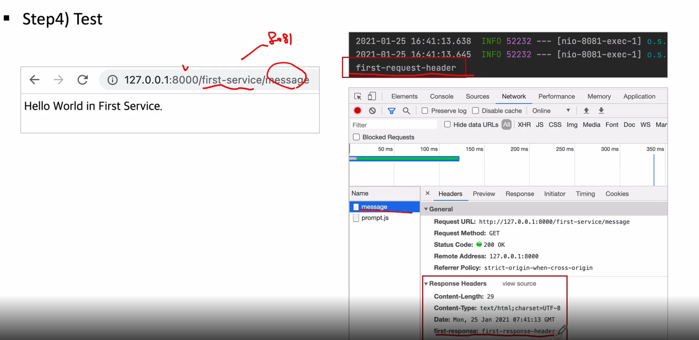

위 라우팅 작업을 자바 코드에 의해서 진행하도록 하겠다

[기존에 만들었던 프로젝트 apigateway-service에 있는 ]

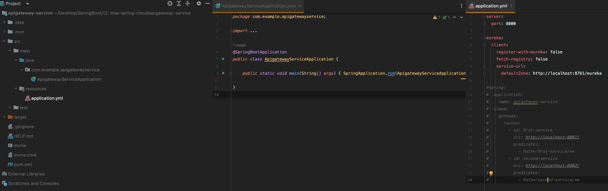

위에 application.yml 파일에 작성했던 부분 주석 처리

```yml
server:
  port: 8000

eureka:
  client:
    register-with-eureka: false
    fetch-registry: false
    service-url:
      defaultZone: http://localhost:8761/eureka

#spring:
#  application:
#    name: apigateway-service
#  cloud:
#    gateway:
#      routes:
#        - id: first-service
#          uri: http://localhost:8081/
#          predicates:
#            - Path=/first-service/**
#        - id: second-service
#          uri: http://localhost:8082/
#          predicates:
#            - Path=/second-service/**
```

위 부분을 자바 코드로 변환

먼저 com.example.apigatewayservice 아래에 config 패키지를 생성 후 FilterConfig 클래스 생성

[기본 구조]
```java
package com.example.apigatewayservice.config;

import org.springframework.cloud.gateway.route.RouteLocator;
import org.springframework.cloud.gateway.route.builder.RouteLocatorBuilder;
import org.springframework.context.annotation.Bean;
import org.springframework.context.annotation.Configuration;

@Configuration
public class FilterConfig {
    @Bean
    public RouteLocator gatewayRoutes(RouteLocatorBuilder builder){
        return builder.routes()
                .route(r -> r.path()
                        .filters()
                        .uri())
                .build();
    }
}
```

```java
package com.example.apigatewayservice.config;

import org.springframework.cloud.gateway.route.RouteLocator;
import org.springframework.cloud.gateway.route.builder.RouteLocatorBuilder;
import org.springframework.context.annotation.Bean;
import org.springframework.context.annotation.Configuration;

@Configuration
public class FilterConfig {
    @Bean
    public RouteLocator gatewayRoutes(RouteLocatorBuilder builder){
        return builder.routes()
                .route(r -> r.path("/first-service/**")
                        .filters(f -> f.addRequestHeader("", "")
                                      .addResponseHeader("", ""))
                        .uri("http://localhost:8081"))
                .build();
    }
}
```

filter에 헤더 추가

```java
package com.example.apigatewayservice.config;

import org.springframework.cloud.gateway.route.RouteLocator;
import org.springframework.cloud.gateway.route.builder.RouteLocatorBuilder;
import org.springframework.context.annotation.Bean;
import org.springframework.context.annotation.Configuration;

@Configuration
public class FilterConfig {
    @Bean
    public RouteLocator gatewayRoutes(RouteLocatorBuilder builder){
        return builder.routes()
                .route(r -> r.path("/first-service/**")
                        .filters(f -> f.addRequestHeader("first-request", "first-request-header")
                                      .addResponseHeader("first-response", "first-response-header"))
                        .uri("http://localhost:8081"))
                .build();
    }
}
```

체이닝을 사용해서 두번째 서비스도 등록
```java
@Configuration
public class FilterConfig {
    @Bean
    public RouteLocator gatewayRoutes(RouteLocatorBuilder builder){
        return builder.routes()
                .route(r -> r.path("/first-service/**")
                        .filters(f -> f.addRequestHeader("first-request", "first-request-header")
                                      .addResponseHeader("first-response", "first-response-header"))
                        .uri("http://localhost:8081"))
                .route(r -> r.path("/second-service/**")
                        .filters(f -> f.addRequestHeader("second-request", "first-request-header")
                                .addResponseHeader("second-response", "first-response-header"))
                        .uri("http://localhost:8082"))
                .build();
    }
}
```

이렇게 작성 한 후 FirstServiceController를 수정

[기존 코드]
```java
package com.example.firstservice;

import org.springframework.web.bind.annotation.GetMapping;
import org.springframework.web.bind.annotation.RequestMapping;
import org.springframework.web.bind.annotation.RestController;

// http://localhost:8081/welcome 우리가 만든 프로젝트가 받기로 한 URI
// 하지만 API-GATEWAY를 통해서 전달받을 때에는 http://locahost:8081/first-service/welcome 이렇게 받기 때문에 에러가 발생
@RestController
@RequestMapping("/first-service")
public class FirstServiceController {
    @GetMapping("/welcome")
    public String welcome(){
       return "Welcome to the First Service";
    }
}
```

[추가 코드]
```java
@RestController
@RequestMapping("/first-service")
public class FirstServiceController {
    @GetMapping("/welcome")
    public String welcome(){
       return "Welcome to the First Service";
    }

    //이 부분 추가
    @GetMapping("/message")
    public String message(@RequestHeader("first-rquest") String header){
        

    }
}

```

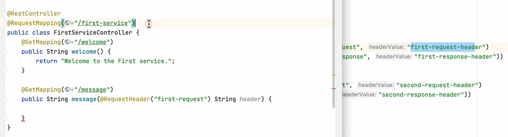

여기서 아까 만들었던 headerValue가 public String message(@RequestHeader("first-request") String header) 부분에 들어간다

[참고] @Slf4j //롬복의 로그를 사용하기 위한 어노테이션

메세지 로그를 남기기 위해 사용

```java
package com.example.firstservice;

import lombok.extern.slf4j.Slf4j;
import org.springframework.web.bind.annotation.GetMapping;
import org.springframework.web.bind.annotation.RequestHeader;
import org.springframework.web.bind.annotation.RequestMapping;
import org.springframework.web.bind.annotation.RestController;

// http://localhost:8081/welcome 우리가 만든 프로젝트가 받기로 한 URI
// 하지만 API-GATEWAY를 통해서 전달받을 때에는 http://locahost:8081/first-service/welcome 이렇게 받기 때문에 에러가 발생
@RestController
@RequestMapping("/first-service")
@Slf4j //롬복의 로그를 사용하기 위한 어노테이션
public class FirstServiceController {
    @GetMapping("/welcome")
    public String welcome(){
       return "Welcome to the First Service";
    }

    @GetMapping("/message")
    public String message(@RequestHeader("first-request") String header){
        log.info(header);
        return "Hello World in First Service";
    }
}

```

위와 동일하게 SecondService쪽도 작업 해주기

```java
package com.example.secondservice;

import lombok.extern.slf4j.Slf4j;
import org.springframework.web.bind.annotation.GetMapping;
import org.springframework.web.bind.annotation.RequestHeader;
import org.springframework.web.bind.annotation.RequestMapping;
import org.springframework.web.bind.annotation.RestController;

@RestController
@RequestMapping("/second-service")
@Slf4j
public class SecondServiceController {
    @GetMapping("/welcome")
    public String welcome(){
       return "Welcome to the Second Service";
    }

    @GetMapping("/message")
    public String message(@RequestHeader("second-request") String header){
        log.info(header);
        return "Hello World in Second Service";
    }

}
```

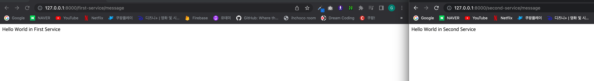

이렇게 하면 정상적으로 출력 되는 것을 확인할 수 있다

로그에 first-request-header도 정상적으로 출력

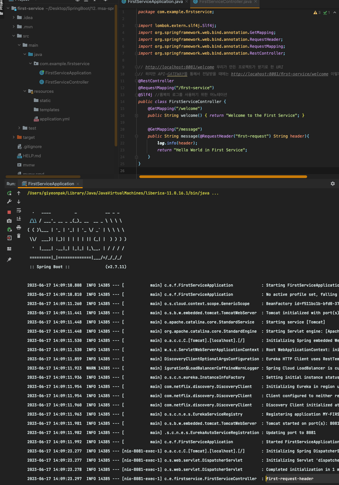

그런데 위에 FilterConfig 클래스는 이런게 있다 정도만 쓰는거고 사용X => 때문에 일단 @Configuration, @Bean을 주석 처리 하자

```java
// @Configuration
public class FilterConfig {
    //Bean
    public RouterLocator gatewayRoutes(RouteLocatorBuilder builder){

    }
}
```

이 상태로 실행해보면 똑같은 URI 입력해도 아무것도 안나오는것을 확인 할 수 있다

[기존 코드]
```yml
server:
  port: 8000

eureka:
  client:
    register-with-eureka: false
    fetch-registry: false
    service-url:
      defaultZone: http://localhost:8761/eureka

#spring:
#  application:
#    name: apigateway-service
#  cloud:
#    gateway:
#      routes:
#        - id: first-service
#          uri: http://localhost:8081/
#          predicates:
#            - Path=/first-service/**
#        - id: second-service
#          uri: http://localhost:8082/
#          predicates:
#            - Path=/second-service/**
```

주석 풀고 filters 추가해주자

```yml
server:
  port: 8000

eureka:
  client:
    register-with-eureka: false
    fetch-registry: false
    service-url:
      defaultZone: http://localhost:8761/eureka

spring:
  application:
    name: apigateway-service
  cloud:
    gateway:
      routes:
        - id: first-service
          uri: http://localhost:8081/
          predicates:
            - Path=/first-service/**
          filters:
            - AddRequestHeader=first-request, first-request-header2
            - AddResponseHeader=first-response, first-response-header2
        - id: second-service
          uri: http://localhost:8082/
          predicates:
            - Path=/second-service/**
          filters:
            - AddRequestHeader=second-request, second-requests-header2
            - AddResponseHeader=second-response, second-response-header2
```

이렇게 해주면 위 자바 코드와 동일하게 header에 추가되는것을 확인 할 수 있다


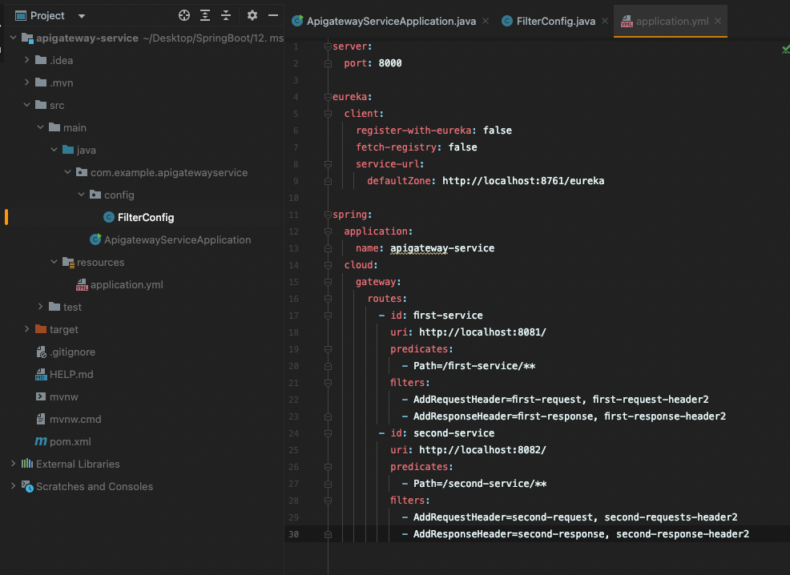

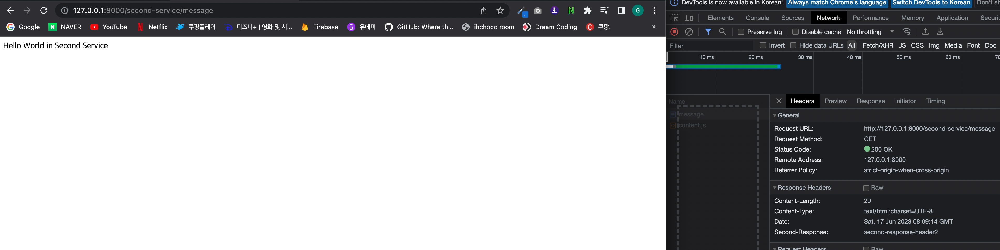

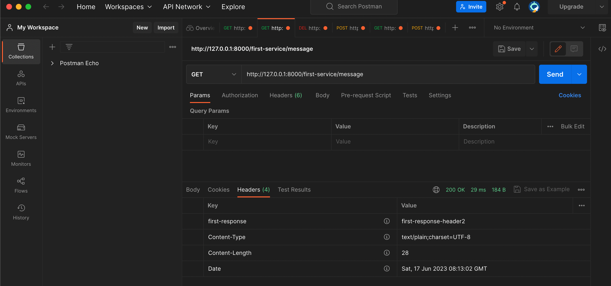

#### 7장. Spring Cloud Gateway - Custom Filter

커스텀 필터 = 자유롭게 로그남기기, 인증 처리, 키 등 처리를 할 수 있는것

1. @Component
2. Slf4j
3. AbstractGatewayFilterFactory 상속
4. public GatewayFilter apply(Config config) 오버라이드

우리가 작성하고자 하는 내용을 apply에 작성하면 된다

사용자가 로그인 했을때 토큰을 받고 그것을 계속 JSON으로 가지고 다니는 것을 JWT라고 하는데 이것을 잘 작동하고 있는지 확인하는것을 만들어보자

> 기존에 사용했던 ServletRquest, ServletResponse를 스프링 5 부터는 더이상 사용하지 않고 ServerHttpRequest, response를 사용한다

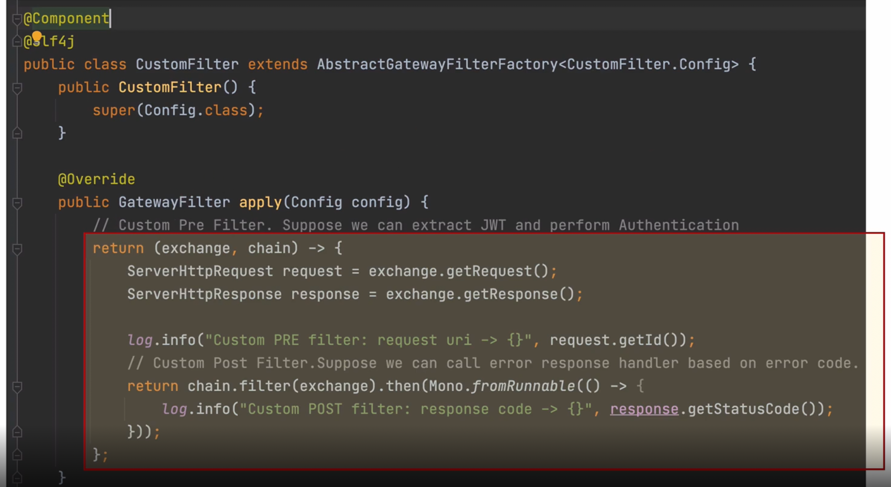

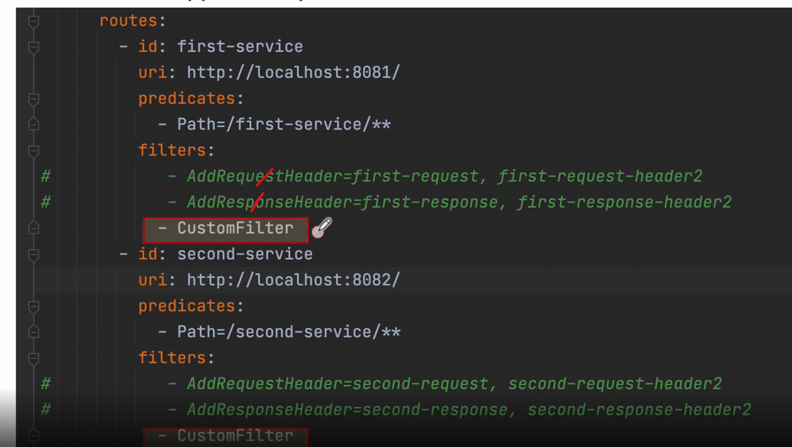


이제 실제 코드를 완성하러 가자

apigateway에서 com.example.apigatewayservice아래에 filter 패키지를 만들고 CustomFilter 클래스를 생성

```java
package com.example.apigatewayservice.filter;

import lombok.extern.slf4j.Slf4j;
import org.springframework.cloud.gateway.filter.GatewayFilter;
import org.springframework.cloud.gateway.filter.factory.AbstractGatewayFilterFactory;
import org.springframework.http.server.reactive.ServerHttpRequest;
import org.springframework.http.server.reactive.ServerHttpResponse;
import org.springframework.stereotype.Component;
import reactor.core.publisher.Mono;

@Component
@Slf4j
public class CustomFilter extends AbstractGatewayFilterFactory<CustomFilter.Config> {

    public CustomFilter(){
        super(Config.class);
    }

    @Override
    public GatewayFilter apply(Config config) {
        return (exchange, chain) -> {
            //import시 org.springframework.http.server.reactive.ServerHttpRequest;
            ServerHttpRequest request = exchange.getRequest();
            ServerHttpResponse response = exchange.getResponse();

            log.info("Custom PRE Filter : request id -> {}", request.getId());

            // Custom Post Filter
            return chain.filter(exchange).then(Mono.fromRunnable(() -> {
                log.info("Custom Post Filter : response code -> {}", response.getStatusCode());
            }));
        };

        /*
            그러면 gateway 필터라는 빈을 하나 등록하고 이 부분은 프리필터, 포스트필터 방식으로 나눠서 작용

            람다식에 exchange, chain 객체를 받고

            exchange 객체로부터 ServerHttpRequest, response 객체를 받을수 있다

            포스트 필터에 반환하는곳 Mono라는 것은 웹플럭스에서 사용하는 것으로 비동기 방식으로 단일 값 전달할때 사용하는것
         */
    }

    public static class Config{

    }
}
```

이렇게 작업 한 후 기존에 만들었던 yml 파일을 아래와 같이 수정

filters 기존 코드는 주석처리 하고 새로운 커스텀 필터 추가

```yml
server:
  port: 8000

eureka:
  client:
    register-with-eureka: false
    fetch-registry: false
    service-url:
      defaultZone: http://localhost:8761/eureka

spring:
  application:
    name: apigateway-service
  cloud:
    gateway:
      routes:
        - id: first-service
          uri: http://localhost:8081/
          predicates:
            - Path=/first-service/**
          filters:
#            - AddRequestHeader=first-request, first-request-header2
#            - AddResponseHeader=first-response, first-response-header2
            - CustomFilter
        - id: second-service
          uri: http://localhost:8082/
          predicates:
            - Path=/second-service/**
          filters:
#            - AddRequestHeader=second-request, second-requests-header2
#            - AddResponseHeader=second-response, second-response-header2
            - CustomFilter
```

기존 FirstServiceController.java, Second쪽에도 아래에 추가 메서드 생성 필요

```java
package com.example.firstservice;

import lombok.extern.slf4j.Slf4j;
import org.springframework.web.bind.annotation.GetMapping;
import org.springframework.web.bind.annotation.RequestHeader;
import org.springframework.web.bind.annotation.RequestMapping;
import org.springframework.web.bind.annotation.RestController;

// http://localhost:8081/welcome 우리가 만든 프로젝트가 받기로 한 URI
// 하지만 API-GATEWAY를 통해서 전달받을 때에는 http://locahost:8081/first-service/welcome 이렇게 받기 때문에 에러가 발생
@RestController
@RequestMapping("/first-service")
@Slf4j //롬복의 로그를 사용하기 위한 어노테이션
public class FirstServiceController {
    @GetMapping("/welcome")
    public String welcome(){
       return "Welcome to the First Service";
    }

    @GetMapping("/message")
    public String message(@RequestHeader("first-request") String header){
        log.info(header);
        return "Hello World in First Service";
    }

    //여기 추가
    @GetMapping("/check")
    public String check(){
        return "Hi, there. This is a message from Second Service";
    }

}
```

second에도 동일하게 추가 필요

이렇게 하고 재기동 하면 정상적으로 동작하는 것을 확인 할 수 있음

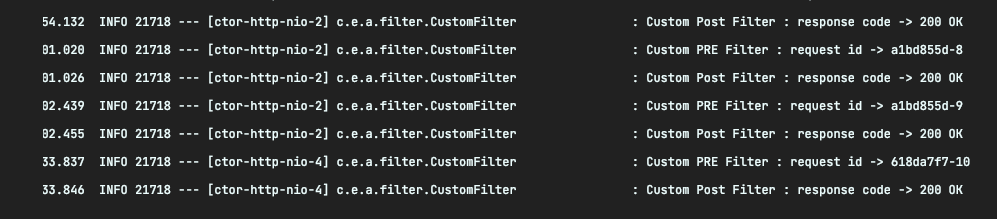

프리 필터 : 사전에 수행

포스트 필터 : 사후에 수행

차후에는 필터를 이용해서 사용자 로그인 기능을 수행해보자


<br>

#### 8장. Spring Cloud Gateway - Global Filter

커스텀 필터와 글로벌 필터는 비슷하지만 다르다

커스텀 필터는 만든다음 필요한 부분에 yml과 같이 추가해주어야 하지만

글로벌 필터는 추가하지 않아도 모두 한테 동작한다


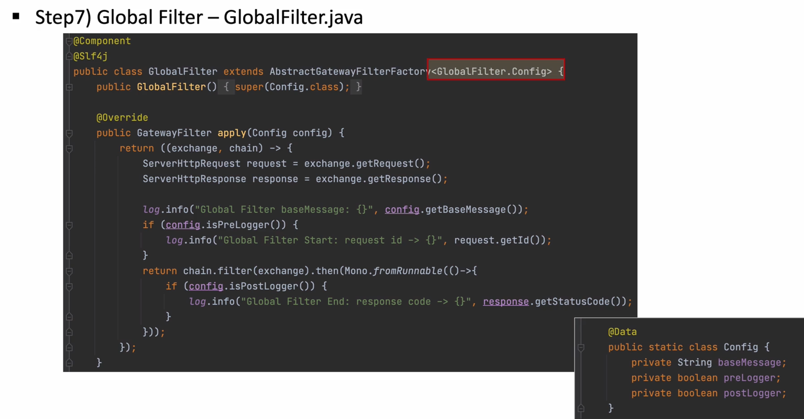


여기서 기초 상식 : @Date, @Setter, @Getter에서 String 타입이 아닌 Boolean타입인 경우 get대신에 is를 앞에 붙인다

isPreLogger();

isPostLogger();


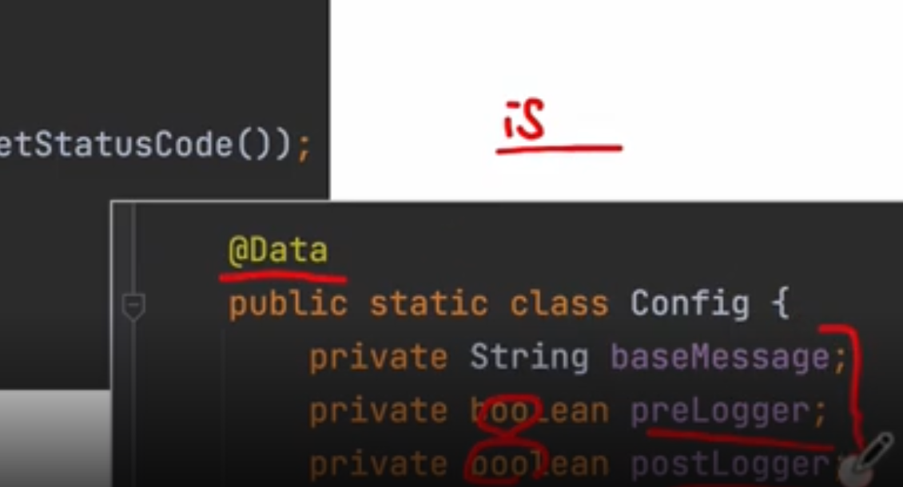

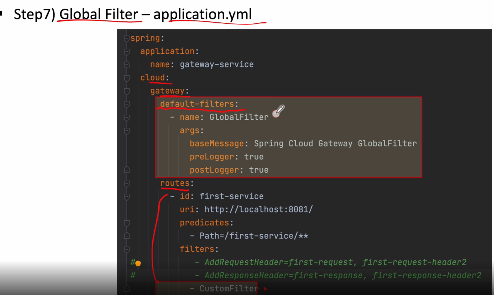

application.yml 파일에 글로벌 필터 적용시킬때 routes 위에 default-filters를 추가하고 위와 같이 해주면 된다(전체 적용)

args에는 기본적으로 들어갈 매개변수들을 나타낸다

-name : 이름

-preLogger : true

-postLogger : true

설정 초기에 기본값들을 셋팅할 수 있다

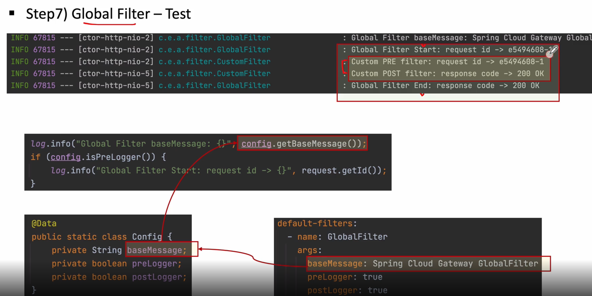

apllication.yml에 baseMessage는 Config파일에 baseMessage에 들어가게 되고 이 정보는 우리가 log를 찍을떼 나타난다

apigateway filter 패키지 아래에 GlobalFilter 추가

```java
package com.example.apigatewayservice.filter;

import lombok.Data;
import lombok.extern.slf4j.Slf4j;
import org.springframework.cloud.gateway.filter.GatewayFilter;
import org.springframework.cloud.gateway.filter.factory.AbstractGatewayFilterFactory;
import org.springframework.http.server.reactive.ServerHttpRequest;
import org.springframework.http.server.reactive.ServerHttpResponse;
import org.springframework.stereotype.Component;
import reactor.core.publisher.Mono;

@Component
@Slf4j
public class GlobalFilter extends AbstractGatewayFilterFactory<GlobalFilter.Config> {

    public GlobalFilter(){
        super(Config.class);
    }

    @Override
    public GatewayFilter apply(Config config) {
        return (exchange, chain) -> {
            //import시 org.springframework.http.server.reactive.ServerHttpRequest;
            ServerHttpRequest request = exchange.getRequest();
            ServerHttpResponse response = exchange.getResponse();

            //log.info("Custom PRE Filter : request id -> {}", request.getId());
            log.info("Custom PRE Filter : request id -> {}", config.getBaseMessage());

            if(config.isPreLogger()){
                log.info("Global Filter start : request id -> {}", request.getId());
            }

            // Custom Post Filter
            return chain.filter(exchange).then(Mono.fromRunnable(() -> {
                if(config.isPostLogger()){
                    log.info("Global Post Filter : response code -> {}", response.getStatusCode());
                }
            }));
        };

        /*
            그러면 gateway 필터라는 빈을 하나 등록하고 이 부분은 프리필터, 포스트필터 방식으로 나눠서 작용

            람다식에 exchange, chain 객체를 받고

            exchange 객체로부터 ServerHttpRequest, response 객체를 받을수 있다

            포스트 필터에 반환하는곳 Mono라는 것은 웹플럭스에서 사용하는 것으로 비동기 방식으로 단일 값 전달할때 사용하는것
         */
    }

    @Data
    public static class Config{
        private String baseMessage;
        private boolean preLogger;
        private boolean postLogger;
    }
}
```

이렇게 한 다음 application.yml에 가서 globalFilter 추가 작업
```yml
server:
  port: 8000

eureka:
  client:
    register-with-eureka: false
    fetch-registry: false
    service-url:
      defaultZone: http://localhost:8761/eureka

spring:
  application:
    name: apigateway-service
  cloud:
    gateway:
      default-filters: 
        - name: GlobalFilter
          args:
            baseMessage: Spring CLoud Gateway Global Filter
            preLogger: true
            postLogger: true
      routes:
        - id: first-service
          uri: http://localhost:8081/
          predicates:
            - Path=/first-service/**
          filters:
#            - AddRequestHeader=first-request, first-request-header2
#            - AddResponseHeader=first-response, first-response-header2
            - CustomFilter
        - id: second-service
          uri: http://localhost:8082/
          predicates:
            - Path=/second-service/**
          filters:
#            - AddRequestHeader=second-request, second-requests-header2
#            - AddResponseHeader=second-response, second-response-header2
            - CustomFilter
```

이렇게 한다음 재기동 하면 된다


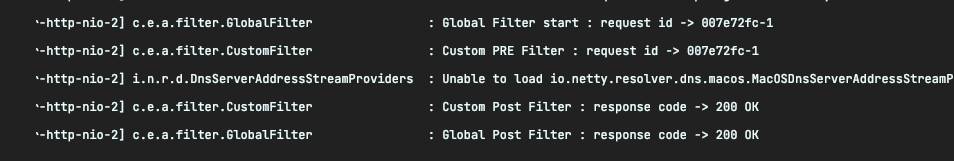

정상적으로 동작하는것을 확인 할 수 있다


참고  
 1. [Spring Cloud로 개발하는 마이크로서비스 애플리케이션(MSA)](https://www.inflearn.com/course/%EC%8A%A4%ED%94%84%EB%A7%81-%ED%81%B4%EB%9D%BC%EC%9A%B0%EB%93%9C-%EB%A7%88%EC%9D%B4%ED%81%AC%EB%A1%9C%EC%84%9C%EB%B9%84%EC%8A%A4/dashboard)
