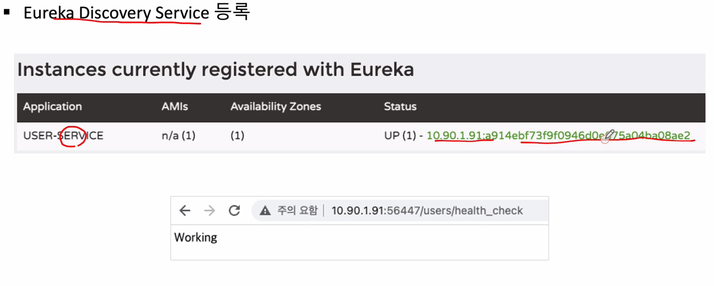

 
###  Spring Cloud로 개발하는 마이크로서비스 애플리케이션 #3(E-Commerce)

E-Commerce 애플리케이션

#### 1장. E-commerce 애플리케이션 개요

전자상거래의 모든것을 구현하기 보다는 간단한 기능에 대해서 MSA로 어떻게 구성할지에 대해서 배워보자


먼저 User-Service와 Order-Service 사이에 마이크로서비스 간의 통신법을 배워보고

Order-Service와 Catalog-Service사이에 통신은 KAFKA를 통해서 데이터를 주고받는법을 학습

사용자가 주문하면 DB에 저장이 되고 Kafka에 던지면 카탈로그 서비스가 던져진것을 가져가고 DB에 작업을 해준다

Order-Service는 메시지를 발행하는쪽, Catalog-Service는 메시지를 구독하는 쪽

[전체 E-Commerce 구조]

1. Eureka Server 생성

2. 마이크로 서비스 를 Eureka Server에 등록

3. 서로간의 데이터 연계를 위해 메시지 큐잉서버(카프카)를 생성

4. 외부에서 요청이 들어올 때 Api-Gateway를 이용해서 부하분산/서비스 라우팅 처리 진행

5. PART2 에서는 마이크로서비스에 들어가는 설정 정보를 외부에 별도 Config Server를 이용해서 관리


[추가 방식]

1. 쿠버네티스, 도커를 사용
   
2. 모니터링

3. CI/CD 파이프라인 배포

위 부분은 후속 강의에서 진행

[이번 프로젝트 준비물]


[이번 프로젝트 API 목록]


 
###  Spring Cloud로 개발하는 마이크로서비스 애플리케이션 #4(Users Microservice)

#### 1장. Users Microservice 개요

클라이언트 요청이 들어오면 API-Gateway를 거쳐서 유레카에 등록된 마이크로 서비스로 요청을 전달


Users Microservices의 구조

UI단 없이 REST로만 작업 진행 예정


위 기능등을 구현 예정


이번 과목에서 진행할 데이터 타입 형식


#### 2장. Users Microservice 프로젝트 생성

1. 기본적인 Dependency 추가(DevTools, Lombok, Web, Eureka Discovery Client)


2. 프로젝트 생성 후 Application 클래스에 @EnableDiscoveryClient 애너테이션 추가


3. application.yml(or application.properties) 설정 변경


4. 상태체크 RestController Class 만들기
   


5. 정상적으로 등록이 완료되면 아래와 같은 화면을 볼 수 있음



6. Configuration 정보 추가

6-1. env 사용


6-2. @Value 사용


7. H2 데이터베이스 사용


7-1. h2 db dependency 추가 방법


7-2. h2 application.yml 파일 수정


7-3. 1.4.198 버전 이후로는 보안 문제로 자동으로 DB생성 하지 않아서 수작업으로 해주어야 하지만, 이번 강의에서는 이전버전을 사용함으로써 테스트 진행하겠음(1.3.176)


#### 2장. Users Microservice - welcome() 메소드

user-service 프로젝트 생성


project 오픈 

1. application.yml

```yml
server:
  port: 0

spring:
  application:
    name: user-service

eureka:
  instance:
    instance-id: ${spring.application.name}:${spring.application.instance_id:${random.value}}
  client:
    register-with-eureka: true
    fetch-registry: true
    service-url:
      defaultZone: http://127.0.0.1:8761/eureka
```

UserServiceApplication 클래스 파일 수정

```java
package com.example.userservice;

import org.springframework.boot.SpringApplication;
import org.springframework.boot.autoconfigure.SpringBootApplication;
import org.springframework.cloud.client.discovery.EnableDiscoveryClient;
import org.springframework.cloud.netflix.eureka.EnableEurekaClient;

@SpringBootApplication
@EnableDiscoveryClient //여기 추가
public class UserServiceApplication {

	public static void main(String[] args) {
		SpringApplication.run(UserServiceApplication.class, args);
	}

}
```

com.example.userservice 아래에 controller 패키지 생성

그 패키지 아래에 UserController 클래스 파일 생성

```java
package com.example.userservice.controller;

import org.springframework.web.bind.annotation.GetMapping;
import org.springframework.web.bind.annotation.RequestMapping;
import org.springframework.web.bind.annotation.RestController;

@RestController
@RequestMapping("/") //사실 /만 넣으면 넣지 않은거랑 다르지 않으나, 추후에 작업을 위해서 미리 이렇게 작업
public class UserController {

    @GetMapping("/health_check")
    public String status(){
        return "It's Working in User Service";
    }
}

/*
    @ReqeustMapping("/user")
     - 여기로 들어오는 모든 URL 앞에 저 부분을 공통으로 추가해주겠다

 */
```

이렇게 추가 해준다음 기존에 만들었던 Eureka 서버 프로젝트 오픈후 기동하고, 새로만든 user-service도 기동해주면 정상적으로 Eureka서버에 등록되는 것을 확인할 수 있다

(먼저 Eureka서버가 기동이 되어야 user-service 기동시 에러가 나오지 않는다)


이렇게 해주면 User-Service가 정상적으로 동작하는 것을 확인 할 수 있다


기존에 만들었던 user-service application.yml 하단에 아래 부분을 추가해주자(이건 기존에 있던 설정이 아닌 우리가 만든것)

```yml
greeting:
  message: Welcome to The Simple E-Commerce.
```

```yml
server:
  port: 0

spring:
  application:
    name: user-service

eureka:
  instance:
    instance-id: ${spring.application.name}:${spring.application.instance_id:${random.value}}
  client:
    register-with-eureka: true
    fetch-registry: true
    service-url:
      defaultZone: http://127.0.0.1:8761/eureka

greeting:
  message: Welcome to The Simple E-Commerce.
```

UserController 클래스 수정
[기존코드]
```java
@RestController
@RequestMapping("/") 
public class UserController {

    @GetMapping("/health_check")
    public String status(){
        return "It's Working in User Service";
    }
}
```

[수정코드]
```java
@RestController
@RequestMapping("/") 
public class UserController {

    private Environment env;
     //application.yml 정보를 가져오기 위해서 사용

    @Autowired //생성자 주입
    public UserController(Environment env) {
        this.env = env;
    }

    @GetMapping("/health_check")
    public String status(){
        return "It's Working in User Service";
    }

    @GetMapping("/welcome")
    public String welcome(){
        return env.getProperty("greeting.message");
    }
}
```

재기동 하면 정상적으로 동작하는 것을 확인 가능


이번에는 env 대신에 @Value를 사용해서 application.yml 정보를 가져오는 방법

com.example.userservice 패키지 아래에 vo 패키지 생성

그 다음 Getting 클래스를 생성


```java
package com.example.userservice.vo;

@Data
@Component
public class Greeting {
    @Value("${greeting.message}")
    private String message;
}
```

그 다음 다시 UserController 클래스 수정

```java
package com.example.userservice.controller;

import com.example.userservice.vo.Greeting;
import org.springframework.beans.factory.annotation.Autowired;
import org.springframework.core.env.Environment;
import org.springframework.web.bind.annotation.GetMapping;
import org.springframework.web.bind.annotation.RequestMapping;
import org.springframework.web.bind.annotation.RestController;

@RestController
@RequestMapping("/") 
public class UserController {

    private Environment env; //application.yml 정보를 가져오기 위해서 사용

    @Autowired
    private Greeting greeting;

    @Autowired //생성자 주입
    public UserController(Environment env) {
        this.env = env;
    }

    @GetMapping("/health_check")
    public String status(){
        return "It's Working in User Service";
    }

    @GetMapping("/welcome")
    public String welcome(){
//        return env.getProperty("greeting.message");
        return greeting.getMessage();
    }
}
```


참고  
 1. [Spring Cloud로 개발하는 마이크로서비스 애플리케이션(MSA)](https://www.inflearn.com/course/%EC%8A%A4%ED%94%84%EB%A7%81-%ED%81%B4%EB%9D%BC%EC%9A%B0%EB%93%9C-%EB%A7%88%EC%9D%B4%ED%81%AC%EB%A1%9C%EC%84%9C%EB%B9%84%EC%8A%A4/dashboard)
