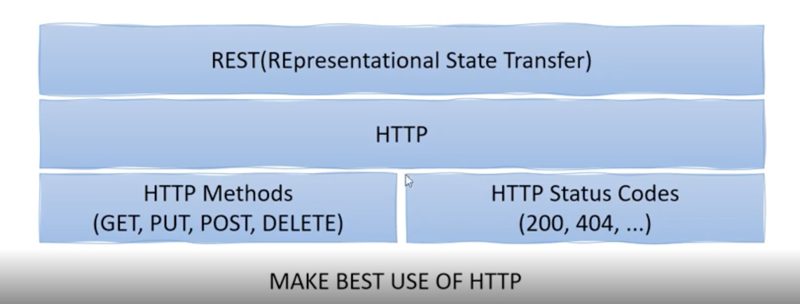
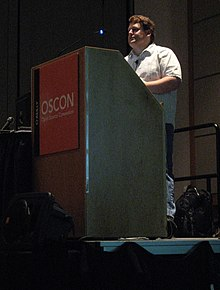

###  기초 용어 및 개념 설명 #1


#### 1장. WEB Service 와 WEB Application

<b>WEB Service</b>는 네트워크 상에서 서로 다른 종류의 컴퓨터들 간에 상호작용하기 위한 소프트웨어 시스템이다.

(기계와 기계통신 / 플랫폼 독립적 / 네트워크 사용)

<b>WEB Application</b>는 원격 서버에 저장되고 있으며 인터넷 브라우저를 통해서 전송되는 프로그램이다.
(An application program that is stored on a remote server and delivered over the Internet through a browser interface)

(ex. 웹메일, 온라인 판매샵, 인터넷 뱅킹 등)


Client와 Server사이에서 request, response가 발생하는데 이러한 WEB Service를 개발하기 위해서 SOAP, RESTFul이 사용될 수 있다.

#### 2장. SOAP 과 REST

SOAP(Simple Object Access Protocol) : 일반적으로 널리 알려진 HTTP, HTTPS, SMTP 등을 통해 네트워크상에서 <b>XML</b> 기반의 메시지를 교환하는 프로토콜이다. 

[SOAP 구조]
```html
 <SOAP-ENV:Envelope xmlns:SOAP-ENV="http://schemas.xmlsoap.org/soap/envelope/">
 <SOAP-ENV:Body>
 <getProductDetails xmlns="http://warehouse.example.com/ws">
 <productId>827635</productId>
 </getProductDetails>
 </SOAP-ENV:Body>
 </SOAP-ENV:Envelope>
```

간단한 사용자 정보를 제공하려고 해도 부가적인 정보로 복잡하게 구성되어 있어 불편한 점이 있다


<i>2000년도 중반부터 스마트폰이 보급되면서 REST의 인기가 증가하게 되었다</i>

REST(Representaional State Transfer) : SOAP과 마찬가지로 네트워크상에서 통신하는 방법중 하나이다. 자원을 이름(자원의 표현)으로 구분하여 해당 자원의 상태(정보)를 주고 받는 모든 것을 의미한다.

즉 REST란 

1. HTTP URI(Uniform Resource Idenrifier)를 통해 자원(Resource)을 명시하고,
2. HTTP Method(POST, GET, PUT, DELETE, PATCH 등)를 통해
3. 해당 자원(URI)에 대한 CRUD Operation을 적용하는 것을 의미한다

[REST 구성 요소 3가지]

1. 자원(Resource) : HTTP URI
2. 자원에 대한 행위(Verb) : HTTP Method
3. 자원에 대한 행위의 내용(Representations) : HTTP Message Pay Load

[REST의 특징]

1. Server-Client 구조
2. Stateless(무상태)
3. Cacheable(캐시 처리 가능)
4. Layered System(계층화)
5. Uniform Interface(인터페이스 일관성)

[REST의 장단점]

장점

1. HTTP 프로토콜의 인프라를 그대로 사용. 별도 REST API 인프라 구축을 할 필요가 없다
2. HTTP 프로토콜에 따르는 모든 플랫폼에서 사용가능하다
3. REST API 메시지가 의도하는 바를 명확하게 알 수 있다
4. 서버와 클라이언트의 역할을 명확하게 분리한다

단점

1. HTTP Method 형태가 제한적이다
2. Header 정보의 값을 처리해야 하므로 전문성이 요구된다
3. 구형 브라우저와 호환이 되지 않아 지원하지 못하는 경구가 있다(익스플로러)

[REST 구조]



#### 3장. REST의 역사

[REST 역사]

로이 필딩(Roy Fielding)은 2000년애 UC어바인에서 "Architectural Styles and the Design of Network-based Software Architectures" 제목의 박사학위 논문에 REST를 정의하였다

<b>로이필딩(Roy Fielding)</b>



REST를 최초 정의한 REST의 아버지

필딩의 REST 원리를 따르는 시스템은 종종 RESTful이란 용어로 지칭된다

<br>
<br>


참고  
 1. [SOAP - 위키피디아](https://ko.wikipedia.org/wiki/SOAP)
 2. [Web Application - 위키피디아](https://en.wikipedia.org/wiki/Web_application)
 3. [REST - 위키피디아](https://ko.wikipedia.org/wiki/REST)
 4. [네트워크 - REST API란? 하진쓰의 서버사이드 기술 블로그](https://khj93.tistory.com/entry/%EB%84%A4%ED%8A%B8%EC%9B%8C%ED%81%AC-REST-API%EB%9E%80-REST-RESTful%EC%9D%B4%EB%9E%80)