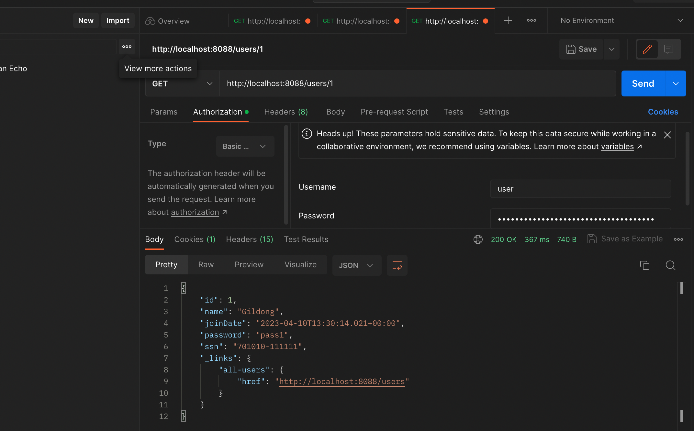

 
###  RESTFul Service 구현방법 #3

#### 1장. Level3 단계의 REST API 구현을 위한 HATEOAS 적용

<b>etc) HATEOAS = 헤테오스 라고 발음</b>

HATEOAS - Hypermedia As the Engine Of Application State

현재 리소스와 연관된(호출 가능한) 자원 상태 정보를 제공

<p style="color:yellow">현재 사용하고 있는 RESTFUL의 리소스와 연관된 또는 호출이 가능한 자원의 상태를 함께 제공해주는 기능</p>

지금까지 우리가 진행했던것은 Level 2 까지 사용했던것

HATEOAS를 사용하기 위해서는 pom.xml에 아래 dependency를 추가해줄 필요가 있음

```xml
<dependency>
    <groupId>org.springframework.boot</groupId>
    <artifactId>spring-boot-starter-hateoas</artifactId>
</dependency>
```


</b>HATEOAS의 경우 SPRING 버전에 따라서 작성하는 코드가 달라진다</b>
1. SPRING 2.1.8.RELEASE일 경우 : [Resource, ControllerLinkBuilder] 사용
2. SPRING 2.2일 경우 : [Resource -> EntityModel, ControllerLinkBuilder -> WebMvcLinkBuilder] 사용


<b>현재 Spring Boot Version의 경우 2.7.8</b>

<u>[버전이 달라서 아래 코드의 경우 구글 검색으로 다른 블로그의 포스팅 내용을 참조](https://mamm.tistory.com/entry/SpringBoot-%ED%94%84%EB%A1%9C%EC%A0%9D%ED%8A%B8%EC%97%90-hateoas-%EA%B8%B0%EB%8A%A5-%EC%82%AC%EC%9A%A9%ED%95%98%EA%B8%B0)</u>

<b style="color:yellow">우리의 목표는 개별 사용자 목록 API에 hateoas 기능을 추가하고 전체 사용자 목록 API로 이동</b>

```java
import org.springframework.hateoas.EntityModel;
import org.springframework.hateoas.server.mvc.WebMvcLinkBuilder;
import org.springframework.http.ResponseEntity;
import org.springframework.web.bind.annotation.*;
import org.springframework.web.servlet.support.ServletUriComponentsBuilder;

import javax.validation.Valid;
import java.net.URI;
import java.util.List;

import static org.springframework.hateoas.server.mvc.WebMvcLinkBuilder.linkTo;
import static org.springframework.hateoas.server.mvc.WebMvcLinkBuilder.methodOn;

@RestController
public class UserController {
    ...

    @GetMapping("/users/{id}")
    public ResponseEntity<EntityModel<User>> retrieveUser(@PathVariable int id){
        User user = service.findOne(id);

        if(user == null){
            throw new UserNotFoundException(String.format("[ID[%s] not found]", id));
             //이렇게만 하면 500번 에러로 message에 첨부되서 넘어간다. 하지만 알아보기 너무 어렵다
        }

        //HATEOAS
        EntityModel entityModel = EntityModel.of(user);

        WebMvcLinkBuilder linkTo = linkTo(methodOn(this.getClass()).retriveAllUsers()); 

        entityModel.add(linkTo.withRel("all-users"));

        return ResponseEntity.ok(entityModel);
    }

    ...
}
```

위에 코드만 바꿔주고 실행하면 에러가 발생하는데 기존에 작업했던 User 도메인 클래스에 @JsonFilter("UserInfo") 설정이 되어 있어 발생

```java
@Data
@AllArgsConstructor
@NoArgsConstructor
//@JsonIgnoreProperties(value = {"password","ssn"})
//@JsonFilter("UserInfo")
public class User {
    private Integer id;

    @Size(min=2, message = "Name은 2글자 이상 입력해 주세요.")
    private String name;
    @Past
    private Date joinDate;

    private String password;
    private String ssn;
}
```

@JsonFilter 부분을 임시로 주석 처리하고 재실행

<b style="color:yellow">아래처럼 정상적으로 결과가 출력되는 것을 확인 할 수 있음(all-users에 내가 원하는 URI정보가 걸려있음)</b>


한명의 사용자 목록을 보고 현재의 리소스 위치에서 다른 작업을 어떻게 수행할 지도 알게되었음

활용법 아래처럼 사용 
1. 상세보기 후 수정하기로 이동하기 위한 URI 정보
2. 상세보기 후 삭제하기로 이동하기 위한 URI 정보

이렇게 HATEOAS 기능을 사용하면 하나의 리소스에서 파생할 수 있는 추가 작업도 확인 가능

<b style="color:yellow">이 작업 자체는 개발자가 해야하는 작업이 늘어나는게 맞지만 개발한 API를 사용하는 사용자 입장에서는 다양한 추가 정보를 얻을 수 있는 장점이 있다</b>

<br>
<br>

#### 2장. REST API Documentation을 위한 Swagger 사용

이번에는 개발자 도움말 페이지를 생성하는 방법

설계, 빌드, 문서화 지원을 해주는 Swagger라는 오픈소스를 이용해서 Document 페이지 만들기

Apache 2.0 오픈소스 라이선스 사용(수많은 온라인 서비스에서 사용)

사용하기 위해서는 pom.xml에 아래 dependency들을 추가해주자(스프링부트 옛날버전)
```xml
[사용 X]
<dependency>
    <groupId>io.springfox</groupId>
    <artifactId>springfox-swagger2</artifactId>
    <version>2.9.2</version>
</dependency>

<dependency>
    <groupId>io.springfox</groupId>
    <artifactId>springfox-swagger-ui</artifactId>
    <version>2.9.2</version>
</dependency>
```

<b style="color:yellow">그런데 지금 사용하고 있는 스프링부트 버전(2.7.3)에는 위에 dependency를 사용하면 에러가 발생하니 아래에 있는걸 사용</b>

```xml
[사용 O]
<dependency>
    <groupId>io.springfox</groupId>
    <artifactId>springfox-boot-starter</artifactId>
    <version>3.0.0</version>
</dependency>
<dependency>
    <groupId>io.springfox</groupId>
    <artifactId>springfox-swagger-ui</artifactId>
    <version>3.0.0</version>
</dependency>
```

이렇게 추가해주고 Maven Reload 해주기(꼭 아래에 있는 3.0.0 버전을 추가해주어야 정상 동작한다)

그 다음 프로젝트에 새로운 package 만들기 해서 이름은 config로 지정해주고 SwaggerConfig 자바 파일 생성
1. config 패키지 만들기
2. SwaggerConfig 클래스 파일 만들기
3. Swaggerconfig 파일에 아래 내용 추가해주기

```java
import org.springframework.context.annotation.Bean;
import org.springframework.context.annotation.Configuration;
import springfox.documentation.spi.DocumentationType;
import springfox.documentation.spring.web.plugins.Docket;
import springfox.documentation.swagger2.annotations.EnableSwagger2;

@Configuration
@EnableSwagger2
public class SwaggerConfig {

    @Bean
    public Docket api(){ //메소드 명은 임의로 지정 가능
        return new Docket(DocumentationType.SWAGGER_2);
    }
}
```

이렇게 추가해주고 서버 실행후 아래 URI 호출하면 정상적으로 표시되는 것을 확인 할 수 있다

> URI : localhost:8088/v2/api-docs


<b style="color:yellow">이걸로 확인하는게 좀 더 가독성이 좋다</b>

> URI : http://localhost:8088/swagger-ui/index.html


위에 있는 docs에서 커스터마이징해서 사용할 수도 있다


#### 3장. Swagger Documentation 구현 방법

이번에는 Documentation을 커스터마이징 하는 방법에 대해서 학습

먼저 기존에 만들었던 SwaggerConfig 클래스를 아래와 같이 수정해주자

```java
import org.springframework.context.annotation.Bean;
import org.springframework.context.annotation.Configuration;
import springfox.documentation.service.ApiInfo;
import springfox.documentation.service.Contact;
import springfox.documentation.spi.DocumentationType;
import springfox.documentation.spring.web.plugins.Docket;
import springfox.documentation.swagger2.annotations.EnableSwagger2;

import java.util.ArrayList;
import java.util.Arrays;
import java.util.HashSet;
import java.util.Set;

@Configuration
@EnableSwagger2
public class SwaggerConfig {

    /*
    * [아래 3가지는 옵셔널이라서 사실 안넣어도 되지만 이왕 커스터마이징 하는거 인포쪽도 연습]
    * DEFAULT_CONTACT
    * DEFAULT_API_INFO
    * DEFAULT_PRODUCES_AND_CONSUMES
    * */

    //컨택트 정보는 자주 변하는게 아니기 때문에 상수로 만드는것이 편하다
    private static final Contact DEFAULT_CONTACT = new Contact("Leon", "http://wwww.leon.co.kr", "leon@gmail.com");

    private static final ApiInfo DEFAULT_API_INFO = new ApiInfo("Awesome API Title",
            "My User management REST API service",
            "1.0",
            "urn:tos",
            DEFAULT_CONTACT,
            "Apache 2.0",
            "http://www.apache.org/licenses-2.0",
            new ArrayList<>());

    private static final Set<String> DEFAULT_PRODUCES_AND_CONSUMES = new HashSet<>(
            Arrays.asList("application/json", "application/xml"));

    @Bean
    public Docket api(){
//        return new Docket(DocumentationType.SWAGGER_2);
        return new Docket(DocumentationType.SWAGGER_2)
                .apiInfo(DEFAULT_API_INFO)
                .produces(DEFAULT_PRODUCES_AND_CONSUMES)
                .consumes(DEFAULT_PRODUCES_AND_CONSUMES);
    }
}
```

그러면 아래쪽에 info 부분이 위에서 작성한 형태로 변경되었음을 확인 할 수 있다

다음에는 기존에 사용하던 User 도메인 클래스에도 Documentation 커스터마이징을 해보자

1. @ApiModel(description = "사용자 상세 정보를 위한 도메인 객체")
2. @ApiModelProperty(notes = "사용자 이름을 입력해 주세요.")


[기존소스] User 클래스
```java
@Data
@AllArgsConstructor
@NoArgsConstructor
//@JsonIgnoreProperties(value = {"password","ssn"})
//@JsonFilter("UserInfo")
public class User {
    private Integer id;

    @Size(min=2, message = "Name은 2글자 이상 입력해 주세요.")
    private String name;
    @Past
    private Date joinDate;

    private String password;
    private String ssn;
}
```

[수정소스] User 클래스
```java
import com.fasterxml.jackson.annotation.JsonFilter;
import com.fasterxml.jackson.annotation.JsonIgnore;
import com.fasterxml.jackson.annotation.JsonIgnoreProperties;
import io.swagger.annotations.ApiModel;
import io.swagger.annotations.ApiModelProperty;
import lombok.AllArgsConstructor;
import lombok.Data;
import lombok.NoArgsConstructor;
import javax.validation.constraints.Past;
import javax.validation.constraints.Size;
import java.util.Date;

@Data
@AllArgsConstructor
@NoArgsConstructor
//@JsonIgnoreProperties(value = {"password","ssn"})
//@JsonFilter("UserInfo")
@ApiModel(description = "사용자 상세 정보를 위한 도메인 객체")
public class User {
    private Integer id;

    @Size(min=2, message = "Name은 2글자 이상 입력해 주세요.")
    @ApiModelProperty(notes = "사용자 이름을 입력해 주세요.")
    private String name;

    @Past
    @ApiModelProperty(notes = "사용자의 등록일을 입력해 주세요.")
    private Date joinDate;

    @ApiModelProperty(notes = "사용자 비밀번호을 입력해 주세요.")
    private String password;

    @ApiModelProperty(notes = "사용자 주민번호을 입력해 주세요.")
    private String ssn;
}
```

이렇게 해주면 description이 반영되어 있는것을 확인 할 수 있다.


<br>
<br>


#### 4장. REST API Monitoring을 위한 Actuator 설정

모니터링 기능을 사용하기 위해서는 pom.xml에 아래 dependency를 추가해주자

```xml
<dependency>
    <groupId>org.springframework.boot</groupId>
    <artifactId>spring-boot-starter-actuator</artifactId>
</dependency>
```

<b style="color:yellow">하지만 이렇게 추가하고 maven reload를 하면 에러가 발생</b>

<b>[Actuator dependency and Swagger Stater 3.0.0 충돌 에러](https://dkswnkk.tistory.com/672)</b>

(구글을 검색해보니 이미 비슷한 증상을 가졌던 분이 정리해서 올려주셔서 참고하였습니다)


```java
일단 Swagger는 모든 endpoint에 대해서 documentation을 해주는 역할입니다. Actuator 또한 마찬가지로 몇몇 endpoint(refresh, beans, health)등을 직접 생성하는 역할이다 보니 의존성이 충돌하게 됩니다.

Springfox는 Spring MVC가 Ant-based path matcher를 기본 값으로 하여 경로를 찾는 것으로 가정하는데, Spring MVC가 2.6.X 버전 이상부터 기본값을 Ant-based path matcher에서 PathPattern-based matcher로 변경하여서 발생하는 버그입니다
```

해결방법 : config 패키지 밑에 config 클래스를 만들어서 아래 Bean을 추가해

```java
import org.springframework.beans.BeansException;
import org.springframework.beans.factory.config.BeanPostProcessor;
import org.springframework.context.annotation.Bean;
import org.springframework.context.annotation.Configuration;
import org.springframework.util.ReflectionUtils;
import org.springframework.web.servlet.mvc.method.RequestMappingInfoHandlerMapping;
import springfox.documentation.spring.web.plugins.WebFluxRequestHandlerProvider;
import springfox.documentation.spring.web.plugins.WebMvcRequestHandlerProvider;

import java.lang.reflect.Field;
import java.util.List;
import java.util.stream.Collectors;

@Configuration
public class Config {
    @Bean
    public static BeanPostProcessor springfoxHandlerProviderBeanPostProcessor() {
        return new BeanPostProcessor() {

            @Override
            public Object postProcessAfterInitialization(Object bean, String beanName) throws BeansException {
                if (bean instanceof WebMvcRequestHandlerProvider || bean instanceof WebFluxRequestHandlerProvider) {
                    customizeSpringfoxHandlerMappings(getHandlerMappings(bean));
                }
                return bean;
            }

            private <T extends RequestMappingInfoHandlerMapping> void customizeSpringfoxHandlerMappings(List<T> mappings) {
                List<T> copy = mappings.stream()
                        .filter(mapping -> mapping.getPatternParser() == null)
                        .collect(Collectors.toList());
                mappings.clear();
                mappings.addAll(copy);
            }

            @SuppressWarnings("unchecked")
            private List<RequestMappingInfoHandlerMapping> getHandlerMappings(Object bean) {
                try {
                    Field field = ReflectionUtils.findField(bean.getClass(), "handlerMappings");
                    field.setAccessible(true);
                    return (List<RequestMappingInfoHandlerMapping>) field.get(bean);
                } catch (IllegalArgumentException | IllegalAccessException e) {
                    throw new IllegalStateException(e);
                }
            }
        };
    }
}
```

이렇게 하면 정상적으로 아래처럼 동작하는것을 확인 가능


추가로 좀 더 상세하게 많은 정보를 보고 싶은 경우에는 application.yml 파일에 아래 코드를 추가해주면 가능
```yml
management:
  endpoints:
    web:
      exposure:
        include: "*"
```

그러면 현재까지 진행된 yml 파일을 아래와 같이 확인할 수 있다(참고용)
```yml
server:
  port: 8088

logging:
  level:
    org.springframework: DEBUG

spring:
  message:
    basename: messages
  mvc:
    pathmatch:
      matching-strategy: ant_path_matcher

management:
  endpoints:
    web:
      exposure:
        include: "*"
```

기존보다 많은 정보를 확인 할 수 있다


<br>
<br>

#### 5장. HAL Browser를 이용한 HATEOAS 기능 구현

Response 정보에 부가적인 정보를 추가해서 제공하는 서비스인 HAL 브라우저

HAL : Hypertext Application Language 

API설계시 HAL을 도입하면 API간에 쉽게 검색이 가능하다(좀 더 나은 개발 환경 제공 가능)

JSOM, XML이건 Hyperlink형태로 쉽게 제공가능

사용하기 위해서는 pom.xml에 dependency를 추가해줘야한다

아래 코드는 spring 옛날 버전에서 동작하므로 현재 에러가 발생
```xml
[사용 X]
<dependency>
    <groupId>org.springframework.data</groupId>
    <artifactId>spring-data-rest-hal-browser</artifactId>
</dependency>
```

<b style="color:yellow">아래 dependency를 추가해주어야 정상적으로 동작한다</b>
```xml
<dependency>
    <groupId>org.springframework.data</groupId>
    <artifactId>spring-data-rest-hal-explorer</artifactId>
</dependency>
```

이렇게 추가해주고 localhost:8088로 들어가보면 hal 브라우저가 정상적으로 동작하는것을 확인 할 수 있다


앞에와 같이 필요한 리소스를 직접 작업하면서 헤테오스를 쓸수있지만 hal 브라우저는 좀 더 편리하게 사용 가능하다?!

<b style="color:yellow">HAL 브라우저는 추후에 한번 더 검색해서 내용 추가해놓자</b>

<br>
<br>


#### 6장. Spring Security를 이용한 인증 처리

지금까지는 인터넷 브라우저나 포스트맨으로 바로 결과를 확인 할 수 있었지만 일반적으로 공개되어야 하는 정보가 아닌 경우에는 보안에 문제가 생기는 구조

OAuth, Token, 아이디 비밀번호 등 여러가지 방법이 있음

<b style="color:yellow">그중에서 Spring Security를 사용</b>

사용하기 위해서는 pom.xml에 dependency를 추가해줘야한다

```xml
<dependency>
    <groupId>org.springframework.boot</groupId>
    <artifactId>spring-boot-starter-security</artifactId>
</dependency>
```

추가해주고 maven reload 수행 후<b style="color:yellow"> 로그를</b> 확인해야 한다

ctrl + f : 검색 누르고 password 검색


밑에 로그를 보면 password를 확인 할 수 있다 

> Using generated security password: 73edd0e2-2268-4f39-9054-b3e37bdca08f

포스트맨을 키고 기존에 사용했던 URL을 호출 해보면 401에러가 발생하는 것을 볼 수 있다


해결하기 위해서는 포스트맨에서 Authorization을 클릭하고 Type을 Basic Auth로 변경 후 

> username : user
> 
> password : 73edd0e2-2268-4f39-9054-b3e37bdca08f

이렇게 추가해주고 send를 하면 아래처럼 정상적으로 결과값이 나오는것을 확인 할 수 있다



간단하게 스프링 dependency에 security 추가해주는것만으로 인증기능을 구현할 수 있다

<br>
<br>

#### 7장. Configuration 클래스를 이용한 사용자 인증 처리

이번에는 스프링 시큐리티에서 자동으로 생성된 패스워드가 아닌 개발자가 직접 만든 id, password를 지정해서 사용

application.yml 파일에 아래 코드 추가

```yml
spring:
  security:
    user:
      name: username
      password: passOrd
```

위 코드를 추가해주면 현재 프로젝트에서 application.yml은 아래와 같이 표시
```yml
server:
  port: 8088

logging:
  level:
    org.springframework: DEBUG

spring:
  message:
    basename: messages
  mvc:
    pathmatch:
      matching-strategy: ant_path_matcher
  security:
    user:
      name: username
      password: passOrd

management:
  endpoints:
    web:
      exposure:
        include: "*"
```

이렇게 설정해주고 서버 재기동을 하면 ID, PASSWORD가 위에서 지정한 값이 들어가게 된다

포스트맨에서 Authorization을 클릭하고 Type을 Basic Auth로 변경 후 아래 데이터 입력

> username : username
> 
> password : passOrd


어플리케이션 yml에 계정정보를 지정하게 되면 ID, PASSWORD가 변경되면 서버를 계속 재기동 해야한다

따라서 고정된 ID사용대신 LDAP, 데이터베이스등 사용자 정보를 가져오는 방식으로 수정 필요

먼저 config 패키지에 새로운 클래스(SecurityConfig) 생성


```java
//webSecurityConfigurerAdapter deprecated 되서 대안 필요
@Configuration //서버가 기동될 때 설정파일이라고 인식
public class SecurityConfig extends WebSecurityConfigurerAdapter {
    @Autowired
    public void configureGlobal(AuthenticationManagerBuilder auth){
        throws Exception{
            auth.inMemoryAuthentication()
                    .withUser("kenneth")
                    .password("{noop}test1234")
                    //실제로 플레인 텍스트를 사용하면 오류가 발생할 수 있으니 인코딩 없이 
                    //사용할 수 있게 사용하려면 {noop} 오퍼레이션 추가
                    .roles("USER");
        }
    }
}
```

<b style="color:yellow"> 이 부분은 deprecated되어서 추후에 검색을 통해서 해결하자</b>

<br>
<br>


참고  
 1. [인프런 - SpringBoot를 이용한 RESTful 개발](https://www.inflearn.com/course/spring-boot-restful-web-services/dashboard)
 2. [SpringBoot 프로젝트에 hateoas 기능 사용하기](https://mamm.tistory.com/entry/SpringBoot-%ED%94%84%EB%A1%9C%EC%A0%9D%ED%8A%B8%EC%97%90-hateoas-%EA%B8%B0%EB%8A%A5-%EC%82%AC%EC%9A%A9%ED%95%98%EA%B8%B0)