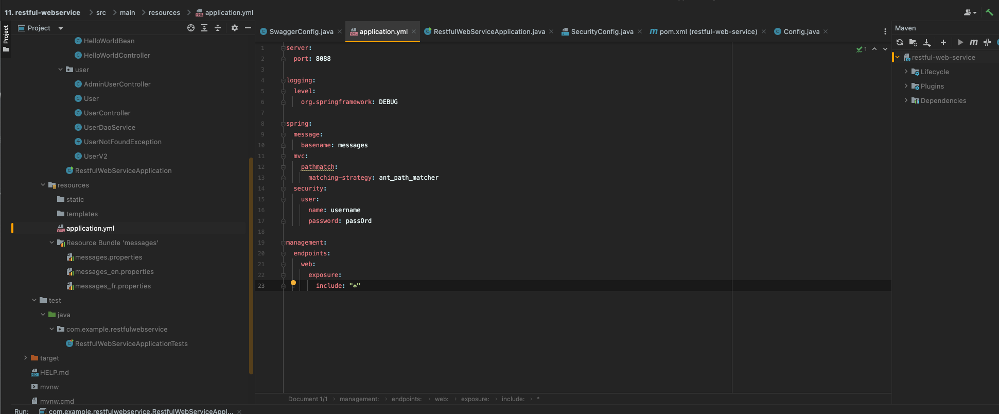

 
###  RESTFul Service 구현방법 #4

전통적으로 자바에서 데이터베이스와 연동되는 어플리케이션을 개발하기 위해서는 데이터베이스 종류에 따른 적절한 종류의 JDBC 가 필요하였지만 이번 섹션에서는 JDBC를 사용하는게 아니라<b style="color:yellow"> JPA(자바에서 정의한 오브젝트와 데이터베이스에서 사용하는 Entity를 매핑하는 방식)</b> 

#### 1장. Java Persistence API의 개요

JPA란?
- Java Persistence API
- 자바 ORM 기술에 대한 API 표준 명세
- 자바 어플리케이션에서 관계형 데이터베이스를 사용하는 방식을 정의한 인터페이스
- EntityManager를 통해 CRUD 처리

```java
/* 핵심파트[JPA 이해] */
JPA는 말 그대로 인터페이스이다. 즉 구현체가 존재하지 않음. (인터페이스는 규약) 

특정 기능을 사용할 수 있는 라이브러리가 아니라 자바 어플리케이션에서 관계형데이터베이스에서 어떻게 사용하면 되는지 대해서 정의해놓은 약속이자 규칙일 뿐이다

즉 구현된 메소드가 없다. 단순 명세서이기 때문에 실제로 메소드 선언문만 존재하고 구현체는 없음.

JPA를 구현한 구현체를 가지고 실제 어플리케이션 개발을 해야한다.

실제 JPA를 구현한 대표적인 라이브러리에는 하이버네이트가 있다(Hibernate)

ORM - 객체 관계 매핑 프레임워크(Object Relationship Mapping)

Java의 객체와 DB의 Entity를 자동으로 매핑되고 있기 때문에 간단한 데이터베이스 어플리케이션을 만드는데 사용하고 있음

복잡한 부분에서는 어렵지만 유지보수가 쉽고 직관적이라는 장점이 있다

Hibernate는 자바 ORM을 위한 라이브러리이면서 JPA의 Entity Manager를 구현한 라이브러리이다

Spring Data JPA : JPA를 추상화한 Repository 인터페이스 제공(구현되어 있는 함수나 메서드 사용 가능)
```

반복되는 CRUD의 경우 공통적인 인터페이스를 통해 처리하면 간편하고 빠르게 처리가능하며, 직관적이고 비즈니스로직에만 집중 할 수 있다

Spring Data JPA의 장점은 CRUD 공통 인터페이스 제공 뿐만 아니라 선언 하는 것만으로도 CRUD를 구현할 수 있음

(아주 간편하고 쉽게 구현 가능)

#### 2장. JPA를 사용을 위한 Dependency 추가와 설정

JPA사용을 위해서는 아래 dependency를 pom.xml에 추가 필요

```xml
<dependency>
  <groupId>org.springframework.boot</groupId>
  <artifactId>spring-boot-starter-data-jpa</artifactId>
</dependency>

<dependency>
  <groupId>com.h2database</groupId>
  <artifactId>h2</artifactId>
  <scope>runtime</scope>
</dependency>
```

etc) maven에 dependency 추가시 scope 의미 : compile(컴파일 할 때 사용), runtime(런타임 할 때 사용), test(테스트에만 사용-배포제외) 등

runtime의 경우 대표적으로 데이터베이스가 해당(컴파일에는 필요없지만 런타임에 필요하니까)

추가로 application.yml에 아래 부분 추가 필요

```yml
jpa:
  show-sql: true
  
h2:
  console:
    enabled: true

spring:
  datasource:
    url: jdbc:h2:mem:testdb
    driver-class-name: org.h2.Driver
```

그럼 지금까지 yml은 아래와 같은데 여기서 security 부분은 주석처리를 해주어도 괜찮다

```yml
server:
  port: 8088

logging:
  level:
    org.springframework: DEBUG

spring:
  message:
    basename: messages
  mvc:
    pathmatch:
      matching-strategy: ant_path_matcher
  security:
    user:
      name: username
      password: passOrd
  datasource:
    url: jdbc:h2:mem:testdb
    driver-class-name: org.h2.Driver

management:
  endpoints:
    web:
      exposure:
        include: "*"

jpa:
  show-sql: true

h2:
  console:
    enabled: true
    path: /h2-console

```

위에 dependency 추가해주고 서버 재기동 하면 아래와 같이 h2 데이터베이스가 올라오는 것을 확인할 수있다


> URL : localhost:8088/h2-console 

위에로 들어가게 되면 자동으로 스프링시큐리티에 의해 아래처럼 인증을 하게 되어있음


아이디와 패스워드
 - 아이디 : username
 - 비밀번호 : passOrd




이 부분이 번거롭다면 2가지 방법이 있다

1. 스프링 시큐리티가 들어있는 dependency를 주석처리하고 spring security config(.java) 파일을 주석처리
2. 기존에 작성한 Security 파일에 아래 코드를 추가

```java
  @Override
  protected void configure(HttpSecurity http) throws Exception{
    http.authorizeRequests().antMatchers("/h2-console/**").permitAll();
    http.csrf().disable();
    http.headers().frameOptions().disable();
  }
```

여기서 현재 2번 방법은 deprecated 되서 사용이 안되어 1번으로 진행

1번(dependency 주석처리 , config 자바 파일 주석처리) 하면 아래와 같이 정상적으로 실행되는것을 확인 가능

> URL : http://localhost:8088/h2-console


여기서 JDBC URL : jdbc:h2:mem:testdb 로 변경하고 Test Connection 실행하면 정상적으로 실행 가능


<br>

[만약에 안되면 기존에 작성했던 JDBC 블로그에서 h2 실행부분 참조-터미널에서 실행](https://ihchoco.github.io/spring/spring_study12/)

<br>

#### 3장. Spring Data JPA를 이용한 Entity 설정과 초기 데이터 생성

기존에 만들었던 User 클래스에 @Entity 붙여주는 작업 진행 필요

추가로 밑에 id 값에 @Id, @GeneratedValue 추가

```java
@Data
@AllArgsConstructor
@NoArgsConstructor
//@JsonIgnoreProperties(value = {"password","ssn"})
//@JsonFilter("UserInfo")
@ApiModel(description = "사용자 상세 정보를 위한 도메인 객체")
@Entity //추가해주면 클래스 이름을 가지고 데이터베이스 테이블을 생성하고 클래스속성값을 가지고 테이블컬럼값을 생성
public class User {
    
    @Id //Primary Key
    @GeneratedValue //자동으로 생성되는 값
    private Integer id;

    @Size(min=2, message = "Name은 2글자 이상 입력해 주세요.")
    @ApiModelProperty(notes = "사용자 이름을 입력해 주세요.")
    private String name;

    @Past
    @ApiModelProperty(notes = "사용자의 등록일을 입력해 주세요.")
    private Date joinDate;

    @ApiModelProperty(notes = "사용자 비밀번호을 입력해 주세요.")
    private String password;

    @ApiModelProperty(notes = "사용자 주민번호을 입력해 주세요.")
    private String ssn;
}
```

이렇게 작성해주고 application.yml 파일에 아래와 같이 추가

```yml
spring:
  jpa:
    show-sql: true
  h2:
    console:
      enabled: true
      path: /h2-console
```

이렇게 하고 로그를 보면 create table이 정상적으로 안되는 부분을 확인 할 수 있다

그 이유는 예약어가 사용되었기 때문인데 기존에 User클래스를 Users로 변경하고 기존에 작성되어 있던 모든 코드의 이름을 변경

그렇게 해주면 아래와 같이 서버 기동할 때 정상적으로 테이블이 생성되는것을 확인


이렇게 해주면 테이블이 생성되었고 그다음에는 데이터를 추가해주자

먼저 resources 폴더에 새로운 파일 추가하기 해서 이름은 data.sql로 지정해주자

그다음 서버기동때 실행될 query(insert) 부분을 추가해주자

```sql
insert into users values(1, current_timestamp(), 'User1', 'test1111', '701010-111111');
insert into users values(2, current_timestamp(), 'User2', 'test2222', '801010-111111');
insert into users values(3, current_timestamp(), 'User3', 'test3333', '901010-111111');
```


<b style="color:yellow">기존에 강의에서는 current_timestamp() 대신에 sysdate()를 사용하였지만 에러가 발생하였음</b>


정상적으로 데이터 확인 가능

<br>

#### 4장. JPA Service 구현을 위한 Controller, Repository 생성

단순하게 Repository 인터페이스를 선언하는 것만으로도 CRUD 관련 메서드 사용 가능

user 패키지에 새로 만들기 해서 UserRepository라는 인터페이스를 생성

```java
@Repository
public interface UserRepository extends JpaRepository<Users, Integer> {
}
```

1. Interface 파일을 만든다
2. JpaRepository<Entity클래스명, Key값의 타입>
3. @Repository를 붙여준다

이렇게 추가해주면 기본적으로 JpaRepository에 정의되어 있는 메소드들을 사용할 수 있다


etc) 만약 재작성해서 사용하고 싶으면 UserRepository 인터페이스에 재정의 해서 사용도 가능하다


이렇게 한 다음 user 패키지에 UserJpaController라는 클래스를 새로 만들어 준다

```java
package com.example.restfulwebservice.user;

import org.springframework.beans.factory.annotation.Autowired;
import org.springframework.web.bind.annotation.GetMapping;
import org.springframework.web.bind.annotation.RequestMapping;
import org.springframework.web.bind.annotation.RestController;

import java.util.List;

@RestController
@RequestMapping("/jpa")
public class UserJpaController {

    @Autowired //기존에 만들었던 userRepository 연결
    private UserRepository userRepository;

    // http://localhost:8088/jpa/users or http://localhost:8088/users(기존에 사용하던 URI)
    @GetMapping("/users")
    public List<Users> retrieveAllUsers(){
        return userRepository.findAll(); 
        //userRepository를 사용하면 findAll, findById, delete, insert등 메서드를 쉽게 이용 가능
    }
}
```

포스트맨을 이용해서 http://localhost:8088/jpa/users 호출해보면 정상적으로 결과값을 반환해준다


<br>

#### 5장. JPA를 이용한 사용자 목록 조회 - GET HTTP Method

개별 사용자 조회 기능을 만들어 보자

JpaRepository < PagingAndSoringRepository < CrudRepository

JpaRepository의 경우 이렇게 위와 같이 상속을 받으면서 내려오는데 findById의 경우에는 CrudRepository에 정의되어 있음

기존에 작성했던 UserJpaController 파일에 아래와 같이 내용 추가

```java
    @GetMapping("/users/{id}") //pathvariable 사용
    public ResponseEntity<EntityModel<Users>> retrieveUser(@PathVariable int id){
        /*
         * findById의 경우에는 return 값으로 Optional 타입을 반환하는데 이유는 id로 검색하였을때 있을수도 없을수도 있으니까
         */
        //Users user = userRepository.findById(id); 이렇게 사용하면 에러
        Optional<Users> user = userRepository.findById(id); //이렇게 사용하면 에러

        if(!user.isPresent()){ //만약에 user값이 없다면 아래와 같이 에러를 표
            throw new UserNotFoundException(String.format("ID[%s] not found", id));
        }

        //Hateoas를 사용해보면 아래와 같이 쓸 수 있따
        //Resource<Users> resource = new Resource<>(user.get());
        //여기서 Resource는 옛날버전 현재 버전에는 맞지 않아서 아래와 같이 진행

        EntityModel entityModel = EntityModel.of(user);
        WebMvcLinkBuilder linkTo = linkTo(methodOn(this.getClass()).retrieveAllUsers());
        entityModel.add(linkTo.withRel("all-users"));

        return ResponseEntity.ok(entityModel);
    }
```

이렇게 추가해주면 현재까지 전체 코드는 아래와 같이 작성되어 있음

```java
package com.example.restfulwebservice.user;

import org.springframework.beans.factory.annotation.Autowired;
import org.springframework.hateoas.EntityModel;
import org.springframework.hateoas.server.mvc.WebMvcLinkBuilder;
import org.springframework.http.ResponseEntity;
import org.springframework.web.bind.annotation.GetMapping;
import org.springframework.web.bind.annotation.PathVariable;
import org.springframework.web.bind.annotation.RequestMapping;
import org.springframework.web.bind.annotation.RestController;

import java.util.List;
import java.util.Optional;

import static org.springframework.hateoas.server.mvc.WebMvcLinkBuilder.linkTo;
import static org.springframework.hateoas.server.mvc.WebMvcLinkBuilder.methodOn;


@RestController
@RequestMapping("/jpa")
public class UserJpaController {

    @Autowired //기존에 만들었던 userRepository 연결
    private UserRepository userRepository;

    // http://localhost:8088/jpa/users or http://localhost:8088/users(기존에 사용하던 URI)
    @GetMapping("/users")
    public List<Users> retrieveAllUsers(){
        return userRepository.findAll(); //userRepository를 사용하면 findAll, findById, delete, insert등 다양한 메서드를 아주 쉽게 바로 이용 가능하
    }

    @GetMapping("/users/{id}") //pathvariable 사용
    public ResponseEntity<EntityModel<Users>> retrieveUser(@PathVariable int id){
        /*
         *
         * findById의 경우에는 return 값으로 Optional 타입을 반환하는데 이유는 id로 검색하였을때 있을수도 없을수도 있으니까
         */
        //Users user = userRepository.findById(id); 이렇게 사용하면 에러
        Optional<Users> user = userRepository.findById(id); //이렇게 사용하면 에러

        if(!user.isPresent()){ //만약에 user값이 없다면 아래와 같이 에러를 표
            throw new UserNotFoundException(String.format("ID[%s] not found", id));
        }

        //Hateoas를 사용해보면 아래와 같이 쓸 수 있따
        //Resource<Users> resource = new Resource<>(user.get()); 여기서 Resource는 옛날버전 현재 버전에는 맞지 않아서 아래와 같이 진행

        EntityModel entityModel = EntityModel.of(user);
        WebMvcLinkBuilder linkTo = linkTo(methodOn(this.getClass()).retrieveAllUsers());
        entityModel.add(linkTo.withRel("all-users"));

        return ResponseEntity.ok(entityModel);
    }
}
```

위와 같이 작성하고 서버재기동 후 포스트맨으로 URI : http://localhost:8088/jpa/users/1 호출하면 아래와 같이 표시

<b style="color:yellow">JPA에서 가져온 값을 HATEOAS까지 써서 결과값을 반환 확인 가능</b>


<br>

#### 6장. JPA를 이용한 사용자의 추가와 삭제 - POST/DELETE HTTP Method

삭제 기능을 만들어 보자(기존에 작성했던 UserJpaController 클래스에 아래와 같이 추가)

```java
@DeleteMapping("/users/{id}")
public void deleteUser(@PathVariable int id){
    userRepository.deleteById(id);
}
```

이렇게 추가해주고 포스트맨에서 Method를 DELETE 방식으로 URI : http://localhost:8088/jpa/users/1 호출해주면 정상적으로 데이터 삭제 가능


사용자 추가 방법

```java
@PostMapping("/users")
public ResponseEntity<User> createUser(@Valid @RequestBody Users user){
    Users savedUser = userRepository.save(user);

    URI location = ServletUriComponentsBuilder.fromCurrentRequest()
            .path("{id}")
            .buildAndExpand(savedUser.getId())
            .toUri();

    return ResponseEntity.created(location).build();
}
```

위와 같이 추가해주고 포스트맨으로 추가

URI : http://localhost:8088/jpa/users
Method : POST

Body에는 아래 데이터 입력
```json
{
    "name" : "User4",
    "joinDate" : "2023-04-16",
    "password" : "test222222",
    "ssn" : "901010-222222"
}
```

이렇게 하고 send를 하면 에러가 발생하는데 그 이유는 id값이 자동으로 1부터 시작하게 되는데 기존에 서버 기동할때 3명의 User가(1,2,3) 들어가면서 동일한 키 값이 있기 때문에 발생

그래서 import.sql 부분을 아래와 같이 수정해준다

```sql
insert into users values(1, current_timestamp(), 'User1', 'test1111', '701010-111111');
insert into users values(2, current_timestamp(), 'User2', 'test2222', '801010-111111');
insert into users values(3, current_timestamp(), 'User3', 'test3333', '901010-111111');

```

```sql
insert into users values(90001, current_timestamp(), 'User1', 'test1111', '701010-111111');
insert into users values(90002, current_timestamp(), 'User2', 'test2222', '801010-111111');
insert into users values(90003, current_timestamp(), 'User3', 'test3333', '901010-111111');
```


이렇게 정상적으로 추가가 된것을 확인할 수 있고 Return값의 Headers에 보면 Location이 잘 보이는 것을 확인할 수 있다(새로 생성되는 URI : location:8088/jpa/users/1)

etc) 

```java
URI location = ServletUriComponentsBuilder.fromCurrentRequest()
                .path("{id}")
                .buildAndExpand(savedUser.getId())
                .toUri();
```

이렇게 쓰면 아까 return 값의 Header 부분에 http://localhost:8088/jpa/users1 이렇게 잘못 나타나게 된다

```java
URI location = ServletUriComponentsBuilder.fromCurrentRequest()
                .path("/{id}")
                .buildAndExpand(savedUser.getId())
                .toUri();
```
이렇게 쓰면 아까 return 값의 Header (location) 부분에 http://localhost:8088/jpa/users/1 정상적으로 나타남

.path(원하는 경로) 입력해주면 된다

그럼 리턴된 header (location) 부분을 카피해서 그대로 다시 전송해보면 새롭게 추가된 값의 정보를 알 수 있다


<br>

#### 7장. 게시물 관리를 위한 Post Entity 추가와 초기 데이터 생성

이번 시간에는 게시물을 작성할 수 있는 기능 구현

Post 클래스 생성


1. User는 여러개의 게시글을 쓸 수 있다
2. User는 게시글을 안써도 괜찮다
3. User가 없는 게시글은 없다

먼저 user패키지에 새로운 클래스 만들기로 POST 클래스를 만들자

```java
import com.fasterxml.jackson.annotation.JsonIgnore;
import lombok.AllArgsConstructor;
import lombok.Data;
import lombok.NoArgsConstructor;

import javax.persistence.*;

@Entity
@Data
@AllArgsConstructor
@NoArgsConstructor
public class Post {

    @Id
    @GeneratedValue
    private Integer id;

    private String description;

    // User : Post -> 1 : (0~N), Main은 User(주 테이블) , Sub : 포스트(외래 테이블)
    @ManyToOne(fetch = FetchType.LAZY)
    @JsonIgnore
    private Users user;

}
```

그 다음 기존에 만들었던 Users 클래스에 맨 아래에 posts를 추가해주자

```java
@Entity
public class Users {
    ...
    @OneToMany(mappedBy = "user") //user테이블과 매핑이 되도록
    private List<Post> posts;
    ...
}
```

아래는 최종 Users클래스의 형태
```java
@Data
@AllArgsConstructor
@NoArgsConstructor
//@JsonIgnoreProperties(value = {"password","ssn"})
//@JsonFilter("UserInfo")
@ApiModel(description = "사용자 상세 정보를 위한 도메인 객체")
@Entity
public class Users {

    @Id //Primary Key
    @GeneratedValue //자동으로 생성되는 값
    private Integer id;

    @Size(min=2, message = "Name은 2글자 이상 입력해 주세요.")
    @ApiModelProperty(notes = "사용자 이름을 입력해 주세요.")
    private String name;

    @Past
    @ApiModelProperty(notes = "사용자의 등록일을 입력해 주세요.")
    private Date joinDate;

    @ApiModelProperty(notes = "사용자 비밀번호을 입력해 주세요.")
    private String password;

    @ApiModelProperty(notes = "사용자 주민번호을 입력해 주세요.")
    private String ssn;

    @OneToMany(mappedBy = "user") //user테이블과 매핑이 되도록
    private List<Post> posts;
}
```

위와 같이 작성한 후 초기 데이터 값을 추가해주자(import.sql)

```sql
insert into users values(90001, current_timestamp(), 'User1', 'test1111', '701010-111111');
insert into users values(90002, current_timestamp(), 'User2', 'test2222', '801010-111111');
insert into users values(90003, current_timestamp(), 'User3', 'test3333', '901010-111111');


insert into post values(10001, 'My first post', 90001);
insert into post values(10002, 'My second post', 90001);
```

이렇게 해주고 서버 재기동을 하면 아래와 같이 에러가 발생


원인 : Users클래스에 새롭게 posts라는 속성이 추가가 되었고 생성자 종류에는(NoArgs, AllArgs) 두개 밖에 없음

즉, posts만 빼고 나머지 값만 들어있는 생성자가 필요하니 아래에 추가해주자

```java
public class Users {

    @Id //Primary Key
    @GeneratedValue //자동으로 생성되는 값
    private Integer id;

    @Size(min=2, message = "Name은 2글자 이상 입력해 주세요.")
    @ApiModelProperty(notes = "사용자 이름을 입력해 주세요.")
    private String name;

    ...

    //[!!!!!아래 부분 추가해주면 된다!!!!!]
    public Users(Integer id, String name, Date joinDate, String password, String ssn) {
        this.id = id;
        this.name = name;
        this.joinDate = joinDate;
        this.password = password;
        this.ssn = ssn;
    }
}
```

이렇게 해주면 아래와 같이 POST 글도 정상적으로 insert 된 것을 확인할 수 있다


<br>

#### 8장. 게시물 조회를 위한 Post Entity와 User Entity와의 관계 설정

유저의 ID를 받으면 그 사람이 작성한 게시글 리스트를 보여주는 기능 구현

[UserJpaController]클래스
```java
    //유저의 ID를 받으면 그 사람이 작성한 게시글 리스트를 보여주는 기능
    // /jpa/users/90001/posts
    @GetMapping("/users/{id}/posts")
    public List<Post> retrieveAllPostsByUser(@PathVariable int id){
        Optional<Users> user = userRepository.findById(id); //이렇게 사용하면 에러

        if(!user.isPresent()){ //만약에 user값이 없다면 아래와 같이 에러를 표시
            throw new UserNotFoundException(String.format("ID[%s] not found", id));
        }

        return user.get().getPosts(); //user정보가 있을 데이터를 가져옴
    }
```
이렇게 해주면 아래와 같이 정상적으로 post 리스트를 가져오는것을 확인 가능

> URI : https://localhost:8088/jpa/users/90001/posts/


<b style="color:yellow">PostRepository를 따로 만들지 않고 기존에 있던 Users를 사용해서 posts리스트를 가져올 수 있음(편리함)</b>


[여기서 90002 사용자는 존재하지만 게시글을 쓴적이 없음]
> URI : https://localhost:8088/jpa/users/90002/posts/


이렇게 보면 200 OK라고 나오지만 실제로 게시글이 없기 때문에 오류를 리턴해주는게 맞음

<b style="color:yellow">이 부분은 기존에 배웠던 내용을 바탕으로 한번 처리해보자(숙제)</b>

[10000 사용자는 존재하지 않음 - 에러발생 처리 완료(좋은 API)]
> URI : https://localhost:8088/jpa/users/10000/posts/


다시 users를 검색해보면 아래와 같이 기존에 없던 posts 정보도 같이 리턴되는것을 확인할 수 있다.


<br>

#### 9장. JPA를 이용한 새 게시물 추가 - POST HTTP Method

user패키지에 새로 만들기에서 [PostRepository] 인터페이스 생성후 아래 코드 작성

<b style="color:yellow">이렇게 해주기만 하면 CRUD를 기본으로 사용 가능</b>

```java
package com.example.restfulwebservice.user;

import org.springframework.data.jpa.repository.JpaRepository;
import org.springframework.stereotype.Repository;

@Repository
public interface PostRepository extends JpaRepository<Post, Integer> {
}
```

[PostRepository] 클래스에 아래와 같이 내용 추가
1. @Autowired private PostRepository postRepository 추가
2. createPost 메소드 추가

```java
@RestController
@RequestMapping("/jpa")
public class UserJpaController {
    @Autowired //기존에 만들었던 userRepository 연결
    private UserRepository userRepository;
    @Autowired
    private PostRepository postRepository;
    
    ...


    @PostMapping("/users/{id}/posts")
    public ResponseEntity<Post> createPost(@PathVariable int id, @RequestBody Post post){

        //먼저 사용자 정보를 검색해서 ID가 존재하는지 확인 하고 그 값을 POST에 연결해줘야 한다
        Optional<Users> user = userRepository.findById(id);

        if(!user.isPresent()){
            throw new UserNotFoundException(String.format("ID[%s] not found", id));
        }

        post.setUser(user.get()); //post값에 사용자 정보를 등록
        Post savedPost = postRepository.save(post);

        URI location = ServletUriComponentsBuilder.fromCurrentRequest()
                .path("/{id}")// /users/{id}/posts뒤에 /id를 추가 => users/{id}/posts/{id}
                .buildAndExpand(savedPost.getId())
                .toUri();

        return ResponseEntity.created(location).build();
    }    
```

이렇게 작성해주고 포스트맨으로 테스트 해보자

> Method : POST

> URI : http://localhost:8088/jpa/users/90001/posts

> body에 아래 데이터 추가해주고 raw 선택후 json으로 변경해주고 아래 텍스트 카피해서 넣어주고 send

```json
{
    "description" : "My Third Post"
}
```

그러면 아래와 같이 정상적으로 출력되는 것을 확인할 수 있다


Headers에 등록된 게시글의 URI도 정상적으로 보여주고 있다(Amazing)

테스트를 해보면 아래와 같이 third 게시글이 추가된 것을 확인할 수 있다


DB에도 정상적으로 들어가 있음


<b style="color:yellow">추가로 게시글 삭제와 수정은 배운것을 활용해서 구현해보자</b>


<br>
<br>


참고  
 1. [인프런 - SpringBoot를 이용한 RESTful 개발](https://www.inflearn.com/course/spring-boot-restful-web-services/dashboard)
 2. [SpringBoot 프로젝트에 hateoas 기능 사용하기](https://mamm.tistory.com/entry/SpringBoot-%ED%94%84%EB%A1%9C%EC%A0%9D%ED%8A%B8%EC%97%90-hateoas-%EA%B8%B0%EB%8A%A5-%EC%82%AC%EC%9A%A9%ED%95%98%EA%B8%B0)