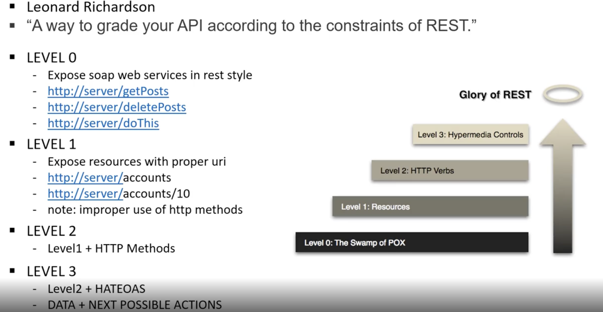

 
###  RESTFul Service 구현방법 #5
RESTAPI를 설계할 때 고려해야 하는 사항들 설명

#### 1장. Richardson Maturity Model 소개

Richardson Maturity는 REST를 설계한 사람이며 Model이란 REST API를 개발할 때 확인해야 할 주요 요소들을 3단계로 나눈것을 말한다(Resource와 HTTP Method, HyperMedia 개념을 이용해서 Resource를 표현)

1. LEVEL 0 : 기존의 Resource를 웹서비스 형태로 제공해서 단순히 URI만 매핑한 경우

위 단계(LEVEL 0)에서 보면 server/getPosts, serer/deletePosts처럼 Method에 이미 get, delete 정보를 구분할 수 있는데 추가로 들어갔으므로 불필요한 표현

2. LEVEL 1 : 외부에 공개하고자 하는 Resource에 대해서 의미있고 적절한 URI로 표현

위 단계(LEVEL 1)에서 보면 HTTP Method별로 구분해서 사용하고 있지는 않다

(사용자 요청을 단순히 GET, POST 메서드만 사용하며 모든 반환값을 에러 또는 200 OK로만 반환하는 단순한 형태)

/server/accounts/10 처럼 URI는 적절하게 구분되어 있는것 같지만 아직까지 HTTP Method에 따라서 구분되어 사용되어 있지는 않음

3. LEVEL 2 : LEVEL 1 단계에서 용도와 상태에 따라서 HTTP Method를 추가해서 사용

위 단계(LEVEL2)에서는 LEVEL1에서 단순한 읽기(GET), 추가(POST), 변경(PUT), 삭제(DELETE)를 사용하는 형태

4. LEVEL 3 : LEVEL 2 단계에서 + HATEOAS를 추가한 경우

다음 작업으로 어떤 것을 할 수 있는지, 또는 그 작업을 하기 위해서는 다뤄줘야 하는 Resource URI는 어떤게 있는지 알려주는것

<b style="color:yellow">클라이언트 측에 서버가 제공하는 서비스를 일일히 찾는 수고를 덜 수 있으며, 최소한의 진입접 end point만을 가지고도 서버의 다음 URI 형태를 알 수 있는 형태(LEVEL3)</b>

<b style="color:yellow">추가로 게시글 삭제와 수정은 배운것을 활용해서 구현해보자</b>

 

#### 2장. REST API 설계 시 고려해야 할 사항

RESTFUL 서비스를 설계 할 때 중요한점 

1. 개발자 중심의 설계 보다는 API를 사용하는 소비자 입장에서 간단 명료하고 직관적인 API 형태로 설계
2. HTTP Method, Request, Response, Header와 같이 HTTP 장점을 최대한 살려 설계
3. 최소한 LEVEL2 이상의 설계(GET-조회, POST-추가, PUT-변경, DELETE-삭제) + (적절한 HTTP Status 코드 반환 - 200, 500 반환, 만약 200 OK 지만 데이터가 없으면 NOT FOUND 반환 등)
4. URI 통해서 직접 크리티컬한 데이터를 포함하면 안된다 
5. 복수형태로 지칭하는것이 좋다(Use plurals)
6. Resource에 대한 정보는 동사보다는 명사형태로 표현(보다 직관적)
7. 일괄된 접근 endpoint 사용
  

etc) {id} = 컬리브레이스 ID 라고 부른다

 

REST API 학습에서는 화면단을 가지지 않는 REST API만을 서비스하는 형태의 단순한 어플리케이션

개발단계에서 화려하고 멋진 화면은 없지만, 다양한 클라이언트 어플리케이션과 확장되고 사용 될 수 있음

예로 Android, IOS 에서도 서버에서 전달받는 데이터의 형식도 이러한 REST 형태로 개발

Microservice에서도 좀 더 잘게 쪼개서 사용하는 추세

<b style="color:yellow">지금까지 PART 1 완료 되었으며, PART 2 에서는 Spring Cloud를 활용한 Microservice 개발 진행</b>

한번 더 블로그에 적었던 것과 반복을 통해서 학습 후 Part 2로 넘어가자

 
 

참고  
 1. [인프런 - SpringBoot를 이용한 RESTful 개발](https://www.inflearn.com/course/spring-boot-restful-web-services/dashboard)
 2. [SpringBoot 프로젝트에 hateoas 기능 사용하기](https://mamm.tistory.com/entry/SpringBoot-%ED%94%84%EB%A1%9C%EC%A0%9D%ED%8A%B8%EC%97%90-hateoas-%EA%B8%B0%EB%8A%A5-%EC%82%AC%EC%9A%A9%ED%95%98%EA%B8%B0)