### 깃허브 레퍼지토리 및 프로젝트 폴더 생성

#### 1. 깃허브 레퍼지토리

**[깃허브 로그인 및 회원가입]** [깃허브 페이지](https://github.com/)


<bold>New Repository 클릭하기</bold>

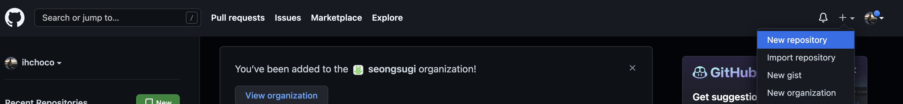


<bold>Create Repository 화면</bold>

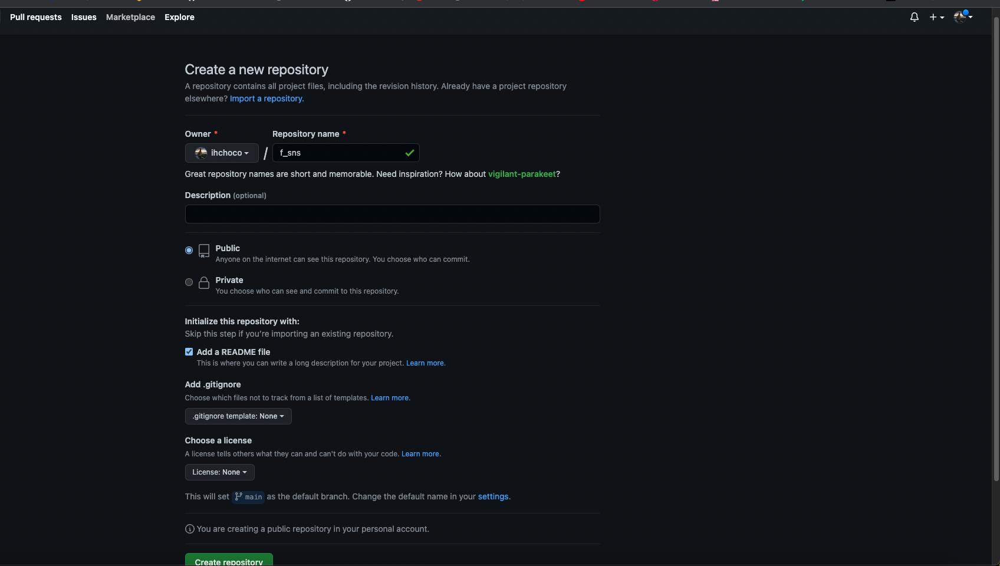


여기에서 Repository name을 입력해주고 Add ad README file(선택) 추가해준다음 Create 클릭


<bold>Repository 생성 후 Code 버튼 클릭</bold>

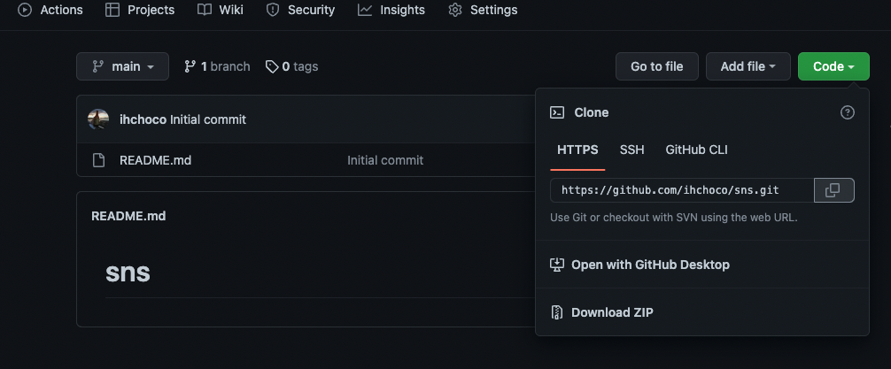


저기에서 URL 옆에 복사하기 버튼(Clone) 눌러서 URL 복사하기

#### 2. 소스트리 설치 및 프로젝트 Clone 

~~**[소스트리 설치]** [소스트리 설치 페이지](https://www.sourcetreeapp.com/)~~

**[깃허브 데스크탑]** [소스트리 설치 페이지](https://desktop.github.com/)

[현재는 소스트리를 사용하지 않고 Github Desktop을 사용하고 있습니다(방법 동일)]


<bold>프로그램 실행 후 새로만들기 & URL 복제</bold>

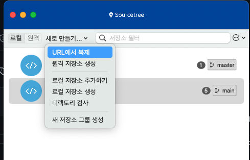


<bold>미리 바탕화면에 프로젝트를 관리하고 싶은 폴더를 만들고 경로를 지정</bold>

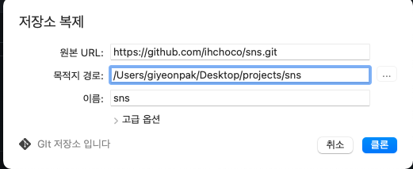


*위 화면의 경우 처음에 Default로 잡히는 경로이지만 저의 경우 Desktop 바탕화면에 SpringBoot 폴더를 만들고 그 안에 SNS프로젝트 관리 폴더를 만들어 지정하였습니다.


#### 3. Intelij 설치 후 프로젝트 연결
**[인텔리제이 설치]** [인텔리제이 설치 페이지](https://www.jetbrains.com/ko-kr/idea/)


<bold>인텔리제이 실행 후 프로젝트 위에 만들었던 경로 불러오기</bold>

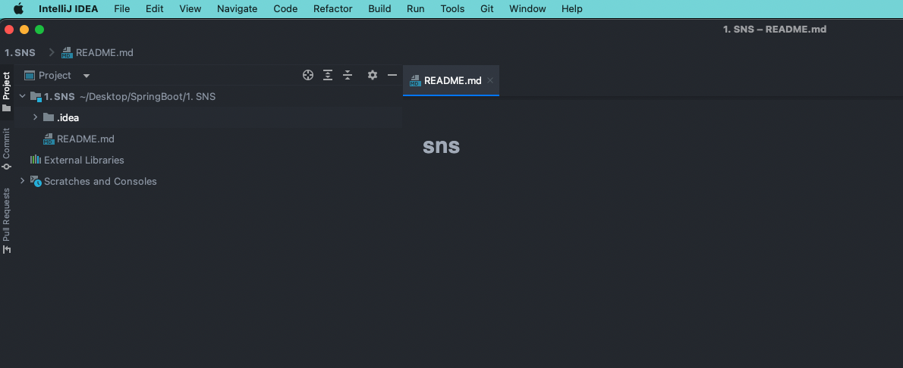


이렇게 들어가면 RADME.md 파일 하나만 보이는것을 확인 가능

### Spring Boot 기본 세팅

#### 1. Spring Initialize로 프로젝트 생성

**[Spring]** [스프링 이니셜라이즈 페이지](https://start.spring.io/)


<bold>이니셜라이즈 초기 세팅 방법</bold>

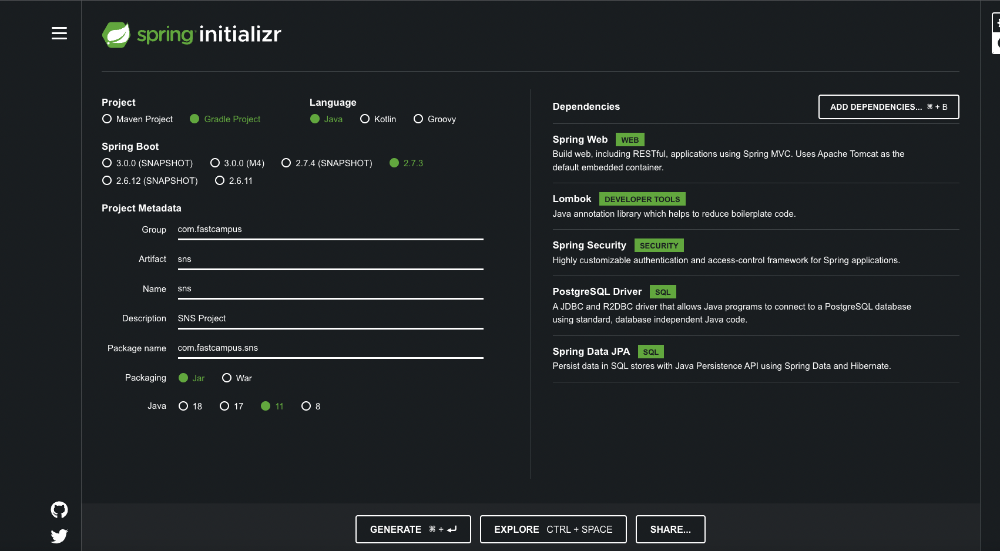


1. Project > Gradle 선택
2. Language > Java 선택
3. Spring Boot > 2.7.3 선택
4. Group > com.example 입력
5. Artifact > demo 입력
6. Packaging > Jar 선택
7. Java > 11 버전 선택
8. Dependency > Spring WEB, Lombok, Spring Security, PostgreSQL Driver, Srping Data,JPA 추가

위와같이 입력 후 Generate 하게되면 .zip 파일을 다운 받을 수 있고 이것을 풀어준다음 기존 SNS폴더에 그대로 추가해준다


<bold>프로젝트 복사해서 경로에 붙여넣기</bold>

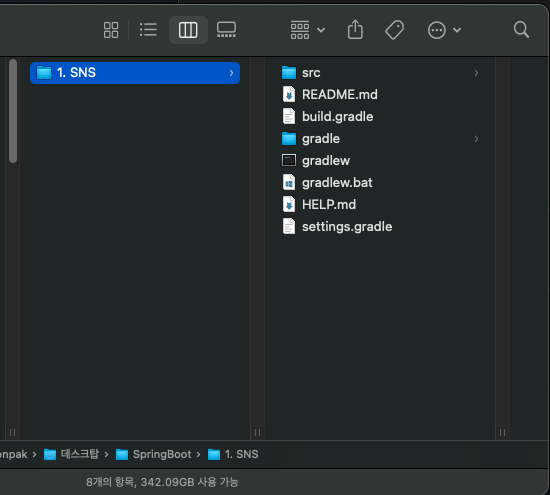


처음에는 README.md 파일밖에 없었지만 받은 .zip파일에 있는 나머지를 전부 저기에 옮겨준다음 Intelij 화면으로 돌아가면 내용이 업데이트 된것을 확인 할 수있다.


<bold>인텔리제이 프로젝트에 붙여넣은 폴더, 파일 자동으로 추가 </bold>

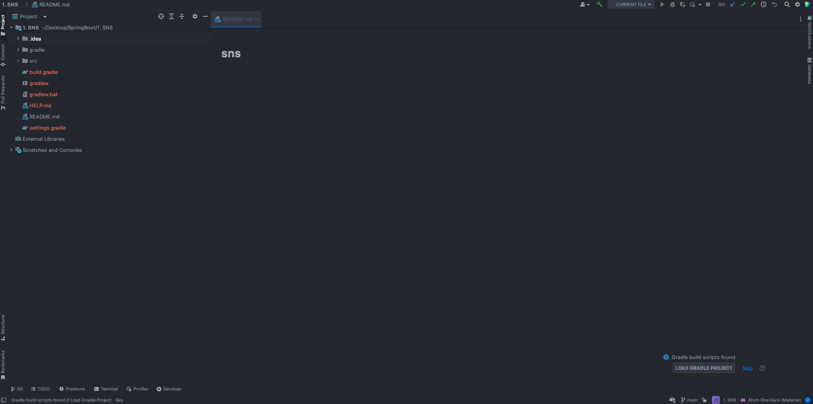


#### 2. Spring Boot 초기 에러 및 세팅


<bold>LOAD GRADLE PROJECT 실행 </bold>

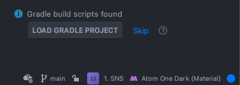


새롭게 프로젝트가 추가되면 위와 같은 화면이 인텔리제이에 뜨게되고 여기서 Load버튼 클릭


**[Git]** [gitignore 파일 생성 페이지](https://www.toptal.com/developers/gitignore/)


<bold>git ignore 파일 생성하기</bold>

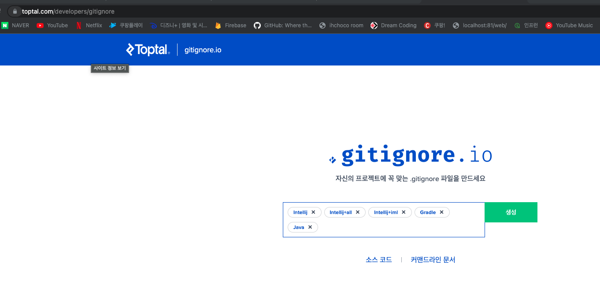


모든 파일을 업로드 하지 않고 필요하지 않은 파일들은 제외하기 위해서 여기에 Keyword입력을 통해서 깃헙저장소에 안올라도록 만들 수 있다.

Intelij, Itelij-all, Intelij+iml, Gradle, Java 추가


<bold>Ignore 파일 전체 복사</bold>

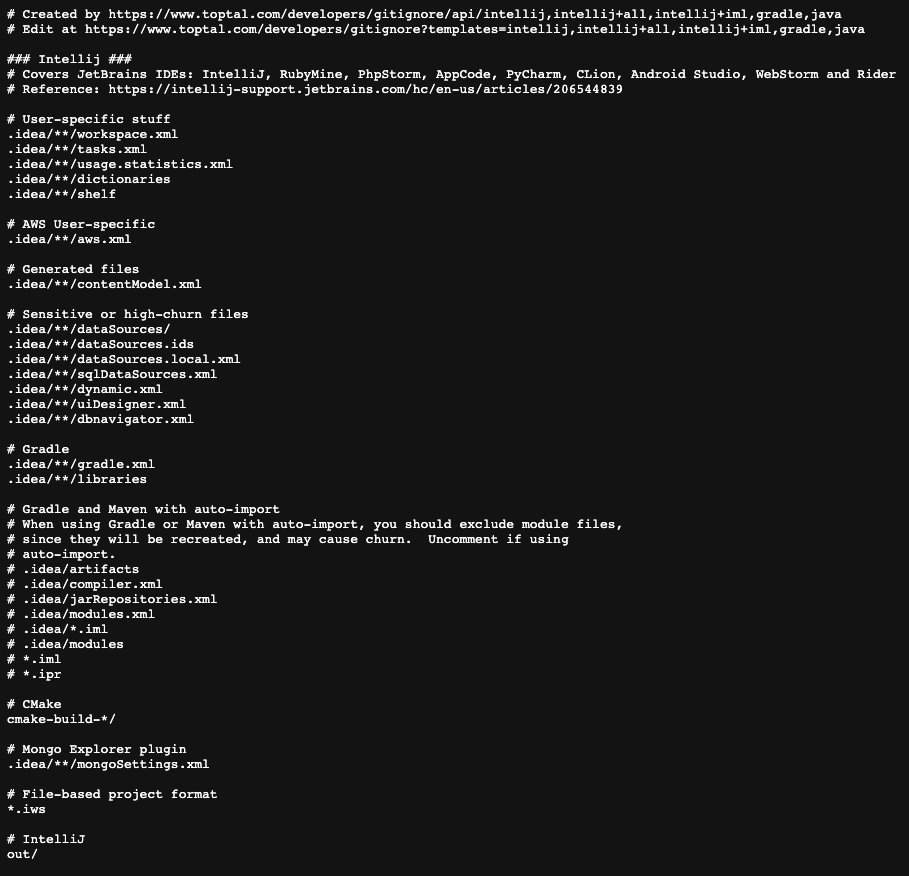


gitignore.io에서 파일 모두 복사한 다음 인텔리제이에 .gitignore 파일 생성


<bold>프로젝트 메인 NEW > FILE 클릭</bold>

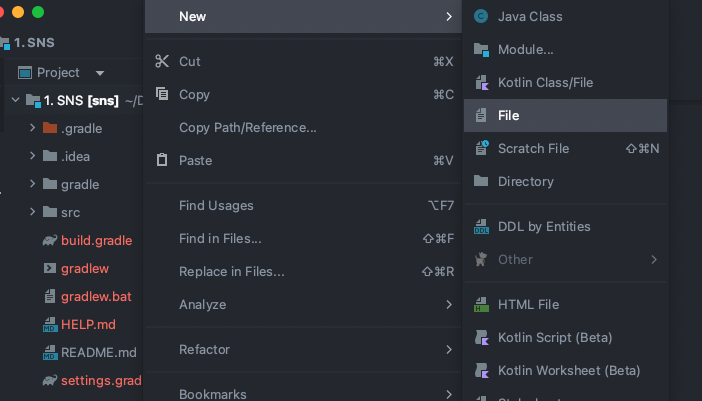


<bold>.gitignore 파일명 지정 </bold>

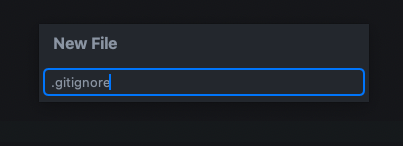


<bold>ignore 파일에 복사한 내용 붙여넣기</bold>

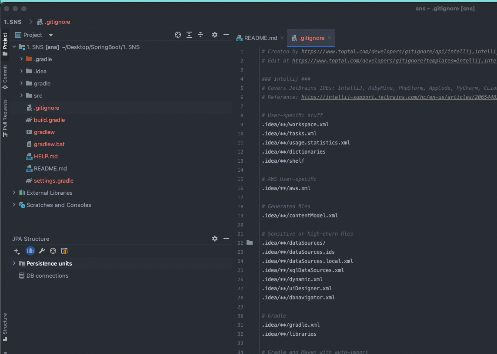


스프링 이니셜라이즈에서 JAVA 11 버전으로 생성하였기에 SDK도 맞게 변경 필요

FILE > Project Structure > Project > SDK 변경(11버전)


<bold>JDK 버전 11로 변경</bold>

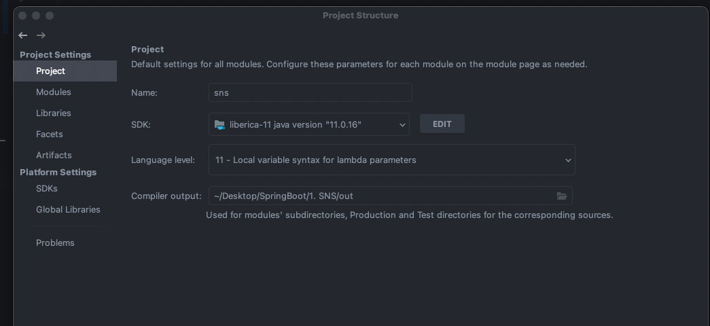


src > main > java > 패키지 > xxxApplication > class 실행버튼 > Run 버튼 클릭


<bold>프로젝트 실행하기</bold>

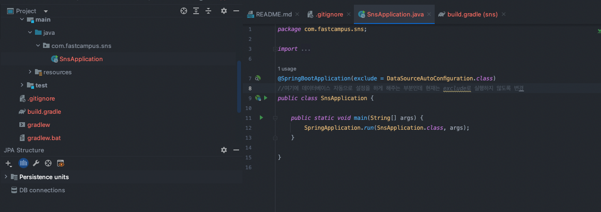


<bold>에러 확인(URL, Embedded)</bold>

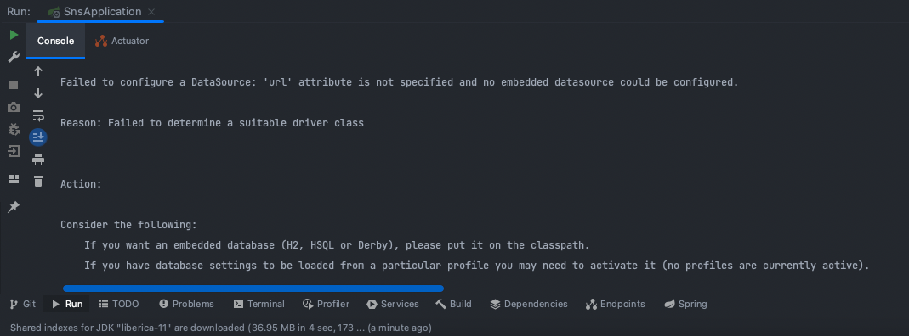


이렇게만 하면 에러 발생 > Url이랑 Embedded database 에러 발생, 아래와 같이 내용 추가

```
[Before]
@SpringBootApplication
public class SnsApplication {


[After]
@SpringBootApplication(exclude = DataSourceAutoConfiguration.class)
//여기에 데이터베이스 자동으로 설정을 하게 해주는 부분인데 현재는 exclude로 실행하지 않도록 변경
public class SnsApplication {

```

이렇게 내용을 수정하고 다시 실행하면 정상적으로 동작한다


<bold>다시 프로젝트 실행하기(정상동작)</bold>

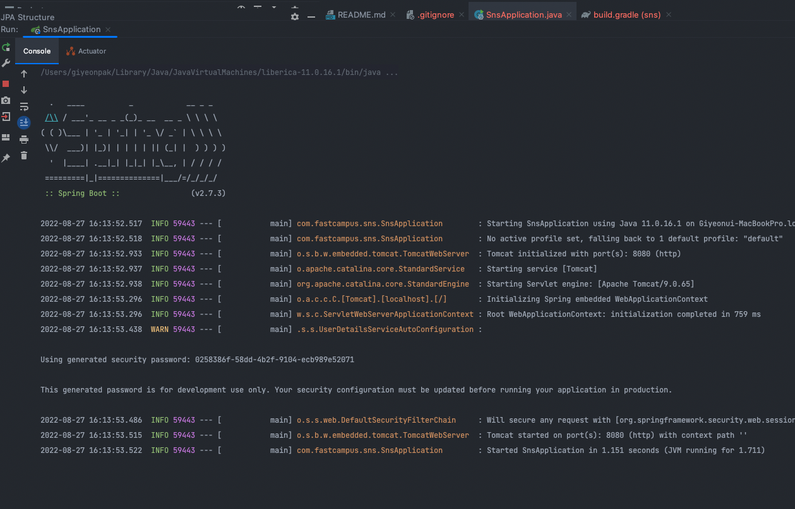


<bold>localhost:8080 입력시 정상적으로 페이지 호출</bold>

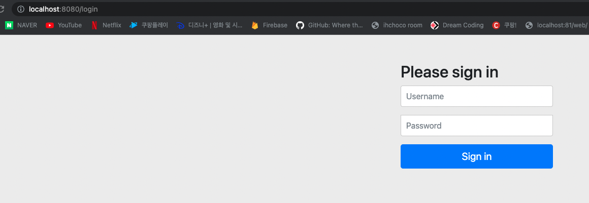


스프링 Security 추가로 위와 같이 모든 페이지에 보안 적용되어있음


<bold>프로젝트 깃허브에 commit & push 1</bold>

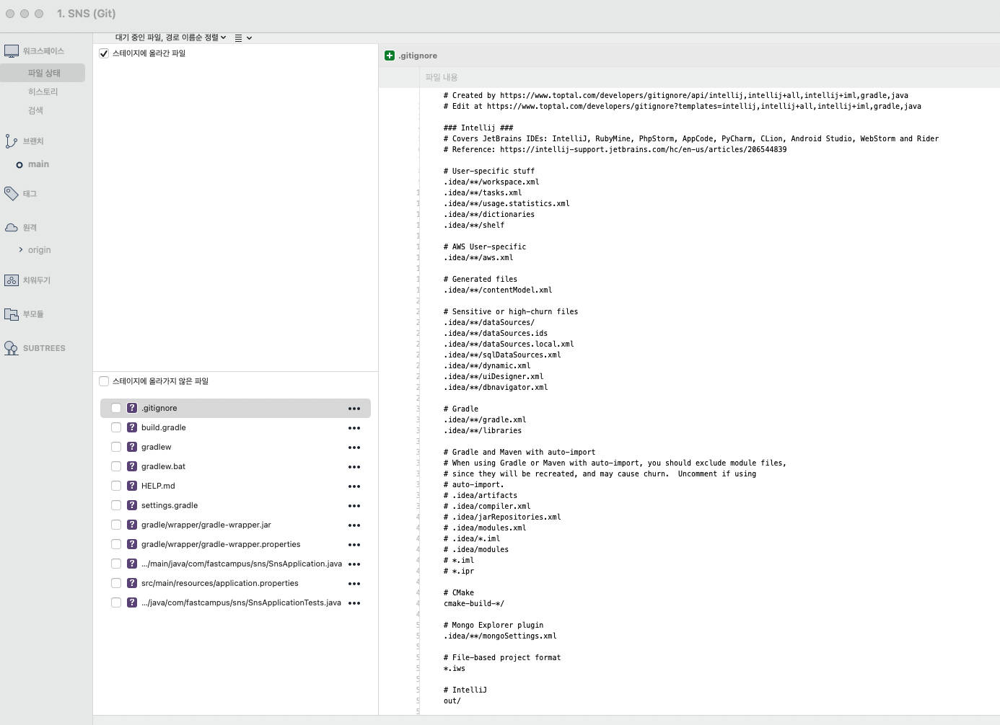


<bold>프로젝트 깃허브에 commit & push 2</bold>

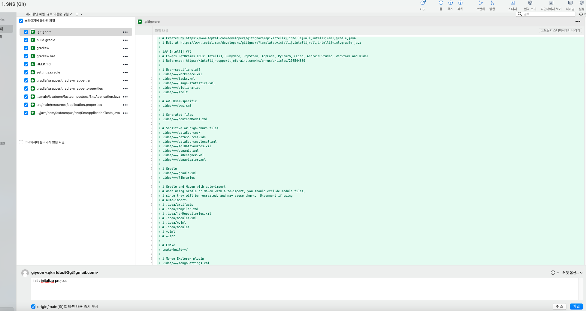


<bold>정상적으로 github에 업로드 된것을 확인 가능</bold>

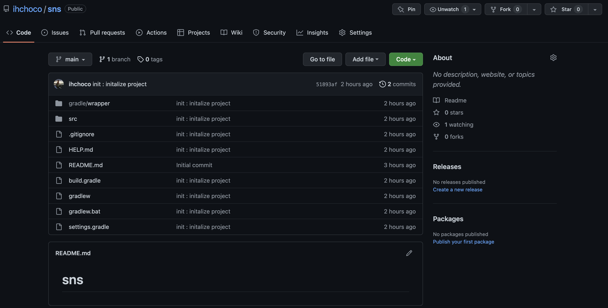


추가적으로 Spring Version을 변경 2.7.3 > 2.6.7


<bold>build.gradle에서 맨 위에 스프링 버전 변경</bold>

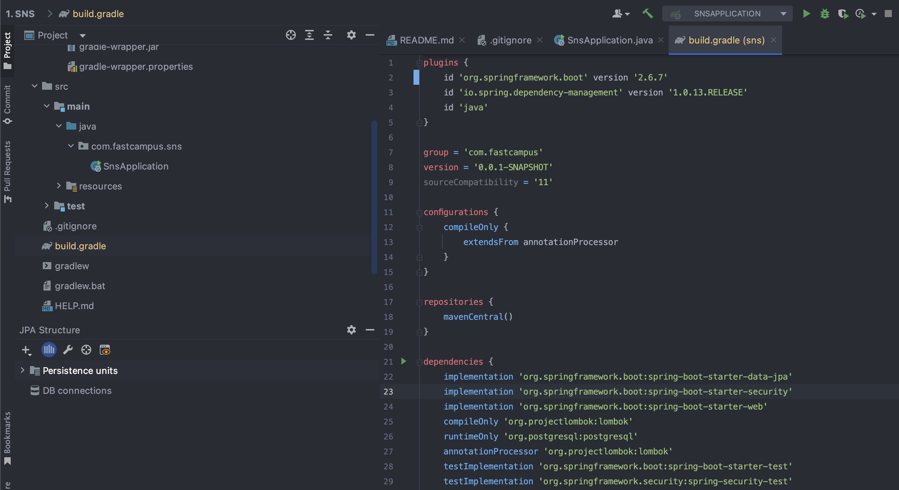


