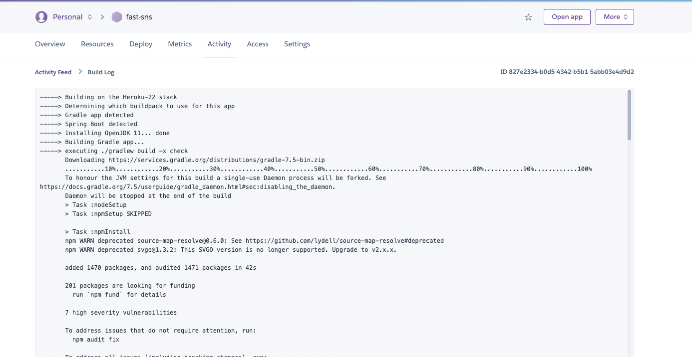

### 프론트엔드(리액트) 추가 

#### 1. 프론트엔드(리액트) 코드 추가

다른곳에서 작성한 프론트엔드(React) 코드 다운로드 해서 압출풀기


<bold>프론트엔드 폴더를 복사</bold>


<bold>복사한 폴더를 프로젝트 경로에 넣어주기</bold>


#### 2. 프론트엔드(리액트) 설정


<bold>build.gradle에 plugins - id 추가해주기</bold>


``` gradle
plugins {
	id 'org.springframework.boot' version '2.6.7'
	id 'io.spring.dependency-management' version '1.0.13.RELEASE'
	id 'java'
	id "com.github.node-gradle.node" version "3.3.0"  // << 여기 부분 추가해주기
}
```
github.node-gradle.node 플러그인 : 노드 베이스 코드를 그레이들을 이용해서 빌드하기 위한 플러그인


<bold>build.gradle에 노드 설정 및 npm 빌드</bold>


``` gradle
node {
	nodeModulesDir = file("$projectDir/front-end")
	version = '18.3.0'
	download = true
}

//node : 노드의 버전이나 다운로드 여부, 노드 모듈이 어디에 있는지 설정하는곳

task npmBuild(type: NpmTask) {
	args = ['run', "build"]
}

//npmBuild : npm task를 하는데 리액트를 빌드하는데 사용된다
//(npm run build를 실행하겠다)

task copyFrontEnd(type: Copy) {
	from "$projectDir/front-end/static"
	into 'build/resources/main/static/.'
}

//copyFrontEnd : build 파일들을 카피해서 into 경로에 넣어주겠다

task cleanFrontEnd(type: Delete) {
	delete "$projectDir/front-end/static", "$projectDir/front-end/node_modules"
}

//cleanFrontEnd : 클린이 일어날때 빌드된 프론트엔드 노드 모듈을 같이 삭제해주겠다

//위에 있는 내용을 체인으로 걸어두었다
npmBuild.dependsOn npmInstall //npmBuild가 일어나기 전에는 npmInstall이 먼저 일어나야 한다.
copyFrontEnd.dependsOn npmBuild //카피가 일어나기 전에는 npmBuild가 일어나야한다.
compileJava.dependsOn copyFrontEnd //컴파일 자바를 하기전에는 카피 프론트엔드도 수행되어야 한다

clean.dependsOn cleanFrontEnd //클린 작업이 일어나기 전에는 클린프론트엔드 클린 되어야한다.

```

위에 SRC 부분 카피해서 build.gradle 젤 하단부분에 붙여넣기

**기존에 spring-security를 사용하게 해두었는데 현재는 사용하지 않으려고 하기에 주석 처리 필요


<bold>spring-security 주석 처리</bold>


여기까지 수행한 후 RUN을 하게 되면 아래와 같이 정상적으로 되는것을 확인 가능


<bold>주소창에 localhost:8080 입력</bold>


### 헤로쿠 배포 방법
<br>

#### 1. 헤로쿠 회원가입 

**[헤로쿠]** [HEROKU 메인 페이지](https://dashboard.heroku.com/)

헤로쿠 페이지에 들어가서 회원가입 진행 후 로그인

<br>
<br>

#### 2. new app 생성 


<bold>create new app 버튼 클릭</bold>


 


<bold>app name 입력 후 create app 진행</bold>


<bold>Heroku APP 생성 완료</bold>


#### 3. Heroku 와 Git 설정
헤로쿠 메인화면에서 프로필 클릭하고 Account Settings로 들어가기


<bold>Account Setting 클릭</bold>


<bold>Account Setting 클릭</bold>


Account Setting에 들어가면 하단에 API KEY를 확인할 수 있는데 Key 값 복사


<bold>API KEY REVEAL 클릭해서 확인 후 카피하기</bold>


API KEY 복사한 다음 GITHUB 계정에 등록해주기


<bold>Github 프로젝트로 들어가서 Settings 클릭</bold>


<bold>Settings에 Secrets 밑에 Actions 클릭 후 New Repository Secret 클릭</bold>


<bold>New Secret Name, Value 입력해주기</bold>


Name : 아무거나 입력가능 / Value : 방금전에 복사했던 API Key 입력

Add secret 버튼 클릭하기


#### 4. Deploy 파일 만들기

프로젝트 메인에 > .github 폴더 생성 > workflows 폴더 생성 > deploy.yml 파일 만들기


<bold>폴더 생성 후 deploy 시나리오 넣어주기</bold>


아래 텍스트 Copy 해서 deploy.yml에 붙여넣기

** 하지만 밑에 heroku_email, heroku_app_name은 아까 Heroku에 만들었던 내용과 동일하게 수정필요
```Yml
# This is a basic workflow to help you get started with Actions

name: Deploy

# Controls when the workflow will run
on:
  # Triggers the workflow on push or pull request events but only for the main branch
  push:
    branches: [ main ]
  # Allows you to run this workflow manually from the Actions tab
  workflow_dispatch:

# A workflow run is made up of one or more jobs that can run sequentially or in parallel
jobs:
  # This workflow contains a single job called "build"
  build:
    # The type of runner that the job will run on
    runs-on: ubuntu-latest

    # Steps represent a sequence of tasks that will be executed as part of the job
    steps:
      # Checks-out your repository under $GITHUB_WORKSPACE, so your job can access it
      - uses: actions/checkout@v3

      - name: Deploy to Heroku
        uses: AkhileshNS/heroku-deploy@v3.12.12
        with:
          # This will be used for authentication. You can find it in your heroku homepage account settings
          heroku_api_key: ${{ secrets.HEROKU_DEPLOY_KEY }}
          # Email that you use with heroku
          heroku_email: qkrrldus93g@gmail.com
          # The appname to use for deploying/updating
          heroku_app_name: fast-sns

```

name : Deploy 이고 언제 일어나는 것은 main 브랜치에 push가 일어났을때 트리거가 된다.

어떤 작업이 수행되는지 확인해보면 git checkout을 하고 헤로쿠 디플로이를 하게되고 AkhileshNS/heroku-deploy@v3.12.12 라이브러리를 사용하겠다.

AkhileshNS/heroku-deploy@v3.12.12 에 필요한정보는 밑에 api_key, email, app_name에 들어있다

heroku_api_key: ${{ secrets.HEROKU_DEPLOY_KEY }} 이 부분은 아까 Github에 저장했던 API SECRET을 가져오겠다는 뜻


<bold>Secret 안에 이름이 위에 있는 heroku_api_key 이름과 동일해야한다.</bold>


#### 5. system.properties 만들기

프로젝트 메인에 > system.properties 파일 만들기

> java.runtime.version=11

한 줄 복사해서 만들어준 system.properties 파일에 붙여넣기


<bold>system.properties에 java 버전 명시</bold>


** JDK 11버전 이상 사용할때는 위와 같이 파일을 만들어주고 명시해주어야 한다

#### 6. Procfile 만들기

프로젝트 메인에 > Procfile 파일 만들기

> web: java -Dserver.port=$PORT $JAVA_OPTS -jar build/libs/sns-0.0.1-SNAPSHOT.jar

한 줄 복사해서 만들어준 Procfile 파일에 붙여넣기


<bold>Procfile 안에 Heroku 앱이 처음에 실행할 명령어 수행 내용 작성</bold>


** 여기서 주의할 점은 마지막에 sns 부분이 프로젝트 명인데 이것은 프로젝트 마다 다르니 수정 필요

project name => settings.gradle에 들어가면 프로젝트 이름이 있으니 거기에 맞춰서 수정

<bold>Project root name 확인</bold>


#### 7. Build 해보기

Intelij 우측 Gradle 클릭 > Tasks > build > build 더블 클릭


<bold>build 클릭하기</bold>


<bold>build 성공시 libs 아래에 .jar 파일 생성확인</bold>


여기에 나오는 build.gradle 버전의 경우(0.0.1)은 build.gradle에 있는 version을 가져오는것으로 만약에 build.gradle 버전 변경시 Procfile에 있는 버전 정보도 꼭!! 변경해주어야 한다.


<bold>build.gradle Version 정보와 Procfile Version정보는 일치해야한다</bold>


여기 까지 진행 후 Spring Boot Application 실행하면 정상적으로 기동되는것을 확인 가능


#### 8. .gitIgnore 내용 추가(필수X)

[프로젝트 마다 이 내용은 필요할 수도 아닐수도 있음]

프로젝트 메인 > .gitignore > 하단부분에 아래 텍스트 추가

```
**/front-end/node_modules/**
**/front-end/static/**
```


<bold>.gitignore에 추가</bold>


#### 9. Commit & PUSH , Github Action 확인

.gitignore에 제외한 내용을 빼고 모두 Commit and Push

github : 프로젝트 > Actions > Worksflow 확인해보면 배포가 진행되는것을 확인 가능


<bold>Github Action 확인</bold>


heroku : 메인에서 배포중인걸 확인가능


<bold>Heroku 확인</bold>





<bold>배포 완료 및 접속 URL 확인</bold>


#### 10. URL로 프로젝트 정상적으로 접속가능한지 확인 가능


<bold>URL 접속 확인 및 자동 배포 완료</bold>


