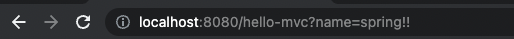

### 스프링부트 MVC 기초 

#### 1. Controller 생성

Project > main > java.com.example.프로젝트 > 패키지 생성

패키지 명 : controller

생성된 controller 패키지 아래에 FirstController.java 생성

```java
package com.example.stella.controller;

public class FirstController {

}
```

위와 같이 클래스가 생성되면 @Controller 어노테이션을 class 위에 추가 

```java
package com.example.stella.controller;

import org.springframework.stereotype.Controller;

@Controller
public class FirstController {

}
```

이렇게 해주면 FirstController 클래스가 Controller 역할을 수행할

URL 입력이 들어오면 처음에 Controller가 받게되고 어디로 가야할지 @GetMapping 어노테이션을 사용해서 안내

```java
package com.example.stella.controller;

import org.springframework.stereotype.Controller;
import org.springframework.ui.Model;
import org.springframework.web.bind.annotation.GetMapping;

@Controller
public class FirstController {

    @GetMapping("/hello")
    public String hello(){
        return "hello"; 
    }
}
```

localhost:8080/hello 입력을 받게되면 FirstController > hello 에서 받게되고 return "hello" 페이지를 하게 된다.

> hello 위치 : resources > static > hello.html


#### 2. View 생성
1. resources > templates > hello.mustache 파일 생성
2. resources > templates > layouts 폴더 생성
3. resources > templates > layouts > header.mustache 파일 생성
4. resources > templates > layouts > footer.mustache 파일 생성


<bold>인텔리제이 폴더구조</bold>


<bold>header.mustache 파일</bold>
```html
<!doctype html>
<html lang="en">
<head>
    <meta charset="utf-8">
    <meta name="viewport" content="width=device-width, initial-scale=1">
    <title>Bootstrap demo</title>
    <link href="https://cdn.jsdelivr.net/npm/bootstrap@5.2.0/dist/css/bootstrap.min.css" rel="stylesheet" integrity="sha384-gH2yIJqKdNHPEq0n4Mqa/HGKIhSkIHeL5AyhkYV8i59U5AR6csBvApHHNl/vI1Bx" crossorigin="anonymous">
</head>
<body>
<script src="https://cdn.jsdelivr.net/npm/bootstrap@5.2.0/dist/js/bootstrap.bundle.min.js" integrity="sha384-A3rJD856KowSb7dwlZdYEkO39Gagi7vIsF0jrRAoQmDKKtQBHUuLZ9AsSv4jD4Xa" crossorigin="anonymous"></script>
<!--navigation-->
<nav class="navbar navbar-expand-lg bg-light">
    <div class="container-fluid">
        
    </div>
</nav>
```

<bold>hello.mustache 파일</bold>

{{>layouts/header}} >> resources/templates/header.mustache 파일 불러오기

```html
{{>layouts/header}} 
<!--content-->
    <div class="bg-dark text-white p-5">
        <h1>{{nickname}}</h1>
    </div>

{{>layouts/footer}}
```

{{>layouts/tooter}} >> resources/templates/footer.mustache 파일 불러오기


<bold>footer.mustache 파일</bold>

```html
<!--site info-->
<div class="mb-5 container-fluid">
    <hr>
    <p>@ GiyeonStudying <a href="#"> Privacy</a></p>
</div>
</body>
</html>
```

** {{nickname}} 의 경우는 controller 부터 전달받은 Model

```java
import org.springframework.stereotype.Controller;
import org.springframework.ui.Model;
import org.springframework.web.bind.annotation.GetMapping;

@Controller
public class FirstController {

    @GetMapping("/hello")
    public String hello(Model model){
        model.addAttribute("username", "차가운핫초코");
        return "hello"; // templates/hello.mustache -> 브라우저로 실행
    }
}
```

여기서 (Model model)속에 model.addAttribute("username", "차가운핫초코") 를 mustache 템플릿에서 가져온다


#### 3. Form Data 전송

templates > articles 폴더 생성 > new.mustache 파일 생성
```html
{{>layouts/header}}
<form class="container" action="/articles/create" method="post">
    <div class="mb-3">
        <label class="form-label">제목</label>
        <input type="text" name="title" class="form-control">
    </div>
    <div class="mb-3">
        <label class="form-label">내용</label>
        <textarea class="form-control" name="content" rows="3"></textarea>
    </div>
    <button type="submit" class="btn btn-primary">Submit</button>
</form>
{{>layouts/footer}}
```

Form 태그 생성시 주의사항
1. method = "post"
2. action = "/articles/create"
3. input 태그에 name은 DTO의 클래스 안에 있는 필드명과 동일하게 맞춰줘야 한다


<bold>DTO 타입</bold>


<bold>Form 내용</bold>


Form Data 수신하는 Controller 작성

controller package에 ArticleController 생성


1.GetMapping("/articles/new")를 이용해서 form 데이터 입력 페이지로 이동

2.전송된 Form Data를 @PostMapping("/articles/create")를 이용해서 받아준다(=Form Action 경로)

3.Post로 전송받을 때는 DTO객체에 담아서 보내주기 때문에 DTO 객체를 만들어야 한다

4.public String createArticle(ArticleForm form){} 여기서 ArticleForm form 객체에 데이터가 넘어와서 자동으로 생성된다

<br>
<br>
<br>
<br>

#### 3. URL에서 Parameter를 전달받고 싶을때

```java
@GetMapping("hello-mvc")
public String helloMvc(@RequestParam(value="name", required = false) String name, Model model){ //@RequestParam("name")을 기본으로 사용
    model.addAttribute("name", name);
    return "hello-template";
}
```

아래처럼 입력을 해주면 name 파라미터에 spring!!이라는 값이 넘어오게 된다



```java
@RequestParam(value="name", required =false) //이렇게 작성해도 괜찮지만

@RequestParam("name") //이렇게 작성가능

/*
두개의 차이점은 위에 1번의 경우는 required = falase로 되어 있어 반드시 Parameter로 안들어와도 되지만

2번의 경우 안들어오게 되면 에러가 발생하게 된다
*/
```


출처 
 1. [[JAVA]홍팍 - 클라우드스터딩](https://cloudstudying.kr/lectures/469)
 2. [[JAVA]스프링 부트 입문](https://cloudstudying.kr/lectures/469)
