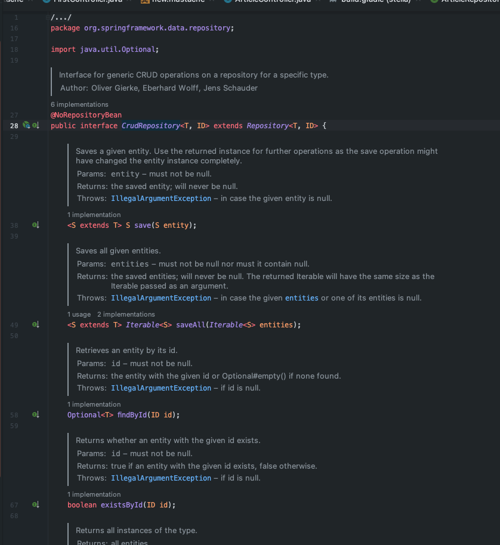

### 스프링부트 JPA & DATABASE 연동 

#### 1. JPA

작업전 H2 Database 사용 필요 > dependency 추가 필요

작업전 JPA 사용 필요 > dependency 추가 필요


```gradle
dependencies {
    implementation 'org.springframework.boot:spring-boot-starter-data-jpa'
    implementation 'org.springframework.boot:spring-boot-starter-mustache'
    implementation 'org.springframework.boot:spring-boot-starter-web'
    compileOnly 'org.projectlombok:lombok'
    runtimeOnly 'com.h2database:h2'
    annotationProcessor 'org.projectlombok:lombok'
    testImplementation 'org.springframework.boot:spring-boot-starter-test'
}
```

DB에 데이터를 기록하려면 어떻게 해야할까? > 문제는 DB는 자바를 이해하지 못한다. 

Q. 그럼 DB에 자바를 이해할 수 있게 해주는 것이 무엇있까?! 

A. 그게 이번에 학습할 JPA 이다

JPA는 데이터 관리에 필요한 여러 기능들도 제공해준다. 

이러한 JPA의 핵심 도구로는 2가지가 있다.
1. Entity : 자바 객체(DTO)를 DB가 잘 이해할 수 있는 규격화된 Entity로 변경
2. Repository : repository라는 일꾼을 통해서 전달받은 Entity를 DB에 저장할 수 있다


[처리흐름개요]

1. DTO를 변환! Entity!
2. Repository에게 Entity를 DB안에 저장하게 함


DTO를 Entity로 변환

> Article article = form.toEntity()

* 먼저 form 객체는 DTO 클래스(ArticleForm)에서 만들어진 객체로 POST 방식으로 넘어올때 자동으로 생성

1. [Entity] Article Entity 만들기 


src > main > java > com.example.프로젝트 > entity > Article.java 파일 생성

** 여기서 Entity KEYPOINT **
1. @Entity 어노테이션을 붙여주어야 DB에서 Entity로 인식가능
2. @ID 어노테이션은 Primary Key 값을 의미한다
3. @GeneratedValue 어노테이션은 자동으로 번호를 채번해주는 sequence 역할
4. @Column 어노테이션은 필드값을 커럼으로 만들어주는 역할

```java
package com.example.stella.entity;

import javax.persistence.Column;
import javax.persistence.Entity;
import javax.persistence.GeneratedValue;
import javax.persistence.Id;

@Entity // 여기에 @Entity 어노테이션을 달아줘야지 DB에서 인식해서 저장이 가능하
public class Article {

    @Id // 대표값을 지정! Like a 주민등록번호
    @GeneratedValue // 1, 2, 3, ... 자동 생성 어노테이션
    private Long id;

    @Column
    private String title;

    @Column
    private String content;

    public Article(Long id, String title, String content) {
        this.id = id;
        this.title = title;
        this.content = content;
    }
    
    @Override
    public String toString() {
        return "Article{" +
                "id=" + id +
                ", title='" + title + '\'' +
                ", content='" + content + '\'' +
                '}';
    }
}
```

2. [DTO] Article 파일에 toForm() 추가하기

```java
package com.example.stella.dto;

import com.example.stella.entity.Article;

public class ArticleForm {
    private String title;
    private String content;

    public ArticleForm(String title, String content) {
        this.title = title;
        this.content = content;
    }

    @Override
    public String toString() {
        return "ArticleForm{" +
                "title='" + title + '\'' +
                ", content='" + content + '\'' +
                '}';
    }

    public Article toEntity() {
        return new Article(null, title, content);
    }
}
```


그 이후 form.toEntity()를 호출하려 하면 당연히 없기 때문에 ArticleDto 클래스에 toEntity()함수 생성


3. [Repository] Repository에게 Entity를 DB안에 저장하게 하도록

단순히 이렇게 추가하면 에러 발생
```java
public class ArticleController {
    ...
    
    @Autowired //여기에 @Autowired 어노테이션으로 연결
    private ArticleRepository articleRepository;
    
    ...
}
```


> Article saved = articleReoisitory.save() 수행 가능하도록 아래와 같이 만들어보자

먼저 Repository 작성

src > main > java > com.example.프로젝트 > repository 패키지 > Interface(ArticleRepository) 파일 생성

```java
package com.example.stella.controller.repository;

public interface ArticleRepository{

}
```

<bold>Interface 생성 후 CrudRepository<Entity, PrimaryKey Type>을 상속</bold>

ex) CrudRepository<Article, Long> 
 - Entity = Article
 - PrimaryKey Type = Long id

```java
package com.example.stella.controller.repository;

import com.example.stella.entity.Article;
import org.springframework.data.repository.CrudRepository;

public interface ArticleRepository extends CrudRepository<Article, Long> {

}
```

[궁금해서 찾아보는 CrudRepository 내부] < save, saveAll, findById ... 여러 기능 포함>



이렇게 해주면 Repository 생성 완료

> 아래와 같이 Article saved = articleRepository.save(article) 하게 되면 정상적으로 저장하고 리턴


[최종CODE] Article Controller

```java
package com.example.stella.controller;

import com.example.stella.controller.repository.ArticleRepository;
import com.example.stella.dto.ArticleForm;
import com.example.stella.entity.Article;
import org.springframework.beans.factory.annotation.Autowired;
import org.springframework.stereotype.Controller;
import org.springframework.web.bind.annotation.GetMapping;
import org.springframework.web.bind.annotation.PostMapping;

@Controller
public class ArticleController {

    @Autowired // 스프링 부트가 미리 생성해놓은 객체를가져다가 자동 연결
    private ArticleRepository articleRepository;

    @GetMapping("/articles/new")
    public String newArticleForm(){
        return "articles/new";
    }

    @PostMapping("/articles/create")
    public String createArticle(ArticleForm form){
        System.out.println(form.toString());

        // 1. Dto를 변환! Entity!
        // DTO는 자바의 객체, DB에 저장하기 위해서는 
        Entity로 변환이 필요하고 그 다음 Repository를 통해서 DB에 저장
        Article article = form.toEntity();
        System.out.println(article.toString());

        // 2. Repository에게 Entity를 DB안에 저장하게 함
        Article saved = articleRepository.save(article);
        System.out.println(saved.toString());

        return "";
    }
}
```

#### 2. DATABASE 연동

H2 Database 

application.properties에 아래와 같이 추가해주면 WEB에서 H2 DB에 접속이 가능하다

> spring.h2.console.enabled=true


WEB H2 URL 접속 방법

localhost:8080/h2-console 입력

이렇게 해주면 접속화면이 나오고 여가에서 JDBC URL을 찾아서 넣어줘야 한다.

JDBC URL은 스프링 기동할 때 아래와 같이 주소가 나오게 된다.

H2 console available at '/h2-console'. Database available at 'jdbc:h2:mem:dc43092e-4034-4c14-aaf6-1d206d67fa94'


> jdbc:h2:mem:dc43092e-4034-4c14-aaf6-1d206d67fa94' //copy


그대로 붙여 넣기

지금은 이렇게 접속하지만 나중에는 자동으로 접속하는 방법으로 접근


기존에 만들었던 Article Entity를 저장하게 되어 Article Table 자동 생성이 된다.

** 주의할 점 : 현재 MEM에 올려서 사용하는 DB로 해두었기에 스프링 재기동시 데이터가 모두 날라간다.


출처 
 1. [[JAVA]홍팍 - 클라우드스터딩](https://cloudstudying.kr/lectures/470)
 2. [[JAVA]스프링 부트 입문](https://www.youtube.com/watch?v=ZGgf_1OXcAY&list=PLyebPLlVYXCiYdYaWRKgCqvnCFrLEANXt&index=99)
 3. [[JAVA]홍팍 - 클라우드스터딩](https://cloudstudying.kr/lectures/471)
 4. [[JAVA]스프링 부트 입문](https://www.youtube.com/watch?v=76a6YMmpZmY&list=PLyebPLlVYXCiYdYaWRKgCqvnCFrLEANXt&index=10)
