### 스프링부트 Lombok 사용법

#### 1. Lombok

Lombok = 코드를 간소화 해주는 라이브러리(getter, setter, constructor, toString...)

Lombok을 사용하면 필수 코드의 반복을 최소화 및 Loging(Log 작성) 통해서 프린트 기능도 개선해줄 수 있다


<bold> build.gradle에 추가</bold>

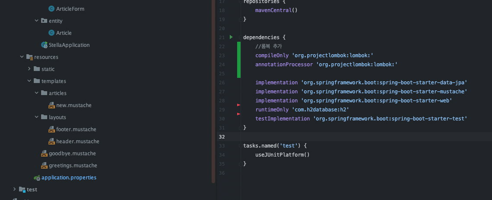

```gradle
dependencies {
    //롬복 추가
    compileOnly 'org.projectlombok:lombok:'
    annotationProcessor 'org.projectlombok:lombok:'
    ...
}
```

추가후 Gradle 새로고침 버튼을 클릭해서 Lombok을 가져온다

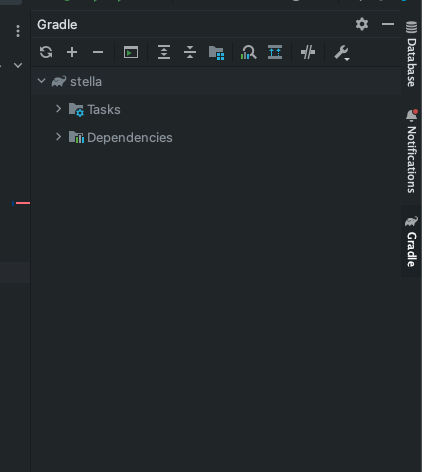

Gradle을 확인해보면 성공적으로 Lombok이 추가된 모습을 확인 가능

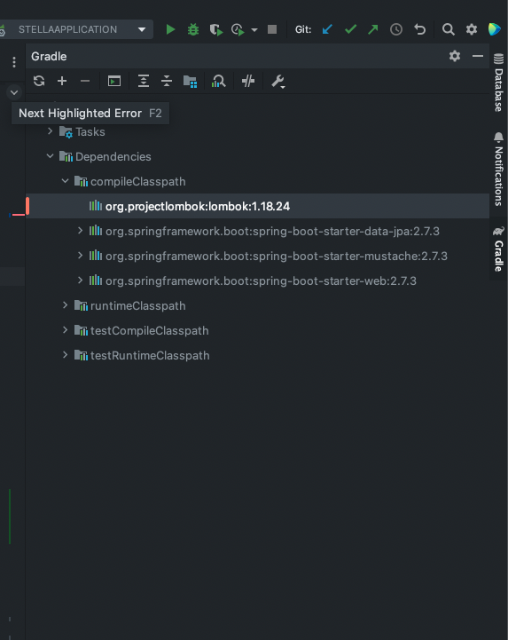

Lombok 플러그인 추가방법

1. help > find action > plugins > Lombok 검색해서 플러그인 설치
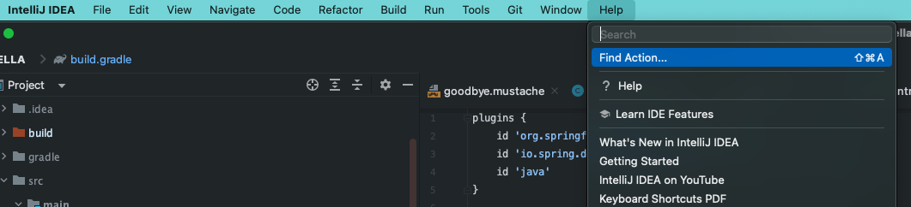

2. Lombok 플러그인 설치
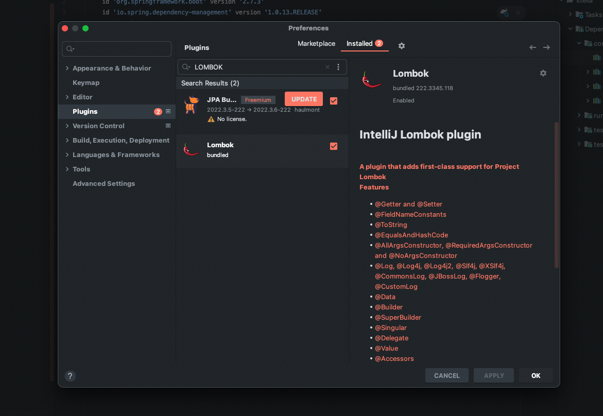

3. Lombok Annotation Processing Enable 클릭
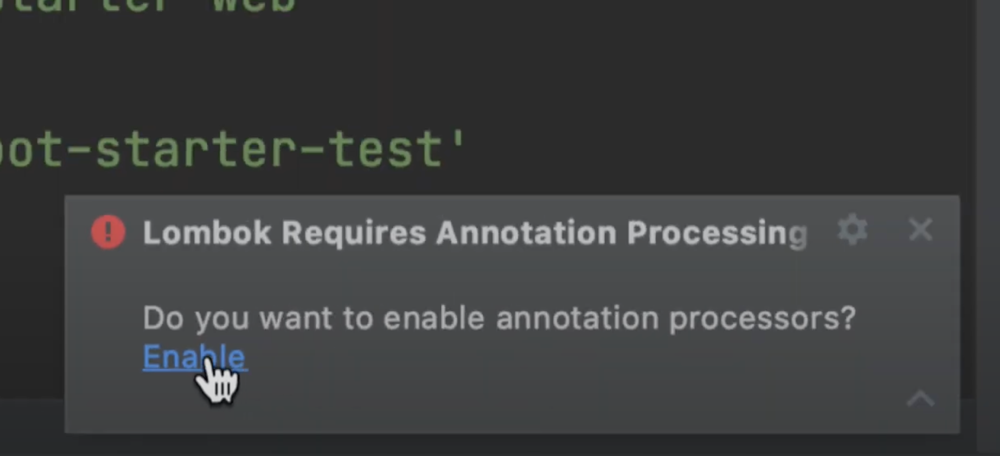


Lombok 설치완료

그럼 이제 리펙토링을 시작해보자

```java
@AllArgsConstructor <= 아래 코드와 같은 의미

public Article(Long id, String title, String content) {
    this.id = id;
    this.title = title;
    this.content = content;
}

@ToString <= 아래 코드와 같은 의미

public String toString() {
    return "Article{" +
            "id=" + id +
            ", title='" + title + '\'' +
            ", content='" + content + '\'' +
            '}';
}
```

1. DTO[ArticleForm] 수정해보자

[DTO 기존코드]
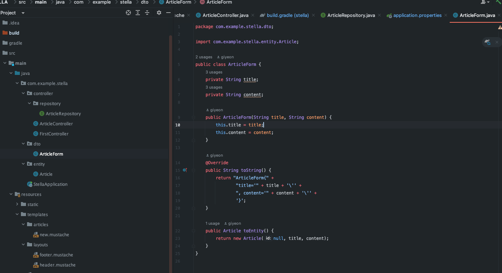

[DTO 수정코드 - Lombok 사용]
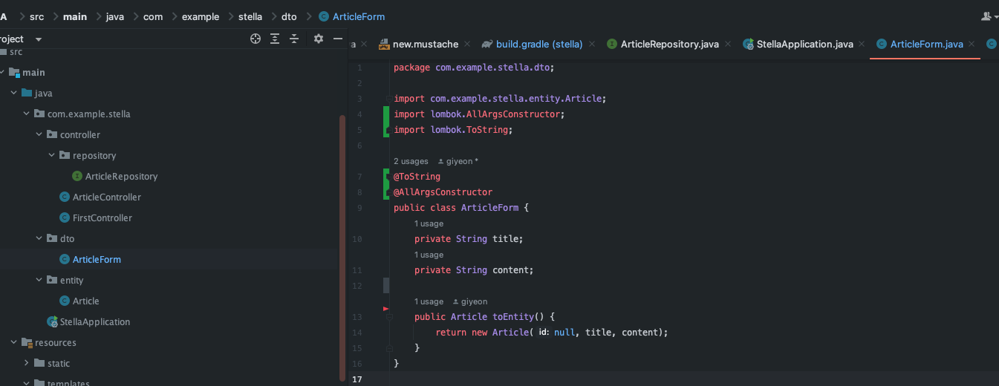

```java
package com.example.stella.dto;

import com.example.stella.entity.Article;
import lombok.AllArgsConstructor;
import lombok.ToString;

@ToString //toString
@AllArgsConstructor //퍼블릭 생성자
public class ArticleForm {
    private String title;
    private String content;

    public Article toEntity() {
        return new Article(null, title, content);
    }
}
```

2. Entity[Article] 수정해보자

[Entity 기존코드]
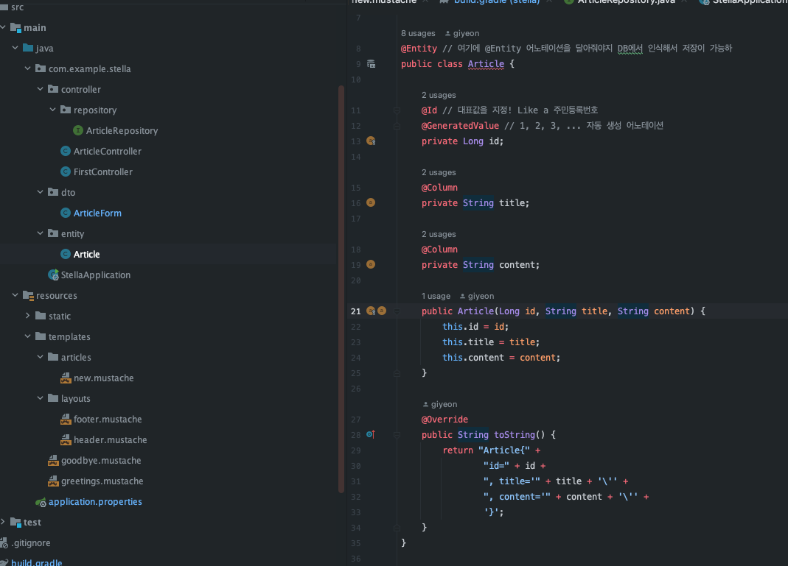

[Entity 수정코드 - Lombok 사용]
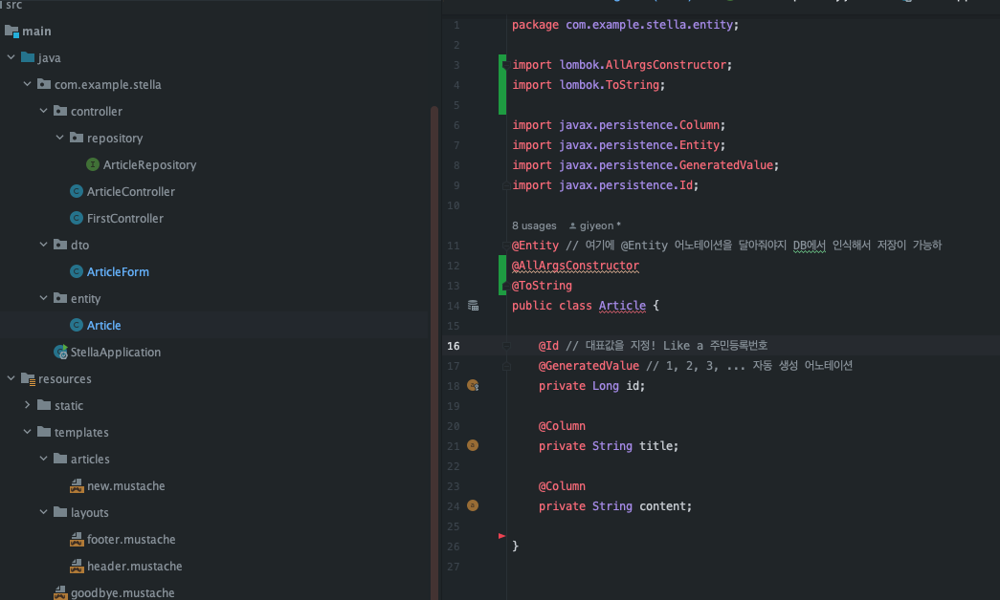

```java
package com.example.stella.entity;

import lombok.AllArgsConstructor;
import lombok.ToString;

import javax.persistence.Column;
import javax.persistence.Entity;
import javax.persistence.GeneratedValue;
import javax.persistence.Id;

@Entity // 여기에 @Entity 어노테이션을 달아줘야지 DB에서 인식해서 저장이 가능하
@AllArgsConstructor
@ToString
public class Article {

    @Id // 대표값을 지정! Like a 주민등록번호
    @GeneratedValue // 1, 2, 3, ... 자동 생성 어노테이션
    private Long id;

    @Column
    private String title;

    @Column
    private String content;

}
```

3. Controller[Article] 수정해보자 - Slf4j 어노테이션 사용

>실제 서버에서는 절대로 System.out.println()을 사용하면 안된다.
1. 확인도 안되고 2. 서버에 부하도 많이 준다.

System.out.println( -> 로깅 기능으로 대체 필요

Logging이란? => 서버에서 일어나는 모든일을 기록하는 것
```java        
@Slf4j //로깅을 위한 어노테이션
public class ArticleController {
    ...
    //System.out.println(form.toString());
    //System.out.println(form.toString) => log.info(form.toString)
    log.info(form.toString()); 
    ...
}
```

[Controller 기존코드]
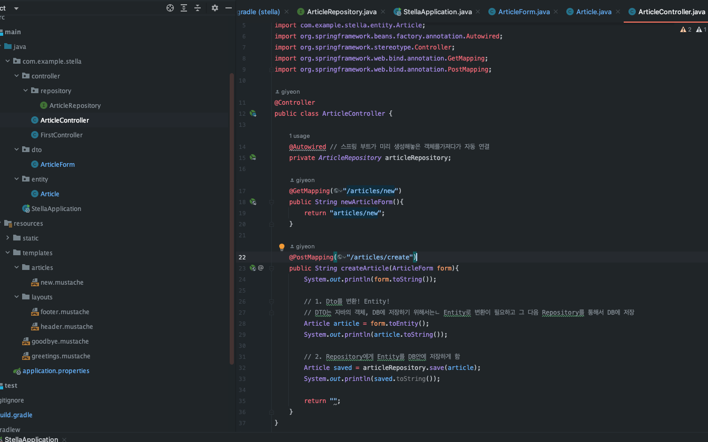

[Controller 수정코드 - Lombok 사용]
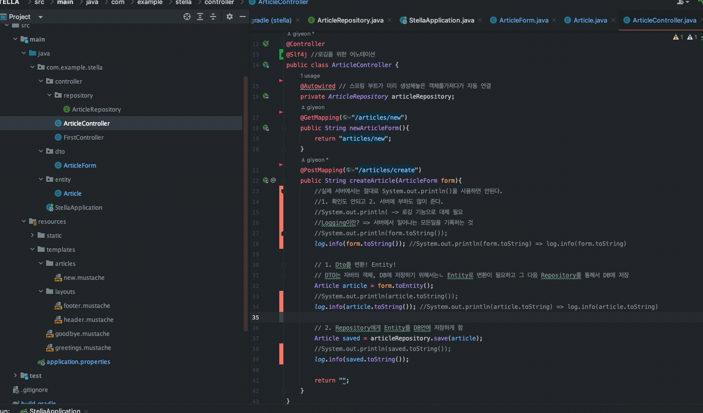

[log 확인 방법(Slf4j)] 아래처럼 콘솔에 찍힘
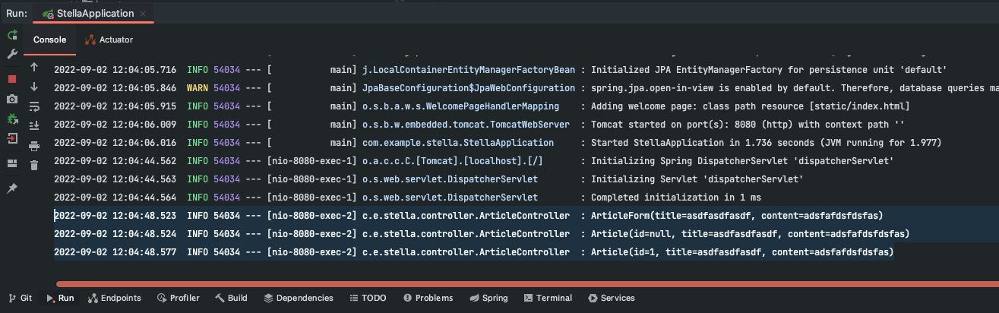

```java
package com.example.stella.controller;

import com.example.stella.controller.repository.ArticleRepository;
import com.example.stella.dto.ArticleForm;
import com.example.stella.entity.Article;
import lombok.extern.slf4j.Slf4j;
import org.springframework.beans.factory.annotation.Autowired;
import org.springframework.stereotype.Controller;
import org.springframework.web.bind.annotation.GetMapping;
import org.springframework.web.bind.annotation.PostMapping;

@Controller
@Slf4j //로깅을 위한 어노테이션
public class ArticleController {
    @Autowired // 스프링 부트가 미리 생성해놓은 객체를가져다가 자동 연결
    private ArticleRepository articleRepository;
    @GetMapping("/articles/new")
    public String newArticleForm(){
        return "articles/new";
    }
    @PostMapping("/articles/create")
    public String createArticle(ArticleForm form){
        //실제 서버에서는 절대로 System.out.println()을 사용하면 안된다.
        //1. 확인도 안되고 2. 서버에 부하도 많이 준다.
        //System.out.println( -> 로깅 기능으로 대체 필요
        //Logging이란? => 서버에서 일어나는 모든일을 기록하는 것
        //System.out.println(form.toString());
        log.info(form.toString()); //System.out.println(form.toString) => log.info(form.toString)

        // 1. Dto를 변환! Entity!
        // DTO는 자바의 객체, DB에 저장하기 위해서는ㄴ Entity로 변환이 필요하고 그 다음 Repository를 통해서 DB에 저장
        Article article = form.toEntity();
        //System.out.println(article.toString());
        log.info(article.toString()); //System.out.println(article.toString) => log.info(article.toString)

        // 2. Repository에게 Entity를 DB안에 저장하게 함
        Article saved = articleRepository.save(article);
        //System.out.println(saved.toString());
        log.info(saved.toString());

        return "";
    }
}

```


출처 
 1. [[JAVA]홍팍 - 클라우드스터딩](https://cloudstudying.kr/lectures/471)
 2. [[JAVA]스프링 부트 입문](https://www.youtube.com/watch?v=2VYBQ_99RJg&t=175s)
