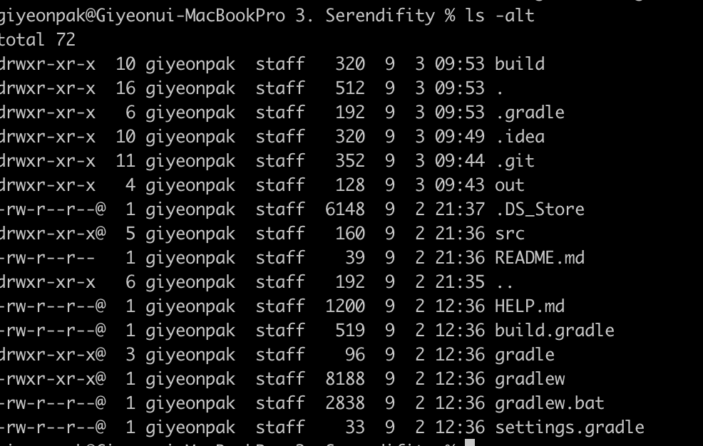
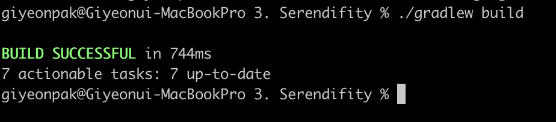
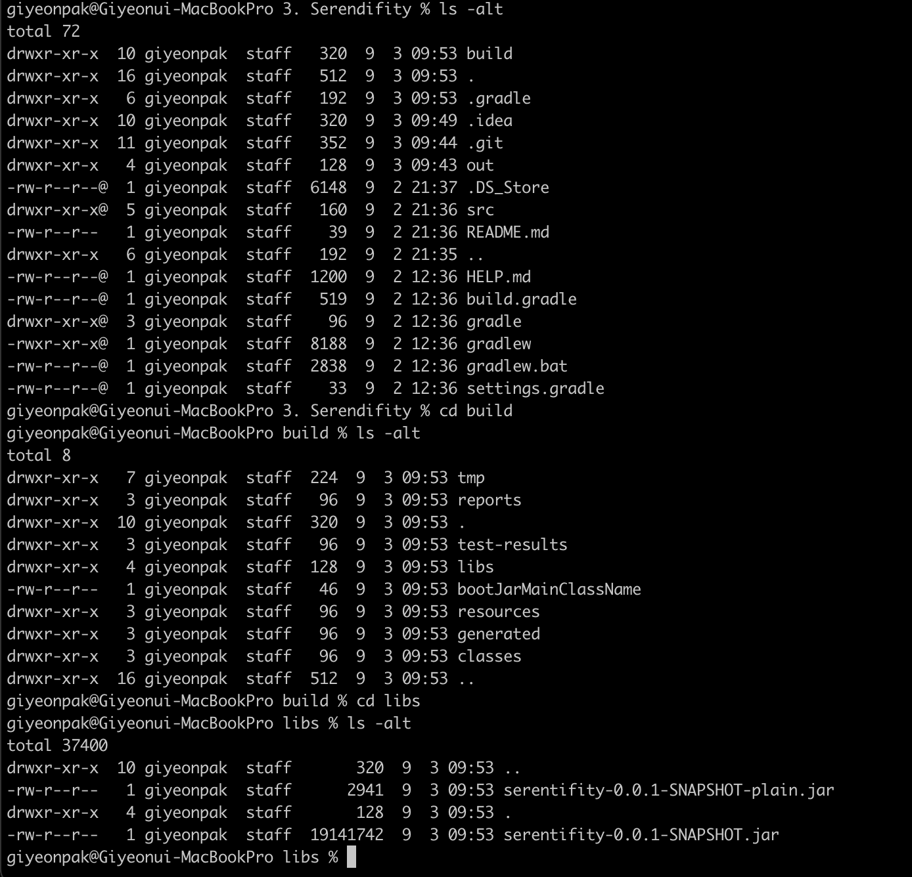
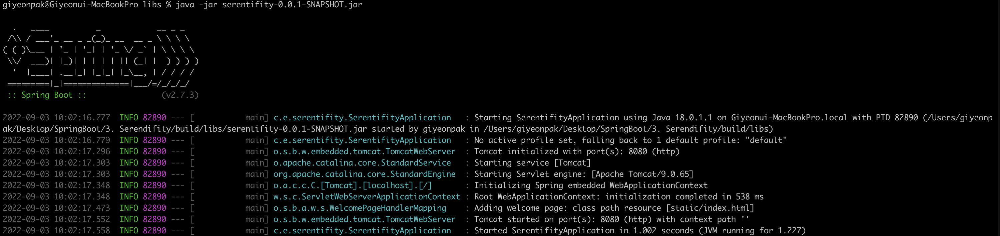

### 스프링부트 build 및 배포 방법

#### 1. 스프링부트 build

프로젝트 완료 후 배포 하고싶으면 먼저 .jar 파일로 빌드를 해야한다

1. 터미널 실행
2. 해당 프로젝트 폴더로 이동

3. ls -alt 검색을 해보면 gradlew가 있는데 이게 자동으로 빌드해서 .jar파일로 만들어주는 실행 프로그램

4. ./gradlew build 명령어 입력으로 프로젝트 빌드 실행
5. .jar 파일이 있는곳으로 이동(project > build > libs > 프로젝트명-0.0.1-SNAPSHOT.jar)

6. .jar 파일을 기동하는 방법(내장 톰캣이 들어있기 때문에 그냥 실행만 시켜주면 된다)

java -jar 프로젝트명-0.0.1-SNAPSHOT.jar 입력하면 정상적으로 서버 기동되면서 스프링 실행

<bold>예전에는 WAS(톰캣) 설치하고 밑에 .jar 파일 넣고 설정해주었지만 현재는 서버에 저 파일을 아무대나 놓고 그냥 실행하면 끝(엄청 편리해졌다)</bold>

터미널에서 ctrl + c 를 누르면 프로젝트 실행 종료

*만약에 build가 잘안될때에는 ./gradlew clean build 명령어로 클린하고 빌드 실행해보자

출처 
 1. [[JAVA]스프링 입문-김영한](https://www.inflearn.com/course/%EC%8A%A4%ED%94%84%EB%A7%81-%EC%9E%85%EB%AC%B8-%EC%8A%A4%ED%94%84%EB%A7%81%EB%B6%80%ED%8A%B8/dashboard)