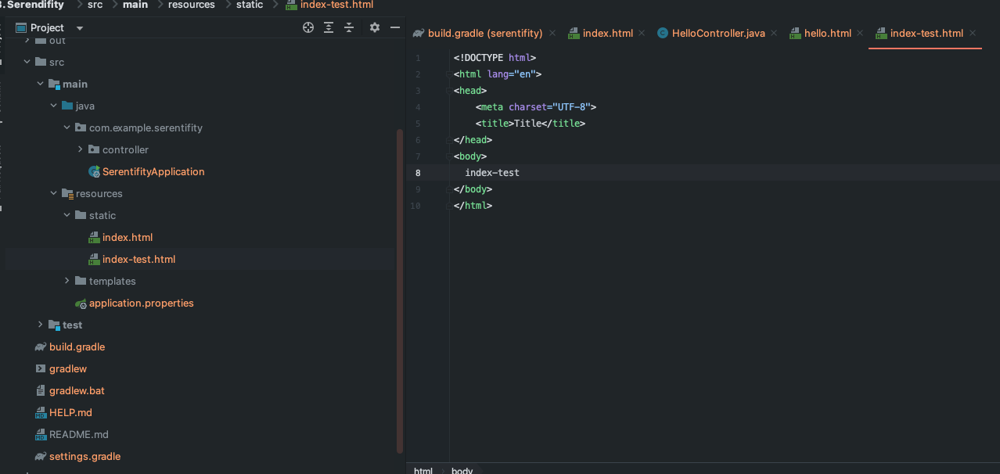
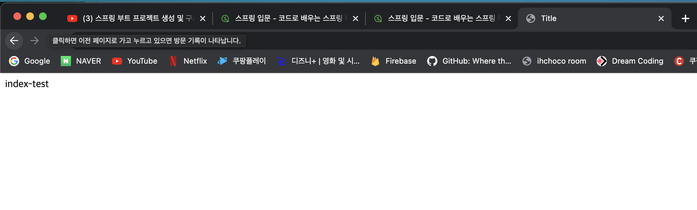
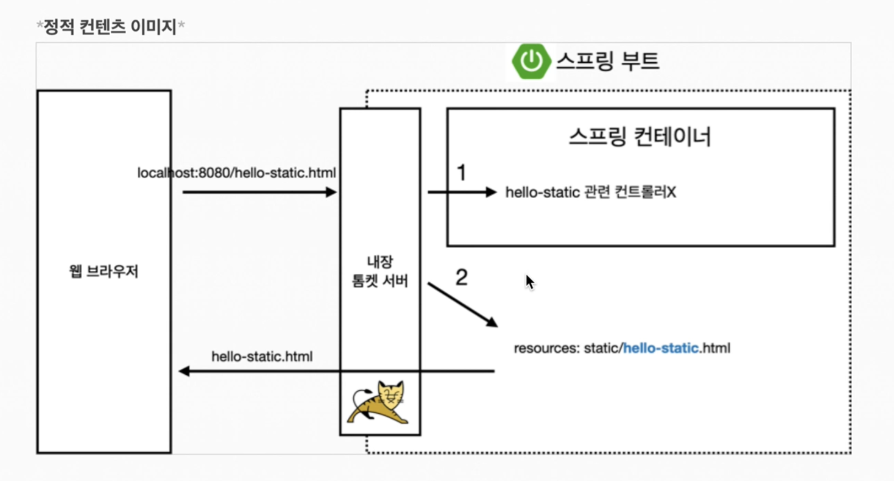
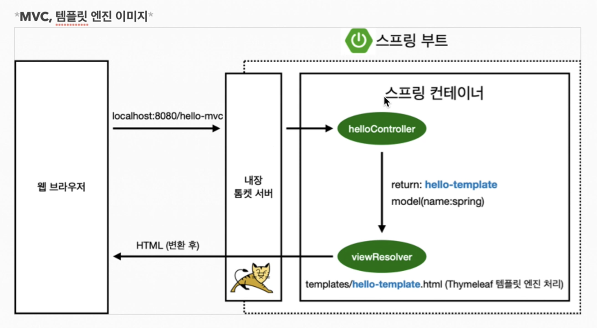
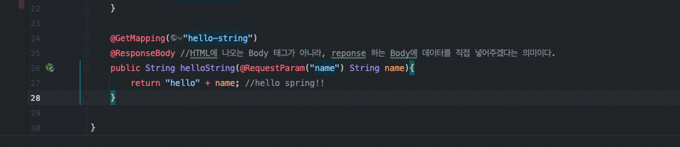
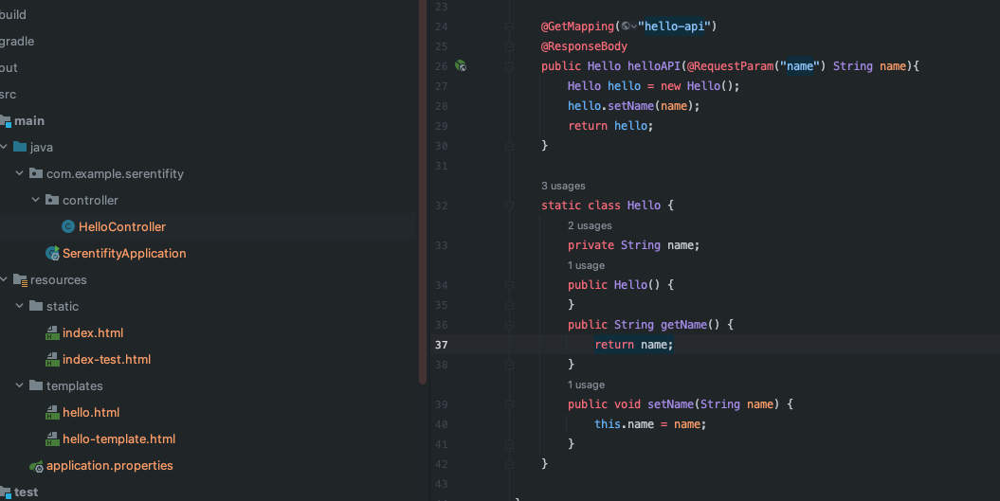
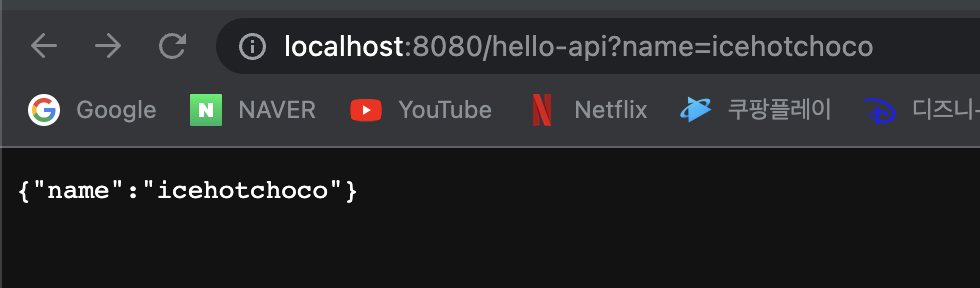
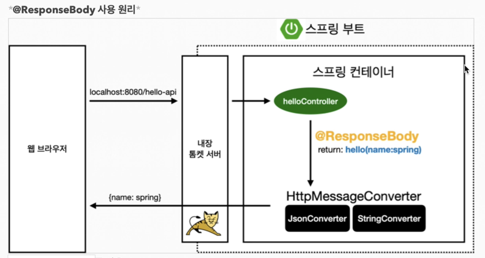

### 스프링부트 WEB개발 3가지 방식

웹 개발에는 크게 3가지 방식이 있다
1. 정적 컨텐츠 = html과 같은 파일을 그냥 그대로 내려주는 방식
2. MVC와 템플릿 엔진 = 가장 많이 사용되는 방식(과거에 JSP/PHP 등이 템플릿 엔진에 해당)-서버에서 동적으로 제공
3. API - 안드로이드나 아이폰 개발하려면 서버입장에서는 JSON에서 데이터를 클라이언트에 전달하며 동작

<br>
<br>


#### 1.정적 컨텐츠

[1]스프링 부트 정적 컨텐츠 방법

프로젝트 > src > main > resources > static 폴더에 아무 HTML을 작성하면 끝



이렇게 만들어주고 주소창에 localhost:8080/hello-test.html 입력해주면 정적 컨텐츠 접속 가능



[정적 컨텐츠 프로세스]


접속 URL 들어오면 먼저 Controller에서 가진게 있는지 확인하고 없으면 resources/ 에서 확인후 반환

<br>
<br>


#### 2.MVC, 템플릿 엔진 이미지

```java
@GetMapping("hello-mvc")
public String helloMvc(@RequestParam(value="name", required = false) String name, Model model){ //@RequestParam("name")을 기본으로 사용
    model.addAttribute("name", name);
    return "hello-template";
}
```

아래처럼 입력을 해주면 name 파라미터에 spring!!이라는 값이 넘어오게 된다


```java
@RequestParam(value="name", required =false) //이렇게 작성해도 괜찮지만

@RequestParam("name") //이렇게 작성가능

/*
두개의 차이점은 위에 1번의 경우는 required = falase로 되어 있어 반드시 Parameter로 안들어와도 되지만

2번의 경우 안들어오게 되면 에러가 발생하게 된다
*/
```



#### 3.API 방식
아래처럼 @GetMappiing()을 해주고 @RequestBody를 추가해준다
```java
@GetMapping("hello-string")
@ResponseBody //HTML에 나오는 Body 태그가 아니라,reponse하는 Body에 데이터를 직접 넣어주겠다
public String helloString(@RequestParam("name") String name){
    return "hello" + name; //hello spring!!
}
```



여기부터 중요하다[객체를 반환하면 JSON 타입이 리턴되게 된다]

```java
@GetMapping("hello-api")
@ResponseBody
public Hello helloAPI(@RequestParam("name") String name){
    Hello hello = new Hello();
    hello.setName(name);
    return hello;
}

static class Hello {
    private String name;
    public Hello() {
    }
    public String getName() {
        return name;
    }
    public void setName(String name) {
        this.name = name;
    }
}
```


이렇게 Hello 객체를 만들어서 helloAPI가 return Type이 String이 아니라 객체(Hello)이면 JSON으로 변환해서 반환해준다



JSON : Key - Value로 이루어진 타입

API 호출 방식


리턴타입이 객체가 되면 한번 고민해보고 기본 Default 는 Json 타입으로 만들어서 반환해라

단순 문자면 HttpMessageConverter에서 StringConverter를 사용해서 리턴

객체일 경우 JsonConverter(MappingJackson2HttpMessageConver)를 이용해서 리턴

실무에서도 그냥 그대로 사용하니까 원리만 이해하고 있자


요약
1. 정적컨텐츠 - HTML 반환
2. MVC, 템플릿 - 동적 HTML 반환
3. API - JSON 객체 반환
   
   

출처 
 1. [[JAVA]스프링 입문-김영한](https://www.inflearn.com/course/%EC%8A%A4%ED%94%84%EB%A7%81-%EC%9E%85%EB%AC%B8-%EC%8A%A4%ED%94%84%EB%A7%81%EB%B6%80%ED%8A%B8/dashboard)