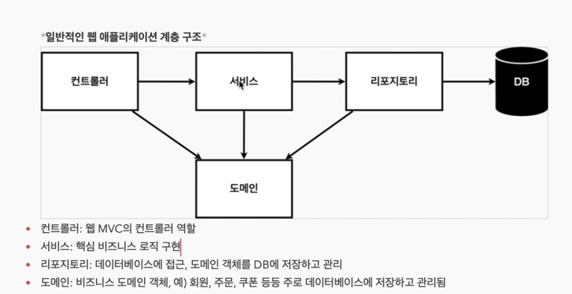
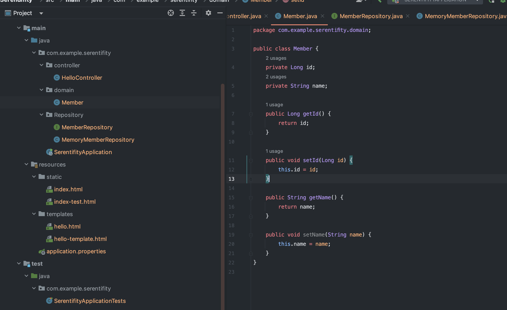
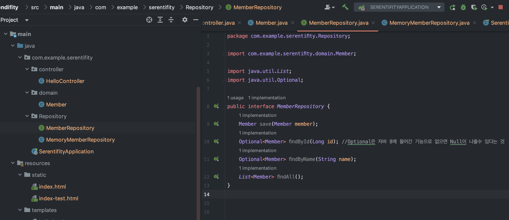
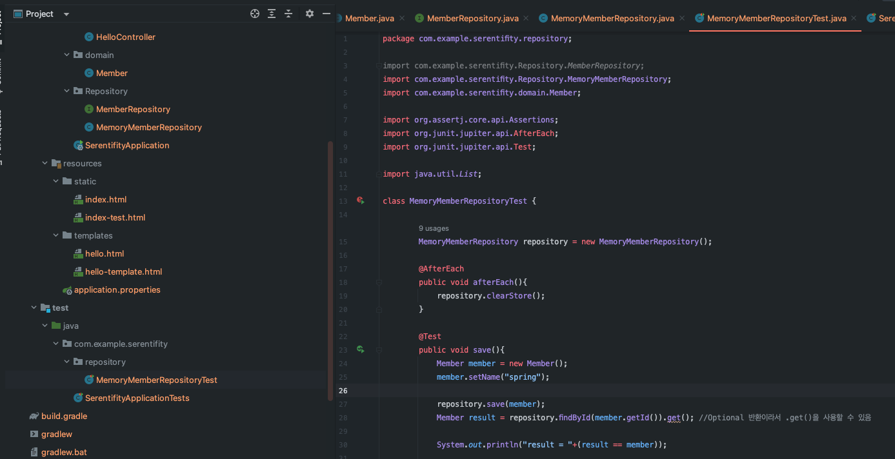
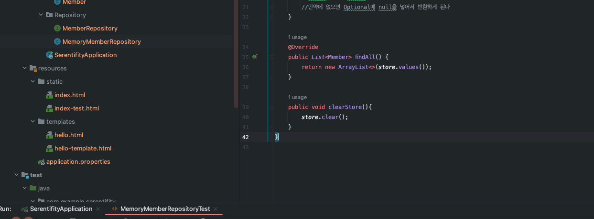
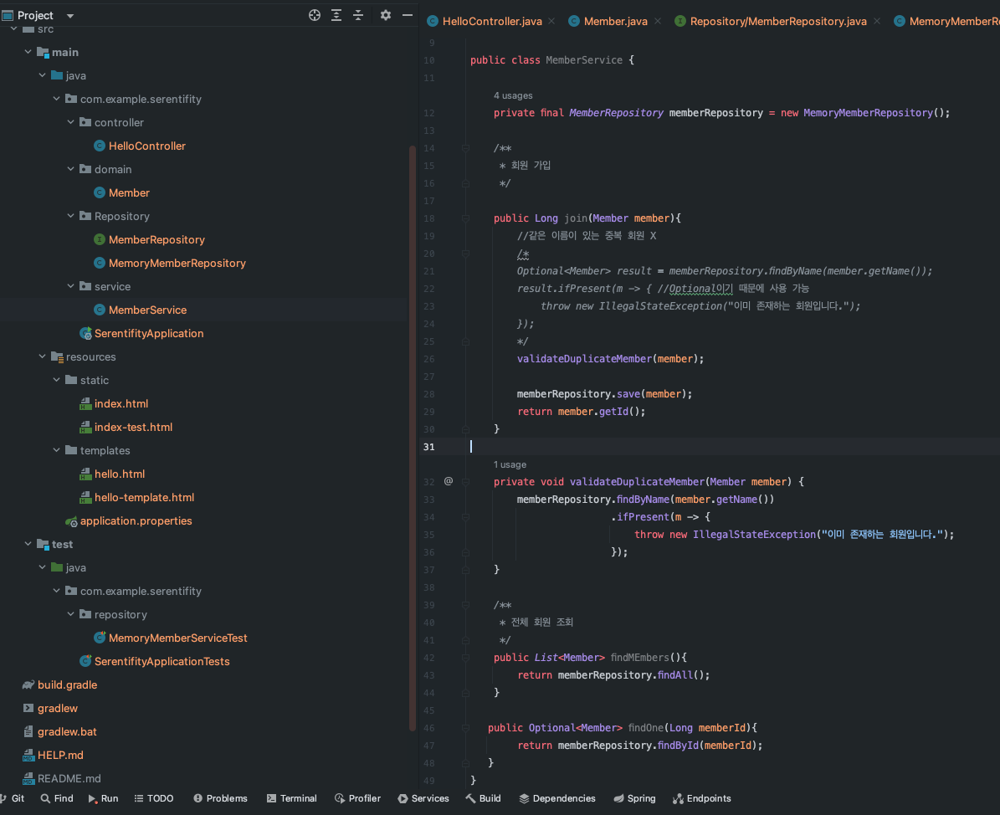
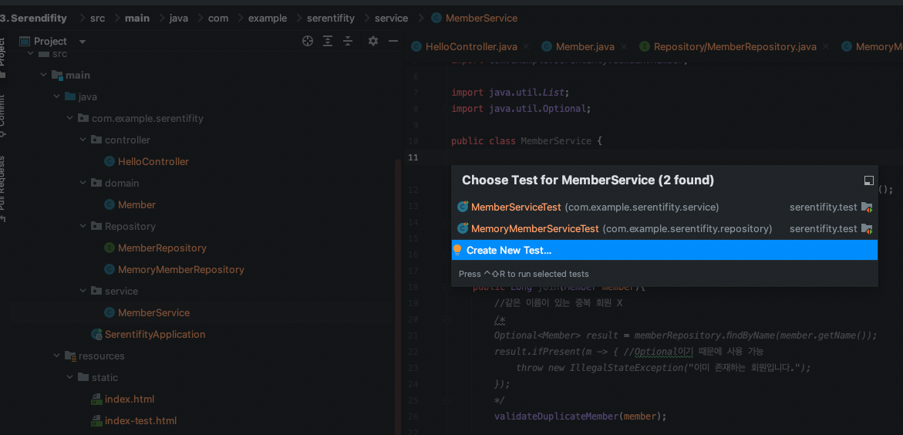
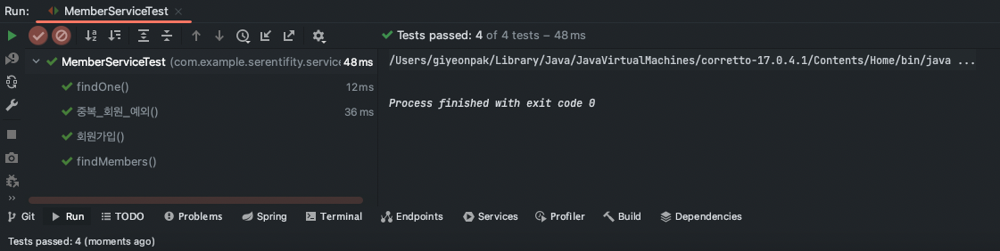
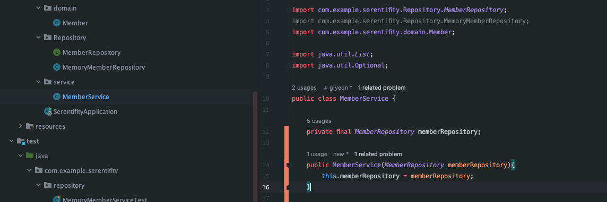
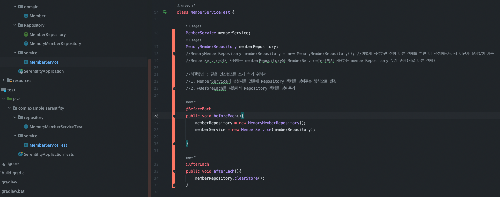

### 스프링부트 WEB개발 회원관리 예제

비즈니스 요구사항

* 데이터 : 회원ID, 이름
* 기능 : 회원 등록, 조회
* 아직 데이터 저장소가 선정되지 않음(가상의 시나리오)



클래스 의존관계
a
* 아직 데이터 저장소가 선정되지 않아서, 우선 인터페이스로 구현 클래스를 변경할 수 있도록 설계
* 데이터 저장소는 RDB, NoSQL등 다양한 저장소를 고민중인 상황으로 가정
* 개발을 진행하기 위해서는 초기 개발 단계에서는 구현체로 가벼운 메모리 기반의 데이터 저장소 사용

<br>
<br>

#### 1. 회원 도메인과 레퍼지토리 만들기

##### 1. Member 도메인

project > main > java > com.example.프로젝트명 > domain 패키지 생성 > Member 클래스 생성

```java
package com.example.serentifity.domain;

public class Member {
    private Long id;
    private String name;

    public Long getId() {
        return id;
    }

    public void setId(Long id) {
        this.id = id;
    }

    public String getName() {
        return name;
    }

    public void setName(String name) {
        this.name = name;
    }
}
```



##### 2. Repository 만들기

project > main > java > com.example.프로젝트명 > Repository 패키지 생성 

생성한 패키지 아래에 아래 두개 파일 만들기

1. MemberRepository Interface 만들기
2. MemoryMemberRepository 만들기


MemberRepository Interface 구현

```java
package com.example.serentifity.Repository;

import com.example.serentifity.domain.Member;

import java.util.List;
import java.util.Optional;

public interface MemberRepository {
    Member save(Member member);
    Optional<Member> findById(Long id); //Optional은 자바 8에 들어간 기능으로 없으면 Null이 나올수 있다는 것
    Optional<Member> findByName(String name);
    List<Member> findAll();
}


```


MemoryMemberRepository class 구현

```java
package com.example.serentifity.Repository;

import com.example.serentifity.domain.Member;

import java.util.*;

public class MemoryMemberRepository implements MemberRepository{
    
    //KEY = 회원의 ID를 할거라서 Long, 값은 Member
    private static Map<Long, Member> store = new HashMap<>(); 
    
    private static long sequence = 0L;

    @Override
    public Member save(Member member) {
        member.setId(++sequence);
        store.put(member.getId(), member);
        return member;
    }

    @Override
    public Optional<Member> findById(Long id) {
        return Optional.ofNullable(store.get(id));
        //만약에 값이 없으면 Null로 보내준다
    }

    @Override
    public Optional<Member> findByName(String name) {
        return store.values().stream()
                .filter(member->member.getName().equals(name))
                .findAny();
        //loop를 돌면서 name이 일치하는 값들을 찾으면 return 해주는것
        //만약에 없으면 Optional에 null을 넣어서 반환하게 된다
    }

    @Override
    public List<Member> findAll() {
        return new ArrayList<>(store.values());
    }
}
```

java Optional이란?!

 : NPE(NullPointerException) 방지를 위해 사용하는데, Null이 올 수 있는 값을 감싸는 Wrapper 클래스

Optional 클래스는 아래와 같은 value에 값을 저장하기 때문에 값이 null이더라도 바로 NPE가 발생하지 않으며, 클래스이기 때문에 각종 메소드를 제공해준다.

```java
public final class Optional<T> {

  // If non-null, the value; if null, indicates no value is present
  private final T value;
  ...
}
```

다른 챕터에서 한번 Optional에 대해서 공부해보자

##### 3. 회원 레포지토리 테스트 케이스 작성

project > test > java > com.example.프로젝트명 > repository 패키지 생성 

```java
package com.example.serentifity.repository;

import com.example.serentifity.Repository.MemberRepository;
import com.example.serentifity.Repository.MemoryMemberRepository;
import com.example.serentifity.domain.Member;

import org.assertj.core.api.Assertions;
import org.junit.jupiter.api.AfterEach;
import org.junit.jupiter.api.Test;

import java.util.List;

class MemoryMemberRepositoryTest {

        MemoryMemberRepository repository = new MemoryMemberRepository();

        @AfterEach
        public void afterEach(){
            repository.clearStore();
        }

        @Test
        public void save(){
            Member member = new Member();
            member.setName("spring");

            repository.save(member);
            Member result = repository.findById(member.getId()).get(); 
            //Optional 반환이라서 .get()을 사용할 수 있음

            System.out.println("result = "+(result == member));

            //Assertions.assertEquals(member, result); 
            //두개의 값이 같으면 그냥 지나가고 다를경우에는 빨간색으로 표시
            
            Assertions.assertThat(member).isEqualTo(result); 
            //위 아래 결과는 동일하지만 요즘은 이 방식을 더 자주 사용한다.

        }

        @Test
        public void findByName(){
            Member member1 = new Member();
            member1.setName("spring1");
            repository.save(member1);

            Member member2 = new Member();
            member2.setName("spring2");
            repository.save(member2);

            Member result = repository.findByName("spring1").get();

            Assertions.assertThat(result).isEqualTo(member1);
        }

        @Test
        public void findAll(){
            Member member1 = new Member();
            member1.setName("spring1");
            repository.save(member1);

            Member member2 = new Member();
            member2.setName("spring2");
            repository.save(member2);

            List<Member> result = repository.findAll();

            Assertions.assertThat(result.size()).isEqualTo(2);


        }
}
```

테스트의 경우 class 전체를 실행할 경우 순서를 보장해주지 않기 때문에 에러가 발생할 수 있어 각 테스트를 수행하고 store를 clear 해줄 필요가 있다.

```java
@AfterEach
public void afterEach(){
    repository.clearStore();
}
```

테스트 코드에 위와 같이 작성해주고 MemoryMemberRepository 원래 코드에 clearStore 메소드를 추가해준다

```java
public void clearStore(){
    store.clear();
}
```





##### 4. 회원 서비스 개발

project > test > java > com.example.프로젝트명 > service 패키지 생성 > MemberService 클래스 생성

```java
package com.example.serentifity.service;

import com.example.serentifity.Repository.MemberRepository;
import com.example.serentifity.Repository.MemoryMemberRepository;
import com.example.serentifity.domain.Member;

import java.util.List;
import java.util.Optional;

public class MemberService {

    private final MemberRepository memberRepository = new MemoryMemberRepository();

    /**
     * 회원 가입
     */

    public Long join(Member member){
        //같은 이름이 있는 중복 회원 X
        /*
        Optional<Member> result = memberRepository.findByName(member.getName());
        result.ifPresent(m -> { //Optional이기 때문에 사용 가능
            throw new IllegalStateException("이미 존재하는 회원입니다.");
        });
        */
        validateDuplicateMember(member);

        memberRepository.save(member);
        return member.getId();
    }

    private void validateDuplicateMember(Member member) {
        memberRepository.findByName(member.getName())
                        .ifPresent(m -> {
                            throw new IllegalStateException("이미 존재하는 회원입니다.");
                        });
    }

    /**
     * 전체 회원 조회
     */
    public List<Member> findMEmbers(){
        return memberRepository.findAll();
    }

   public Optional<Member> findOne(Long memberId){
        return memberRepository.findById(memberId);
   }
}
```




<br>
<br>

##### 5. 회원 서비스 테스트 케이스 작성

테스트 클래스 빨리 만드는 방법 

command + shift + t 를 누르게 되면 밑에처럼 화면이 보여지고 new test를 클릭하면 된다




테스트 작성하는 기본방법

1. given
2. when
3. then

이렇게 3가지를 먼저 주석을 해두고 작업하면 편하다

그리고 Asserion은 org.Juiit을 사용해준다(import)

```java
@Test
void 회원가입() { //테스트는 한국말로 적어도 괜찮다
    //given
    Member member = new Member();
    member.setName("hello");

    //when
    Long saveId = memberService.join(member);

    //then
    Member findMember = memberService.findOne(saveId).get();
    assertThat(member.getName()).isEqualTo(findMember.getName());
}
```

```java
 //테스트는 정상적으로 동작하는것도 중요하지만 아닌 예외상황을 만드는것도 중요하다
@Test
public void 중복_회원_예외(){
    //given
    Member member1 = new Member();
    member1.setName("spring");

    Member member2 = new Member();
    member2.setName("spring");

    //when
    memberService.join(member1);

    /* try catch 대신에 다른 문법 사용
    try{
        memberService.join(member2);
        fail();
    }catch(IllegalStateException e){
        assertThat(e.getMessage()).isEqualTo("이미 존재하는 회원입니다.");
    }
    */
    IllegalStateException e = assertThrows(IllegalStateException.class, () -> memberService.join(member2));

    //then
    assertThat(e.getMessage()).isEqualTo("이미 존재하는 회원입니다.");
}
```



위와 같이 테스트가 정상적으로 실행되는 것을 확인 할 수 있다.

```java
class MemberServiceTest {
    ...
    MemberService memberService = new MemberService();

    //이렇게 생성하면 전혀 다른 객체를 한번 더 생성하는거라서 어딘가 문제발생 가능
    MemoryMemberRepository memberRepository = new MemoryMemberRepository(); 

    ...
}

public class MemberService {

    private final static MemberRepository memberRepository = new MemoryMemberRepository();

    ...

}
```

이렇게 생성하면 전혀 다른 객체를 한번 더 생성하는거라서 어딘가 문제발생 가능

MemberService에서 사용하는 memberRepository와 MemberServiceTest에서 사용하는 memberRepository 두개 존재(서로 다른 객체)

    해결방법 : 같은 인스턴스를 쓰게 하기 위해서
    1. MemberService에 생성자를 만들때 Repository 객체를 넣어주는 방식으로 변경
    2. @BeforeEach를 사용해서 Repository 객체를 넣어주기

class : [MemberService] 



```java
public class MemberService {
    //해결방법 : 같은 인스턴스를 쓰게 하기 위해서
    //1. MemberService에 생성자를 만들때 Repository 객체를 넣어주는 방식으로 변경
    private final MemberRepository memberRepository;

    //DI방식으로 MemberService에 생성자에 주입하는 방식 사용함으로써 위에서 발생한 문제 해결
    public MemberService(MemberRepository memberRepository){
        this.memberRepository = memberRepository;
    }
    
    /**
     * 회원 가입
     */
    public Long join(Member member){
        //같은 이름이 있는 중복 회원 X
        /*
        Optional<Member> result = memberRepository.findByName(member.getName());
        result.ifPresent(m -> { //Optional이기 때문에 사용 가능
            throw new IllegalStateException("이미 존재하는 회원입니다.");
        });
        */
        validateDuplicateMember(member);

        memberRepository.save(member);
        return member.getId();
    }

    private void validateDuplicateMember(Member member) {
        memberRepository.findByName(member.getName())
                        .ifPresent(m -> {
                            throw new IllegalStateException("이미 존재하는 회원입니다.");
                        });
    }

    /**
     * 전체 회원 조회
     */
    public List<Member> findMEmbers(){
        return memberRepository.findAll();
    }

   public Optional<Member> findOne(Long memberId){
        return memberRepository.findById(memberId);
   }
}
```

class : [MemberServiceTest] 



```java
class MemberServiceTest {

    MemberService memberService;
    MemoryMemberRepository memberRepository;

    //2. @BeforeEach를 사용해서 Repository 객체를 넣어주기
    @BeforeEach
    public void beforeEach(){
        memberRepository = new MemoryMemberRepository();
        memberService = new MemberService(memberRepository);
    }

    @AfterEach
    public void afterEach(){
        memberRepository.clearStore();
    }


    @Test
    void 회원가입() { //테스트는 한국말로 적어도 괜찮다
        //given
        Member member = new Member();
        member.setName("hello");

        //when
        Long saveId = memberService.join(member);

        //then
        Member findMember = memberService.findOne(saveId).get();
        assertThat(member.getName()).isEqualTo(findMember.getName());
    }

    //테스트는 정상적으로 동작하는것도 중요하지만 아닌 예외상황을 만드는것도 중요하다
    @Test
    public void 중복_회원_예외(){
        //given
        Member member1 = new Member();
        member1.setName("spring");

        Member member2 = new Member();
        member2.setName("spring");

        //when
        memberService.join(member1);

        /* try catch 대신에 다른 문법 사용
        try{
            memberService.join(member2);
            fail();
        }catch(IllegalStateException e){
            assertThat(e.getMessage()).isEqualTo("이미 존재하는 회원입니다.");
        }
         */
        IllegalStateException e = assertThrows(IllegalStateException.class, () -> memberService.join(member2));

        assertThat(e.getMessage()).isEqualTo("이미 존재하는 회원입니다.");
        //then
    }

    @Test
    void findMembers() {
    }

    @Test
    void findOne() {
    }
}
```


출처 
 1. [[JAVA]스프링 입문-김영한](https://www.inflearn.com/course/%EC%8A%A4%ED%94%84%EB%A7%81-%EC%9E%85%EB%AC%B8-%EC%8A%A4%ED%94%84%EB%A7%81%EB%B6%80%ED%8A%B8/dashboard)
 2. [[JAVA]Optional에 대해서-티스토리 블로그](https://mangkyu.tistory.com/70)

