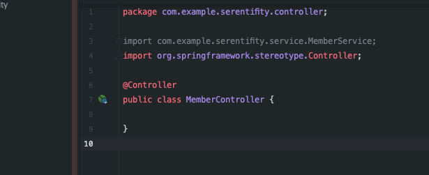
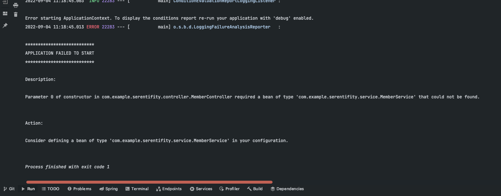
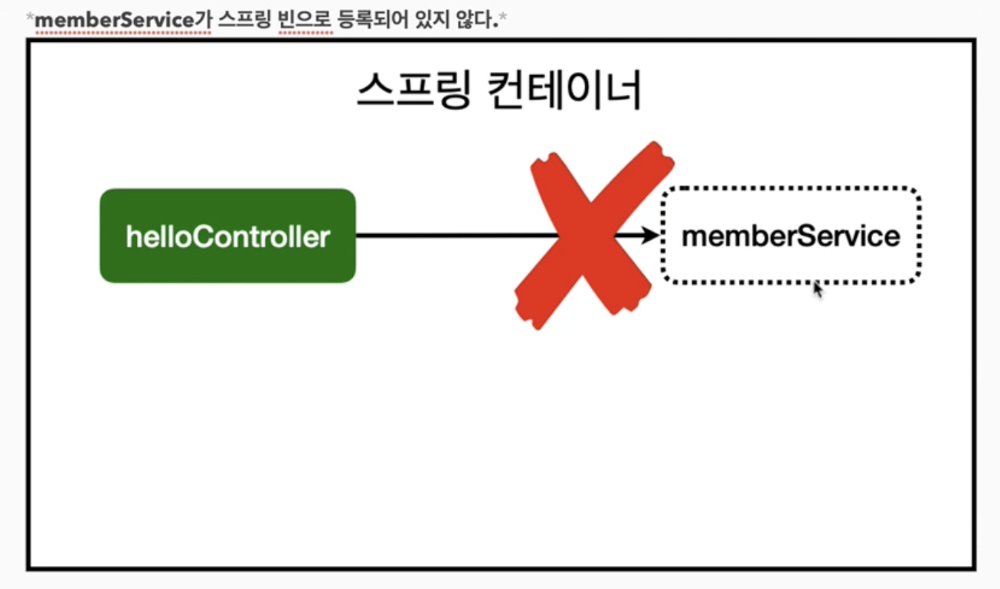
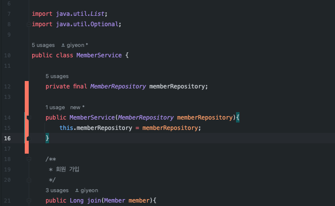
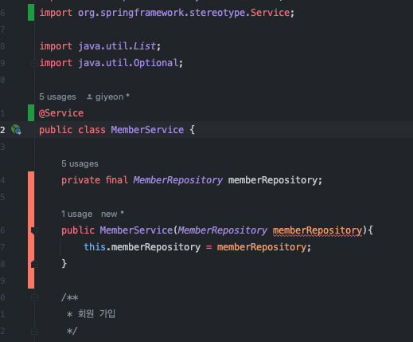
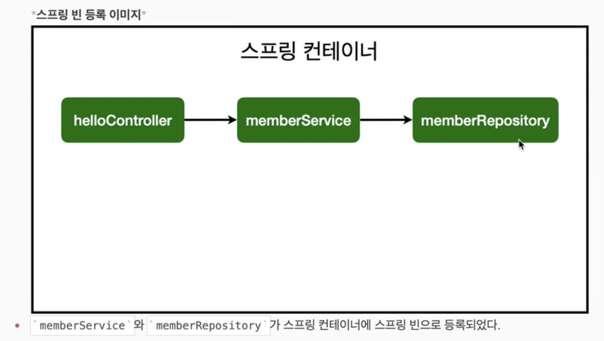
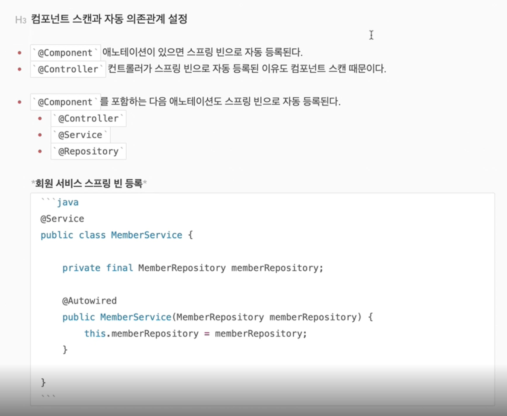

### 스프링 빈과 의존관계

#### 1. 컴포넌트 스캔과 자동 의존관계 설정

project > main > java > com.example.프로젝트명 > Controller 패키지 > MemberController 생성

생성한 Controller에 @Controller 어노테이션을 붙여주는 순간 이 클래스는 스프링부트가 기동될 때 컨테이너에서 Bean으로 생성해서 관리하게 된다



그래서 우리가 별다른 설정 없이 GetMapping, PostMapping을 잘 사용할 수 있었음

[중요] Controller에서 작업을 수행하기 위해서는 Service 클래스를 통해서 수행되어야 하는데 단순히 new Service() 이렇게 생성을 해주면 다른 Controller에서도 이 Service를 사용할 때 

중복으로 사용되니까 이렇게 하면 안되고 @어노테이션을 사용해서 1개의 객체를 공유할 수 있게 사용해야 한다

[잘못된 사용예시]

```java
@Controller
public class MemberController {    
    private final MemberService memberService = new MemberService();
}
```

[잘된 사용예시]

```java
@Controller
public class MemberController {

    private final MemberService memberService;

    @Autowired
    public MemberController(MemberService memberService){
        this.memberService = memberService;
    }
}
```



위와 같이 잘된 사용예시를 동작했을때 @Autowired를 사용해도 memberService객체를 못찾았다고 메시지가 나온다...



WHY? 왜 스프링부트는 MemberService객체를 못찾는걸까?



현재 MemberService에는 그냥 Class로 만들어져 있는데 @Annotation이 없어서 스프링이 이게 MemberService인지 아닌지 알 수 있는 방법이 없다.



```java
@Service //이 부분만 넣어주면 모두 OK[필수]
public class MemberService {

    private final MemberRepository memberRepository;

    public MemberService(MemberRepository memberRepository){
        this.memberRepository = memberRepository;
    }
    ...
}

```

그래서 위와 같이 @Service를 해주게 되면 @Controller 처럼 스프링이 기동될 때 자동으로 Bean을 생성해주고 @Autowired에 해당하는 부분들에 모두 넣어주게 된다.

WOW 엄청 편한 스프링부트 WOW

이렇게 사용하면 Controller가 생성될 때 @Autowired가 memberService를 찾아서 MemberController 안에 있는 memberService객체에 자동으로 연결해준다.

그렇다면 Service에 있는 Repository 방식도 똑같이 변경해주자

```java
@Repository
public class MemoryMemberRepository implements MemberRepository{

     //KEY = 회원의 ID를 할거라서 Long, 값은 Member
    private static Map<Long, Member> store = new HashMap<>();
    
    private static long sequence = 0L;

    ...
}
```

```java
@Service
public class MemberService {

    private final MemberRepository memberRepository;

    @Autowired
    public MemberService(MemberRepository memberRepository){
        this.memberRepository = memberRepository;
    }
    ...
}
```

이렇게 MemberRepository(변수)에 bean을 주입시켜주는것을 DI라고 한다

스프링 컨테이너가 기동될때 MemberService를 생성하는데 여기에 생성자에 @Autowired가 있으면 컨테이너에서 너는 이게 필요하구나 하고 그대로 넣어주는 방식





[스프링 공식 ] : 컨트롤러 통해서 외부 요청을 받고 서비스에서 비즈니스 로직을 만들고 레퍼지토리에서 데이터를 저장

[스프링 빈을 등록하는 2가지 방법]
1. 컴포넌트 스캔과 자동 의존관계 설정 
  - 이게 방금 진행한 @Annotaion으로 bean을 만들어서 @Autowired 주입 방식
  - why? 컴포넌트 스캔이라고 할까? Service, Repository, Controller 모두 Component 포함
  - 스프링 컨테이너가 기동될 때 @Component가 있는거는 모두 객체로 생성해서 스프링 컨테이너에 등록
  - Autowired는 그 객체로 생성된 것들을 연결시켜주는 역할
  - 스프링 빈은 기본적으로 싱글톤으로 등혹된다(유일하게 하나만 등록해서 공유한다)
  
  

여기서 주의할 점!

무조건 @Component 어노테이션을 붙인다고 컨테이너가 객체를 생성하는 것이 아니라 [프로젝트Application]에 있는 Package 안에 있는것들만 자동으로 등록

```java
package com.example.serentifity; //여기 패키지 안에 있는 @Component만 객체 생성

import org.springframework.boot.SpringApplication;
import org.springframework.boot.autoconfigure.SpringBootApplication;

@SpringBootApplication
public class  SerentifityApplication {

	public static void main(String[] args) {
		SpringApplication.run(SerentifityApplication.class, args);
	}

}
```

#### 2. 자바 코드로 직접 스프링 빈 등록하기

하나하나 직접 자바코드로 스프링 등록하는 방법(설정파일에 등록)

project > main > java > com.example.프로젝트명 > SpringConfig 클래스 만들기

SpringConfig 클래스에 @Configuration을 등록해주고 직접 등록해줄 객체를 만든다음 @Bean을 추가해주면 스프링이 기동되면서 아까 @Component와 똑같이 객체를 생성해준다

```java
package com.example.serentifity;

import com.example.serentifity.service.MemberService;
import org.springframework.context.annotation.Bean;
import org.springframework.context.annotation.Configuration;

@Configuration //스프링 Bean 설정 어노테이션
public class SpringConfig {

    @Bean //기동될 때 아래 객체를 Bean으로 등록해라 
    public MemberService memberService(){
        return new MemberService(); //여기에 Repository 객체를 주입필요
    }
}
```

Service에 Repository를 주입하기 위해서는 아래와 같이 작성

```java
package com.example.serentifity;

import com.example.serentifity.Repository.MemberRepository;
import com.example.serentifity.Repository.MemoryMemberRepository;
import com.example.serentifity.service.MemberService;
import org.springframework.context.annotation.Bean;
import org.springframework.context.annotation.Configuration;

@Configuration
public class SpringConfig {

    @Bean
    public MemberService memberService(){
        return new MemberService(memberRepository()); //2. memberService에 주입
    }

    @Bean //1. memberRepository를 만들고
    public MemberRepository memberRepository(){
        return new MemoryMemberRepository();
    }
}
```


두 방법 모두 각각 장단점이 있다

예전에는 XML로 설정하는 방식(현재 회사에서 사용중 ㅠㅠ)을 사용했으나 요즘에는 자바 코드로 대체해서 위에 처럼 사용

<br>

<bold>DI 주입 방식</bold>

1. 생성자 주입 방식 : 지금까지 위에서 사용해왔던 방식
```java
@Controller
public class MemberController {
    private final MemberService memberService;

    @Autowired
    public MemberController(MemberService memberService){
        this.memberService = memberService;
    }
}
```
2. 필드 주입 방식 : 단순히 필드에 @Autowired 추가해서 사용
```java
@Controller
public class MemberController {

    @Autowired
    private MemberService memberService;
}
```

3. Setter 주입 방식 
```java
@Controller
public class MemberController {

    private MemberService memberService;

    @Autowired
    public void setMemberService(MemberService memberService) {
        this.memberService = memberService;
    }
}
```

최근에는 1번 생성자 주입 방식을 선호하고 있으므로 1번을 사용하자

현재 이걸 공부하는 이유는 시나리오가 가상 MEM 레퍼지토리에서 수행하다가 갑자기 운영쪽으로 바뀌게 되면 코드를 일절 손대지 않고 바꾸는법을 배우기 위해서이다

참고 : 실무에서 주로 정형화된 컨트롤러, 서비스, 리포지토리 같은 코드는 컴포넌트 스캔을 사용한다. 그리고 정형화되지 않거나, 상황에 따라 구현 클래스를 변경해야 하면 설정을 통해 스프링 빈으로 등록한다

주의 : @Autowired를 통한 DI는 helloController, MemberService 등과 같이 스프링이 관리하는 객체에서만 동작한다. 스프링 빈으로 등록하지 않고 내가 직접 생성한 객체에서는 동작하지 않는다

[스프링 컨테이너에 SpringBean 등록되지 않으면 @Autowired가 먹지 않는다]

<br>
<br>

<b>ex) MemoryMemberRepository => DBMemberRepository로 변경</b>

코드를 건드릴 필요없이 설정파일(SpringConfig)만 변경해주면 된다

[BEFORE]
```java
@Configuration
public class SpringConfig {

    @Bean
    public MemberService memberService(){
        return new MemberService(memberRepository()); 
    }

    @Bean 
    public MemberRepository memberRepository(){
        return new MemoryMemberRepository(); //여기만 수정
    }
}
```

[AFTER]
```java
@Configuration
public class SpringConfig {

    @Bean
    public MemberService memberService(){
        return new MemberService(memberRepository()); 
    }

    @Bean 
    public MemberRepository memberRepository(){
        return new DBMemberRepository(); //요렇게 바꿔주면 끝 
    }
}
```


출처 
 1. [[JAVA]스프링 입문-김영한](https://www.inflearn.com/course/%EC%8A%A4%ED%94%84%EB%A7%81-%EC%9E%85%EB%AC%B8-%EC%8A%A4%ED%94%84%EB%A7%81%EB%B6%80%ED%8A%B8/dashboard)


