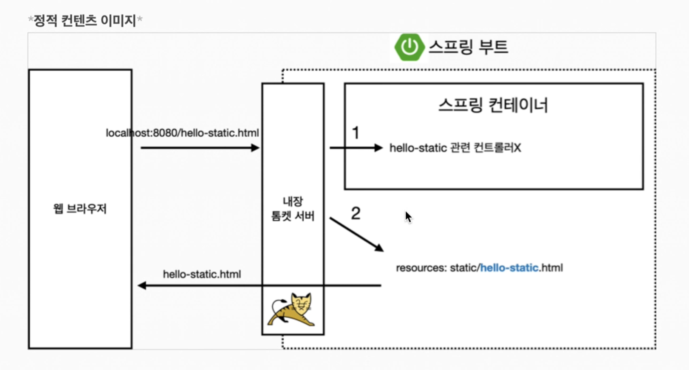

### 스프링부트 회원 관리 예제-MVC

#### 1. 화면 웹 기능 - 홈 화면 추가

project > main > java > com.example.프로젝트명 > Controller 패키지 > HomeController 생성

```java
package com.example.serentifity.controller;

import org.springframework.stereotype.Controller;
import org.springframework.web.bind.annotation.GetMapping;

@Controller
public class HomeController {

    @GetMapping("/")
    public String home(){
        return "home";
    }
}
```

project > main > resources > templates > home.html 생성
```html
<!DOCTYPE html>
<html xmlns:th="http://www.thymeleaf.org">
<head>
    <meta http-equiv="Content-Type" content="text/html; charset=UTF-8">
    <title>Title</title>
</head>
<body>
<div>
    <h1>HELLO SPRING</h1>
    <p>회원 기능</p>
    <p>
        <a href="/members/new">회원 가입</a>
        <a href="/members">회원 목록</a>
    </p>
</div>
</body>
</html>
```
아래와 같이 정상적으로 화면 출력 가능


그런데 약간 이상하다? 저번에 우리가 추가했던 project > main > resources > index.html이 있는데 왜 home 화면이 먼저 출력되었을까?


이렇게 resources > static > index.html이 있는데 왜 HomeController에서 GetMapping("/")를 호출하게 되었을까? 

이건 우선순위가 있기 때문이다

WEB브라우저에서 요청이 오면 먼저 스프링 컨트롤러를 찾게 되고 없으면 static 파일을 찾게 되어있기 때문이다

[정적 컨텐츠 프로세스]



#### 2. 화면 웹 기능 -  등록

[등록페이지로 보낼 Controller Mapping]

project > main > java > com.example.프로젝트명 > Controller 패키지 > MemberController 메소드 추가

```java
package com.example.serentifity.controller;

import com.example.serentifity.domain.Member;
import com.example.serentifity.service.MemberService;
import org.springframework.beans.factory.annotation.Autowired;
import org.springframework.stereotype.Controller;
import org.springframework.web.bind.annotation.GetMapping;
import org.springframework.web.bind.annotation.PostMapping;

@Controller
public class MemberController {

    private MemberService memberService;

    @Autowired
    public MemberController(MemberService memberService) {
        this.memberService = memberService;
    }

    @GetMapping("/members/new") //등록페이지로 이동
    public String createForm(){
        return "members/createMemberForm";
    }

    @PostMapping("/members/new") //POST로 전달받은 데이터 처리 부분
    public String create(MemberForm form){
        Member member = new Member();
        member.setName(form.getName());

        memberService.join(member);

        return "redirect:/";
    }
}
```

project > main > resources > templates > members 폴더 생성 > createMemberForm.html 생성

[등록 페이지 만들기]
```html
<!DOCTYPE html>
<html xmlns:th="http://www.thymeleaf.org">
<head>
  <meta http-equiv="Content-Type" content="text/html; charset=UTF-8">
  <title>Title</title>
</head>
<body>
<div>
  <h1>HELLO SPRING</h1>
  <p>회원 등록</p>
  <form action="/members/new" method="post">
    <div class="fonr-group">
      <label for="name"></label>
      <input for="text" id="name" name="name" placeholder="이름을 입력하세요"></input>
    </div>
    <button type="submit">등록</button>
  </form>
</div>
</body>
</html>
```

#### 3. 화면 웹 기능 -  조회

project > main > java > com.example.프로젝트명 > Controller 패키지 > MemberController 메소드 추가

```java
package com.example.serentifity.controller;

import java.util.List;

@Controller
public class MemberController {

    private MemberService memberService;

    @Autowired
    public MemberController(MemberService memberService) {
        this.memberService = memberService;
    }

    @GetMapping("/members/new") //회원 등록페이지 이동
    public String createForm(){
        return "members/createMemberForm";
    }

    @PostMapping("/members/new") //회원 등록
    public String create(MemberForm form){
        Member member = new Member();
        member.setName(form.getName());

        memberService.join(member);

        return "redirect:/";
    }

    @GetMapping("/members") //회원 조회
    public String list(Model model){
        List<Member> members = memberService.findMEmbers();

        model.addAttribute("members", members);
        return "members/memberList";
    }
}

```

project > main > resources > templates > members 폴더 > memberList.html 생성

```html
<!DOCTYPE html>
<html xmlns:th="http://www.thymeleaf.org">
<head>
    <meta http-equiv="Content-Type" content="text/html; charset=UTF-8">
    <title>Title</title>
</head>
<body>
<div>
    <h1>HELLO SPRING</h1>
    <p>회원 조회</p>
    <div>
        <table>
            <thead>
            <tr>
                <th>#</th>
                <th>이름</th>
            </tr>
            </thead>
            <tbody>
            <tr th:each="member : ${members}">
                <td th:text="${member.id}"></td>
                <td th:text="${member.name}"></td>
            </tr>
            </tbody>
        </table>
    </div>
</div>
</body>
</html>
```

정상적으로 회원 조회 가능


출처 
 1. [[JAVA]스프링 입문-김영한](https://www.inflearn.com/course/%EC%8A%A4%ED%94%84%EB%A7%81-%EC%9E%85%EB%AC%B8-%EC%8A%A4%ED%94%84%EB%A7%81%EB%B6%80%ED%8A%B8/dashboard)


