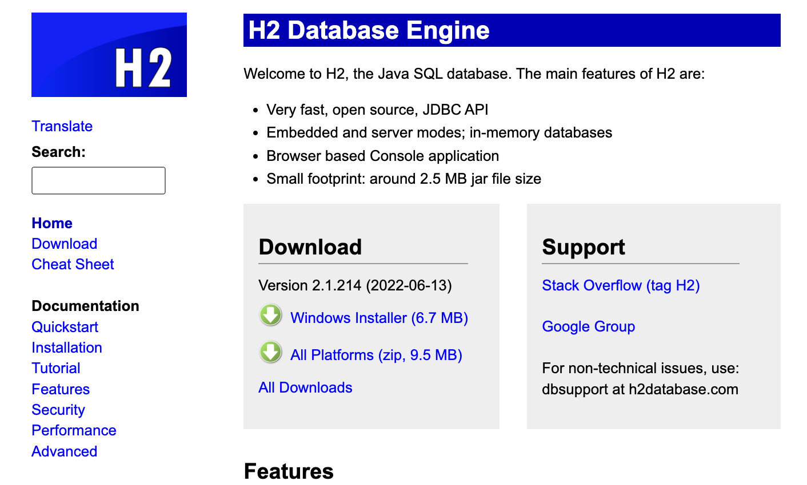
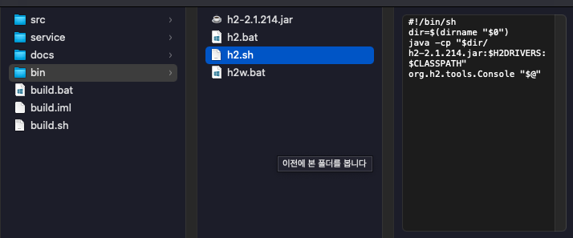
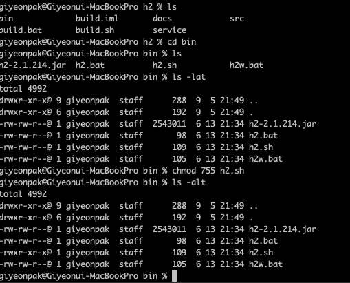
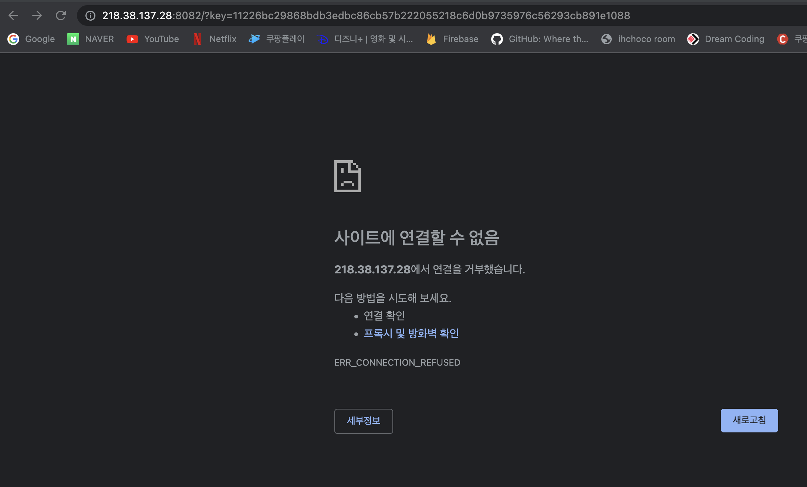

### 스프링부트 H2 데이터베이스 설치

#### 1. H2 Database 설치

[[H2]다운로드 페이지](https://www.h2database.com/html/main.html)



여기서 All Platforms 다운로드 후 zip 파일 풀기



위와 같은 폴더일 때 터미널을 열어서 bin 폴더에 들어간 후 h2.sh에 실행권한을 준다



cd bin > chmod 755 h2.sh > ./h2.sh

실행이 되면 [사이트에 연결할 수 없음]이라고 나오지만 당황하지 말고 앞에 IP부분을 localhost로 변경 해주면 정상적으로 접속이 가능해진다



여기서 연결을 누르면 정상적으로 접속이 가능해진다

그런데 터미널로 HOME에 가보면 test.mv.db라는 파일이 갑자기 생성이 되어 있다

이 파일이 있어야지 접속이 가능해진다

JDBC URL

> jdbc:h2:tcp://localhost/~/test

다음부터 접속 할 때는 위에 URL을 연결해주고 접속해야 충돌발생을 없앨 수 있다

만약에 문제가 생기면 아까 있던 test.mv.db를 지우고 서버도 재시동 해주면 새로운 test.mv.db가 생성되며 리셋하면서 정상접속 가능해진다

```sql
--소문자로 작성해야 한다?!

create table member
(
    id bigint generated by default as identity, -- generated by default as identity = 여기에 값을 입력하지 않으면 DB가 알아서 값을 채워준다
    name varchar(255),
    primary key(id)
);

insert into member(name) values('spring');
insert into member(name) values('spring2');

select * from member;
```

참고로 DB실행중인 터미널을 종료하면 DB도 접속이 안되게 되니까 유의하자!!


출처 
 1. [[JAVA]스프링 입문-김영한](https://www.inflearn.com/course/%EC%8A%A4%ED%94%84%EB%A7%81-%EC%9E%85%EB%AC%B8-%EC%8A%A4%ED%94%84%EB%A7%81%EB%B6%80%ED%8A%B8/dashboard)


