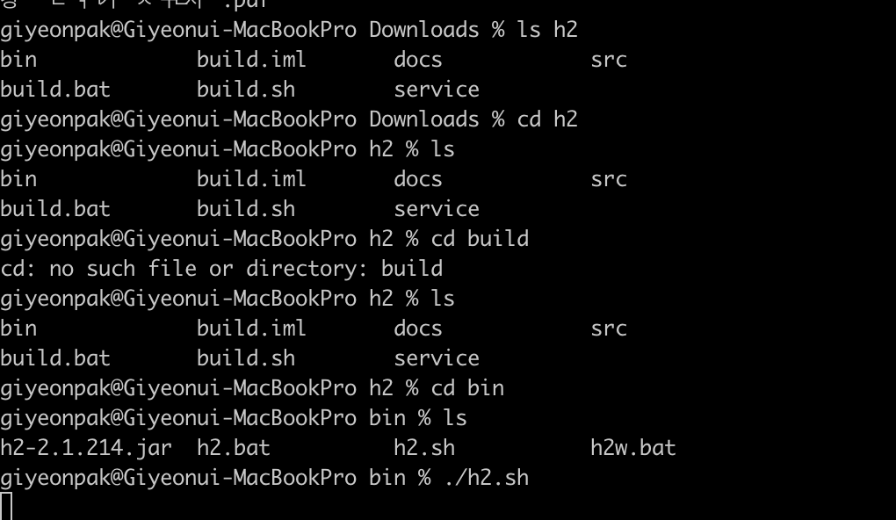
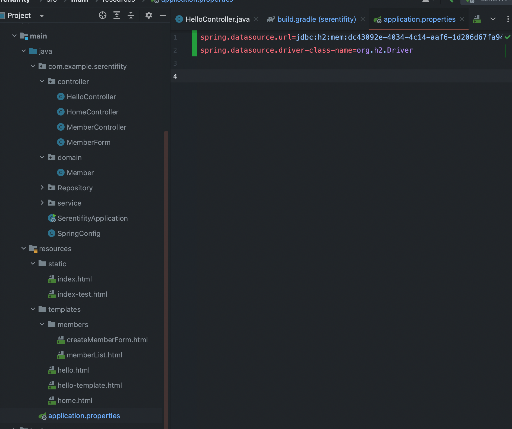
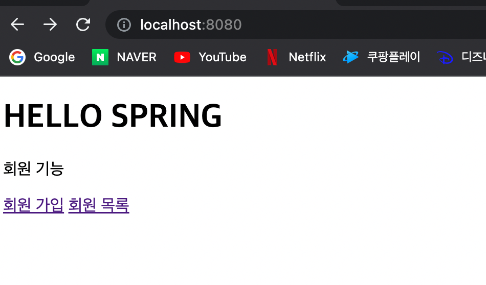
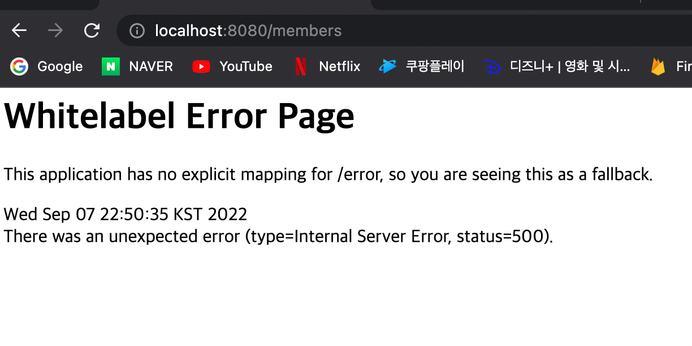
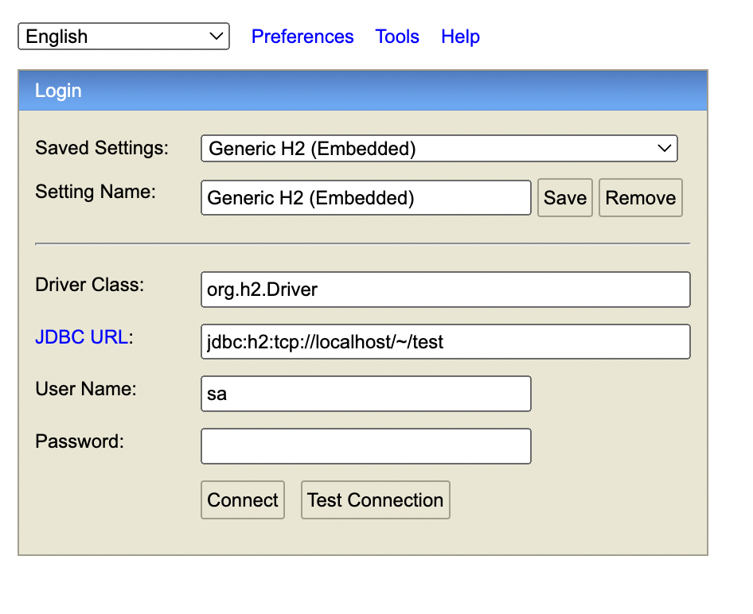
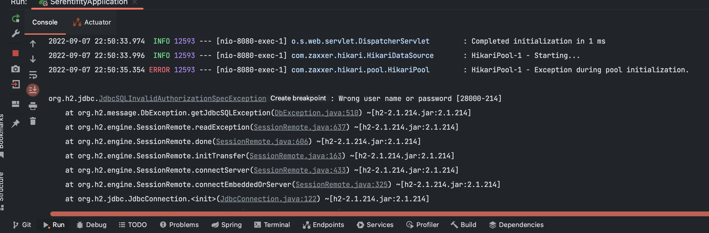
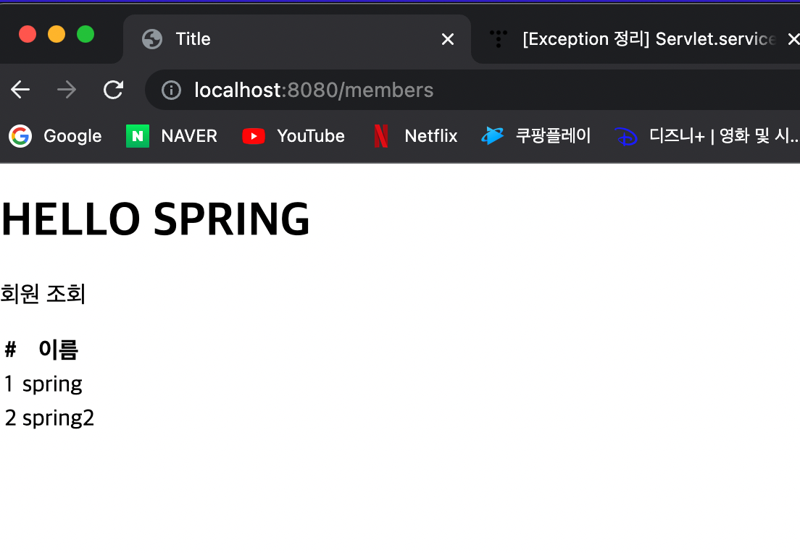
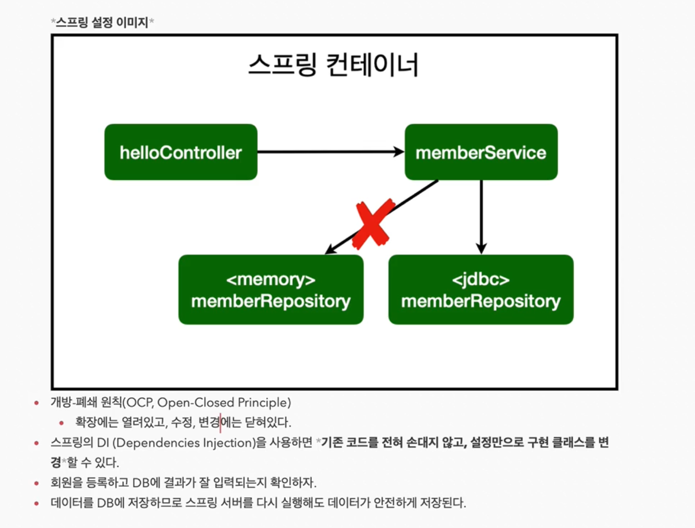
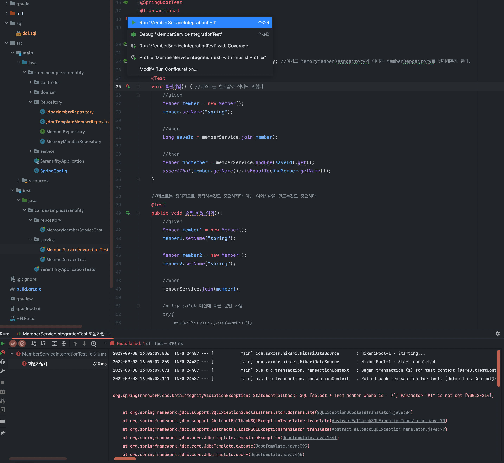
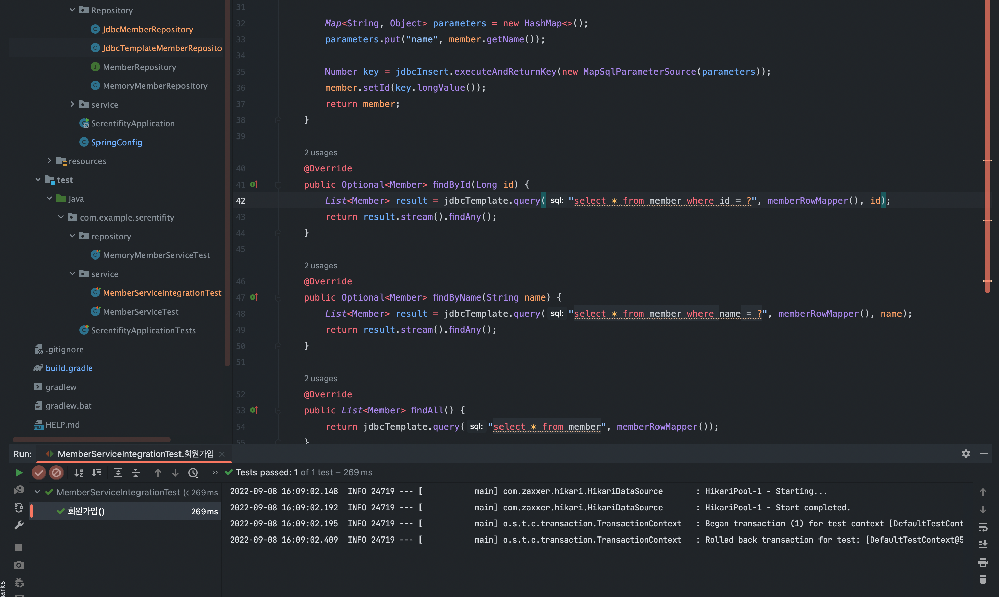

### 스프링부트 JDBC 연동방법

#### 1. build.gradle dependency 추가

> implementation 'org.springframework.boot:spring-boot-starter-jdbc'
> 
> runtimeOnly 'com.h2database:h2:'
>

```gradle
plugins {
	id 'org.springframework.boot' version '2.7.3'
	id 'io.spring.dependency-management' version '1.0.13.RELEASE'
	id 'java'
}

group = 'com.example'
version = '0.0.1-SNAPSHOT'
sourceCompatibility = '11'

repositories {
	mavenCentral()
}

dependencies {
	implementation 'org.springframework.boot:spring-boot-starter-thymeleaf'
	implementation 'org.springframework.boot:spring-boot-starter-web'
	implementation 'org.springframework.boot:spring-boot-starter-jdbc' //이 부분 추가
	runtimeOnly 'com.h2database:h2:' //이 부분 추가
	testImplementation 'org.springframework.boot:spring-boot-starter-test'
}

tasks.named('test') {
	useJUnitPlatform()
}

```

#### 2. application.properties 설정

1. h2 데이터 베이스 실행 시키기



cd Downolads/h2/bin

./h2.bat 프로그램 실행 후 브라우저가 실행되면 주소를 localhost로 변경해주고 여기에 있는 JDBC URL을 가져온다

JDBC URL : jdbc:h2:mem:dc43092e-4034-4c14-aaf6-1d206d67fa94



application.properties에 아래와 같이 datasource를 추가해준다

```java
spring.datasource.url=jdbc:h2:mem:dc43092e-4034-4c14-aaf6-1d206d67fa94
spring.datasource.driver-class-name=org.h2.Driver
```

여기서 url은 아까 복사해왔던 JDBC URL을 붙여준다

#### 3. JDBC Repository 만들기

class name : JdbcMEmberRepository

기존에 만들어 두었던 MemberRepository 인터페이스를 상속받아 확장해서 구현

```java 
public class JdbcMemberRepository implements MemberRepository {

}
```

이렇게 추가해주면 당연히 interface의 모든 기능을 구현해주어야 한다

```java
package com.example.serentifity.Repository;

import com.example.serentifity.domain.Member;

import java.util.List;
import java.util.Optional;

public class JdbcMemberRepository implements MemberRepository {

    @Override
    public Member save(Member member) {
        return null;
    }

    @Override
    public Optional<Member> findById(Long id) {
        return Optional.empty();
    }

    @Override
    public Optional<Member> findByName(String name) {
        return Optional.empty();
    }

    @Override
    public List<Member> findAll() {
        return null;
    }
}
```

그 다음 private final DataSource datasource 변수를 만들어 준다

```java
import javax.sql.DataSource;

public class JdbcMemberRepository implements MemberRepository {

    private final Datasource datasource; 
    @Override
    public Member save(Member member) {
        return null;
    }

}
```

여기서 이렇게만 하면 datasource에 빨간색 표시가 날텐데 따로 생성해주는 부분이 없어서 발생

생성자를 만들어서 객체 생성될 때 datasource 주입 되는 방식 사용

```java
public class JdbcMemberRepository implements MemberRepository {

    private final DataSource dataSource;

    public JdbcMemberRepository(DataSource dataSource) {
        this.dataSource = dataSource;
    }

    @Override
    public Member save(Member member) {
        return null;
    }

```

나중에 spring을 통해서 application.properties에 있는 datasrouce를 여기로 주입 받으면 된다

전체 데이터 소스[JdbcMemberRepository]

```java
package com.example.serentifity.Repository;

import com.example.serentifity.Repository.MemberRepository;
import com.example.serentifity.domain.Member;
import org.springframework.jdbc.datasource.DataSourceUtils;
import javax.sql.DataSource;
import java.sql.*;
import java.util.ArrayList;
import java.util.List;
import java.util.Optional;

public class JdbcMemberRepository implements MemberRepository {
    private final DataSource dataSource;
    public JdbcMemberRepository(DataSource dataSource) {
        this.dataSource = dataSource;
    }
    @Override
    public Member save(Member member) {
        String sql = "insert into member(name) values(?)";
        Connection conn = null;
        PreparedStatement pstmt = null;
        ResultSet rs = null;
        try {
            conn = getConnection();
            //RETURN_GENERATED_KEYS = 자동으로 채번하는 sequence 같은 역할
            pstmt = conn.prepareStatement(sql,
                    Statement.RETURN_GENERATED_KEYS);
            pstmt.setString(1, member.getName());
            pstmt.executeUpdate();
            rs = pstmt.getGeneratedKeys(); // db에서 방금 키를 1번을 생성했으면 2번을 반환, 2번햇으면 3번
            if (rs.next()) {
                member.setId(rs.getLong(1));
            } else {
                throw new SQLException("id 조회 실패");
            }
            return member;
        } catch (Exception e) {
            throw new IllegalStateException(e);
        } finally {
            close(conn, pstmt, rs);
        }
    }
    @Override
    public Optional<Member> findById(Long id) {
        String sql = "select * from member where id = ?";
        Connection conn = null;
        PreparedStatement pstmt = null;
        ResultSet rs = null;
        try {
            conn = getConnection();
            pstmt = conn.prepareStatement(sql);
            pstmt.setLong(1, id);
            rs = pstmt.executeQuery();
            if(rs.next()) {
                Member member = new Member();
                member.setId(rs.getLong("id"));
                member.setName(rs.getString("name"));
                return Optional.of(member);
            } else {
                return Optional.empty();
            }
        } catch (Exception e) {
            throw new IllegalStateException(e);
        } finally {
            close(conn, pstmt, rs);
        }
    }
    @Override
    public List<Member> findAll() {
        String sql = "select * from member";
        Connection conn = null;
        PreparedStatement pstmt = null;
        ResultSet rs = null;
        try {
            conn = getConnection();
            pstmt = conn.prepareStatement(sql);
            rs = pstmt.executeQuery();
            List<Member> members = new ArrayList<>();
            while(rs.next()) {
                Member member = new Member();
                member.setId(rs.getLong("id"));
                member.setName(rs.getString("name"));
                members.add(member);
            }
            return members;
        } catch (Exception e) {
            throw new IllegalStateException(e);
        } finally {
            close(conn, pstmt, rs);
        }
    }
    @Override
    public Optional<Member> findByName(String name) {
        String sql = "select * from member where name = ?";
        Connection conn = null;
        PreparedStatement pstmt = null;
        ResultSet rs = null;
        try {
            conn = getConnection();
            pstmt = conn.prepareStatement(sql);
            pstmt.setString(1, name);
            rs = pstmt.executeQuery();
            if(rs.next()) {
                Member member = new Member();
                member.setId(rs.getLong("id"));
                member.setName(rs.getString("name"));
                return Optional.of(member);
            }
            return Optional.empty();
        } catch (Exception e) {
            throw new IllegalStateException(e);
        } finally {
            close(conn, pstmt, rs);
        }
    }
    private Connection getConnection() {
        return DataSourceUtils.getConnection(dataSource);
    }
    private void close(Connection conn, PreparedStatement pstmt, ResultSet rs)
    {
        try {
            if (rs != null) {
                rs.close();
            }
        } catch (SQLException e) {
            e.printStackTrace();
        }
        try {
            if (pstmt != null) {
                pstmt.close();
            }
        } catch (SQLException e) {
            e.printStackTrace();
        }
        try {
            if (conn != null) {
                close(conn);
            }
        } catch (SQLException e) {
            e.printStackTrace();
        }
    }
    private void close(Connection conn) throws SQLException {
        DataSourceUtils.releaseConnection(conn, dataSource);
    }
}

```
#### 3. SpringConfig 변경해주기

[기존코드]SpringConfig 

```java
@Configuration
public class SpringConfig {

    @Bean
    public MemberService memberService(){

        return new MemberService(memberRepository());
    }

    @Bean
    public MemberRepository memberRepository(){
        return new MemoryMemberRepository();
    }
}

```

[수정코드]SpringConfig 

```java
@Configuration
public class SpringConfig {

    private DataSource dataSource;
    @Autowired
    public SpringConfig(DataSource dataSource){
        this.dataSource = dataSource;
    }

    @Bean
    public MemberService memberService(){

        return new MemberService(memberRepository());
    }

    @Bean
    public MemberRepository memberRepository(){
        //return new MemoryMemberRepository();
        return new JdbcMemberRepository(dataSource);
    }
}
```

application.properties에 있는 DataSource는 스프링이 알아서 생성해서 가지고 있는데 SpringConfig 생성자에 

@Autowired가 묶여서 Datasource가 있으면 주입해달라라는 명령이 있어서 스프링이 알아서 찾아서 객체를 저기에다 넣어주고 

그 주입된 dataSource를 다시 JdbcMemberRepository에 전달해주면 끝

<b>코드를 변경하지 않고 딱 SpringConfig만 변경함으로써 MemoryMemberRepository에서 JdbcMemberRepository로 변경</b>


#### 4. 프로젝트 실행결과 보기

이렇게 작성한 후 실행을 하게되면 화면은 보이지만 들어가면 에러를 확인 할 수 있다



나는 잘 따라 했는데 왜 갑자기 에러가 나는거지?!



분명 H2 DB에는 MEMBER테이블이 있는데 왜 없다고 나오는 것일까?!

1. 내가 JDBC URL을 잘못잡았기 때문

 - 처음에는 URL을 아래와 같이 잡았었지만 이건 잘못잡았던 경우

```
spring.datasource.url=jdbc:h2:mem:dc43092e-4034-4c14-aaf6-1d206d67fa94
spring.datasource.driver-class-name=org.h2.Driver
```

 - 아래처럼 잡아야 한다
```
spring.datasource.url=jdbc:h2:tcp://localhost/~/test
spring.datasource.driver-class-name=org.h2.Driver
```

 

실제로 h2 console에도 이렇게 들어가야 한다.

KEY POINT 
 - JDBC URL : jdbc:h2:tcp://localhost/~/test

여기까지 하고 다시 실행하면 다른 에러가 발생한다.

 

이렇게 하고 다시 시작해보니 이번에는 다른 에러가 발생한다

wrong user or password?!

아니 분명히 다 따라쳤는데 왜 안되는거지?!

처음에는 test.mv.db 파일 문제라고 생각해서 rm -rf 로 지우고 다시 만들기 반복했지만 여전히 문제가 해결되지 않았음

** 참고로 test.mv.db가 ./h2.bat을 해도 자동으로 안만들어질경우 cd ~ 에 들어가서 vi test.mv.db 파일을 만들어주어야 한다. 

안에 내용은 비어도 괜찮음

이렇게 하고 ./h2.bat을 하면 test.mv.db에 자동으로 텍스트가 들어가게 되서 connect를 성공적으로 할 수 있게 된다.

아까 발생했던 wrong user or password 문제의 해결책은

```
spring.datasource.url=jdbc:h2:tcp://localhost/~/test
spring.datasource.driver-class-name=org.h2.Driver
spring.datasource.username=sa
```

이렇게 spring.datasource.username=sa 를 properties파일 밑에 꼭 추가시켜줘야한다.

스프링부트 2.4.0버전부터 명시하도록 바뀌었음

 

이렇게 하면 정상적으로 동작하는것을 확인 할 수 있다

[요약]
1. JDBC는 그냥 이렇게 쓴다는거라고 알아만 두자
2. SpringConfig에서 설정을 바꿔주는것만으로 연결 DB를 바꿔줄 수 있다

옛날에는 DB를 변경하려면 Repository, Service안에 직접 불러오고 있어서 같이 수정해주었어야 했지만 지금 DI를 사용하면서 코드를 수정 할 필요없이 설정변경으로 DB변경 가능

어셈블리 코드 = SpringConfig
 - 코드 변경 없이 설정만 변경

 

객체지향의 핵심

<b>인터페이스에서 구현체를 바꾸면서도 코드를 변경하지 않고 바꿀수 있는점</b>

### 스프링부트 JDBC Template 사용법

순수 JDBC와 동일한 환경설정을 하면 된다.

스프링 JDBCTemplate과 Mybatis 같은 라이브러리는 JDBC API에서 본 반복 코드를 대부분 제거해준다. 하지만 SQL은 직접 작성해야한다

실무에서도 자주 사용된다(참고)

class name : JdbcTemplateMemberRepository

기존에 만들어 두었던 MemberRepository 인터페이스를 상속받아 확장해서 구현

```java

public class JdbcTemplateMemberRepository implements MemberRepository {

    private final JdbcTemplate jdbcTemplate;

    @Autowired
    public JdbcTemplateMemberRepository(DataSource dataSource) {
        jdbcTemplate = new JdbcTemplate(dataSource);
    }

    @Override
    public Member save(Member member) {
        return null;
    }

    @Override
    public Optional<Member> findById(Long id) {
        return Optional.empty();
    }

    @Override
    public Optional<Member> findByName(String name) {
        return Optional.empty();
    }

    @Override
    public List<Member> findAll() {
        return null;
    }
}
```

1. JdbcTemplate 변수를 만든다
2. 생성자에 DataSource를 받고 그것을 new JdbcTemplate(datasource)에 넣어준다
3. @Autowired 어노테이션을 붙여준다. 하지만 지금 이 경우에는 생성자가 딱 하나라서 @Autowired를 안써줘도 자동으로 주입해준다(Autowired 생략가능)

```java
package com.example.serentifity.Repository;

import com.example.serentifity.domain.Member;
import org.springframework.beans.factory.annotation.Autowired;
import org.springframework.jdbc.core.JdbcTemplate;
import org.springframework.jdbc.core.RowMapper;

import javax.sql.DataSource;
import java.sql.ResultSet;
import java.sql.SQLException;
import java.util.List;
import java.util.Optional;

public class JdbcTemplateMemberRepository implements MemberRepository {

    private final JdbcTemplate jdbcTemplate;

    @Autowired
    public JdbcTemplateMemberRepository(DataSource dataSource) {
        jdbcTemplate = new JdbcTemplate(dataSource);
    }

    @Override
    public Member save(Member member) {
        return null;
    }

    @Override
    public Optional<Member> findById(Long id) {
        List<Member> result = jdbcTemplate.query("select * from member where id = ?", memberRowMapper());
        return result.stream().findAny();
    }

    @Override
    public Optional<Member> findByName(String name) {
        return Optional.empty();
    }

    @Override
    public List<Member> findAll() {
        return null;
    }

    private RowMapper<Member> memberRowMapper(){
        return (rs, rowNum) -> {
            Member member = new Member();
            member.setId(rs.getLong("id"));
            member.setName(rs.getString("name"));
            return member;
        };
    }

    /* 위에 람다식을 원래 아래처럼 쓸 수 있다
    private RowMapper<Member> memberRowMapper(){
        return new RowMapper<Member>() {
            @Override
            public Member mapRow(ResultSet rs, int rowNum) throws SQLException {

                Member member = new Member();
                member.setId(rs.getLong("id"));
                member.setName(rs.getString("name"));
                return member;
            }
        }
    }
    */

}
```

완성된 JDBCTemplateRepository

```java
public class JdbcTemplateMemberRepository implements MemberRepository {

    private final JdbcTemplate jdbcTemplate;

    @Autowired
    public JdbcTemplateMemberRepository(DataSource dataSource) {
        jdbcTemplate = new JdbcTemplate(dataSource);
    }

    @Override
    public Member save(Member member) {
        SimpleJdbcInsert jdbcInsert = new SimpleJdbcInsert(jdbcTemplate);
        jdbcInsert.withTableName("member").usingGeneratedKeyColumns("id");

        Map<String, Object> parameters = new HashMap<>();
        parameters.put("name", member.getName());

        Number key = jdbcInsert.executeAndReturnKey(new MapSqlParameterSource(parameters));
        member.setId(key.longValue());
        return member;
    }

    @Override
    public Optional<Member> findById(Long id) {
        List<Member> result = jdbcTemplate.query("select * from member where id = ?", memberRowMapper());
        return result.stream().findAny();
    }

    @Override
    public Optional<Member> findByName(String name) {
        List<Member> result = jdbcTemplate.query("select * from member where name = ?", memberRowMapper(), name);
        return result.stream().findAny();
    }

    @Override
    public List<Member> findAll() {
        return jdbcTemplate.query("select * from member", memberRowMapper());
    }

    private RowMapper<Member> memberRowMapper(){
        return (rs, rowNum) -> {
            Member member = new Member();
            member.setId(rs.getLong("id"));
            member.setName(rs.getString("name"));
            return member;
        };
    }
}
```

이렇게 작성한 후 SpringConfig에 들어가서 Repository를 변경해주면 끝

```java
@Configuration
public class SpringConfig {

    private final DataSource dataSource;
    @Autowired
    public SpringConfig(DataSource dataSource){
        this.dataSource = dataSource;
    }

    @Bean
    public MemberService memberService(){
        return new MemberService(memberRepository());
    }

    @Bean
    public MemberRepository memberRepository(){
        //return new MemoryMemberRepository();
        //return new JdbcMemberRepository(dataSource);
        return new JdbcTemplateMemberRepository(dataSource);
    }
}
```

스프링 통합테스트로 잘되는지 확인해보자 - 기존에 만들었던 MemberServiceIntegrationTest로 테스트 진행

 

이렇게 하면 문제가 발생하는데 그 이유는 파라미터 셋팅을 잘못해두었기 때문

[테스트 케이스] 장점 - 웹에서 했으면 또 회원가입하고 회원목록 눌러야 확인 가능하지만 테스트케이스는 바로 확인 가능하다

```java
    @Override
    public Optional<Member> findById(Long id) {
        List<Member> result = jdbcTemplate.query("select * from member where id = ?", memberRowMapper(), id);
        return result.stream().findAny();
    }
```

위에 id 파라미터 넣어주는것을 깜빡해서 새로 추가해주면 된다

 

테스트 케이스에서 정상적으로 동작하는것을 확인 가능

JDBCTemplate 사용 완료

출처 
 1. [[JAVA]스프링 입문-김영한](https://www.inflearn.com/course/%EC%8A%A4%ED%94%84%EB%A7%81-%EC%9E%85%EB%AC%B8-%EC%8A%A4%ED%94%84%EB%A7%81%EB%B6%80%ED%8A%B8/dashboard)


