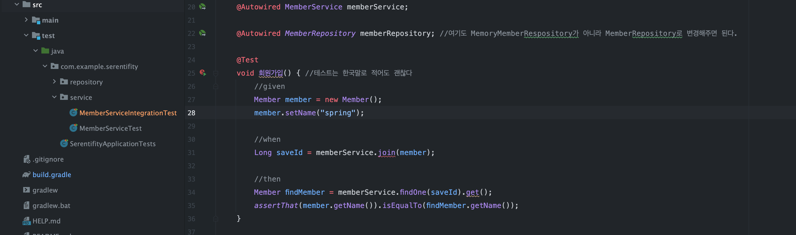
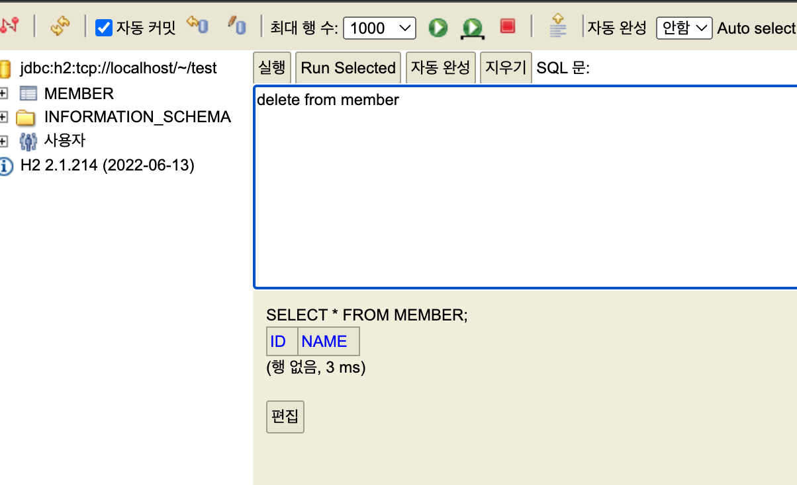
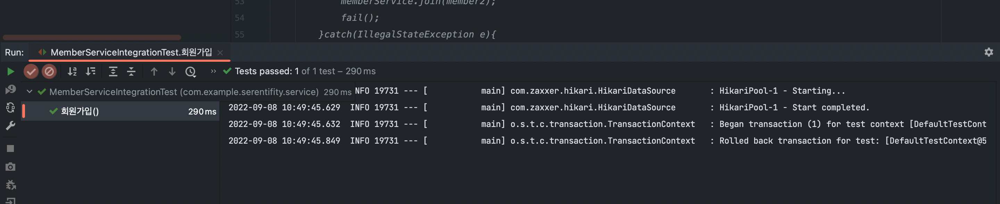

### 스프링부트 통합테스트 방법

#### 1. MemberServiceIntegrationTest.java 파일 만들기

Project > src > test > java > service > MemberServiceIntegrationTest 파일 만들기

1. @SpringBootTest 어노테이션 붙이기
2. @Transactional 어노테이션 붙이기

 

```java

@SpringBootTest
@Transactional
class MemberServiceIntegrationTest {

    @Autowired MemberService memberService;

    @Autowired MemberRepository memberRepository; //여기도 MemoryMemberRespository가 아니라 MemberRepository로 변경해주면 된다.

    @Test
    void 회원가입() { //테스트는 한국말로 적어도 괜찮다
        //given
        Member member = new Member();
        member.setName("spring");

        //when
        Long saveId = memberService.join(member);

        //then
        Member findMember = memberService.findOne(saveId).get();
        assertThat(member.getName()).isEqualTo(findMember.getName());
    }

    ...
}
```

여기서 회원가입만 먼저 테스트 해보면 이미 존재하는 회원이라는 에러발생

 

기존에 있던 member 테이블에 데이터를 지워주고 다시한번 테스트 동작시켜보면

 

정상적으로 되는것을 확인해 볼 수 있다

그런데 다시한번 동작하면 정상적으로 안되는것을 확인할 수 있는데 위에서 테스트하면서 DB에 실제로 데이터가 들어갔기 때문이다

그래서 Test를 다시 할 수 있게 만들기 위해서는 

```java
    @AfterEach
    public void afterEach(){
        memberRepository.clearStore();
    }
```

기존에 위와 같이 clear해주는 부분을 @AfterEach 어노테이션을 걸고 계속 수행되도록 해두었지만 이게 굉장히 번거롭다

그런데 스프링에서는 @Transactional 어노테이션을 추가해주면 DB 트랜잭션을 테스트 하기전 상태로 ROLLBACK 해주는 역할을 한다

즉, 테스트 할때는 데이터를 넣고 테스트가 끝나면 원복시켜주는 역할(@AfterEach)와 비슷하다

> 테스트를 실행할 때 트랜잭션을 먼저 실행하고 데이터 넣고 조회하고 하다가 테스트가 끝나면 트랜잭션 실행 전으로 RollBack해준다

```java
@SpringBootTest : 스프링 컨테이너와 테스트를 함께 실행한다(스프링 기동)

@Transactional : 테스트 케이스에 이 어노테이션이 있으면, 테스트 시작 전에 트랜잭션을 시작하고, 테스트 완료 후에 항상 롤백한다.
이렇게 하면 DB에 데이터가 남지 않으므로 다음 테스트에 영향을 주지 않는다
```

단위 테스트 : 스프링 기동없이(@SpringBootTest X) 없이 회원가입, 로그인등 단위로 테스트 진행(밀리세컨드)

통합 테스트 : 스프링 기동하면서(@SpringBootTest O) 회원가입, 로그인등 전체 테스트 진행(세컨드)

<b>[imporant]스프링 컨테이너 없는 단위테스트 훈련을 많이 해두어야 한다</b>


출처 
 1. [[JAVA]스프링 입문-김영한](https://www.inflearn.com/course/%EC%8A%A4%ED%94%84%EB%A7%81-%EC%9E%85%EB%AC%B8-%EC%8A%A4%ED%94%84%EB%A7%81%EB%B6%80%ED%8A%B8/dashboard)


