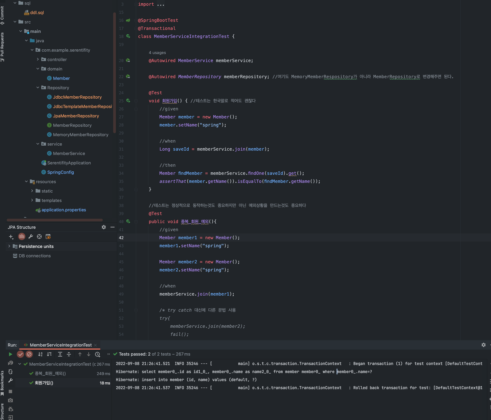
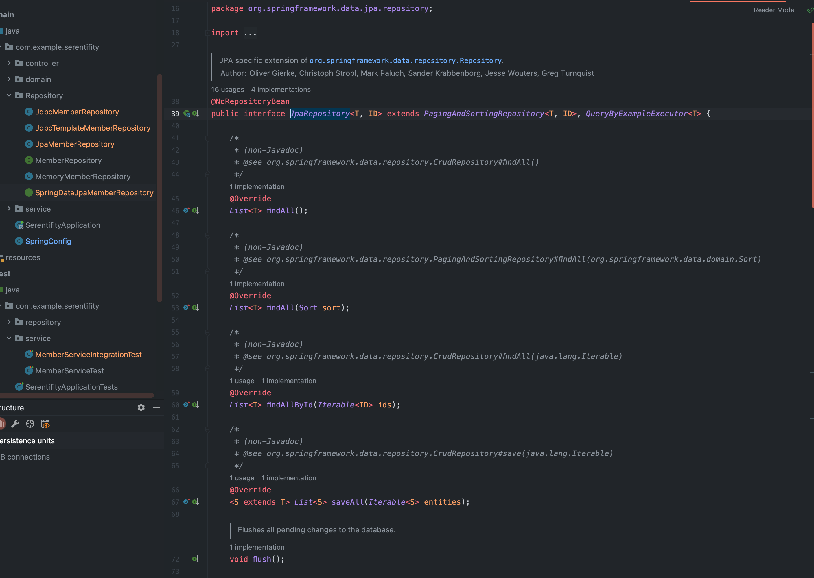
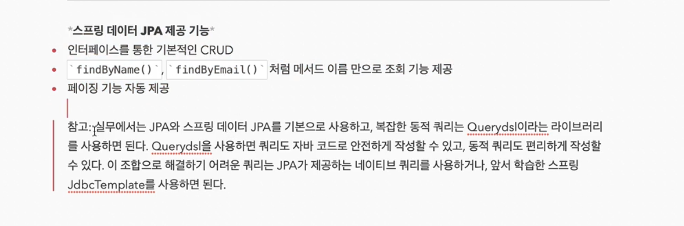

### JPA와 데이터 연동

#### 1. JPA

ORM 기술 : Object - Relational - Mapping (객체와 관계형 데이터베이스를 매핑한다는 기술) = JPA

JPA : 자바 표준 인터페이스

Hibernate : 구현체

1. build.gradle에 dependencies 쪽에 implementation 추가해주기

```gradle
dependencies {
	implementation 'org.springframework.boot:spring-boot-starter-thymeleaf'
	implementation 'org.springframework.boot:spring-boot-starter-web'
	//implementation 'org.springframework.boot:spring-boot-starter-jdbc'
	implementation 'org.springframework.boot:spring-boot-starter-data-jpa' // 이 부분 추가해주기
	runtimeOnly 'com.h2database:h2:'
	testImplementation 'org.springframework.boot:spring-boot-starter-test'
}
```

2. application.properties에 설정 추가해주기

> 프로젝트 > src > main > resources > application.properties에 설정 추가하기

```
spring.datasource.url=jdbc:h2:tcp://localhost/~/test
spring.datasource.driver-class-name=org.h2.Driver
spring.datasource.username=sa
spring.jpa.show-sql=true
spring.jpa.hibernate.ddl-auto=none
```

spring.jpa.show-sql=true : JPA 쿼리 출력 여부

spring.jpa.hibernate.ddl-auto : JPA에서 자동으로 Entity을 보고 테이블을 만들지 여부(이미 만들어져 있으니까 none)

spring.jpa.hibernate.ddl-auto : create 하면 자동으로 테이블 만들어 준다


3. Entity(domain) 설정 해주기

> 프로젝트 > src > main > java > com.example.프로젝트 > domain 패키지 생성 > Member 클래스 생성


[기존 코드]
```java
public class Member {
    private Long id;
    private String name;

    public Long getId() {
        return id;
    }

    public void setId(Long id) {
        this.id = id;
    }

    public String getName() {
        return name;
    }

    public void setName(String name) {
        this.name = name;
    }
}
```

[수정코드(Entity)]
```java
 @Entity
public class Member {
    @Id
    @GeneratedValue(strategy = GenerationType.IDENTITY) //DB에 Insert할 때 자동으로 key값이 +1 되면서 DB에서 자동으로 추가되는 전략을 IDENTITY 전략이라고 부른다
    private Long id;

    private String name;

    public Long getId() {
        return id;
    }

    public void setId(Long id) {
        this.id = id;
    }

    public String getName() {
        return name;
    }

    public void setName(String name) {
        this.name = name;
    }
}
```

[1] @Entity 어노테이션 추가

[2] key 값이 꼭 들어가야한다. 즉 @Id를 Key 값에 할당해주어야 한다. 

[3] key 값에 자동으로 값이 증가되는것을 원하면 @GeneratedValue 어노테이션을 할당

[4] 따로 컬럼명을 지정하고 싶으면 @Column(name = "xxx") 이렇게 추가해줄 수 있다. 없으면 자동으로 이름에 맞게 테이블이 만들어 진다

4. JpaMemberRepository(repository) 생성 해주기

> 프로젝트 > src > main > java > com.example.프로젝트 > repository 패키지 생성 > JpaMemberRepository 클래스 생성 

[기존 코드]
```java
public class JpaMemberRepository implements MemberRepository{

    @Override
    public Member save(Member member) {
        return null;
    }

    @Override
    public Optional<Member> findById(Long id) {
        return Optional.empty();
    }

    @Override
    public Optional<Member> findByName(String name) {
        return Optional.empty();
    }

    @Override
    public List<Member> findAll() {
        return null;
    }
}
```

[수정코드(Repository)]
```java
package com.example.serentifity.Repository;

import com.example.serentifity.domain.Member;
import org.springframework.transaction.annotation.Transactional;

import javax.persistence.EntityManager;
import java.util.List;
import java.util.Optional;

@Transactional
public class JpaMemberRepository implements MemberRepository{

    //아까 build.gradle에 JPA를 추가해두었으면 스프링이 기동될 때 자동으로 EntityManager bean객체를 만들어서 Repository에 주입해준다
    private final EntityManager em;

    public JpaMemberRepository(EntityManager em) {
        this.em = em;
    }

    @Override
    public Member save(Member member) {
        em.persist(member); //이렇게 하면 JPA가 Insert Query를 만들어서 자동으로 동작시켜준다
        return member;
    }

    @Override
    public Optional<Member> findById(Long id) {
        Member member = em.find(Member.class, id);
        return Optional.ofNullable(member);
    }

    @Override
    public Optional<Member> findByName(String name) {
        List<Member> result = em.createQuery("select m from Member m where m.name = :name", Member.class)
                .setParameter("name", name)
                .getResultList();

        return result.stream().findAny();
    }

    @Override
    public List<Member> findAll() {
        List<Member> result =  em.createQuery("select m from member m", Member.class).getResultList();
        return result;
    }    
}
```

    //저장, 조회, 수정, 삭제는 자동으로 JPA가 해주니까 따로 작성필요 없다

    //PK기반이 아닌 나머지것들을 이용할 때는 위와 같이 작성해주어야 한다

    //JPA는 모든 작업이 Transactional 안에서 수행되어야 한다. 특정 부분에만 @Transactional 어노테이션 추가가 가능하지만 클래스 위에 전체에 적용도 가능


5. SpringConfig에 사용 Repository를 변경해준다

> 프로젝트 > src > main > java > com.example.프로젝트 > SpringConfig 내용 수정

[기존 코드]
```java
@Configuration
public class SpringConfig {

    private final DataSource dataSource;
    @Autowired
    public SpringConfig(DataSource dataSource){
        this.dataSource = dataSource;
    }

    @Bean
    public MemberService memberService(){
        return new MemberService(memberRepository());
    }

    @Bean
    public MemberRepository memberRepository(){
        //return new MemoryMemberRepository();
        //return new JdbcMemberRepository(dataSource);
        return new JdbcTemplateMemberRepository(dataSource);
    }
}
```

[수정 코드]
```java
@Configuration
public class SpringConfig {

    private EntityManager em;
    @Autowired
    public SpringConfig(EntityManager em) {
        this.em = em;
    }

    //    private final DataSource dataSource;
//    @Autowired
//    public SpringConfig(DataSource dataSource){
//        this.dataSource = dataSource;
//    }

    @Bean
    public MemberService memberService(){
        return new MemberService(memberRepository());
    }

    @Bean
    public MemberRepository memberRepository(){
        //return new MemoryMemberRepository();
        //return new JdbcMemberRepository(dataSource);
        //return new JdbcTemplateMemberRepository(dataSource);
        return new JpaMemberRepository(em);
    }
}
```

6. 통합 테스트 진행

> 프로젝트 > src > test > java > com.example.프로젝트 > service > MemberServiceIntegrationTest 실행

```java
package com.example.serentifity.service;

import com.example.serentifity.Repository.MemberRepository;
import com.example.serentifity.Repository.MemoryMemberRepository;
import com.example.serentifity.domain.Member;
import org.junit.jupiter.api.AfterEach;
import org.junit.jupiter.api.BeforeEach;
import org.junit.jupiter.api.Test;
import org.springframework.beans.factory.annotation.Autowired;
import org.springframework.boot.test.context.SpringBootTest;
import org.springframework.transaction.annotation.Transactional;

import static org.assertj.core.api.Assertions.assertThat;
import static org.junit.jupiter.api.Assertions.assertThrows;

@SpringBootTest
@Transactional
class MemberServiceIntegrationTest {

    @Autowired MemberService memberService;

    @Autowired MemberRepository memberRepository; //여기도 MemoryMemberRespository가 아니라 MemberRepository로 변경해주면 된다.

    @Test
    void 회원가입() { //테스트는 한국말로 적어도 괜찮다
        //given
        Member member = new Member();
        member.setName("spring");

        //when
        Long saveId = memberService.join(member);

        //then
        Member findMember = memberService.findOne(saveId).get();
        assertThat(member.getName()).isEqualTo(findMember.getName());
    }

    //테스트는 정상적으로 동작하는것도 중요하지만 아닌 예외상황을 만드는것도 중요하다
    @Test
    public void 중복_회원_예외(){
        //given
        Member member1 = new Member();
        member1.setName("spring");

        Member member2 = new Member();
        member2.setName("spring");

        //when
        memberService.join(member1);

        /* try catch 대신에 다른 문법 사용
        try{
            memberService.join(member2);
            fail();
        }catch(IllegalStateException e){
            assertThat(e.getMessage()).isEqualTo("이미 존재하는 회원입니다.");
        }
         */
        IllegalStateException e = assertThrows(IllegalStateException.class, () -> memberService.join(member2));

        //then
        assertThat(e.getMessage()).isEqualTo("이미 존재하는 회원입니다.");

    }
}
```

그대로 테스트를 진행하면 아래와 같이 성공적으로 테스트가 되는모습을 확인 할 수 있다

 

```
Hibernate: select member0_.id as id1_0_, member0_.name as name2_0_ from member member0_ where member0_.name=?

Hibernate: insert into member (id, name) values (default, ?)
```

만약에 실제로 데이터가 들어가는 모습을 테스트할때 하고싶으면 원하는 메소드에 @Commit 어노테이션만 추가해주면 된다

[기존 코드]
```java
    @Test
    void 회원가입() { //테스트는 한국말로 적어도 괜찮다
        //given
        Member member = new Member();
        member.setName("spring");

        //when
        Long saveId = memberService.join(member);

        //then
        Member findMember = memberService.findOne(saveId).get();
        assertThat(member.getName()).isEqualTo(findMember.getName());
    }
```

[수정 코드]
```java
    @Test
    @Commit
    void 회원가입() { //테스트는 한국말로 적어도 괜찮다
        //given
        Member member = new Member();
        member.setName("spring");

        //when
        Long saveId = memberService.join(member);

        //then
        Member findMember = memberService.findOne(saveId).get();
        assertThat(member.getName()).isEqualTo(findMember.getName());
    }
```

이렇게 하고 테스트를 하면 실제 DB에 반영된다

#### 2. Spring Data JPA

마법같이 인터페이스만으로 개발을 끝낼수 있다?! 

핵심 비즈니스 로직만 구현하면 된다

이제는 JPA는 선택이 아니라 필수이다

스프링 데이터 JPA는 JPA를 도와주는것일 뿐 먼저 JPA를 할 줄 알아야지 Spring Data JPA를 쓸 수 있다

꼭 JPA를 먼저 배우고 데이터 JPA를 사용하자

1. SpringDataJpaMemberRepository Interface 만들기

class 가 아닌 Interface!!

> 프로젝트 > src > main > java > com.example.프로젝트 > repository > SpringDataJpaMemberRepository Interface 생성

```java
package com.example.serentifity.Repository;

import com.example.serentifity.domain.Member;
import org.springframework.data.jpa.repository.JpaRepository;

import java.util.Optional;

public interface SpringDataJpaMemberRepository extends JpaRepository<Member, Long>, MemberRepository{ //첫번째 T : Entity, 두번째 Key : key 값의 타입(Long)
    @Override
    Optional<Member> findByName(String name);

}
```

    //지금 Interface만 있고 구현체도 없고 아무것도 없는데 끝?! 이게 끝..

    //이렇게 JpaRepository를 상속받는 Interface를 만들게 되면 자동으로 스프링에서 구현체를 자동으로 만들어서 등록을 해주기 때문에 우리는 그걸 가져다 사용하기만 하면 된다.

    //사용법은 SpringConfig에 가서 MemberRepository 변수를 만들어서 사용해주면 끝

그 다음 SpringConfig에 가서 작업을 해주면 끝

[기존 코드]
```java
@Configuration
public class SpringConfig {

    private EntityManager em;
    @Autowired
    public SpringConfig(EntityManager em) {
        this.em = em;
    }

    //    private final DataSource dataSource;
//    @Autowired
//    public SpringConfig(DataSource dataSource){
//        this.dataSource = dataSource;
//    }

    @Bean
    public MemberService memberService(){
        return new MemberService(memberRepository());
    }

    @Bean
    public MemberRepository memberRepository(){
        //return new MemoryMemberRepository();
        //return new JdbcMemberRepository(dataSource);
        //return new JdbcTemplateMemberRepository(dataSource);
        return new JpaMemberRepository(em);
    }
}
```

[수정 코드]
```java
package com.example.serentifity;

import com.example.serentifity.Repository.*;
import com.example.serentifity.service.MemberService;
import org.springframework.beans.factory.annotation.Autowired;
import org.springframework.context.annotation.Bean;
import org.springframework.context.annotation.Configuration;

import javax.persistence.EntityManager;
import javax.sql.DataSource;

@Configuration
public class SpringConfig {

    private final MemberRepository memberRepository;

    @Autowired
    public SpringConfig(MemberRepository memberRepository) {
        this.memberRepository = memberRepository;
    }

    @Bean
    public MemberService memberService(){
        return new MemberService(memberRepository);
    }
}

```


 

실제로 JpaRepository에 들어가보면 이미 대부분 구현이 되어 있어서 그대로 사용하면 된다. etc) save, findById, findAll...

하지만 구현이 필요한것들도 있는데 key 값을 사용하지 않는경우, 예를 들어서 key값이 아니라 이름으로 찾고싶은 경우

Member Entity에 name으로 검색하고 싶은데 이게 다른회사에서는 user_name으로 검색할 수도 있고 다 다르기 때문에 공통으로 하는게 불가능

그래서 KEY 관련만 공통으로 해두어서 사용, 나머지는 구현?! [추후 확인 필요]


 


출처 
 1. [[JAVA]스프링 입문-김영한](https://www.inflearn.com/course/%EC%8A%A4%ED%94%84%EB%A7%81-%EC%9E%85%EB%AC%B8-%EC%8A%A4%ED%94%84%EB%A7%81%EB%B6%80%ED%8A%B8/dashboard)


