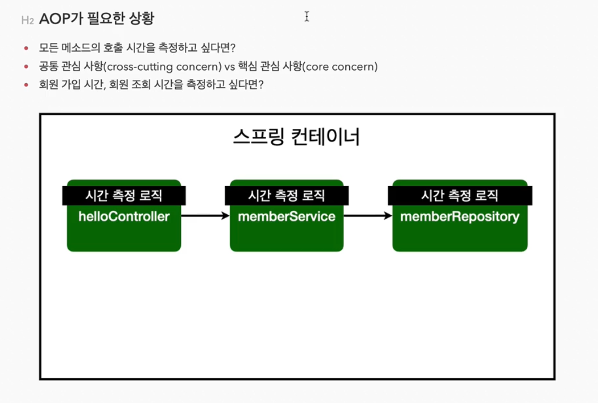
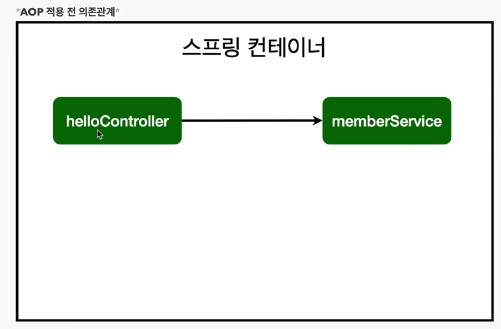

### 스프링부트 AOP

#### 1. AOP가 필요한 상황

 {: .img-width-half}

악덕상사 : 모든 메소드의 호출 시간을 측정해봐

나 : 네? 메소드가 1000개인데..일단 수정하자

악덩상사 : 호출 시간을 날짜로 바꿔

나 : 사직서 제출..

AOP가 없을때 사용 방법

MemberService에 Join을 저렇게 시작점과 끝나는점을 구한다음 sysout으로 출력

```java
    public Long join(Member member){
        long start = System.currentTimeMillis();
        try{
            validateDuplicateMember(member);
            memberRepository.save(member);
            return member.getId();
        }finally{
            long finish = System.currentTimeMillis();
            long timeMs = finish - start;
            System.out.println("join = "+timeMs+"ms");
        }
    }
```

테스트를 진행해봄면 아래와 같이 시간이 얼마나 걸렸는지 알 수 있음


여기서 발생하는 문제

 

[핵심] 유지보수가 어려워지고 수정할게 많고 쓸데없는 중복코드가 엄청나게 많아진다

#### 2. AOP 적용

 

AOP : Aspect Oriented Programming (관점지향 프로그래밍)

공통 관심 사항(cross-cutting concern)과 핵심 관심 사항(core concern) 분리


> 프로젝트 > src > main > java > com.example.프로젝트 > aop 패키지 생성 > TimeTraceAop class 생성

TimeTraceAop class

```java
package com.example.serentifity.aop;

import org.aspectj.lang.ProceedingJoinPoint;
import org.aspectj.lang.annotation.Aspect;

@Aspect
//@Component 이렇게 써주면서 Bean으로 만들어줘도 되지만 특별하니까 SpringConfig에 직접 등록해주자
public class TimeTraceAop {

    @Around("execution(* com.example.serentifity..*(..))") //우리 패키지 안에있는것들은 다 적용하라는 말
    public Object execute(ProceedingJoinPoint joinPoint) throws Throwable{
        long start = System.currentTimeMillis();
        System.out.println("START : "+joinPoint.toString());
        try{
            /*
                Object result = joinPoint.proceed();
                return result;
             */
            return joinPoint.proceed(); //위에처럼 쓰기보다는 이렇게 한줄에 쓸 수 있다
        }finally{
            long finish = System.currentTimeMillis();
            long timeMs = finish - start;
            System.out.println("END : "+joinPoint.toString()+" "+timeMs+"ms");
        }
    }
}

```

> 프로젝트 > src > main > java > com.example.프로젝트 > SpringConfig에 Bean 등록 추가

```java
@Configuration
public class SpringConfig {

    private final MemberRepository memberRepository;

    @Autowired
    public SpringConfig(MemberRepository memberRepository) {
        this.memberRepository = memberRepository;
    }

    //    private EntityManager em;
//    @Autowired
//    public SpringConfig(EntityManager em) {
//        this.em = em;
//    }

    //    private final DataSource dataSource;
//    @Autowired
//    public SpringConfig(DataSource dataSource){
//        this.dataSource = dataSource;
//    }

    @Bean
    public MemberService memberService(){
        return new MemberService(memberRepository);
    }

    /* Spring Data JPA를 사용할때는 아래처럼 만들어서 memberService 메소드에 return 객체에 추가해줄필요 없이 바로 위에있는 memberRepository를 넣어주면 된다
    @Bean
    public MemberRepository memberRepository(){
        //return new MemoryMemberRepository();
        //return new JdbcMemberRepository(dataSource);
        //return new JdbcTemplateMemberRepository(dataSource);
        return new JpaMemberRepository(em);
    }
    */

    @Bean
    public TimeTraceAop timeTraceAop(){
        return new TimeTraceAop();
    }
}
```

그런데 지금 SpringConfig에 등록하면 에러가 발생하니까 그냥 Bean등록을 TimeTraceAop에 @Component 추가로 진행하자

```java
@Aspect
@Component //이렇게 써주면서 Bean으로 만들어줘도 되지만 특별하니까 SpringConfig에 직접 등록해주자
public class TimeTraceAop {

    @Around("execution(* com.example.serentifity..*(..))") //우리 패키지 안에있는것들은 다 적용하라는 말
    public Object execute(ProceedingJoinPoint joinPoint) throws Throwable{
        long start = System.currentTimeMillis();
        System.out.println("START : "+joinPoint.toString());
        try{
            return joinPoint.proceed(); //위에처럼 쓰기보다는 이렇게 한줄에 쓸 수 있다
        }finally{
            long finish = System.currentTimeMillis();
            long timeMs = finish - start;
            System.out.println("END : "+joinPoint.toString()+" "+timeMs+"ms");
        }
    }
}
```

그렇게 하고 실행시키면 아래처럼 AOP가 정상적으로 찍히는 모습을 확인할 수 있다 

 


만약 타겟을 패키지 아래 전체가 아니라 일부만 하고 싶을 경우 


@Around("execution(* com.example.serentifity.service.*(..))") //패키지 밑에 service쪽만 다 적용해라

 

AOP 동작 방식

1. AOP 적용 전 의존관계
 

2. AOP 적용 후 의존관계
 

3. 전체 그림
 

 

SPRING 입문 완료 - 김영한(2022.09.09 완료) : 정말 쉽고 재밌고 자세하게 알려주는 강의
 


출처 
 1. [[JAVA]스프링 입문-김영한](https://www.inflearn.com/course/%EC%8A%A4%ED%94%84%EB%A7%81-%EC%9E%85%EB%AC%B8-%EC%8A%A4%ED%94%84%EB%A7%81%EB%B6%80%ED%8A%B8/dashboard)


