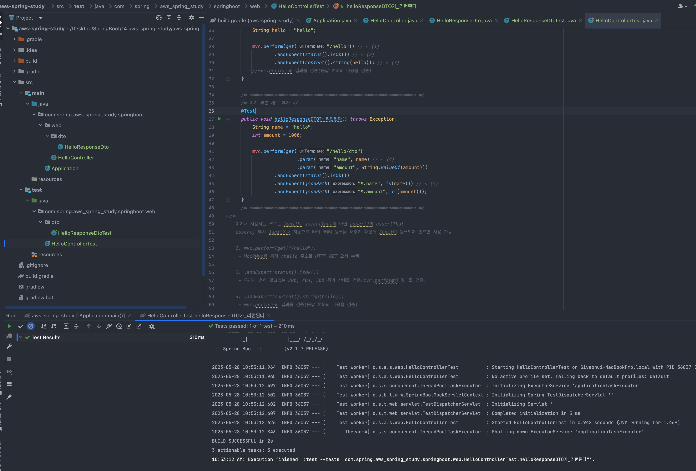

 
###  인텔리제이로 스프링 부트 시작하기

[기초부터 탄탄하게 연휴 스프링 복습 프로젝트]

#### 1장. 인텔리제이로 스프링 부트 시작하기

<b style="color:royalblue">너도 할 수 있어(Community 버전)</b>

<b style="text-decoration: line-through;">스프링 이니셜라이즈(start.spring.io)에서 프로젝트 생성</b>

<b style="color:lightgreen">인텔리제이 기본 Java 프로젝트 => SpringBoot 프로젝트 변경</b>

(1) 인텔리제이 프로젝트 생성 화면


CREATE(생성) 클릭

<br>

(2) 그레이들 프로젝트를 스프링 부트 프로젝트로 변경하기

[프로젝트 생성시 나타나는 초기 build.gradle]
```gradle
plugins {
    id 'java'
}

group 'com.spring'
version '1.0-SNAPSHOT'

repositories {
    mavenCentral()
}

dependencies {
    testImplementation 'org.junit.jupiter:junit-jupiter-api:5.8.1'
    testRuntimeOnly 'org.junit.jupiter:junit-jupiter-engine:5.8.1'
}

test {
    useJUnitPlatform()
}
```

[기본 Java 프로젝트 => SpringBoot 프로젝트 변경 변경 build.gradle]
```gradle
buildscript {
    ext { //ext는 build.gradle에서 사용하는 전역변수를 설정하겠다는 의미
        springBootVersion = '2.1.7.RELEASE'
    }
    repositories {
        mavenCentral()
    }
    dependencies {
        classpath("org.springframework.boot:spring-boot-gradle-plugin:${springBootVersion}")
    }
}

//앞서 선언한 플러그인 의존성들을 적용할 것인지를 결정하는 코드
apply plugin: 'java'
apply plugin: 'eclipse'
apply plugin: 'org.springframework.boot'
apply plugin: 'io.spring.dependency-management'
//io.spring.dependency-management는 스프링 부트의 의존성들을 관리해주는 플러그인(필수 플러그인)

group 'com.spring'
version '1.0-SNAPSHOT'
sourceCompatibility = 1.11

repositories {//원격 저장소 선택(인터넷 연결해서 받아오는 원격저장소)
    mavenCentral()
}

/* 의존성 등록 */
dependencies {
    /* 
      Gradle 버전 업그레이드 참고사항 
      1. 기존 compile(), testCompile() 메서드는 deprecated
      2. 대신 implementation , testImplementation 사용
    */
    
    /* SpringBoot 사용(JAVA > SpringBoot) */
    implementation('org.springframework.boot:spring-boot-starter-web')

    /* SpringBoot 테스트 사용 */
    testImplementation('org.springframework.boot:spring-boot-starter-test')
  


    /* --------- [JPA 의존성 추가할 때 H2도 같이 추가 필요] --------- */
    /* JPA 사용(스프링 부트용 Spring Data JPA 라이브러리) */
    implementation('org.springframework.boot:spring-boot-starter-data-jpa')

    /* 인메모리 관계형 데이터 베이스(h2 라이브러리) */
    runtimeOnly 'com.h2database:h2'
    //implementation('org.h2database:h2') deprecated 되어서 runtimeonly 사용


    /* 롬복(lombok) 사용 */
    implementation('org.projectlombok:lombok')
    annotationProcessor('org.projectlombok:lombok') //gradle 버전이 올라가면서 lombok 사용시 추가


    /* 의존성 등록할때 특정버전을 입력하지 않으면 자동으로 현재 스프링 부트에 맞는 버전으로 다운 */
}
```

<b style="color:dodgerblue">변경 후 gradle reload를 통해서 프로젝트 변경</b>


<b style="color:deeppink">여기서는 예제를 위해서 스프링부트 2.1.7 버전 사용(현재는 2.7.x 버전 까지 나옴)</b>

<br>

(3) 인텔리제이에서 깃과 깃허브 사용하기

1) GITHUB 계정 가입 필요

2) 단축키(인텔리제이 Action) : [window] Ctrl + shift + A / [mac] Command + Shift + A

3) share project on Github 입력


4) share 클릭


5) 커밋을 위한 팝업창(.idea는 선택 X)


6) 깃허브 프로젝트 자동 생성


7) .gitignore 파일 수정
```gitignore
# Project exclude paths
.gradle
.idea
```

8) 깃 커밋창 열기 단축키() : [window] Ctrl + K / [mac] Command + K


9) 깃 푸쉬창 열기 단축키() : [window] Ctrl + Shift + K / [mac] Command + Shift + K


10) 깃허브 PUSH 확인


<br>

#### 2장. 스프링 부트에서 테스트 코드를 작성하자

<b style="color:deeppink">[핵심] 테스트 코드 작성은 어려워 보이지만 필수(무조건 알고가야하는 챕터)</b>

[TDD = 단위 테스트를 위한 최소한의 필수조건]

<b style="color:mediumspringgreen">TDD는 테스트가 주도하는 개발(테스트 코드를 먼저 작성하는 방식)</b>

1. 항상 실패하는 테스트를 먼저 작성하고(RED)
2. 테스트가 통과하는 프로덕션 코드를 작성하고(GREEN)
3. 테스트가 통과하면 프로덕션 코드를 리팩토링한다(Refactor)


<b style="color:dodgerblue">테스트 코드(단위테스트) 작성 이유</b>

1. 개발단계 초기 문제 발견
2. 업그레이드 또는 리펙토링 후에도 기존 기능이 올바르게 작동하는지 확인 가능 
3. 기능에 대한 불확실성을 감소
4. 시스템에 대한 실제 문서를 제공(즉, 단위 테스트 자체가 문서로 사용가능)

<b style="color:aquamarine; text-decoration: line-through;">기존 개발 테스트 방식</b>

1. 코드를 작성하고
2. 프로그램(Tomcat)을 실행한 뒤
3. Postman과 같은 API 테스트 도구로 HTTP 요청하고
4. 요청 결과를 System.out.println() 으로 눈으로 검증한다
5. 결과가 다르면 다시 프로그램(Tomcat)을 중지하고 코드를 수정

Q. 왜 계속 톰캣을 내렸다가 다시 반복해야만 하는가? 

A. 이는 테스트 코드가 없기 때문에 눈과 손으로 직접 수정된 기능을 확인하는 방법밖에 없다

<b style="color:lightgreen">테스트 코드 작성을 도와주는 프레임워크들이 있는데 가장 대중적인 테스트 프레임워크로는 xUnit이 있다</b>

Junit - JAVA

DBUnit - DB

CppUnit - C++

NUnit - .net

이 중에서 자바용인 Junit을 앞으로 사용하겠다. (Junit 4버전을 사용)


<b style="color:royalblue"><u>[T] 테스트 코드 작성이 해보니 어려웠지만 일단 반복하면서 패턴에 익숙해지고 천천히 이해하면서 작성 습관을 들이다</u></b>

<br>


가) HelloController 테스트 코드 작성하기

1) java 폴더 아래에 패키지 생성(com.spring.aws_spring_study.springboot)
2) 새로 만든 패키지 아래에 Application.class 생성하기

```java
package com.spring.aws_spring_study.springboot;

import org.springframework.boot.SpringApplication;
import org.springframework.boot.autoconfigure.SpringBootApplication;

//어노테이션 스프링 부트의 자동 설정, 스프링 Bean 읽기와 생성을 모두 자동으로 설정
@SpringBootApplication
public class Application { //앞으로 만들 프로젝트의 메인 클래스
    public static void main(String[] args){
        SpringApplication.run(Application.class, args);
    }
}

//@SpringBootApplication이 있는 위치부터 설정을 읽어가기 때문에 항상 프로젝트의 최상단에 위치

//1. SpringApplication.run()으로 내장 WAS 실행
//2. Jar파일로 패키징되어 있는 파일을 실행하기만 하면 어디서든 프로젝트 기동 가능
```


3) 패키지(com.spring.aws_spring_study.springboot) 아래에 새로운 패키지(web) 생성하기
4) web패키지에 테스트를 위한 HelloController.class 생성하기
 (앞으로 컨트롤러 클래스들은 web 패키지에 위치)
```java
package com.spring.aws_spring_study.springboot.web;

import org.springframework.web.bind.annotation.GetMapping;
import org.springframework.web.bind.annotation.RequestParam;
import org.springframework.web.bind.annotation.RestController;

@RestController
public class HelloController {

    @GetMapping("/hello")
    public String hello(){
        return "hello";
    }

}
/*
KEY POINT
1. @RequestParam
 - 외부에서 API로 넘긴 파라미터를 가져오는 어노테이션 (쿼리 파라미터)

2. @RequestBody
 - 외부에서 API로 넘길때 HTTP Body에서 넘어오는 데이터(POST 방식)

3. @PathVariable
 - URL(localhost:8088/users/{id}) 에서 id 부분
 */
```

5) 테스트 폴더에도 main과 동일하게 패키지 생성(com.spring.aws_spring_study.springboot.web)
6) com.spring.aws_spring_study.springboot.web 패키지 아래에 HelloControllerTest 생성
```java
package com.spring.aws_spring_study.springboot.web;

import org.junit.Test;
import org.junit.runner.RunWith;
import org.springframework.beans.factory.annotation.Autowired;
import org.springframework.boot.test.autoconfigure.web.servlet.WebMvcTest;
import org.springframework.test.context.junit4.SpringRunner;
import org.springframework.test.web.servlet.MockMvc;

import static org.springframework.test.web.servlet.request.MockMvcRequestBuilders.get;
import static org.springframework.test.web.servlet.result.MockMvcResultMatchers.content;
import static org.springframework.test.web.servlet.result.MockMvcResultMatchers.status;

//테스트 진행할 때 JUnt에 내장된 실행자 외에 다른 실행자를 실행시킨다(JUnit과 스프링부트 테스트 중간 역할)
@RunWith(SpringRunner.class)
@WebMvcTest(controllers = HelloController.class)
public class HelloControllerTest {

    @Autowired
    private MockMvc mvc; 
    //웹 API를 테스트할 때 사용한다.(스프링MVC 테스트의 시작점이자 API 테스트 도구)

    @Test
    public void hello가_리턴된다() throws Exception{
        String hello = "hello";

        mvc.perform(get("/hello")) //MockMvc를 통해 /hello 주소로 HTTP GET 요청 수행
                .andExpect(status().isOk()) 
                //우리가 흔히 알고있는 200, 404, 500 등의 상태를 검증(mvc.perform의 결과를 검증)
                .andExpect(content().string(hello));
                //mvc.perform의 결과를 검증(응답 본문의 내용을 검증)
    }
}
```

<b style="color:deeppink">테스트를 실행하면 아래 처럼 정상적으로 테스트가 동작하는 것을 확인 할 수 있다</b>


직접 서버를 기동하고 손으로 입력해서 눈으로 확인해도 동일한 결과를 얻을 수 있다


나) 롬복 설치하기

롬복 : @Getter, @Setter, @NoArgsConstructor 등

1) gradle 의존성 추가 필요(우리는 이미 위에서 초기에 추가해주었음)
```gradle
/* 의존성 등록 */
dependencies {
    /* 롬복(lombok) 사용 */
    implementation('org.projectlombok:lombok')
    annotationProcessor('org.projectlombok:lombok') 
    //gradle 버전이 올라가면서 lombok 사용시 추가(annotationProcessor)
}
```

2) main 폴더에 com.spring.aws_spring_study.web 패키지 아래에 dto 패키지 생성하기
3) dto패키지 아래에 HelloResponseDto.class 만들기
```java
package com.spring.aws_spring_study.springboot.web.dto;

import lombok.Getter;
import lombok.RequiredArgsConstructor;

@Getter
//선언된 모든 final 필드가 포함된 생성자를 생성해준다(final이 없는 필드는 생성자에 포함하지 않는다)
@RequiredArgsConstructor
public class HelloResponseDto {
    private final String name;
    private final int amount;
}
```

4) Test폴더에 동일하게 패키지 생성(dto) 해주고 HelloResponseDtoTest.class 생성하기
```java
package com.spring.aws_spring_study.springboot.web.dto;

import org.junit.Test;

import static org.assertj.core.api.Assertions.assertThat;

public class HelloResponseDtoTest {

    @Test
    public void 롬복_기능_테스트(){
        //given
        String name = "test";
        int amount = 1000;

        //when
        HelloResponseDto dto = new HelloResponseDto(name, amount);

        assertThat(dto.getName()).isEqualTo(name);
        assertThat(dto.getAmount()).isEqualTo(amount);
        
        /*
        1. assertThat
         - assertj라는 테스트 검증 라이브러리의 검증 메소드이다
         - 검증하고 싶은 대상을 메소드 인자로 받는다
         - 메소드 체이닝이 지원되어 isEqualTo와 같이 메소드를 이어서 사용 가능하다
         
        2. isEqualTo
         - assertj의 동등 비교 메소드이다
         - assertThat에 있는 값과 isEqualTo의 값을 비교해서 같을 때만 성공한다
         
        [여기서는 Junit의 assertThat이 아닌 assertj의 assertThat을 사용]
         */
    }
}
```
5) 롬복_기능_테스트()를 테스트 해보면 lombok이 정상적으로 동작하고 있는것을 확인 할 수 있다
6) 기존에 만들었던 main 폴더의 HelloController.class에 메소드를 추가해준다
```java
@RestController
public class HelloController {
  
    ...

    @GetMapping("/hello/dto")
    public HelloResponseDto helloDto(@RequestParam("name") String name, @RequestParam("amount") int amount){
        return new HelloResponseDto(name, amount);
    }
}
/*
KEY POINT
1. @RequestParam
 - 외부에서 API로 넘긴 파라미터를 가져오는 어노테이션 (쿼리 파라미터)

2. @RequestBody
 - 외부에서 API로 넘길때 HTTP Body에서 넘어오는 데이터(POST 방식)

3. @PathVariable
 - URL(localhost:8088/users/{id}) 에서 id 부분
 */
```

7) Test폴더에 만들었던 HelloControllerTest에도 새로운 테스트 메소드를 추가해준다
```java
package com.spring.aws_spring_study.springboot.web;

import org.junit.Test;
import org.junit.runner.RunWith;
import org.springframework.beans.factory.annotation.Autowired;
import org.springframework.boot.test.autoconfigure.web.servlet.WebMvcTest;
import org.springframework.test.context.junit4.SpringRunner;
import org.springframework.test.web.servlet.MockMvc;

import static org.hamcrest.Matchers.is;
import static org.springframework.test.web.servlet.request.MockMvcRequestBuilders.get;
import static org.springframework.test.web.servlet.result.MockMvcResultMatchers.*;
import static org.springframework.test.web.servlet.result.MockMvcResultMatchers.jsonPath;

//테스트 진행할 때 JUnt에 내장된 실행자 외에 다른 실행자를 실행시킨다(JUnit과 스프링부트 테스트 중간 역할)
@RunWith(SpringRunner.class)
@WebMvcTest(controllers = HelloController.class)
public class HelloControllerTest {

    @Autowired
    private MockMvc mvc;
    //웹 API를 테스트할 때 사용한다.(스프링MVC 테스트의 시작점이자 API 테스트 도구)

    @Test
    public void hello가_리턴된다() throws Exception{
        String hello = "hello";

        mvc.perform(get("/hello")) // < (1)
                .andExpect(status().isOk()) // < (2)
                .andExpect(content().string(hello)); // < (3)
        //mvc.perform의 결과를 검증(응답 본문의 내용을 검증)
    }

    /* ************************************************************ */
    /* 여기 부분 새로 추가 */
    @Test
    public void helloResponseDTO가_리턴된다() throws Exception{
        String name = "hello";
        int amount = 1000;

        mvc.perform(get("/hello/dto")
                        .param("name", name) // < (4)
                        .param("amount", String.valueOf(amount))) 
                .andExpect(status().isOk())
                .andExpect(jsonPath("$.name", is(name))) // < (5)
                .andExpect(jsonPath("$.amount", is(amount)));
    }
    /* ************************************************************ */
/*
  여기서 사용하는 코드는 Junit의 assertThat이 아닌 assertj의 assertThat
  assertj 역시 Junit에서 자동으로 라이브러리 등록을 해주기 때문에 Junit이 등록되어 있으면 사용 가능
  
  1. mvc.perform(get("/hello"))
   - MockMvc를 통해 /hello 주소로 HTTP GET 요청 수행

  2. .andExpect(status().isOk())
   - 우리가 흔히 알고있는 200, 404, 500 등의 상태를 검증(mvc.perform의 결과를 검증)

  3. .andExpect(content().string(hello));
   - mvc.perform의 결과를 검증(응답 본문의 내용을 검증)

  4. param
   - API 테스트할 때 사용될 요청 파라미터를 설정
   - 단, 값은 String만 허용된다
   - 그래서 숫자/날짜 등의 데이터도 등록할 때는 문자열로 변경해야만 가능하다
   
  5. jsonPath
   - JSON 응답값을 필드별로 검증할 수 있는 메소드이다
   - $를 기준으로 필드명을 명시한다
   - 여기서는 name과 amount를 검증하니 $.name, $.amount로 검증한다 
*/
}
```

아래와 같이 정상적으로 테스트가 완료되는 것을 확인 할 수 있다




<br>
<br>


#### 3장. 스프링 부트에서 JPA로 데이터베이스 다뤄보자

기존에 스프링을 배울때는 MyBatis와 같은 SQL 매퍼를 이용해서 데이터베이스 쿼리를 작성했다

분명 "객체지향 프로그래밍을 해야하는데 객체 지향보다는 테이블 모델링에만 집중하고, 객체를 단순히 테이블에 맞추어 데이터 전달 역할만 하는 개발은 기형적인 형태였다"

객체지향 프로그래밍을 하기 위한 고민으로 이미 기존의 Java 에서는 JPA라는 자바 표준 ORM 기술이 존재하였다

<b style="color:dodgerblue">(MyBatis는 ORM이 아닌 SQL Mapper이다. ORM은 객체를 매핑하는것이고, SQL Mapper는 쿼리를 매핑하는것)</b>

<b style="color:deeppink">JPA는 많은 기업에서 사용하고 있으며, 기본적으로 알고있어야 하는 지식이다</b>

[기존 방식-SQL Mapper(Mybatis)]
1. SQL Mapper를 쓰면 애플리케이션 코드보다 SQL로 가득하게 된다
2. CRUD와 같이 단순 반복적인 작업들도 SQL을 만들고 유지보수 해야한다
3. 패러다임 불일치(RDB : 데이터를 어떻게 저장할지 초점 vs 객체지향 : 메시지를 기반으로 기능과 속성을 한 곳에서 관리)
4. 관계형 데이터베이스와 객체지향은 사상부터 다른 시작점(패러다임 불일치)

[객체지향 프로그래밍에서 부모가 되는 객체를 가져오는 방식]

```java
User user = findUser();
Group group = user.getGroup();
```

[여기에 데이터베이스가 추가되면 아래와 같이 변경]


```java
User user = userDao.findUser();
Group group = groupDao.findGroup(user.getGroupId());
```

User 따로, Group 따로 조회하게 된다.

User와 Group이 어떤 관계인지 알 수 있을까? 상속, 1:N등 객체 모델링을 데이터베이스로는 구현 할 수 없다.

그러다 보니 웹 애플리케이션 개발은 점점 데이터 베이스 모델링에만 집중하게 되며, JPA는 이러한 문제점을 해결하기 위해 등장하게 되었다.

JPA를 쓰면 개발자는 더 이상 SQL에 종속적인 개발을 하지 않아도 되며, 생산성 향상과 유지보수하기가 정말 편해진다

<b style="color:lightgreen">JPA는 인터페이스로서 자바 표준명세서이다</b>

JPA = 인터페이스

JPA를 사용하기 위해서는 구현체가 필요하다(대표적으로 Hibernate, Eclipse Link 등이 있다)

하지만 Spring에서 JPA를 사용할 때는 이 구현체들을 직접 다루진 않는다.

<b style="color:mediumspringgreen">구현체들을 좀 더 쉽게 사용하고자 추상화 시킨 Spring Data JPA라는 모듈을 이용하여 JPA 기술을 다룬다.</b>

<u><b style="color:mediumspringgreen">[요약] 여기서는 Spring Data JPA를 사용해서 JPA 기능을 구현</b></u>


가) 프로젝트에 Spring Data Jpa 적용하기

1) build.gradle에 의존성 추가
```gradle
/* 의존성 등록 */
dependencies {
    /* --------- [JPA 의존성 추가할 때 H2도 같이 추가 필요] --------- */
    /* JPA 사용(스프링 부트용 Spring Data JPA 라이브러리) */
    implementation('org.springframework.boot:spring-boot-starter-data-jpa')

    /* 인메모리 관계형 데이터 베이스(h2 라이브러리) */
    runtimeOnly 'com.h2database:h2'
    //implementation('org.h2database:h2') deprecated 되어서 runtimeonly 사용
}
```

2) main 폴더에 com.spring.aws_spring_study.springboot.domain 패키지 생성
  - 여기서 도메인이란 게시글, 댓글, 회원, 정산, 결제 등 소프트웨어에 대한 요구사항 혹은 문제 영역
3) 생성된 domain 패키지 아래에 새로운 도메인 posts 패키지를 생성
  - 기존 MyBatis에 쿼리 매퍼를 사용했다면 DAO 패키지를 떠올리겠지만, 도메인은 조금 다르다
  - xml에 쿼리를 담고, 클래스는 오로지 쿼리의 결과만 담던 일들이 모두 도메인 클래스에서 해결된다
  - DDD 관련해서 공부하면서 도메인에 대해 좀 더 알아보자
4) posts 패키지 아래에 Posts.class 생성
```java
package com.spring.aws_spring_study.springboot.domain.posts;


import lombok.Builder;
import lombok.Getter;
import lombok.NoArgsConstructor;

import javax.persistence.*;

@Getter
@NoArgsConstructor
@Entity
public class Posts {

    @Id
    @GeneratedValue(strategy = GenerationType.IDENTITY)
    private Long id;

    @Column(length = 500, nullable = false)
    private String title;

    @Column(columnDefinition = "TEXT", nullable = false)
    private String content;

    private String author;

    @Builder
    public Posts(Long id, String title, String content, String author) {
        this.id = id;
        this.title = title;
        this.content = content;
        this.author = author;
    }
}

/*
1. @Entity
 - 테이블과 링크될 클래스임을 나타낸다
 - 기본값으로 클래스의 카멜케이스 이름을 언더스코어 네이밍(_)으로 테이블 이름을 매칭한다
 ex) SalesManager.java  ->  sales_manager [table]

2. @Id
 - 해당 테이블의 PK 필드를 나타낸다

3. @GeneratedValue
 - PK 생성 규칙을 나타낸다
 - 스프링부트 2.0에서는 GenerationType.IDENTITY 옵션을 추가해야만 auto_increment가 된다

4. @Column
 - 테이블의 컬럼을 나타내며 굳이 선언하지 않더라도 해당 클래스의 필드는 모두 컬럼이 된다
 - 사용하는 이유는, 기본값 외에 추가로 변경이 필요한 옵션이 있으면 사용한다
 - 문자열의 경우 VARCHAR(255)가 기본값인데, 사이즈를 500으로 늘리고 싶거나 타입을 TEXT로 변경하고 싶은 경우 사용한다

5. @Builder
 - 해당 클래스의 빌더 패턴 클래스를 생성
 - 생성자 상단에 선언 시 생성자에 포함된 필드만 빌더에 포함

!KEY POINT
1. 웬만하면 Entity의 PK는 Long타입의 Auto_increment를 추천한다
2. Entity 클래스에는 절대 Setter 메소드 사용 X
 - 필요시 명확한 의도를 나타낼 수 있는 메소드를 추가해야한다
 */
```
 - JPA를 사용하면 DB 데이터를 작업할 경우 실제 쿼리를 날리기보다는, 이 Entity 클래스의 수정을 통해 작업진행

5) Posts 클래스 생성이 끝나면, Posts 클래스로 Database를 접근하게 해줄 JpaRepository.class를 생성한다(동일 경로)
```java
package com.spring.aws_spring_study.springboot.domain.posts;

import org.springframework.data.jpa.repository.JpaRepository;

public interface PostsRepository extends JpaRepository<Posts, Long> {

}
/*
  Posts(Entity)클래스 생성 이후 Posts클래스로 DB접근이 가능하게 해주는 JpaRepository를 생성해주어야 한다

  JPA에서는 Repository라고 부르며 인터페이스로 생성한다

  사용법 : 인터페이스 생성명 extends JpaRepository<Entity 클래스명, ID타입>

  @Repository를 추가할 필요도 없습니다. 하지만 주의할 점은 Entity 클래스와 기본 Entity Repository는 함께 위치해야 한다는 점
  (나중에 프로젝트가 커지면 도메인 패키지에 Entity, Repository는 함께 움직여야 한다)
*/
```

- <b style="color:mediumspringgreen">JPA에서 Repository는 보통 ibatis나 MyBatis 등에서 DAO라고 불리는 DB Layer 접근자이다</b>

<br>
<br>

나) Spring Data JPA 테스트 코드 작성하기

1) test 폴더에 com.spring.aws_spring_study 패키지에 domain.posts 패키지를 생성하고, PostsRepositoryTest.class 생성
```java
package com.spring.aws_spring_study.springboot.domain.posts;


import org.junit.After;
import org.junit.Test;
import org.junit.runner.RunWith;
import org.springframework.beans.factory.annotation.Autowired;
import org.springframework.boot.test.context.SpringBootTest;
import org.springframework.test.context.junit4.SpringRunner;

import java.time.LocalDateTime;
import java.util.List;

import static org.assertj.core.api.Assertions.assertThat;

@RunWith(SpringRunner.class)
@SpringBootTest
public class PostsRepositoryTest {
    @Autowired
    PostsRepository postsRepository;

    @After
    public void cleanup() {
        postsRepository.deleteAll();
    }

    @Test
    public void 게시글저장_불러오기() {
        //given
        String title = "테스트 게시글";
        String content = "테스트 본문";

        postsRepository.save(Posts.builder()
                .title(title)
                .content(content)
                .author("qkrrldus93g@gmail.com")
                .build());

        //when
        List<Posts> postsList = postsRepository.findAll();

        //then
        Posts posts = postsList.get(0);
        assertThat(posts.getTitle()).isEqualTo(title);
        assertThat(posts.getContent()).isEqualTo(content);
    }
}

/*
    1. @After
     - Junit에서 단위 테스트가 끝날 때마다 수행되는 메소드를 지정
     - 보통은 배포 전 전체 테스트를 수행할 때 테스트간 데이터 침범을 막기 위해 사용한다
     - 여러 테스트가 동시에 수행되면 테스트용 데이터베이스인 H2에 데이터가 그대로 남아 있어 다음 테스트 싱핼 시 실패할 수 있음(그래서 deleteAll() 사용으로 초기화)

    2. postsRepository.save
     - 테이블 posts에 insert/update 쿼리를 실행한다
     - id값이 있다면 update가, 없다면 insert 쿼리를 실행

    3. postsRepository.findAll
     - 테이블 posts에 있는 모든 데이터를 조회해오는 메소드

     [별다른 설정 없이 @SpringBootTest를 사용할 경우 H2 데이터베이스를 자동으로 실행해준다]

     만약 실제로 실행된 쿼리는 어던 형태인지 확인 하기 위해서는 application.yml에서 설정을 바꿔주면 가능
*/
```

- 테스트가 정상적으로 동작되는 것을 확인 할 수 있다


여기에서 추가로 로그에 JPA 쿼리를 확인하고 싶을 때에는 application.properties에 설정을 추가해주면 된다

2) application.properties 생성(main 폴더에 resources 폴더 우클릭 하고 new > file 생성 > 파일명 : application.properties)
```properties
spring.jpa.show_sql=true 
spring.jpa.properties.hibernate.dialect=org.hibernate.dialect.MySQL5InnoDBDialect


# spring.jpa.show_sql=true  : 콘솔에 JPA로그 보여주기
# spring.jpa.properties.hibernate.dialect=org.hibernate.dialect.MySQL5InnoDBDialect  :  JPA로그를 MySql 형태로 보여주기
```


다) 등록/수정/조회 API 만들기


<b style="color:mediumspringgreen">
API를 만들기 위해서는 총 3개의 클래스가 필요
</b>

1. Request 데이터를 받을 Dto
2. API 요청을 받을 Controller
3. 트랜잭션, 도메인 기능 간의 순서를 보장하는 Service

<b style="color:deeppink">[핵심] 많은 분들이 오해하고 계신 것이, Service에서 비지니스 로직을  처리해아한다는 점</b>


<b style="color:cornflowerblue">
  전혀 그렇지 않다. [요점] - Service는 트랜잭션, 도메인 간 순서 보장의 역할만 수행할 뿐이다
</b>

<br>

Q. 그렇다면 비지니스 로직은 누가 처리하는가?

<b style="color:lightgreen">
A. 정답은 바로 Domain이다
</b>

<br>

[스프링 WEB 계층]


1. WEB Layer
    - 흔히 사용되는 컨트롤러(Controller)와 JSP 등의 뷰 템플릿 영역
    - 이외에도 필터, 인터셉터, 컨트롤러 어드바이스 등 외부 요청과 응답에 대한 전반적인 영역
2. Service Layer
    - @Service에 사용되는 서비스 영역
    - 일반적으로 Controller와 Dao의 중간 영역에서 사용된다
    - <b style="color:lightgreen">@Transactional이 사용되어야 하는 영역 </b>
3. Repository Layer
    - Database와 같이 데이터 저장소에 접근하는 영역
    - 기존에 개발하셨던 분들이라면 DAO(Data Access Object) 영역으로 이해
4. Dtos
    - Dto(Data Transfer Object)는 계층 간에 데이터 교환을 위한 객체를 이야기 하며 Dtos는 이들의 영역을 얘기하는것
    - 예를 들어 뷰 템플릿 엔진에서 사용될 객체나 Repository Layer에서 결과로 넘겨준 객체 등이 이들을 이야기 한다
5. Domain Model
    - 도메인이라 불리는 개발 대상을 모든 사람이 동일한 관점에서 이해할 수 있고 공유 할 수 있도록 단순화 시킨 것을 도메인 모델이라 부른다
    - 이를테면 택시 앱이라고 하면 배차, 탑승, 요금 등이 모두 도메인이 될 수 있다
    - @Entity를 사용해보신 분들은 @Entity가 사용된 영역 역시 도메인 모델이라고 이해하면 된다
    - 다만, 무조건 데이터베이스의 테이블과 관계가 있어야만 하는것은 아니다
    - VO처럼 값 객체들도 이 영역에 해당하기 때문이다

<b style="color:aquamarine">기존에 서비스로 처리하던 방식을 트랜잭션 스크립트라고 한다</b>

[예시 슈도 코드]
```java
@Transactional
public Order cancelOrder(int orderId){
  1) 데이터베이스로부터 주문정보(Orders), 결제정보(Billing), 배송정보(Delivery) 조회

  2) 배송 취소를 해야하는지 확인

  3) If(배송중이라면){
    배송 취소로 변경
  }

  4) 각 테이블에 취소 상태 Update
```

<b style="color:dodgerblue">[트랜잭션 스크립트 방식-기존]</b>
```java
@Transactional
public Order cancelOrder(int orderId){

  //1)
  OrderDto order = orderDao.selectOrders(orderId);
  BillingDto billing = billingDao.selectBilling(orderId);
  DeliveryDto delivery = deliveryDao.selectDelivery(orderId);

  //2)
  String deliveryStatus = delivery.getStatus();

  //3)
  if("IN_PROGRESS".equals(deliveryStatus)){
    delivery.setStatus("CANCEL");
    deliveryDao.update(delivery);
  }

  //4)
  order.setStatus("CANCEL");
  orderDao.update(order);

  billing.setStatus("CANCEL");
  deliveryDao.update(billing);

  return order;
}
```

```java
@Transactional
public Order cancelOrder(int orderId){

  //1)
  OrderDto order = orderDao.selectOrders(orderId);
  BillingDto billing = billingDao.selectBilling(orderId);
  DeliveryDto delivery = deliveryDao.selectDelivery(orderId);

  //2)
  String deliveryStatus = delivery.getStatus();

  //3)
  if("IN_PROGRESS".equals(deliveryStatus)){
    delivery.setStatus("CANCEL");
    deliveryDao.update(delivery);
  }

  //4)
  order.setStatus("CANCEL");
  orderDao.update(order);

  billing.setStatus("CANCEL");
  deliveryDao.update(billing);

  return order;
}
```

모든 로직이 서비스 클래스 내부에서 처리된다. 그러다 보니 서비스 계층이 무의미하며, 객체란 단순히 데이터 덩어리 역할만 수행

<b style="color:dodgerblue">[도메인 모델 처리 방식]</b>

```java
@Transactional
public Order cancelOrder(int orderId){

  //1)
  Orders order = orderRepository.findById(orderId);
  Billing billing = billingRepository.findByOrderId(orderId);
  Delivery delivery = deliveryRepository.findByOrderId(orderId);

  //2-3)
  delivery.cancel();

  //4)
  order.cancel();
  billing.cancel();

  return order;
}
```

<b style="color:deeppink">order, billing, delivery가 각자 본인의 취소 인벤트 처리를 하며, 서비스 메소드는 트랜잭션과 도메인간의 순서만 보장</b>

여기서는 계속 이렇게 도메인 모델을 다루고 코드를 작성 해보자

등록/수정/조회 API 만들기 위한 코드 작성

1) main 폴더에 web 패키지 아래에 PostsApiController.class 생성
```java
package com.spring.aws_spring_study.springboot.web;

import com.spring.aws_spring_study.springboot.domain.posts.PostsRepository;
import lombok.RequiredArgsConstructor;
import org.springframework.web.bind.annotation.PostMapping;
import org.springframework.web.bind.annotation.RequestBody;
import org.springframework.web.bind.annotation.RequestParam;
import org.springframework.web.bind.annotation.RestController;

@RequiredArgsConstructor
@RestController
public class PostsApiController {

    private final PostsService postsService;

    @PostMapping("/api/v1/posts")
    public Long save(@RequestBody PostsSaveRequestDto requestDto){
        return postsService.save(requestDto);
    }

}
/*
    스프링을 써봤던 분들이라면 Controller와 Service에서 @Autowired가 없는 것이 어색하게 느껴질텐데. 스프링에서는 Bean을 주입하는 방식이 아래와 같음
    1. @Autowired
    2. setter
    3. 생성자

    이 중 가장 권장하는 방식은 생성자로 주입받는 방식
    그럼 여기서 생성자는 어디 있을까?(ANSWER : @RequiredArgsConstructor)
*/
```
  - <b style="color:lightgreen">스프링을 써봤던 분들이라면 Controller와 Service에서 @Autowired가 없는 것이 어색하게 느껴질텐데. 스프링에서는 Bean을 주입하는 방식이 아래와 같음</b>
  - @Autowired
  - setter
  - 생성자
  - <b style="color:mediumspringgreen">이 중 가장 권장하는 방식은 생성자로 주입받는 방식
    그럼 여기서 생성자는 어디 있을까?</b>
  - 정답 : @RequiredArgsConstructor
  - <b style="color:mediumspringgreen">@RequiredArgsConstructor를 사용하면 final이 선언된 모든 필드를 인자값으로 하는 생성자가 등록(자동으로 생성 주입)</b>
  

2) main 폴더에 com.spring.aws_spring_study.springboot 패키지 아래에 service.posts 패키지 생성
3) com.spring.aws_spring_study.springboot.service.posts 패키지 아래에 PostsService.class 생성
```java
package com.spring.aws_spring_study.springboot.service.posts;

import com.spring.aws_spring_study.springboot.domain.posts.PostsRepository;
import lombok.RequiredArgsConstructor;
import org.springframework.stereotype.Service;

@RequiredArgsConstructor
@Service
public class PostsService {

    private final PostsRepository postsRepository;

    public Long save(PostsSaveRequestDto requestDto){
        return postsRepository.save(requestDto.toEntity()).getId();
    }
}
```
4) main 폴더에 com.spring.aws_spring_study.springboot.web.dto 패키지 밑에 PostsSaveRequestDto.class 생성
```java
package com.spring.aws_spring_study.springboot.web.dto;

import com.spring.aws_spring_study.springboot.domain.posts.Posts;
import lombok.Builder;
import lombok.Getter;
import lombok.NoArgsConstructor;

@Getter
@NoArgsConstructor
public class PostsSaveRequestDto {
    private String title;
    private String content;
    private String author;

    @Builder
    public PostsSaveRequestDto(String title, String content, String author){
        this.title = title;
        this.content = content;
        this.author = author;
    }

    public Posts toEntity(){
        return Posts.builder()
                .title(title)
                .content(content)
                .author(author)
                .build();
    }

    /*
        여기서 Entity 클래스와 거의 유사한 형태임에도 Dto 클래스를 추가로 생성하였다.
        하지만, 절대로 Entity 클래스를 Request/Response 클래스로 사용해서는 안된다.

        Entity 클래스는 데이터베이스와 맞닿은 핵심 클래스이다.

        사소한 화면 변경을 위해서 DB 스키마(Entity 클래스를 변경 하는 것은 너무 큰 변경이다)

        수많은 서비스 클래스, 비즈니스 로직들이 Entity 클래스를 기준으로 동작
        Entity 클래스가 변경되면 여러 클래스에 영향을 끼치지만, Request와 Response용 Dto는 
        View를 위한 클래스라 정말 자주 변경이 필요하다

        
        추가로 DTO에는 toEntity라는 메소드를 만들어서 Entity로 변환해주는 메서드를 추가해주자
        (이건 내 생각 => 틀렸음)

        DTO > Entity로 가는 경우에는 toEntity
        Entity > DTO로 가는 경우에는 Dto 생성자 만들때 Entity를 파라미터로 받아서 데이터
        넣어서 생성하는 방식으로 진행
     */
}
```
 - <b style="color:mediumspringgreen">절대로 Entity 클래스를 Request/Response 클래스로 사용해서는 안된다.</b>
 - <b style="color:dodgerblue">Entity 클래스는 데이터베이스와 맞닿은 핵심 클래스이다.</b>
      -  Entity 클래스를 기준으로 테이블이 생성되고, 스키마가 변경이 되는데 화면 변경은 사소한 기능 변경
 - <b style="color:deeppink">View Layer와 DB Layer의 역할 분리를 철저하게 하는게 좋다.</b>
      -  즉 DTO와 Entity는 별도로 구분해서 사용하자
 - <b style="color:lightgreen">저장 DTO의 경우(Save, request) : DTO > Entity로 가는 경우에는 Dto 클래스에 toEntity() 추가</b>
 - <b style="color:lightgreen">응답 DTO의 경우(findById, Response) : Entity > DTO로 가는 경우에는 Dto 생성자 만들때 Entity를 파라미터로 받아서 데이터 넣어서 생성하는 방식으로 진행</b>


[저장 DTO의 경우(Save, request 등)]
```java
@Getter
@NoArgsConstructor
public class PostsSaveRequestDto {
    private String title;
    private String content;
    private String author;

    ...

    public Posts toEntity(){
        return Posts.builder()
                .title(title)
                .content(content)
                .author(author)
                .build();
    }
}
```

[응답 DTO의 경우(findById, Response 등)]
```java
@Getter
public class PostsResponseDto {

    private Long id;
    private String title;
    private String content;
    private String author;

    public PostsResponseDto(Posts entity) {
        this.id = entity.getId();
        this.title = entity.getTitle();
        this.content = entity.getContent();
        this.author = entity.getAuthor();
    }
}
```

5) test 폴더에 com.spring.aws_spring_study.springboot.web 패키지 아래에 PostsApiControllerTest.class 파일을 생성
```java
package com.spring.aws_spring_study.springboot.web;

import com.spring.aws_spring_study.springboot.domain.posts.Posts;
import com.spring.aws_spring_study.springboot.domain.posts.PostsRepository;
import com.spring.aws_spring_study.springboot.web.dto.PostsSaveRequestDto;
import org.junit.After;
import org.junit.Test;
import org.junit.runner.RunWith;
import org.springframework.beans.factory.annotation.Autowired;
import org.springframework.boot.test.context.SpringBootTest;
import org.springframework.boot.test.web.client.TestRestTemplate;
import org.springframework.boot.web.server.LocalServerPort;
import org.springframework.http.HttpEntity;
import org.springframework.http.HttpMethod;
import org.springframework.http.HttpStatus;
import org.springframework.http.ResponseEntity;
import org.springframework.test.context.junit4.SpringRunner;

import java.util.List;

import static org.assertj.core.api.Assertions.assertThat;

@RunWith(SpringRunner.class)
@SpringBootTest(webEnvironment = SpringBootTest.WebEnvironment.RANDOM_PORT)
public class PostsApiControllerTest {

    @LocalServerPort
    private int port;

    @Autowired
    private TestRestTemplate restTemplate;

    @Autowired
    private PostsRepository postsRepository;

    @After
    public void tearDown() throws Exception{
        postsRepository.deleteAll();
    }

    @Test
    public void Posts_등록되다() throws Exception{
        //given
        String title = "title";
        String content = "content";
        PostsSaveRequestDto requestDto = PostsSaveRequestDto.builder()
                .title(title)
                .content(content)
                .author("author")
                .build();

        String url = "http://localhost:"+port+"/api/v1/posts";

        //when
        ResponseEntity<Long> responseEntity = restTemplate.postForEntity(url, requestDto, Long.class);

        //then
        assertThat(responseEntity.getStatusCode()).isEqualTo(HttpStatus.OK);
        assertThat(responseEntity.getBody()).isGreaterThan(0L);

        List<Posts> all = postsRepository.findAll();
        assertThat(all.get(0).getTitle()).isEqualTo(title);
        assertThat(all.get(0).getContent()).isEqualTo(content);
    }
}

/*
    Tomcat started on port(s): 52511 (http) with context path
*/
```
랜덤 포트가 들어가면서 테스트가 정상적으로 동작하는것을 확인


<b style="color:deeppink">[여기 까지 등록 기능을 구현하였고 뒤에는 수정/조회 기능을 만들어 보자]</b>

1) main폴더 PostsApiController 클래스 내용 추가
```java
@RequiredArgsConstructor
@RestController
public class PostsApiController {

    private final PostsService postsService;

    ... 

    @PutMapping("/api/v1/posts/{id}")
    public Long update(@PathVariable Long id, @RequestBody PostsUpdateRequestDto requestDto){
        return postsService.update(id, requestDto);
    }

    @GetMapping("/api/v1/posts/{id}")
    public PostsResponseDto findById(@PathVariable Long id){
        return postsService.findById(id);
    }
}
```

2) dto 패키지에 PostsResponseDto, PostsUpdateRequestDto 클래스 파일 생성

[PostsResponseDto.class]
```java
package com.spring.aws_spring_study.springboot.web.dto;

import com.spring.aws_spring_study.springboot.domain.posts.Posts;
import lombok.Getter;

@Getter
public class PostsResponseDto {

    private Long id;
    private String title;
    private String content;
    private String author;

    public PostsResponseDto(Posts entity) {
        this.id = entity.getId();
        this.title = entity.getTitle();
        this.content = entity.getContent();
        this.author = entity.getAuthor();
    }
}
```
   - PostsResponseDto는 Entity의 일부만 사용하므로 생성자로 Entity를 받아 필드에 값을 넣는다.
   - 굳이 모든 필드를 가진 생성자가 필요하진 않으므로 Dto는 Entity를 받아서 처리

<br>
<br>

[PostsUpdateRequestDto.class]
```java
package com.spring.aws_spring_study.springboot.web.dto;

import lombok.Builder;
import lombok.Getter;
import lombok.NoArgsConstructor;

@Getter
@NoArgsConstructor
public class PostsUpdateRequestDto {
    private String title;
    private String content;

    @Builder
    public PostsUpdateRequestDto(String title, String content) {
        this.title = title;
        this.content = content;
    }
}
```

3) Posts 클래스 수정(update 기능 추가)
```java
package com.spring.aws_spring_study.springboot.domain.posts;


import lombok.Builder;
import lombok.Getter;
import lombok.NoArgsConstructor;

import javax.persistence.*;

@Getter
@NoArgsConstructor
@Entity
public class Posts {

    @Id
    @GeneratedValue(strategy = GenerationType.IDENTITY)
    private Long id;

    @Column(length = 500, nullable = false)
    private String title;

    @Column(columnDefinition = "TEXT", nullable = false)
    private String content;

    private String author;

    @Builder
    public Posts(Long id, String title, String content, String author) {
        this.id = id;
        this.title = title;
        this.content = content;
        this.author = author;
    }

    //[이 부분 추가]
    public void update(String title, String content){
        this.title = title;
        this.content = content;
    }
}
```

4) PostsSerivce 클래스 수정(update, findById 기능 추가)
```java
package com.spring.aws_spring_study.springboot.service.posts;

import com.spring.aws_spring_study.springboot.domain.posts.Posts;
import com.spring.aws_spring_study.springboot.domain.posts.PostsRepository;
import com.spring.aws_spring_study.springboot.web.dto.PostsResponseDto;
import com.spring.aws_spring_study.springboot.web.dto.PostsSaveRequestDto;
import com.spring.aws_spring_study.springboot.web.dto.PostsUpdateRequestDto;
import lombok.RequiredArgsConstructor;
import org.springframework.stereotype.Service;

import javax.transaction.Transactional;

@RequiredArgsConstructor
@Service
public class PostsService {
    private final PostsRepository postsRepository;

    @Transactional
    public Long save(PostsSaveRequestDto requestDto){
        return postsRepository.save(requestDto.toEntity()).getId();
    }

    @Transactional
    public Long update(Long id, PostsUpdateRequestDto requestDto){
        Posts posts = postsRepository.findById(id).orElseThrow(
                () -> new IllegalArgumentException("해당글이 없습니다. id="+id)
        );

        posts.update(requestDto.getTitle(), requestDto.getContent());

        return id;
        
    }

    public PostsResponseDto findById(Long id){
        Posts entity = postsRepository.findById(id)
                .orElseThrow(() -> new IllegalArgumentException("해당 게시글이 없습니다. id = "+id));

        return new PostsResponseDto(entity);
    }
}
```
 - <b style="color:lightgreen">여기서 신기한 부분은 update 기능에서 DB 쿼리를 날리는 부분이 없다. </b>
 - 그런데 데이터는 변경이 가능한 이유는 JPA의 영속성 컨텍스트 때문이다
 - 영속성 컨텍스트란, 엔티티를 영구 저장하는 환경으로 일종의 논리적 개념
 - JPA의 핵심 내용은 엔티티가 영속성 컨텍스트에 포함되어 있냐 아니냐로 갈린다
 - JPA의 엔티티 매니저가 활성화된 상태로 Spring Data JPA를 쓴다면 트랜잭션 안에서 데이터베이스에서 데이터를 가져오면 이 데이터는 영속성 컨텍스트가 유지된다
 - 해당 데이터의 값을 변경하면 트랜잭션이 끝나는 시점에 해당 테이블에 변경분을 반영한다
 - <b style="color:mediumspringgreen">즉, Entity 객체의 값만 변경하면 별도로 Update 쿼리를 날릴 필요가 없다!!(이것을 더티 채킹이라 한다)</b>


<br>

5) test 폴더에 PostsApiControllerTest 클래스 파일을 수정해주자
```java
package com.spring.aws_spring_study.springboot.web;

import com.spring.aws_spring_study.springboot.domain.posts.Posts;
import com.spring.aws_spring_study.springboot.domain.posts.PostsRepository;
import com.spring.aws_spring_study.springboot.web.dto.PostsSaveRequestDto;
import com.spring.aws_spring_study.springboot.web.dto.PostsUpdateRequestDto;
import org.junit.After;
import org.junit.Test;
import org.junit.runner.RunWith;
import org.springframework.beans.factory.annotation.Autowired;
import org.springframework.boot.test.context.SpringBootTest;
import org.springframework.boot.test.web.client.TestRestTemplate;
import org.springframework.boot.web.server.LocalServerPort;
import org.springframework.http.HttpEntity;
import org.springframework.http.HttpMethod;
import org.springframework.http.HttpStatus;
import org.springframework.http.ResponseEntity;
import org.springframework.test.context.junit4.SpringRunner;

import java.util.List;

import static org.assertj.core.api.Assertions.assertThat;

@RunWith(SpringRunner.class)
@SpringBootTest(webEnvironment = SpringBootTest.WebEnvironment.RANDOM_PORT)
public class PostsApiControllerTest {

    @LocalServerPort
    private int port;
    @Autowired
    private TestRestTemplate restTemplate;
    @Autowired
    private PostsRepository postsRepository;
    @After
    public void tearDown() throws Exception{
        postsRepository.deleteAll();
    }

    ...

    @Test
    public void Posts_수정되다() throws Exception{
        //given
        Posts savedPosts = postsRepository.save(Posts.builder()
                .title("title")
                .content("content")
                .author("author")
                .build());

        Long updateId = savedPosts.getId();

        String expectedTitle = "title2";
        String expectedContent = "cotent2";

        PostsUpdateRequestDto requestDto =
                PostsUpdateRequestDto.builder()
                        .title(expectedTitle)
                        .content(expectedContent)
                        .build();

        String url = "http://localhost:" + port + "/api/v1/posts/" + updateId;

        HttpEntity<PostsUpdateRequestDto> requestEntity = new HttpEntity<>(requestDto);

        //when
        ResponseEntity<Long> responseEntity = restTemplate.exchange(url, HttpMethod.PUT, requestEntity, Long.class);

        //then
        assertThat(responseEntity.getStatusCode()).isEqualTo(HttpStatus.OK);
        assertThat(responseEntity.getBody()).isGreaterThan(0L);

        List<Posts> all = postsRepository.findAll();

        assertThat(all.get(0).getTitle()).isEqualTo(expectedTitle);
        assertThat(all.get(0).getContent()).isEqualTo(expectedContent);
    }
}
```


정상적으로 테스트 코드가 동작 되는 것을 확인 할 수 있다

6) application.properties에 h2 console 접속을 할 수 있게 권한 부여
```java
spring.jpa.show_sql=true 
spring.jpa.properties.hibernate.dialect=org.hibernate.dialect.MySQL5InnoDBDialect

spring.h2.console.enabled=true
```

7) h2-console 접속


8) insert 쿼리 날리기
```sql
insert into posts(author, content, title) values('author', 'content', 'title');
```

9) API 호출시에도 정상적으로 동작하는 것을 확인 할 수 있다


라) JPA Auditing으로 생성시간/수정시간 자동화 하기

보통 엔티티에 해당 데이터의 생성시간과 수정시간을 포함합니다

언제 만들어졌는지, 언제 수정되었는지 등은 차후 유지보수에 있어 굉장히 중요하기 때문입니다

[기존 방식]
```java
// 생성일 추가 코드 예제
public void savePosts(){
  ...
  posts.setCreateDate(new LocalDate());
  postsRepository.save(posts);
  ...
}
```

이런 단순하고 반복적인 코드가 모든 테이블과 서비스 메소드에 포함되어야 한다고 생각하면 매우 귀찮고 지저분해진다.

그렇기에 이 문제를 해결하고자 JPA Auditing를 사용해보자

1) main 폴더 domain 패키지에 BaseTimeEntity 클래스를 생성하자(domain.posts 패키지 X, domain 바로 아래 패키지)
```java
package com.spring.aws_spring_study.springboot.domain;

import lombok.Getter;
import org.springframework.data.annotation.CreatedDate;
import org.springframework.data.annotation.LastModifiedDate;
import org.springframework.data.jpa.domain.support.AuditingEntityListener;

import javax.persistence.EntityListeners;
import javax.persistence.MappedSuperclass;
import java.time.LocalDateTime;

@Getter
@MappedSuperclass
@EntityListeners(AuditingEntityListener.class)
public class BaseTimeEntity {

    @CreatedDate
    private LocalDateTime createDate;

    @LastModifiedDate
    private LocalDateTime modifiedDate;
}

/*
    1. @MappedSuperclass
     - JPA Entity 클래스들이 BaseTimeEntity을 상속할 경우 필드들(createdDate, modifiedDate)도 컬럼으로 인식하도록 한다

    2. @EntityListeners(AuditingEntityListener.class)
     - BaseTimeEntity 클래스에 Auditing 기능을 포함시킨다

    3. @CreatedDate
     - Entity가 생성되어 저장될 때 시간이 자동 저장된다

    4. @LastModifiedDate
     - 조회한 Entity의 값을 변경할 때 시간이 자동 저장된다
*/
```

2) Posts 클래스가 BaseTimeEntity를 상속받도록 변경하자
```java
public class Posts extends BaseTimeEntity {
  ...
}
```

3) Application 클래스에 활성화 어노테이션 하나를 추가
```java
package com.spring.aws_spring_study.springboot;

import org.springframework.boot.SpringApplication;
import org.springframework.boot.autoconfigure.SpringBootApplication;
import org.springframework.data.jpa.repository.config.EnableJpaAuditing;

@EnableJpaAuditing //JPA Auditing 활성화 < 이부분 추가
@SpringBootApplication 
public class Application { //앞으로 만들 프로젝트의 메인 클래스
    public static void main(String[] args){
        SpringApplication.run(Application.class, args);
    }
}
```

4) test 폴더에 PostsRepositoryTest 클래스에 테스트 메소드 하나 더 추가 하여 진행

```java
package com.spring.aws_spring_study.springboot.domain.posts;

import org.junit.After;
import org.junit.Test;
import org.junit.runner.RunWith;
import org.springframework.beans.factory.annotation.Autowired;
import org.springframework.boot.test.context.SpringBootTest;
import org.springframework.test.context.junit4.SpringRunner;

import java.time.LocalDateTime;
import java.util.List;

import static org.assertj.core.api.Assertions.assertThat;

@RunWith(SpringRunner.class)
@SpringBootTest
public class PostsRepositoryTest {
    @Autowired
    PostsRepository postsRepository;

    @After
    public void cleanup() {
        postsRepository.deleteAll();
    }

    ... 

    @Test
    public void BaseTimeEntity_등록(){
        //given
        LocalDateTime now = LocalDateTime.of(2023, 5, 27, 0, 0, 0);
        postsRepository.save(Posts.builder()
                .title("title")
                .content("content")
                .author("author")
                .build());

        //when
        List<Posts> postsList = postsRepository.findAll();

        //then
        Posts posts = postsList.get(0);

        System.out.println(">>>>>>>>> CreatedDate = "+posts.getCreateDate()+" , modifiedDate = "+posts.getModifiedDate());

        assertThat(posts.getCreateDate()).isAfter(now);
        assertThat(posts.getModifiedDate()).isAfter(now);
    }

    // 앞으로 추가될 엔티티들은 더이상 등록일/수정일로 고민할 필요가 없다.
    // BaseTimeEntity만 상속받으면 자동으로 해결되기 때문
}
```
정상적으로 테스트가 동작하는 것을 확인


<b style="color:mediumspringgreen">[최종 디렉토리 구조 - Chapter03]</b>


<b style="color:cornflowerblue">[스프링 입문자 또는 처음부터 해보고 싶은 분들에게는 필독서]</b>


참고  
 1. [스프링 부트와 AWS로 혼자 구현하는 웹 서비스 - 이동욱 저자](http://www.yes24.com/Product/Goods/83849117)
