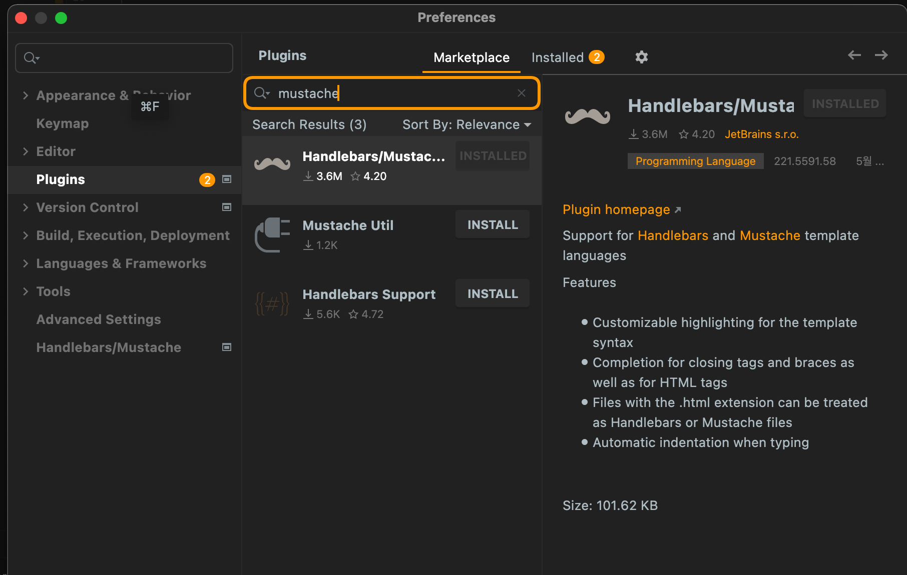
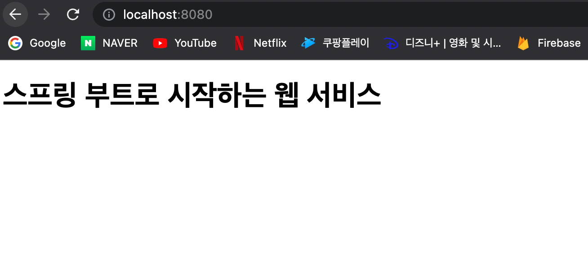

 
###  머스테치로 화면 구성하기

[기초부터 탄탄하게 연휴 스프링 복습 프로젝트]

#### 4장. 머스테치로 화면 구성하기

<b style="color:lightgreen">머스테치란(mustache)</b> 수많은 언어를 지원하는 가장 심플한 템플릿 엔진

자바 진영에는 다양한 서버 템플릿 엔진이 존재(JSP, Velocity, Freemarker, Thymeleaf 등)

1. JSP, Velocity : 스프링 부트에서는 권장하지 않는 템플릿 엔진
   
2. Freemarker : 템플릿 엔진으로 너무 많은 기능 포함

3. Thymeleaf : 스프링 진영에서 적극적으로 밀고 있지만, 문법이 어렵다

반면 Mustache의 장점은 다음과 같다

1. 문법이 다른 템플릿 엔진보다 심플하다

2. 로직 코드를 사용할 수 없어 View 역할과 서버의 역할이 명확하게 분리된다

3. Mustache.js와 Mustache.java 2가지 다 있어, 하나의 문법으로 클라이언트/서버 템플릿을 모두 사용 가능

<b style="color:mediumspringgreen">[요점] 템플릿 엔진은 화면 역할에만 충실 해야한다</b>

<br>

<b style="color:deeppink">[머스테치 사용 가이드]</b>

<b style="color:dodgerblue">1. 머스테치 사용을 위해서는 먼저 플러그인 설치 필요(Mustache)</b>

인텔리제이 Action 명령어(Command + Shift + a) > plugin > Marketplace > Mustache 설치



<b style="color:mediumspringgreen">가장 큰 장점 : 머스테치는 인텔리제이 커뮤니티 버전에서 사용 가능</b>

다른 템플릿 엔진(Thymeleaf, JSP)는 커뮤니티 버전이 아닌 얼티메이트 버전에서 공식 지원

<br>

<b style="color:dodgerblue">2. build.gradle 의존성 추가 </b>

```gradle
buildscript {
    ext { //ext는 build.gradle에서 사용하는 전역변수를 설정하겠다는 의미
        springBootVersion = '2.1.7.RELEASE'
    }
    repositories {
        mavenCentral()
    }
    dependencies {
        classpath("org.springframework.boot:spring-boot-gradle-plugin:${springBootVersion}")
    }
}

//앞서 선언한 플러그인 의존성들을 적용할 것인지를 결정하는 코드
apply plugin: 'java'
apply plugin: 'eclipse'
apply plugin: 'org.springframework.boot'
apply plugin: 'io.spring.dependency-management'
//io.spring.dependency-management는 스프링 부트의 의존성들을 관리해주는 플러그인(필수 플러그인)

group 'com.spring'
version '1.0-SNAPSHOT'
sourceCompatibility = 1.11

repositories {//원격 저장소 선택(인터넷 연결해서 받아오는 원격저장소)
    mavenCentral()
}

/* 의존성 등록 */
dependencies {
    /*
      Gradle 버전 업그레이드 참고사항
      1. 기존 compile(), testCompile() 메서드는 deprecated
      2. 대신 implementation , testImplementation 사용
    */

    ...

    /* 머스타치(mustache) 사용 */
    implementation('org.springframework.boot:spring-boot-starter-mustache')

    /* 의존성 등록할때 특정버전을 입력하지 않으면 자동으로 현재 스프링 부트에 맞는 버전으로 다운 */
}
```

<b style="color:dodgerblue">3. 기본 페이지 만들기 </b>

1) 머스테치를 사용할 때에는 main 폴더 아래에 resources 폴더 우클릭 후 templates라는 폴더를 생성 해주어야 한다

<b style="color:mediumspringgreen">[중요] 머스테치의 기본 경로 : src/main/resources/templates </b>

2) templates 폴더 아래에 index.mustache 파일 생성

```html
<!DOCTYPE HTML>
<html>
<head>
    <title>스프링 부트 웹서비스</title>
    <meta http-equiv="Content-Type" content="text/html; charset=UTF-8" />
</head>
<body>
    <h1> 스프링 부트로 시작하는 웹 서비스</h1>
</body>
</html>
```

3) main폴더에 springboot.web 패키지 아래에 IndexController 만들어주기

```java
package com.spring.aws_spring_study.springboot.web;

import com.spring.aws_spring_study.springboot.service.posts.PostsService;
import com.spring.aws_spring_study.springboot.web.dto.PostsResponseDto;
import lombok.RequiredArgsConstructor;
import org.springframework.stereotype.Controller;
import org.springframework.ui.Model;
import org.springframework.web.bind.annotation.GetMapping;
import org.springframework.web.bind.annotation.PathVariable;

@RequiredArgsConstructor
@Controller
public class IndexController {

    private final PostsService postsService;

    @GetMapping("/")
    public String index(Model model){
        model.addAttribute("posts", postsService.findAllDesc());
        return "index";
    }
}


/*
    머스테치 스타터 덕분에 컨트롤러에서 문자열을 반환할 때 앞의 경로와 뒤의 파일 확장자는 자동으로 지정된다
    (앞의 경로는 src/main/resources/templates, 뒤의 파일 확장자는 .mustache가 붙는다)

    즉 여기선 "index"를 반환하고, src/main/resources/templates/index.mustache로 전환되어 View Resolver가 처리하게 된다.
 */

```

 - 머스테치 스타터 덕분에 컨트롤러에서 문자열을 반환할 때 앞의 경로와 뒤의 파일 확장자는 자동으로 지정된다

 - <b style="color:mediumspringgreen">앞의 경로는 src/main/resources/templates, 뒤의 파일 확장자는 .mustache가 붙는다</b>

 - 즉 여기선 "index"를 반환하고, src/main/resources/templates/index.mustache로 전환되어 View Resolver가 처리하게 된다.

4) test폴더에 springboot.web 패키지 아래에 IndexControllerTest.class 파일을 생성

```java
package com.spring.aws_spring_study.springboot.web;

import org.junit.Test;
import org.junit.runner.RunWith;
import org.springframework.beans.factory.annotation.Autowired;
import org.springframework.boot.test.context.SpringBootTest;
import org.springframework.boot.test.web.client.TestRestTemplate;
import org.springframework.test.context.junit4.SpringRunner;

import static org.assertj.core.api.Assertions.assertThat;
import static org.springframework.boot.test.context.SpringBootTest.WebEnvironment.RANDOM_PORT;

@RunWith(SpringRunner.class)
@SpringBootTest(webEnvironment = RANDOM_PORT)
public class IndexControllerTest {

    @Autowired
    private TestRestTemplate restTemplate;

    @Test
    public void 메인페이지_로딩(){
        //when
        String body = this.restTemplate.getForObject("/", String.class);

        //then
        assertThat(body).contains("스프링 부트로 시작하는 웹 서비스");
        /*
                URL호출 시 페이지의 내용이 제대로 호출되는지에 대한 테스트
                (글자가 하나라도 틀리면 실패 반환 - 정확성 및 편리성 UP)
                TestRestTemplate를 통해 "/"로 호출했을 때 index.mustache에 포함된 코드들이 
                있는지 확인 하는 테스트
        */
    }
}
```
테스트 실행시 정상적으로 동작하는 것을 확인 할 수 있음


> 글자가 하나라도 틀리면 에러를 발생(눈으로 검증하는것보다 정확하다)



실제로 서버를 기동해서 확인해도 정상 동작 하는 것을 확인 할 수 있음

<br>
<br>

<b style="color:dodgerblue">4. 게시글 등록 화면 만들기 </b>

1. 레이아웃 방식 적용(공통 영역을 별도의 파일로 분리하여 필요한 곳에서 가져다 쓰는 방식)
 
   - src/main/resources/templates 디렉토리에 layout 디렉토리를 추가로 생성
   - 그리고 header.mustache, footer.mustache 파일 생성

[header.mustache]
```html
<!doctype html>
<html>
<head>
    <meta charset="UTF-8">
    <meta name="viewport"
          content="width=device-width, user-scalable=no, initial-scale=1.0, maximum-scale=1.0, minimum-scale=1.0">
    <meta http-equiv="Content-Type" content="text/html">
    <title>스프링 부트 웹 서비스</title>

    <!-- **************** CDN 방식(Header) **************** -->
    <!--    BootStrap CDN 방식    -->
     <link rel="stylesheet" href="https://stackpath.bootstrapcdn.com/bootstrap/4.3.1/css/bootstrap.min.css">
    <!--************************************************************ -->


    <!-- **************** DIRECT IMPORT 방식(Header) **************** -->
    <!-- <link rel="stylesheet" href="/js/app/bootstrap.css" /> -->
    <!--************************************************************ -->
</head>
<body>
```

[footer.mustache]
```html

<!-- **************** CDN 방식(Footer) **************** -->
<!--    jQuery CDN 방식   -->
<script src="https://code.jquery.com/jquery-3.3.1.min.js"></script>
<!--    BootStrap(js) CDN 방식-->
<script src="https://stackpath.bootstrapcdn.com/bootstrap/4.3.1/js/bootstrap.min.js"></script>
<!--************************************************************ -->


<!-- **************** DIRECT IMPORT 방식(Footer) **************** -->
<!--    jquery direct import   -->
<!-- <script src="/js/app/jquery-3.7.0.min.js" ></script> -->
<!--    BootStrap direct import   -->
<!-- <script src="/js/app/bootstrap.js" ></script> -->
<!--************************************************************ -->

</body>
</html>
```

코드를 보면 css와 js의 위치가 서로 다름(페이지 로딩 속도를 UP)

 - css는 header 쪽에 위치, js는 footer 쪽에 위치

<br>

[참고] BootStrap, jQuery 적용 순서

가. CSS 링크(header쪽)

```html
<!--    BootStrap CDN 방식    -->
<link rel="stylesheet" href="https://stackpath.bootstrapcdn.com/bootstrap/4.3.1/css/bootstrap.min.css">
```

나. jQuery 링크(footer쪽)

```html
<!--    jQuery CDN 방식   -->
<script src="https://code.jquery.com/jquery-3.3.1.min.js"></script>
```

다. BootStrap 번들(footer쪽)

```html
<!--    BootStrap(js번들) CDN 방식-->
<script src="https://stackpath.bootstrapcdn.com/bootstrap/4.3.1/js/bootstrap.min.js"></script>
```

2. index.mustache에 layout 코드 import 

```html
{{>layout/header}}

<h1>스프링부트로 시작하는 웹 서비스 Ver.2</h1>

{{>layout/footer}}
```

3. index.mustache에 글 등록 버튼 추가

```html
{{>layout/header}}

<h1>스프링부트로 시작하는 웹 서비스 Ver.2</h1>
<div class="col-md-12">
    <div class="row">
        <div class="col-md-6">
            <a href="/posts/save" role="button" class="btn btn-primary">글 등록</a>
        </div>
    </div>
    <br>
</div>

{{>layout/footer}}
```

4. /posts/save로 이동할 컨트롤러 매핑 메소드 만들기

```java
package com.spring.aws_spring_study.springboot.web;

@RequiredArgsConstructor
@Controller
public class IndexController {

    private final PostsService postsService;

    ...

    @GetMapping("/posts/save")
    public String postsSave(){
        return "posts-save";
    }
}
```
 - /posts/save를 호출하면 resources/templates/posts-save.mustache 호출하나 페이지 없으니 새로 생성

5. resources/templates 디렉토리에 posts-save.mustache 파일 생성

```html
{{>layout/header}}

<h1>게시글 등록</h1>

<div class="col-md-12">
    <div class="col-md-4">
        <form>
            <div class="form-group">
                <label for="title">제목</label>
                <input type="text" class="form-control" id="title" placeholder="제목을 입력하세요">
            </div>
            <div class="form-group">
                <label for="author"> 작성자 </label>
                <input type="text" class="form-control" id="author" placeholder="작성자를 입력하세요">
            </div>
            <div class="form-group">
                <label for="content"> 내용 </label>
                <textarea class="form-control" id="content" placeholder="내용을 입력하세요"></textarea>
            </div>
        </form>
        <a href="/" role="button" class="btn btn-secondary">취소</a>
        <button type="button" class="btn btn-primary" id="btn-save">등록</button>
    </div>
</div>

{{>layout/footer}}
```
 - 하지만 아직 게시글 등록 화면에 등록 버튼 기능이 없음. API 호출 기능을 만들어 보자
  
6. src/main/resources 디렉토리에 static/js/app 디렉토리를 생성
7. app 디렉토리 아래에 index.js 파일 생성

```js
    var main = {
    init : function(){
        var _this = this;
        $('#btn-save').on('click', function(){
            _this.save();
        });
    },
    save : function(){
        var data = {
            title : $('#title').val(),
            author : $('#author').val(),
            content : $('#content').val()
        };

        $.ajax({
            type: 'POST',
            url: '/api/v1/posts',
            dataType: 'json',
            contentType: 'application/json; charset=utf-8',
            data: JSON.stringify(data)
        }).done(function(){
            alert('글이 등록되었습니다.');
            window.location.href = '/';
        }).fail(function(error){
            alert(JSON.stringify(error));
        });
    }
};

main.init();
```
 - 이렇게 사용하는 이유는 중복된 함수 이름 방지를 위해서 index.js 만의 유효범위를 만들어 사용
 - index 객체 안에서만 function이 유효하기 때문에 다른 JS와 곂칠 위험이 없어짐

8. 생성된 index.js를 머스테치 파일이 쓸 수 있게 footer.mustache에 추가
```html

<!-- **************** CDN 방식(Footer) **************** -->
<!--    jQuery CDN 방식   -->
<script src="https://code.jquery.com/jquery-3.3.1.min.js"></script>
<!--    BootStrap(js) CDN 방식-->
<script src="https://stackpath.bootstrapcdn.com/bootstrap/4.3.1/js/bootstrap.min.js"></script>
<!--************************************************************ -->

<!-- index.js 추가 -->
<script src="/js/app/index.js"></script>

</body>
</html>
```
 - index.js 호출 코드를 보면 절대 경로(/)로 바로 시작한다.
 - (부트는) 기본적으로 src/main/resources/static에 위치한 자바스크립트, css, 이미지 등 정적 파일들을 URL에서 /로 설정한다
  
<b style="color:mediumspringgreen">그래서 다음과 같이 파일이 위치하면 위치에 맞게 호출이 가능하다</b>
```html
1. src/main/resources/static/js/... => (http://도메인/js/...)
2. src/main/resources/static/css/... => (http://도메인/css/...)
3. src/main/resources/static/image/... => (http://도메인/image/...)
```

9. application 시작 후 게시글 등록 확인


<br>
<br>

<b style="color:dodgerblue">5. 게시글 전체 조회 화면 만들기 </b>

1. src/resources/templates 디렉토리에 있는 index.mustache 파일 열어서 수정
```html
{{>layout/header}}

<h1>스프링부트로 시작하는 웹 서비스 Ver.2</h1>
<div class="col-md-12">
    <div class="row">
        <div class="col-md-6">
            <a href="/posts/save" role="button" class="btn btn-primary">글 등록</a>
        </div>
    </div>
    <br>
    <!-- 목록 출력 영역 -->
    <table class="table table-horizontal table-bordered">
        <thead class="thead-strong">
        <tr>
            <th>게시글번호</th>
            <th>제목</th>
            <th>작성자</th>
            <th>최종수정일</th>
        </tr>
        </thead>
        <tbody id="tbody">
        {{#posts}}
            <tr>
                <td>{{id}}</td>
                <td>{{title}}</td>
                <td>{{author}}</td>
                <td>{{modifiedDate}}</td>
            </tr>
        {{/posts}}
        </tbody>
    </table>
</div>

{{>layout/footer}}
```

<b style="color:royalblue">[참고] Mustache 문법</b>
 - {{posts}} : posts라는 List를 순회하겠다(Java의 for문)
 - {{id}} 등의 {{변수명}} : List에서 뽑아낸 객체의 필드를 사용하겠다 

2. PostsRepository 인터페이스에 쿼리를 추가

```java
package com.spring.aws_spring_study.springboot.domain.posts;

import org.springframework.data.jpa.repository.JpaRepository;
import org.springframework.data.jpa.repository.Query;

import java.util.List;

public interface PostsRepository extends JpaRepository<Posts, Long> {
    
    @Query("SELECT p FROM Posts p ORDER BY p.id DESC")
    List<Posts> findAllDesc();

}
/*
    1. SpringDataJpa에서 제공하지 않는 메소드는 위처럼 쿼리로 작성 가능
    2. 실제로 전체 조회의 경우에는 SpringDataJpa에서 제공하는 기본 메소드만으로 해결 가능
    3. 다만 @Query가 가독성이 좋으니 선택해서 사용
 */
```
 - 데이터 조회는 FK 조인, 복잡한 조건 등으로 Entity 클래스 만으로는 처리하기 어려움
 - 조회용 프레임워크를 추가로 사용(MyBatis, QueryDsl, jooq 등)
 - 등록/수정/삭제는 SpringDataJpa를 통해 진행(개인적으로는 QueryDSL 추천)

<b style="color:lightgreen">QueryDSL은 타입 안정성이 보장되고 국내 많은 회사(서비스기업)에서 사용중이며 레퍼런스가 많다</b>


3. Repository 다음으로 PostsService에 코드를 추가

```java
package com.spring.aws_spring_study.springboot.service.posts;

@RequiredArgsConstructor
@Service
public class PostsService {
    private final PostsRepository postsRepository;

    ...

    @Transactional
    public List<PostsListResponseDto> findAllDesc(){
        return postsRepository.findAllDesc().stream()
                .map(PostsListResponseDto::new)
                .collect(Collectors.toList());
    }

    /*
        findAllDesc 메소드의 트랜잭션 어노테이션(@Transactional)에 옵션이 하나 추가되었음
        (readOnly = true)를 주면 트랜잭션 범위는 유지하되 조회 기능만 남겨두어 조회 속도가 
        개선이 되기 때문에 등록, 수정, 삭제 기능이 전혀 없는 메소드에서 사용하는 것을 추천

        >> readOnly = true 는 deprecated?!

        람다식을 모르면 조금 생소한 코드

        .map(PostsListResponseDto::new) 의 코드는 아래 코드와 같다
        .map(posts -> new PostsListResponseDto(posts))

        postsRepository 결과로 넘어온 Posts의 Stream을 map을 통해 
        PostsListResponseDto 변환 -> List로 반환하는 메소드이다

        아직 PostsListResponseDto 클래스가 없으므로 이 클래스 역시 생성해야 한다
     */
}
```

4. dto 패키지 아래에 PostsListResponseDto.class 파일 생성
```java
package com.spring.aws_spring_study.springboot.web.dto;

import com.spring.aws_spring_study.springboot.domain.posts.Posts;
import lombok.Getter;

@Getter
public class PostsResponseDto {

    private Long id;
    private String title;
    private String content;
    private String author;

    public PostsResponseDto(Posts entity) {
        this.id = entity.getId();
        this.title = entity.getTitle();
        this.content = entity.getContent();
        this.author = entity.getAuthor();
    }
}
```

5. 마지막으로 Controller를 변경해준다(IndexController)
```java
package com.spring.aws_spring_study.springboot.web;

@RequiredArgsConstructor
@Controller
public class IndexController {

    private final PostsService postsService; //여기 추가

    @GetMapping("/")
    public String index(Model model){ //여기 추가
        model.addAttribute("posts", postsService.findAllDesc());
        return "index";
    }

    ...
}
```
6. 전체 화면 조회 확인


<br>

<b style="color:dodgerblue">5. 게시글 수정, 삭제 화면 만들기 </b>

기존에 만들었떤 게시글 수정 API를 활용(이전 챕터에서 만들었음)
```java
package com.spring.aws_spring_study.springboot.web;

@RequiredArgsConstructor
@RestController
public class PostsApiController {

    private final PostsService postsService;

    @PutMapping("/api/v1/posts/{id}")
    public Long update(@PathVariable Long id, @RequestBody PostsUpdateRequestDto requestDto){
        return postsService.update(id, requestDto);
    }

}
```

1. 게시글 수정 페이지 만들기(templates 디렉토리 아래에 posts-update.mustache 파일 생성)

[posts-update.mustache 파일 생성 후 코드 작성]
```html
{{>layout/header}}

<h1>게시글 수정</h1>

<div class="col-md-12">
    <div class="col-md-4">
        <form>
            <div class="form-group">
                <label for="title">글 번호</label>
                <input type="text" class="form-control" id="id" value="{{post.id}}" readonly>
            </div>
            <div class="form-group">
                <label for="title">제목</label>
                <input type="text" class="form-control" id="title" value="{{post.title}}">
            </div>
            <div class="form-group">
                <label for="author"> 작성자 </label>
                <input type="text" class="form-control" id="author" value="{{post.author}}" readonly>
            </div>
            <div class="form-group">
                <label for="content"> 내용 </label>
                <textarea class="form-control" id="content">{{post.content}}</textarea>
            </div>
        </form>
        <a href="/" role="button" class="btn btn-secondary">취소</a>
        <button type="button" class="btn btn-primary" id="btn-update">수정 완료</button>
        <button type="button" class="btn btn-danger" id="btn-delete">삭제</button>
    </div>
</div>

{{>layout/footer}}
```

2. index.js에 update function 추가

```js
var main = {
    init : function(){
        var _this = this;
        $('#btn-save').on('click', function(){
            _this.save();
        });
        $('#btn-update').on('click', function(){
            _this.update();
        });
    },
    save : function(){
        var data = {
            title : $('#title').val(),
            author : $('#author').val(),
            content : $('#content').val()
        };

        $.ajax({
            type: 'POST',
            url: '/api/v1/posts',
            dataType: 'json',
            contentType: 'application/json; charset=utf-8',
            data: JSON.stringify(data)
        }).done(function(){
            alert('글이 등록되었습니다.');
            window.location.href = '/';
        }).fail(function(error){
            alert(JSON.stringify(error));
        });
    },
    update : function(){
        var data = {
            title: $('#title').val(),
            content: $('#content').val()
        };

        var id = $('#id').val();

        $.ajax({
            type: 'PUT',
            url: '/api/v1/posts/'+id,
            dataType: 'json',
            contentType: 'application/json; charset=utf-8',
            data: JSON.stringify(data)
        }).done(function(){
            alert('글이 수정되었습니다.');
            window.location.href = '/';
        }).fail(function(error){
            alert(JSON.stringify(error));
        })
    }
};

main.init();
```

3. 전체 조회 화면에서 수정 페이지로 넘어갈 수 있게 수정(index.mustache)

```html
{{>layout/header}}

<h1>스프링부트로 시작하는 웹 서비스 Ver.2</h1>
<div class="col-md-12">
    <div class="row">
        <div class="col-md-6">
            <a href="/posts/save" role="button" class="btn btn-primary">글 등록</a>
        </div>
    </div>
    <br>
    <!-- 목록 출력 영역 -->
    <table class="table table-horizontal table-bordered">
        <thead class="thead-strong">
        <tr>
            <th>게시글번호</th>
            <th>제목</th>
            <th>작성자</th>
            <th>최종수정일</th>
        </tr>
        </thead>
        <tbody id="tbody">
        {{#posts}}
            <tr>
                <td>{{id}}</td>
                <!-- 여기 아래 부분 <a href="update 페이지로 갈 수 있게 추가"> -->
                <td><a href="/posts/update/{{id}}">{{title}}</a></td> 
                <td>{{author}}</td>
                <td>{{modifiedDate}}</td>
            </tr>
        {{/posts}}
        </tbody>
    </table>
</div>

{{>layout/footer}}
```

4. IndexController에 수정화면을 연결
```java
package com.spring.aws_spring_study.springboot.web;

@RequiredArgsConstructor
@Controller
public class IndexController {

    private final PostsService postsService;

    @GetMapping("/")
    public String index(Model model){
        model.addAttribute("posts", postsService.findAllDesc());
        return "index";
    }

    @GetMapping("/posts/save")
    public String postsSave(){
        return "posts-save";
    }

    @GetMapping("/posts/update/{id}")
    public String postsUpdate(@PathVariable Long id, Model model){
        PostsResponseDto dto = postsService.findById(id);
        model.addAttribute("post", dto);

        return "posts-update";
    }
}
```

5. 게시글 수정 화면에서 테스트


6. index.js 파일에 delete 기능 추가
   
```js
var main = {
    init : function(){
        var _this = this;
        $('#btn-save').on('click', function(){
            _this.save();
        });
        $('#btn-update').on('click', function(){
            _this.update();
        });
        $('#btn-delete').on('click', function(){
            _this.delete();
        })
    },
    ...
    delete : function(){
        var id = $('#id').val();

        $.ajax({
            type: 'DELETE',
            url: '/api/v1/posts/'+id,
            dataType: 'json',
            contentType: 'application/json; charset=utf-8'
        }).done(function(){
            alert('글이 삭제되었씁니다.');
            window.location.href = '/';
        }).fail(function(error){
            alert(JSON.stringify(error));
        })
    }
};

main.init();
```

8. PostsService에 Delete 기능 추가
   
```java
package com.spring.aws_spring_study.springboot.service.posts;

@RequiredArgsConstructor
@Service
public class PostsService {
    private final PostsRepository postsRepository;

    ...

    @Transactional
    public void delete(Long id){
        Posts posts = postsRepository.findById(id)
                .orElseThrow(() -> new IllegalArgumentException("해당 게시글이 없습니다. id = "+id));

        postsRepository.delete(posts);
    }
}
```

9. 서비스에서 만든 delete 메소드를 컨트롤러가 사용하도록 코드를 추가(IndexController)
```java
package com.spring.aws_spring_study.springboot.web;

@RequiredArgsConstructor
@RestController
public class PostsApiController {

    private final PostsService postsService;

    ...

    @DeleteMapping("/api/v1/posts/{id}")
    public Long delete(@PathVariable Long id){
        postsService.delete(id);
        return id;
    }
}

```

10. 삭제 테스트 확인


<br>

스프링에 대해서 배웠지만 기초부터 다시 배워보며 전체적인 프로세스가 어떻게 흘러가는지 큰 도움이 되었습니다

확실히 예전에 책을 봤을때는 조금 어려운 느낌이 있었지만, 스프링에 대해서 조금 공부하고 나서 보니 왜 이 책이 유명한지 깨달은것 같습니다

<b style="color:mediumspringgreen">[코드 예제부터 설명까지 스프링 퀵 스타터 책 이후로 가장 마음에 드는 책]</b>

다만, 아직도 테스트 코드와 스트림, 람다 같은 부분에 약하기 때문에 이부분을 집중적으로 공부 진행 필요

<b style="color:cornflowerblue">[스프링 입문자 또는 처음부터 해보고 싶은 분들에게는 필독서]</b>


참고  
 1. [스프링 부트와 AWS로 혼자 구현하는 웹 서비스 - 이동욱 저자](http://www.yes24.com/Product/Goods/83849117)
