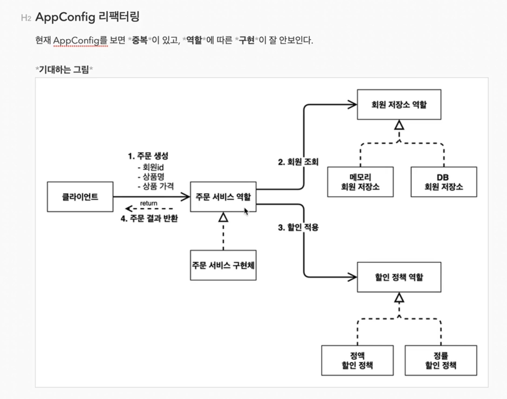
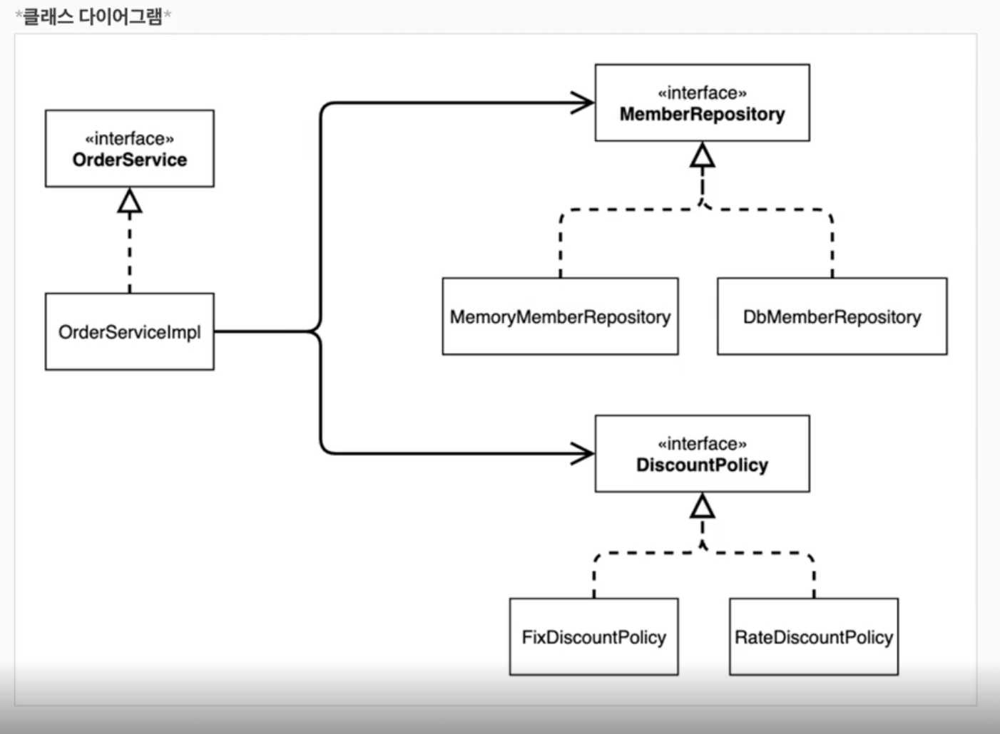
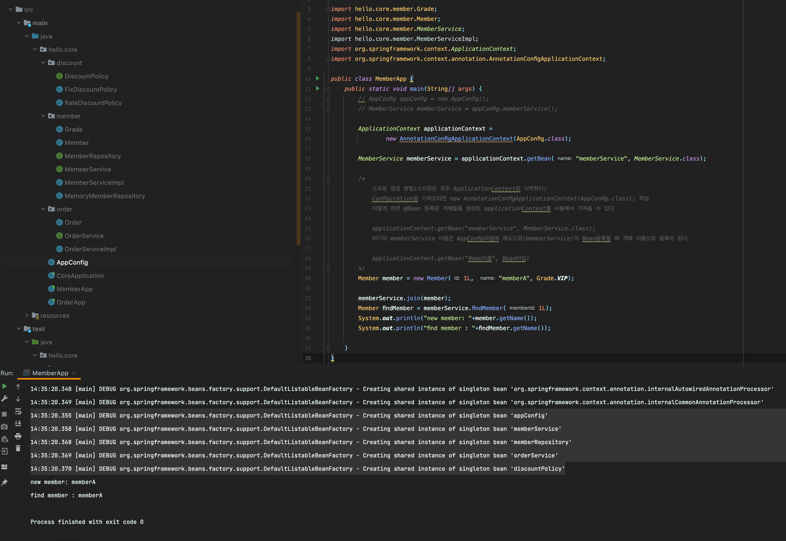
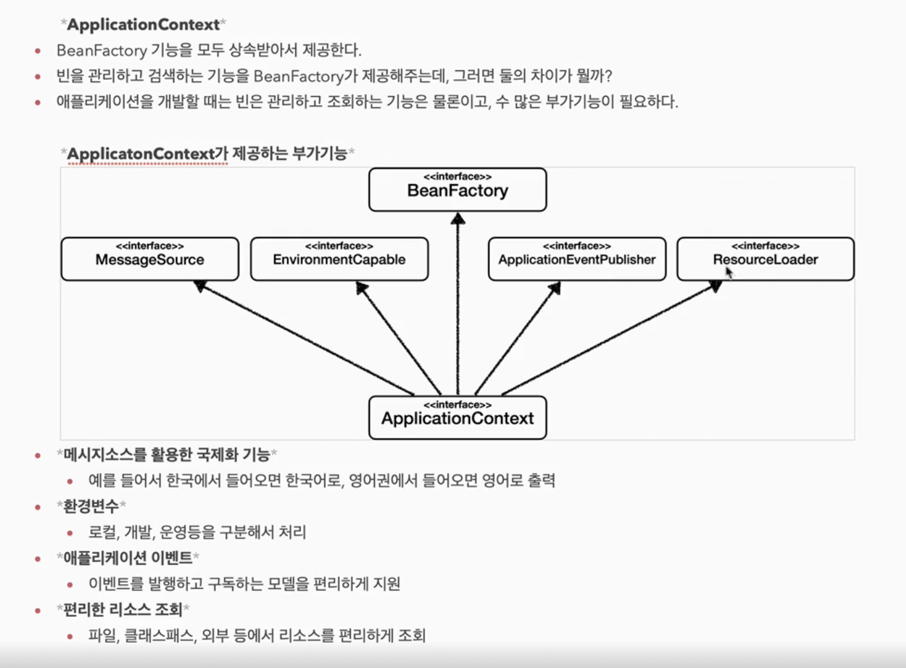
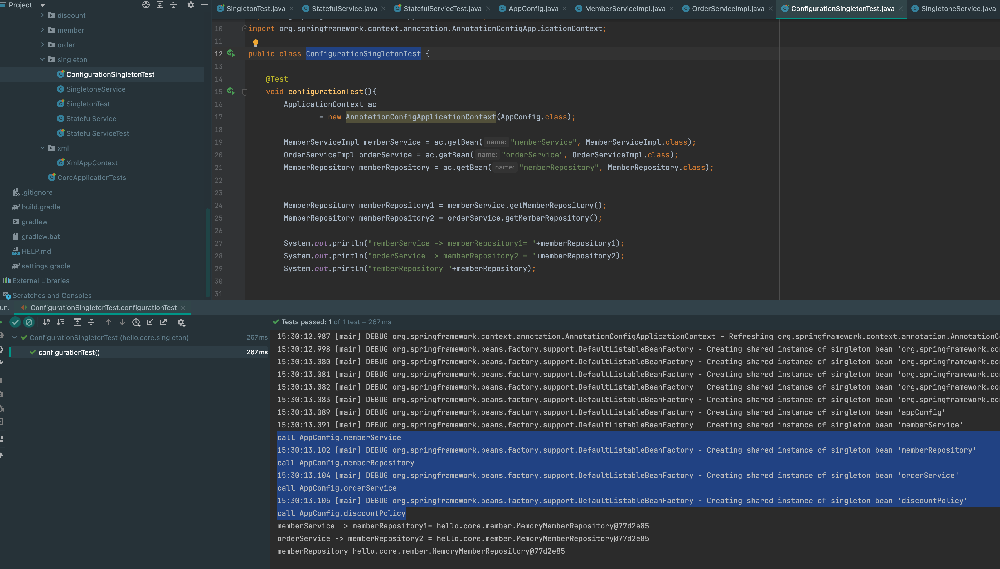
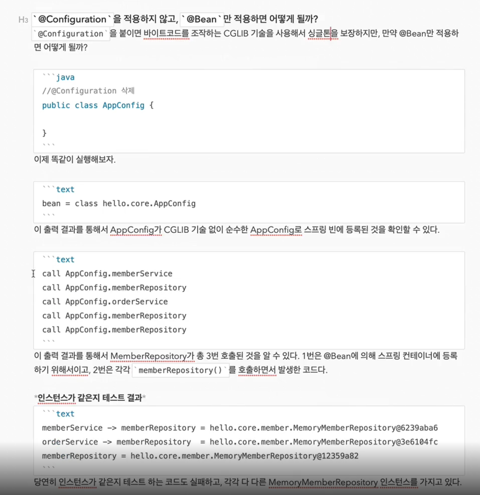

 
##  스프링 핵심 원리 - 기본편 #1(객체지향설계, 예제만들기, 객체지향 원리적용)

[기초부터 탄탄하게 연휴 스프링 복습 프로젝트]

### 1장. 객체 지향 설계와 스프링

#### 1-1장. 좋은 객체 지향 프로그래밍이란?

객체지향의 특징(추상화, 캡슐화, 상속, 다형성)

이중에서 가장 중요한 것은 <b style="color:mediumspringgreen">다형성(Polymorphism)</b>이다

객체지향 프로그래밍은 유연하고 변경이 용이하여 대규모 소프트웨어 개발에 많이 사용된다

<b style="color:lightgreen">유연하고 변경이 용이하다?</b>
 - 레고 블록 조립하듯이
 - 키보드, 마우스 갈아끼우듯이
 - 컴퓨터 부품 갈아 끼우듯이
 - 컴포넌트를 쉽고 유연하게 변경하면서 개발할 수 있는 방법

[핵심] 다형성의 실세계 비유 방법 : <b style="color:mediumspringgreen">역할</b>과 <b style="color:mediumspringgreen">구현</b>으로 세상을 구분


역할 : 운전자 역할 / 자동차 역할

구현 : K3 / 아반떼 / 테슬라 모델3

[요약] <b style="color:dodgerblue">운전자는 K3, 아반떼, 테슬라 모델3 차종에 상관없이 어떤 차든 운전을 할 수 있다</b>

어떻게 그렇게 할 수 있는가? 

사람은 자동차 운전을 하는 방법만 알면 되는거지 자동차 내부적으로 어떻게 동작하는지 알 필요가 없다

<b style="color:aquamarine">즉, K3든 아반떼든 테슬라 모델 3든 자동차 역할의 인터페이스에 따라서 구현이 되었고 운전자는 자동차 인터페이스만 알고있으면 운전이 가능하다.</b>

운전자는 K3 -> 테슬라 모델 3로 변경해도 새로운 운전자로 대체하는게 아니라 그대로 운전자가 변하지 않고 운전가능

<b style="color:aquamarine">[핵심] 새로운 자동차가 나와도 클라이언트를 바꿀필요가 없다</b>

<br>


로미오와 줄리엣을 보면 역할과 구현을 나누었다

역할 : 로미오 대본 / 줄리엣 대본

구현 : 장동건 / 원빈 / 김태희 / 송혜교

<b style="color:aquamarine">사실 구현은 장동건, 원빈이 아니라 무명배우가 될 수도 있다. 갑자기 모두 아프면 무명배우가 해야하는데 로미오 역할이 무명배우로 바뀐다고 해서 줄리엣이 변경될 필요는 없다.</b>

<br>

<b style="color:cornflowerblue">키보드를 기계식 키보드를 쓰다가 리얼포스 무접점으로 변경해도 그대로 사용할 수 것을 다형성이라 한다</b>


* 클라이언트는 구현 대상의 내부구조를 몰라도 된다(인터페이스만 알면 된다)
  
* 클라이언트는 구현 대상 자체를 변경해도 영향을 받지 않는다(갑자기 전기차로 바껴도 운전자가 기존대로 운전 가능)


<b style="color:lightgreen">역할 = 인터페이스 / 구현 = 인터페이스를 구현한 클래스, 객체</b>


<b style="color:aquamarine">[핵심] 객체 설계시 역할(인터페이스)을 먼저 부여하고, 그 역할을 수행하는 구현 객체 만들기</b>

객체의 협력이라는 관계 부터 생각

혼자 있는 객체는 없다.

클라이언트 : 요청, 서버 : 응답

수 많은 객체 클라이언트와 객체 서버는 서로 협력 관계를 가진다


<b style="color:aquamarine">[핵심] 클라이언트(파란색)은 MemoryDB(빨간색)이든 JdbcDB(초록색)이든 유연하게 변경해서 사용할 수 있으며 여기서 변경이 될 때 클라이언트에서는 변경을 해줄 필요가 없다는것이 중요하다</b>


인터페이스를 안정적으로 잘 설계하는게 정말 중요하다


만약 인터페이스가 변경이 되면, 클라이언트 뿐 아니라 구현체도 모두 변경이 되기 때문에 인터페이스는 안정적으로 잘 설계 해야한다

<b style="color:aquamarine">1. 객체 지향에서 가장 중요한 것은 다형성</b>


<b style="color:aquamarine">2. 스프링은 다형성을 극대화 해서 이용할 수 있게 도와준다</b>


<b style="color:aquamarine">3. 스프링 IOC, DI등은 다형성을 활용해서 역할과 구현을 편리하게 다룰 수 있도록 지원 하는 기능</b>


<b style="color:aquamarine">4. 스프링을 사용하면 마치 레고 블록 조립하듯이, 공연 무대의 배우를 선택하듯이, 구현을 편리하게 변경 가능</b>

<br>

#### 1-2장. 좋은 객체 지향 설계의 5가지 원칙(SOLID)


1. SRP(단일책임원칙)
    : 한 클래스는 하나의 책임만 가져야 한다
> 하나의 책임이라는 것은 모호하다.
>
> UI를 하나 변경하는데 SQL코드, 어플리케이션 모두 변경이 필요하면 잘못설계한 경우

<b style="color:aquamarine">단일 JSP 파일안에 뷰, 비즈니스로직, 쿼리 모두 들어가 있는 경우는 SRP 원칙에 위배된다고 볼 수 있다</b>

범위를 잘 적정하게 조절하는게 객체지향의 묘미

<br>

2. OCP(개발폐쇄원칙)
    : 소프트웨어 요소는 확장에는 열려 있으나 변경에는 닫혀 있어야 한다
> 다형성을 생각해보자
>
> 자동차가 K3에서 테슬라로 변경되어도 운전자의 역할이 변경되지 않는다
>
> 이게 바로 개방폐쇄 원칙이라고 한다

<b style="color:aquamarine">다형성을 이용하면 확장에는 열려 있으나 변경에는 닫혀 있게 할 수 있다</b>

하지만 현재 단계에서는 MemoryDB 에서 JdbcDB로 변경할 때 MemberService를 변경하게 되는데 이 부분은 OCP가 지켜지지 않지만 추후에 스프링을 통해서 MemberService에 코드 변경 없이 OCP를 지킬수 있도록 변경 할 계획

<b style="color:aquamarine">(OCP + 다형성)을 해결하기 위한 방법 : 객체를 생성하고, 연관관계를 맺어주는 별도의 조립, 설정자가 필요하다(스프링)</b>

3. LSP(리스코프 치환 원칙)
    : 프로그램의 정확성을 깨뜨리지 않으면서 하위 타입의 인스턴스로 바꿀수 있어야 한다

> 단순히 컴파일에 성공하는 것이 아니라 해당 역할을 충실히 수행하여야 한다
>
> 자동차 구현체가 악셀을 구현 할때 앞으로(Speed + 10) 가는게 아니라 뒤로가게 만들어도(Speed - 10) 컴파일은 정상적으로 되지만 이 기능은 우리가 원래 구현하려고 했던 기능에 위반

<b style="color:aquamarine">자동차 앞으로 가능 구현하라고 했더니 뒤로가게 만들면 LSP 위반</b>

4. ISP(인터페이스 분리 원칙)
    : 특정 클라이언트를 위한 인터페이스 여러 개가 범용 인터페이스 하나보다 낫다

> 자동차 인터페이스 > 운전 인터페이스, 정비 인터페이스로 분리
> 
> 사용자 클라이언트 > 운전자 클라이언트, 정비사 클라이언트로 분리
> 
> 분리하면 정비 인터페이스 자체가 변해도 운전자 클라이언트에 영향을 주지 않음

<b style="color:aquamarine">인터페이스를 하나에 다 넣어서 구분하지 않을경우<br>(자동차 정비만 하면 되는데 운전 쪽과 다른쪽에도 모두 수정해야 하며 기능이 너무 많으면 복잡하니 구분이 필요하다)</b>

스프링 프레임워크는 정말 철저하게 인터페이스들이 분리되어 있다

5. DIP(의존관계 역전 원칙)
    : 프로그래머는 "추상화에 의존해야지, 구체화에 의존하면 안된다"

> 클라이언트 코드가 구현클래스를 바라보는게 아니라 인터페이스만 바라봐라
>
> MemberService는 repository 인터페이스만 보면 되지 JDBC, Memory 구현체에 어떤게 있는지 알 필요가 없다

<b style="color:aquamarine">역할(ROLE)에 의존하게 해야 하지 구현에 의존하면 안된다</b>

연글할 때도 역할에 의존해야지 배역에 의존하게 되면 상대 배역이 다른사람으로 대체하면 연극은 망할거다

[MemberService 클라이언트가 구현 클래스를 직접 선택]

> MemberRepository m = new MemoryMemberRepository();

위 부분은 <b style="color:deeppink">DIP 위반</b>이다

그렇다고 위에 new MemoryMemberRepository()를 안하게 되면 null exception 발생..

이러한 문제점을 해결하기 위해 고안된게 스프링 프레임워크 이다

#### 1-3장. 객체 지향 설계와 스프링

스프링은 다음 기술로 다형성 + OCP, DIP를 가능하게 지원

 - DI : 의존관계 주입, 의존성 주입
  
 - DI 컨테이너 제공

<b style="color:aquamarine">클라이언트 코드의 변경 없이 기능 확장</b>


### 2장. 스프링 핵심 원리 이해 - 예제 만들기
#### 2-1장. 프로젝트 생성

이번시간에는 순수한 JAVA만 이용하지만 프로젝트 생성의 편의성을 위해서 start.spring.io에서 프로젝트 생성


단순하게 프로젝트 생성 후 IDE(인텔리제이) 오픈

#### 2-2장. 비즈니스 요구사항과 설계


#### 2-3장. 회원 도메인 설계


#### 2-4장. 회원 도메인 개발

src/hello/core 아래에 member Package 생성 후 grade.enum 생성

```java
package hello.core.member;

public enum Grade {
    BASIC,
    VIP
}
```

같은 경로에 Member.class 만들기

```java
package hello.core.member;

public class Member {
    private Long id;
    private String name;
    private Grade grade;

    public Member(Long id, String name, Grade grade) {
        this.id = id;
        this.name = name;
        this.grade = grade;
    }

    public Long getId() {
        return id;
    }

    public void setId(Long id) {
        this.id = id;
    }

    public String getName() {
        return name;
    }

    public void setName(String name) {
        this.name = name;
    }

    public Grade getGrade() {
        return grade;
    }

    public void setGrade(Grade grade) {
        this.grade = grade;
    }
}
```

같은 경로에 MemberRepository interface 만들기

```java
package hello.core.member;

public interface MemberRepository {

    void save(Member member);

    Member findById(Long memberId);
}
```

같은 경로에 MemoryMemberRepository 클래스 만들기

```java
package hello.core.member;

import java.util.HashMap;
import java.util.Map;

public class MemoryMemberRepository implements MemberRepository{

    private static Map<Long, Member> store = new HashMap<>();

    @Override
    public void save(Member member) {
        store.put(member.getId(), member);
    }

    @Override
    public Member findById(Long memberId) {
        return store.get(memberId);
    }
}
```

같은 경로에 MemberService 인터페이스 만들기

```java
package hello.core.member;

public interface MemberService {

    void join(Member member);

    Member findMember(Long memberId);
}
```

같은 경로에 MemberServiceImpl 클래스 만들기

```java
package hello.core.member;

public class MemberServiceImpl implements MemberService{

    private MemberRepository memberRepository = new MemoryMemberRepository();

    @Override
    public void join(Member member) {
        memberRepository.save(member);
    }

    @Override
    public Member findMember(Long memberId) {
        return memberRepository.findById(memberId);
    }
}
```

#### 2-5장. 회원 도메인 실행과 테스트

hello.core 패키지 바로 아래에 MemberApp 클래스 파일을 만든다(테스트용)

```java
package hello.core;

import hello.core.member.Grade;
import hello.core.member.Member;
import hello.core.member.MemberService;
import hello.core.member.MemberServiceImpl;

public class MemberApp {
    public static void main(String[] args) {
        MemberService memberService = new MemberServiceImpl();
        Member member = new Member(1L, "memberA", Grade.VIP);

        memberService.join(member);
        Member findMember = memberService.findMember(1L);
        System.out.println("new member: "+member.getName());
        System.out.println("find member : "+findMember.getName());

    }

}
```

test > java > hello.core 패키지 아래에 member 패키지 만들고 MemberServiceTest 클래스 만들기

```java
package hello.core.member;

import org.assertj.core.api.Assertions;
import org.junit.jupiter.api.Test;

public class MemberServiceTest {

    MemberService memberService = new MemberServiceImpl();

    @Test
    void join(){
        //given
        Member member = new Member(1L, "MemberA", Grade.VIP);

        //when
        memberService.join(member);
        Member findMember = memberService.findMember(1L);

        //then
        Assertions.assertThat(member).isEqualTo(findMember);
    }
}
```

#### 2-6장. 주문과 할인 도메인 설계

<b style="color:cornflowerblue">이제부터 조금 복잡하지만 천천히 반복해보자</b>


<b style="color:aquamarine">[핵심] 먼저 역할을 구분하여 구현체는 아무거나 와도 사용할 수 있게끔 설계를 하였다</b>


#### 2-7장. 주문과 할인 도메인 개발

main > java > hello.core 패키지 아래에 discount라는 새로운 패키지 만들고 DiscountPolicy 인터페이스 만들기

```java
package hello.core.discount;

import hello.core.member.Member;

public interface DiscountPolicy {
    /**
     * @return 할인 대상 금액
     */
    int discount(Member member, int price);
}
```

동일 경로에 FixDiscountPolicy 클래스(구현체) 파일 만들기

```java
package hello.core.discount;

import hello.core.member.Grade;
import hello.core.member.Member;

public class FixDiscountPolicy implements DiscountPolicy{

    private int discountFixPrice = 1000; // 1000원 할인

    @Override
    public int discount(Member member, int price) {
        if(member.getGrade() == Grade.VIP){
            return discountFixPrice;
        }else{
            return 0;
        }
    }
}
```
main > java > hello.core 패키지 아래에 order라는 새로운 패키지 만들고 Order 클래스 만들기

```java
package hello.core.order;

public class Order {
    private Long memberId;
    private String itemName;
    private int itemPrice;
    private int discountPrice;

    //비즈니스 로직 추가
    public int calculatePrice(){
        return itemPrice - discountPrice;
    }

    @Override
    public String toString() {
        return "Order{" +
                "memberId=" + memberId +
                ", itemName='" + itemName + '\'' +
                ", itemPrice=" + itemPrice +
                ", discountPrice=" + discountPrice +
                '}';
    }

    public Order(Long memberId, String itemName, int itemPrice, int discountPrice) {
        this.memberId = memberId;
        this.itemName = itemName;
        this.itemPrice = itemPrice;
        this.discountPrice = discountPrice;
    }

    public Long getMemberId() {
        return memberId;
    }

    public void setMemberId(Long memberId) {
        this.memberId = memberId;
    }

    public String getItemName() {
        return itemName;
    }

    public void setItemName(String itemName) {
        this.itemName = itemName;
    }

    public int getItemPrice() {
        return itemPrice;
    }

    public void setItemPrice(int itemPrice) {
        this.itemPrice = itemPrice;
    }

    public int getDiscountPrice() {
        return discountPrice;
    }

    public void setDiscountPrice(int discountPrice) {
        this.discountPrice = discountPrice;
    }
}
```

동일 경로에 OrderService 인터페이스 클래스 만들기

```java
package hello.core.order;

public interface OrderService {

    Order createOrder(Long memberId, String itemName, int itemPrice);
}
```

동일 경로에 OrderServiceImpl 클래스 만들기

```java
package hello.core.order;

import hello.core.discount.DiscountPolicy;
import hello.core.discount.FixDiscountPolicy;
import hello.core.member.Member;
import hello.core.member.MemberRepository;
import hello.core.member.MemoryMemberRepository;

public class OrderServiceImpl implements OrderService{

    private final MemberRepository memberRepository = new MemoryMemberRepository();
    private final DiscountPolicy discountPolicy = new FixDiscountPolicy();

    @Override
    public Order createOrder(Long memberId, String itemName, int itemPrice) {
        Member member = memberRepository.findById(memberId);
        int discountPrice = discountPolicy.discount(member, itemPrice);

        return new Order(memberId, itemName, itemPrice, discountPrice);
    }
}
```


<b style="color:aquamarine">위 경우 설계가 아주 잘 되어 있음

1. OrderService 입장에서는 할인에 대해서 몰라도 된다.
2. DiscountPolicy 쪽에서 할인에 대해서 수행하고 결과만 OrderService쪽으로 넘겨준다
3. 이 경우 할인에 수정이 필요할 경우 DiscountPolicy쪽만 수정하면 되고 OrderService는 건드리지 않는다

</b>

단일 책임 원칙을 잘 지킨 경우이며, 이렇지 않으면 할인을 수정하는 경우 OrderService도 수정해주어야 한다

#### 2-8장. 주문과 할인 도메인 실행과 테스트

main > hello.core에 OrderApp 클래스 파일 생성

```java
package hello.core;

import hello.core.member.Grade;
import hello.core.member.Member;
import hello.core.member.MemberService;
import hello.core.member.MemberServiceImpl;
import hello.core.order.Order;
import hello.core.order.OrderService;
import hello.core.order.OrderServiceImpl;

public class OrderApp {
    public static void main(String[] args) {

        MemberService memberService = new MemberServiceImpl();
        OrderService orderService = new OrderServiceImpl();

        Long memberId = 1L;
        Member member = new Member(memberId, "memberA", Grade.VIP);
        memberService.join(member);

        Order order = orderService.createOrder(memberId, "itemA", 10000);

        System.out.println("Order = "+order);
        System.out.println("Order.calculate() = "+order.calculatePrice());
    }
}
```

test > hello.core에 order 패키지를 만들고 OrderServiceTest 클래스 만들기

```java
package hello.core.order;

import hello.core.member.Grade;
import hello.core.member.Member;
import hello.core.member.MemberService;
import hello.core.member.MemberServiceImpl;
import org.assertj.core.api.Assertions;
import org.junit.jupiter.api.Test;

public class OrderServiceTest {

    MemberService memberService = new MemberServiceImpl();
    OrderService orderService = new OrderServiceImpl();

    @Test
    void createOrder(){
        Long memberId = 1L;
        //primitive에는 null이 들어가지 않기 때문에 wrapper 클래스를 사용

        Member member = new Member(memberId, "memberA", Grade.VIP);
        memberService.join(member);

        Order order = orderService.createOrder(memberId, "itemA", 10000);
        Assertions.assertThat(order.getDiscountPrice()).isEqualTo(1000);
        Assertions.assertThat(order.calculatePrice()).isEqualTo(9000);
    }
}
```


<b style="color:aquamarine">프로젝트 구조</b>


<br>
<br>

### 3장. 스프링 핵심 원리 이해 - 객체 지향 원리 적용
#### 3-1장. 새로운 할인 정책 개발

<b style="color:lightgreen">기존에 만들었던 정액 할인(FixDiscountPolicy)에서 기획자가 정률 할인(RateDiscountPolicy)로 정책 변경</b>


<b style="color:deeppink">VIP 회원일 경우 금액의 10% 할인 제공</b>

discount 패키지에 RateDiscountPolicy 클래스 파일 생성

```java
package hello.core.discount;

import hello.core.member.Grade;
import hello.core.member.Member;

public class RateDiscountPolicy implements DiscountPolicy{

    private final int discountRate = 10;
    @Override
    public int discount(Member member, int price) {
        if(member.getGrade() == Grade.VIP){
            return price * discountRate / 100;
        }else{
            return 0;
        }
    }
}
```

<b style="color:lightgreen">[핵심 단축키] 메소드 클릭 후 테스트 코드 만들기 : Command+Shift+t</b>

메소드 명 마우스 클릭 후 Command + Shift + t 누르면 자동으로 테스트 코드 생성 가능(엄청 편리함)

test > hello.core.discount 패키지에 RateDiscountPolicyTest 클래스 파일 생성

```java
package hello.core.discount;

import hello.core.member.Grade;
import hello.core.member.Member;
import org.assertj.core.api.Assertions;
import org.junit.jupiter.api.DisplayName;
import org.junit.jupiter.api.Test;

import static org.junit.jupiter.api.Assertions.*;

class RateDiscountPolicyTest {

    DiscountPolicy discountPolicy = new RateDiscountPolicy();

    @Test
    @DisplayName("VIP는 20% 할인이 적용되어야 한다")
    public void discount_테스트(){
        //given
        Member member
                 = new Member(1L, "memberVIP", Grade.VIP);
        //when
        int discount = discountPolicy.discount(member, 10000);
        //then
        Assertions.assertThat(discount).isEqualTo(1000);
    }

    @Test
    @DisplayName("VIP가 아니라면 할인이 적용되지 않아야 한다")
    public void discount_no_테스트(){
        //given
        Member member
                = new Member(2L, "memberBASIC", Grade.BASIC);
        //when
        int discount = discountPolicy.discount(member, 10000);
        //then
        Assertions.assertThat(discount).isEqualTo(0);
    }
}
```

<b style="color:cornflowerblue">이렇게 하면 테스트가 정상적으로 돌아가는것을 확인 할 수 있다
<br>
(설계가 잘 되어 있어 할인 테스트만 할때 다른 부분 건드리지 않고 독립적으로 가능)</b>

테스트 주의사항 : 되는것 뿐만 아니라 실패하는 부분도 꼭 같이 테스트를 해야한다(특히 금액관련은 중요함)

<br>

#### 3-2장. 새로운 할인 정책 적용과 문제점

이번에는 OrderServiceImpl 클래스 파일을 아래와 같이 변경

```java
    // private final DiscountPolicy discountPolicy = new FixDiscountPolicy();
    private fianl DiscountPolicy discountPolicy = new RateDiscountPolicy();
```

이렇게 해도 훌륭하지만 문제점을 발견(변경이 될 때 OrderServiceImpl도 변경이 필요함) 

<b style="color:mediumspringgreen">DIP / OCP 위반</b>

<b style="color:cornflowerblue">위 경우는 예로 내가 운전면허증을 가지고 있고 자동차를 K3 타다가 테슬라로 변경을 하였는데, 기존 라이센스로는 안되고 새로운 라이센스를 발급받아야 하는 상황(그렇기 때문에 잘못되었음. 운전면허증만 있으면 K3, 테슬라 모두 탈수 있어야지)</b>


그럼 위반하지 않도록 아래처럼 클래스를 수정해보자(OrderServiceImpl 클래스)

```java
package hello.core.order;

import hello.core.discount.DiscountPolicy;
import hello.core.discount.FixDiscountPolicy;
import hello.core.discount.RateDiscountPolicy;
import hello.core.member.Member;
import hello.core.member.MemberRepository;
import hello.core.member.MemoryMemberRepository;

public class OrderServiceImpl implements OrderService{

    private final MemberRepository memberRepository = new MemoryMemberRepository();

    /* 이렇게 하면 DIP, OCP 위반이기 때문에 아래와 같이 코드를 수정*/
    // private final DiscountPolicy discountPolicy = new FixDiscountPolicy();
    // private final DiscountPolicy discountPolicy = new RateDiscountPolicy();

    private DiscountPolicy discountPolicy; //이 부분 수정

    @Override
    public Order createOrder(Long memberId, String itemName, int itemPrice) {
        Member member = memberRepository.findById(memberId);
        int discountPrice = discountPolicy.discount(member, itemPrice);

        return new Order(memberId, itemName, itemPrice, discountPrice);
    }
}
```

근데 이렇게만 실행하면 NullpointerException 발생

<b style="color:aquamarine">이 문제를 해결하려면 누군가 클라이언트인 OrderServiceImpl에 DiscountPolicy의 구현객체를 넣어주어야 한다</b>

<br>

#### 3-3장. 관심사의 분리


디카프리오가 로미오 역할을 수행하는데 줄리엣 역할로 내가 원하는 사람을 배역으로 지정하지 않는다.

<b style="color:aquamarine">보통 공연기획자가 로미오는 디카프리오, 줄리엣은 케이트윈슬렛 배역을 지정(개발도 마찬가지)</b>

위 경우는 디카프리오가 줄리엣 역할을 직접 지정하는 경우였는데, 잘못되었음

<b style="color:cornflowerblue">관심사를 분리하자(공연 기획자를 만들고, 배우와 공연 기획자의 책임을 확실히 분리하자)</b>

hello.core 패키지 아래에 AppConfig 클래스 파일 생성

```java
package hello.core;

import hello.core.member.MemberService;
import hello.core.member.MemberServiceImpl;
import hello.core.member.MemoryMemberRepository;

public class AppConfig {
    /* 애플리케이션 환경 설정은 모두 여기서 한다(MemberServiceImpl / OrderServiceImpl) */
    
    // 1. MemberService에 주입하려는 구현체를 여기서 먼저 작성
    public MemberService memberService(){ 
        
        //4. 여기서 객체를 생성하면서 MemoryMemberRepository()를 주입
        return new MemberServiceImpl(new MemoryMemberRepository()); 
    }
}
```

기존에 만들었던 MemberServiceImpl 클래스 파일 수정
```java
package hello.core.member;

public class MemberServiceImpl implements MemberService{

    // 2. 기존에 ServiceImpl에서 구현체에 의존했던것을 주석처리
    // private MemberRepository memberRepository = new MemoryMemberRepository();
    private final MemberRepository memberRepository;

    // 3. 여기서 MemberServiceImpl 생성자를 만들어서 객체 생성시 의존성 주입받도록 만들기 
    public MemberServiceImpl(MemberRepository memberRepository) {
        this.memberRepository = memberRepository;
    }

    @Override
    public void join(Member member) {
        memberRepository.save(member);
    }

    @Override
    public Member findMember(Long memberId) {
        return memberRepository.findById(memberId);
    }
}
```

<b style="color:aquamarine">
여기서 MemberServiceImpl에 보면 MemoryMemberRepository에 대한 내용이 없음
</b>

인터페이스인 MemberRepository에만 100% 의존하면서(추상화에만 의존), OCP/DIP 원칙을 잘 지키고 있음


<b style="color:deeppink">이 방식을 '생성자를 통해서 의존성을 주입한다(생성자 주입)'라고 한다</b>

아래 OrderServiceImpl 클래스 파일 에도 똑같이 반영해주자

```java
package hello.core.order;

import hello.core.discount.DiscountPolicy;
import hello.core.discount.FixDiscountPolicy;
import hello.core.discount.RateDiscountPolicy;
import hello.core.member.Member;
import hello.core.member.MemberRepository;
import hello.core.member.MemoryMemberRepository;

public class OrderServiceImpl implements OrderService{


    /* 이렇게 하면 DIP, OCP 위반이기 때문에 아래와 같이 코드를 수정*/
    // private final MemberRepository memberRepository = new MemoryMemberRepository();
    
    // private final DiscountPolicy discountPolicy = new FixDiscountPolicy();
    // private final DiscountPolicy discountPolicy = new RateDiscountPolicy();
    /* ======================================================================== */
    
    private final MemberRepository memberRepository;
    private final DiscountPolicy discountPolicy;

    public OrderServiceImpl(MemberRepository memberRepository, DiscountPolicy discountPolicy) {
        this.memberRepository = memberRepository;
        this.discountPolicy = discountPolicy;
    }

    @Override
    public Order createOrder(Long memberId, String itemName, int itemPrice) {
        Member member = memberRepository.findById(memberId);
        int discountPrice = discountPolicy.discount(member, itemPrice);

        return new Order(memberId, itemName, itemPrice, discountPrice);
    }
}
```

AppConfig 클래스 파일도 아래와 같이 수정

```java
package hello.core;

import hello.core.discount.FixDiscountPolicy;
import hello.core.member.MemberService;
import hello.core.member.MemberServiceImpl;
import hello.core.member.MemoryMemberRepository;
import hello.core.order.OrderService;
import hello.core.order.OrderServiceImpl;

public class AppConfig {
    /* 애플리케이션 환경 설정은 모두 여기서 한다(MemberServiceImpl / OrderServiceImpl) */

    // 1. MemberService에 주입하려는 구현체를 여기서 먼저 작성
    public MemberService memberService(){

        //4. 여기서 객체를 생성하면서 MemoryMemberRepository()를 주입
        return new MemberServiceImpl(new MemoryMemberRepository());
    }

    public OrderService orderService(){
        return new OrderServiceImpl(
            new MemoryMemberRepository(), 
            new FixDiscountPolicy()
        );
    }
}
```

이렇게 하면 OrderServiceImpl의 경우에도 완전히 추상화에만 의존하고 있지 구체화에 의존하고 있지 않음

<b style="color:aquamarine">DIP / OCP를 철저하게 준수(OrderServiceImpl 코드만 봐서는 FixDiscount가 올지, RateDiscount가 올지 모름)</b>

<b style="color:mediumspringgreen">TIP : 파이널로 되어 있으면 기본으로 할당하거나 생성자로 할당이 되어야 한다</b>

<b style="color:lightgreen">[핵심 단축키] 클래스 목록 선택 : Command + e </b>


<b style="color:aquamarine">생성자 주입(Injection) : 반복하는 이유는 그만큼 중요하기 때문</b>


<b style="color:aquamarine">
memberServiceImpl입장에서는 의존 관계를 마치 외부에서 주입해주는 것 같다(의존관계 주입)
</b>

DI(Dependency Injection) : 의존관계 주입

OrderServiceImpl, MemberServiceImpl은 이제 본연의 역할에만 충실히 하면 된다

[THINK] : OrderServiceImpl에서 Member 값을 찾아와야 할 때 MemberService를 사용하는게 아니라 MemberRepository를 사용하고 있음

<b style="color:aquamarine">Service에서 다른 Service를 의존하는게 아니라 다른 Repository를 의존하도록 구현</b>

이제 테스트를 하려면 MemberApp 클래스 파일을 수정하자

[기존 방식]
```java
public class MemberApp {
    public static void main(String[] args) {
        MemberService memberService = new MemberServiceImpl();
        Member member = new Member(1L, "memberA", Grade.VIP);

        memberService.join(member);
        Member findMember = memberService.findMember(1L);
        System.out.println("new member: "+member.getName());
        System.out.println("find member : "+findMember.getName());

    }
}
```

[새로운 방식]
```java
public class MemberApp {
    public static void main(String[] args) {
        AppConfig appConfig = new AppConfig();
        
        // MemberService memberService = new MemberServiceImpl();
        MemberService memberService = appConfig.memberService();
        
        Member member = new Member(1L, "memberA", Grade.VIP);

        memberService.join(member);
        Member findMember = memberService.findMember(1L);
        System.out.println("new member: "+member.getName());
        System.out.println("find member : "+findMember.getName());

    }
}
```

기존에 만들었던 OrderApp 클래스 파일도 수정해주자

[기존 방식]
```java
public class OrderApp {
    public static void main(String[] args) {

        MemberService memberService = new MemberServiceImpl();
        OrderService orderService = new OrderServiceImpl();

        Long memberId = 1L;
        Member member = new Member(memberId, "memberA", Grade.VIP);
        memberService.join(member);

        Order order = orderService.createOrder(memberId, "itemA", 10000);

        System.out.println("Order = "+order);
        System.out.println("Order.calculate() = "+order.calculatePrice());
    }
}
```

[새로운 방식]
```java
public class OrderApp {
    public static void main(String[] args) {
        AppConfig appConfig = new AppConfig();
        MemberService memberService = appConfig.memberService();
        OrderService orderService = appConfig.orderService();

        Long memberId = 1L;
        Member member = new Member(memberId, "memberA", Grade.VIP);
        memberService.join(member);

        Order order = orderService.createOrder(memberId, "itemA", 10000);

        System.out.println("Order = "+order);
        System.out.println("Order.calculate() = "+order.calculatePrice());
    }
}
```

테스트 코드도 수정이 필요함

MemberServiceTest 클래스 파일 수정

[기존 방식]
```java
public class MemberServiceTest {

    MemberService memberService = new MemberServiceImpl();

    @Test
    void join(){
        //given
        Member member = new Member(1L, "MemberA", Grade.VIP);

        //when
        memberService.join(member);
        Member findMember = memberService.findMember(1L);

        //then
        Assertions.assertThat(member).isEqualTo(findMember);
    }
}
```

[새로운 방식]
```java
public class MemberServiceTest {

    MemberService memberService;

    @BeforeEach //테스트 실행 전에 돌아가도록 하는 어노테이션
    public void beforeEach(){
        AppConfig appConfig = new AppConfig();
        memberService = appConfig.memberService();
    }

    @Test
    void join(){
        //given
        Member member = new Member(1L, "MemberA", Grade.VIP);

        //when
        memberService.join(member);
        Member findMember = memberService.findMember(1L);

        //then
        Assertions.assertThat(member).isEqualTo(findMember);
    }
}
```

OrderServiceTest 클래스 파일도 같이 수정

[기존 방식]
```java
public class OrderServiceTest {

    MemberService memberService = new MemberServiceImpl();
    OrderService orderService = new OrderServiceImpl();

    @Test
    void createOrder(){
        Long memberId = 1L;
        //primitive에는 null이 들어가지 않기 때문에 wrapper 클래스를 사용

        Member member = new Member(memberId, "memberA", Grade.VIP);
        memberService.join(member);

        Order order = orderService.createOrder(memberId, "itemA", 10000);
        Assertions.assertThat(order.getDiscountPrice()).isEqualTo(2000);
        Assertions.assertThat(order.calculatePrice()).isEqualTo(8000);
    }
}
```

[새로운 방식]
```java
public class OrderServiceTest {

    MemberService memberService;
    OrderService orderService;
    
    @BeforeEach
    public void beforeEach(){
        AppConfig appConfig = new AppConfig();
        memberService = appConfig.memberService();
        orderService = appConfig.orderService();
    }

    @Test
    void createOrder(){
        Long memberId = 1L;
        //primitive에는 null이 들어가지 않기 때문에 wrapper 클래스를 사용

        Member member = new Member(memberId, "memberA", Grade.VIP);
        memberService.join(member);

        Order order = orderService.createOrder(memberId, "itemA", 10000);
        Assertions.assertThat(order.getDiscountPrice()).isEqualTo(2000);
        Assertions.assertThat(order.calculatePrice()).isEqualTo(8000);
    }
}
```
<b style="color:aquamarine">
이번장에서 AppConfig를 통해서 관심사를 완벽하게 분리했다

배역, 배우를 생각해보자(AppConfig는 공연 기획자다)

AppConfig는 구체 클래스를 선택한다. 배역에 맞는 담당 배우를 선택한다

이제 각 배우들은 담당 기능을 실행하는 책임만 지면 된다(상대 배역 선택 X)

</b>

<br>

#### 3-4장. AppConfig 리팩토링


<b style="color:dodgerblue">역할과 구현을 분리해서 한 그림에 보고 싶은데 현재 AppConfig에는 그런게 없다(역할을 드러나게 표현해주는 작업 진행)</b>



[기존 AppConfig 방식]
```java
public class AppConfig {
    /* 애플리케이션 환경 설정은 모두 여기서 한다(MemberServiceImpl / OrderServiceImpl) */

    // 1. MemberService에 주입하려는 구현체를 여기서 먼저 작성
    public MemberService memberService(){

        //4. 여기서 객체를 생성하면서 MemoryMemberRepository()를 주입
        return new MemberServiceImpl(new MemoryMemberRepository());
    }

    public OrderService orderService(){
        return new OrderServiceImpl(
                new MemoryMemberRepository(),
                new FixDiscountPolicy()
        );
    }
}
```
[리펙토링 AppConfig 방식]
```java
public class AppConfig {
    /* 애플리케이션 환경 설정은 모두 여기서 한다(MemberServiceImpl / OrderServiceImpl) */

    public MemberService memberService(){
        return new MemberServiceImpl(memberRepository());
    }

    //memberService가 있고 memberRepository도 추가로 만들어줘서 메소드 호출 형태로 리팩토링
    private MemberRepository memberRepository(){
        return new MemoryMemberRepository();
    }

    public OrderService orderService(){
        return new OrderServiceImpl( memberRepository(), discountPolicy() );
    }

    public DiscountPolicy discountPolicy(){
        return new FixDiscountPolicy();
    }
}
```

이렇게 하면 장점
 1. 만약에 MemoryRepository가 변경이 되면 기존 코드에서는 2번 변경을 해주어야 한다
 2. 하지만 새로운 리팩토링 코드에서는 메소드 호출방식으로 1번만 변경하면 된다(만약 100개였다면 끔찍)
 ```java
    public MemberService memberService(){
        return new MemberServiceImpl(memberRepository());
    }

    public MemberRepository memberRepository(){
        return new MemoryMemberRepository();
    }
    // new MemberServiceImpl(new MemoryMemberRepository())
    // => new MemberServiceImpl(memberRepository())
    // 이렇게 하면 가독성도 더 훌륭해지면서 변경되는 코드의 양도 최소화 가능
 ```
 3. AppConfig를 보면 역할과 구현 클래스가 한눈에 들어온다(애플리케이션 전체 구성을 빠르게 파악 가능)

<br>

#### 3-5장. 새로운 구조와 할인 정책 적용


새로운 정책(정액 > 정률)로 변경 작업 진행

아주 간단하게 변경 가능(단순하게 AppConfig 클래스만 변경해주면 된다 - 사용영역은 그대로 놔두면 된다)

이렇게 될 수 있었던 이유는 <b style="color:lightgreen">사용 영역과 구성 영역이 완전히 분리되었기 때문이다</b>

[기존 AppConfig - FixDiscountPolicy적용]
```java
public class AppConfig {
    ...
    public OrderService orderService(){
        return new OrderServiceImpl( memberRepository(), discountPolicy() );
    }

    public DiscountPolicy discountPolicy(){
        return new FixDiscountPolicy();
    }
}
```


[새로운 AppConfig  - RateDiscountPolicy적용]
```java
public class AppConfig {
    ...
    public OrderService orderService(){
        return new OrderServiceImpl( memberRepository(), discountPolicy() );
    }

    public DiscountPolicy discountPolicy(){
        //return new FixDiscountPolicy();
        return new RateDiscountPolicy();
    }
}
```


<b style="color:cornflowerblue">AppConfig는 공연기획자라고 생각
<br>
이렇게 변경 해주면 DIP, OCP 모두 만족시키면서 클라이언트 코드(xxxServiceImpl)를 변경할 필요가 없다</b>


#### 3-6장. 전체 흐름 정리


<br>

#### 3-7장. 좋은 객체 지향 설계의 5가지 원칙의 적용


<b style="color:aquamarine">
구현 객체를 생성하고 연결하는 책임은 AppConfig가 담당
</b>

(기존에는 클라이언트에서 직접 객체를 생성하고, 연결하고, 실행하는 다양한 책임을 가지고 있었음)


<br>

#### 3-8장. IoC, DI, 그리고 컨테이너

IoC(Inversion Of Control) 제어의 역전

<b style="color:aquamarine">내가 뭔가 호출하는게 아니라 프레임워크가 내 코드를 대신 호출해주는것</b>


<b style="color:cornflowerblue">기존 방식(MemberServiceImpl에서 MemberRepository를 생성하고.. 직접 개발자가 코드를 작성해서 호출)</b>

IoC 방식(반면에 AppConfig가 등장하고 나서는 흐름 자체가 클라이언트쪽이 아니라 AppConfig쪽으로 가져간다)

AppConfig는 OrderServiceImpl이 아닌 다른 구현체를 만들수도 있는데, 클라이언트는 그런상황은 모르고 원래 주어진 책임만 열심히 수행한다


JUnit은 프레임워크이다(Test코드 실행하면 @BeforeEach와 같은 어노테이션을 테스트 프레임워크가 알아서 실행시켜준다)


[중요]
 
1. 정적인 클래스 의존관계(단순하게 클래스를 보고 이게 어떤 클래스와 의존관계가 있는지 판단 가능)
```java
public class OrderServiceImpl implements OrderService{

    private final MemberRepository memberRepository;
    private final DiscountPolicy discountPolicy;

    public OrderServiceImpl(MemberRepository memberRepository, DiscountPolicy discountPolicy) {
        this.memberRepository = memberRepository;
        this.discountPolicy = discountPolicy;
    }
    ...
}
```
 위에 보면 OrderServiceImpl은 MemberRepository, DiscountPolicy를 의존하고 있구나 라는것을 알 수 있다
 
 (ex. 클래스 다이어그램)



2. 동적 클래스 관계(객체 다이어그램)


IoC 컨테이너, DI 컨테이너

의존관계 역전을 일으킨다고 해서 AppConfig를 IoC 컨테이너, DI 컨테이너라고도 한다

보통 <b style="color:aquamarine">AppConfig를 의존성 주입을 대신 해주기 때문에 DI 컨테이너라고</b> 한다


스프링이 보통 DI 컨테이너 역할을 수행한다.

<b style="color:mediumspringgreen">[지금까지 순수 자바를 사용하여 프로젝트 구성을 하였고 이제 지금까지 했던 내용을 스프링으로 전환하는 작업 진행]</b>

#### 3-9장. 스프링으로 전환하기

스프링이 얼마나 대단한지 한번 봐보자

AppConfig를 먼저 스프링으로 변경해보자
[기존 Java 방식 - AppConfig]
```java
public class AppConfig {

    public MemberService memberService(){
        return new MemberServiceImpl(memberRepository());
    }

    public MemberRepository memberRepository(){
        return new MemoryMemberRepository();
    }

    public OrderService orderService(){
        return new OrderServiceImpl( memberRepository(), discountPolicy() );
    }

    public DiscountPolicy discountPolicy(){
//        return new FixDiscountPolicy();
        return new RateDiscountPolicy();
    }
}
```

[AppConfig 클래스 파일을 스프링 방식으로 변경]
```java
import org.springframework.context.annotation.Bean;
import org.springframework.context.annotation.Configuration;

@Configuration //스프링에서는 설정정보를 @Configuration 어노테이션 추가해주어야 한다 
public class AppConfig {

    @Bean //@Bean을 추가해주면 이게 모두 스프링 컨테이너라는곳에 자동으로 등록이 된다
    public MemberService memberService(){
        return new MemberServiceImpl(memberRepository());
    }

    @Bean
    public MemberRepository memberRepository(){
        return new MemoryMemberRepository();
    }
    @Bean
    public OrderService orderService(){
        return new OrderServiceImpl( memberRepository(), discountPolicy() );
    }
    @Bean
    public DiscountPolicy discountPolicy(){
//        return new FixDiscountPolicy();
        return new RateDiscountPolicy();
    }
}
```

MemberApp 클래스 파일도 스프링으로 변경해보자

[기존 Java - MemberApp 클래스]

```java
public class MemberApp {
    public static void main(String[] args) {
        AppConfig appConfig = new AppConfig();

//        MemberService memberService = new MemberServiceImpl();
        MemberService memberService = appConfig.memberService();


        Member member = new Member(1L, "memberA", Grade.VIP);

        memberService.join(member);
        Member findMember = memberService.findMember(1L);
        System.out.println("new member: "+member.getName());
        System.out.println("find member : "+findMember.getName());

    }
}
```

[새로운 Spring 방식 - MemberApp 클래스]
```java
import org.springframework.context.ApplicationContext;
import org.springframework.context.annotation.AnnotationConfigApplicationContext;

public class MemberApp {
    public static void main(String[] args) {
        // AppConfig appConfig = new AppConfig();
        // MemberService memberService = appConfig.memberService();

        ApplicationContext applicationContext =
                new AnnotationConfigApplicationContext(AppConfig.class);

        MemberService memberService = 
                applicationContext.getBean("memberService", MemberService.class);


        Member member = new Member(1L, "memberA", Grade.VIP);

        memberService.join(member);
        Member findMember = memberService.findMember(1L);
        System.out.println("new member: "+member.getName());
        System.out.println("find member : "+findMember.getName());

    }
}
```

스프링 생성 방법(스프링은 모두 ApplicationContext로 시작한다)

1. Configuration을 가져오려면 new AnnotationConfigApplicationContext(AppConfig.class) 작성
2. 이렇게 하면 @Bean 등록된 객체들을 생성된 applicationContext를 사용해서 가져올 수 있다
3. applicationContext.getBean("memberService", MemberService.class);
<b style="color:aquamarine"> 
4. Bean 이름은 AppConfig파일에 메소드명(memberService)이 Bean등록될 때 객체 이름으로 자동 등록이 된다</b>
   
```java
    @Bean //@Bean을 추가해주면 이게 모두 스프링 컨테이너라는곳에 자동으로 등록이 된다
    public MemberService memberService(){ //memberService가 bean이름으로 자동 등록
        return new MemberServiceImpl(memberRepository());
    }
```
5. applicationContext.getBean("Bean이름", Bean타입)


이렇게 하고 실행을 해보면 아래처럼 콘솔창에 Bean들이 자동으로 등록되고 테스트 결과도 정상적으로 수행되는 것을 확인 할 수 있다



<br>

OrderApp 클래스 파일도 스프링으로 변경해보자

[기존 Java - OrderApp 클래스]

```java
public class OrderApp {
    public static void main(String[] args) {
        AppConfig appConfig = new AppConfig();
        MemberService memberService = appConfig.memberService();
        OrderService orderService = appConfig.orderService();


        Long memberId = 1L;
        Member member = new Member(memberId, "memberA", Grade.VIP);
        memberService.join(member);

        Order order = orderService.createOrder(memberId, "itemA", 10000);

        System.out.println("Order = "+order);
        System.out.println("Order.calculate() = "+order.calculatePrice());
    }
}
```

[새로운 Spring 방식 - OrderApp 클래스]

```java
public class OrderApp {
    public static void main(String[] args) {
        // AppConfig appConfig = new AppConfig();
        ApplicationContext applicationContext = 
                new AnnotationConfigApplicationContext(AppConfig.class);

        // MemberService memberService = appConfig.memberService();
        MemberService memberService = 
                applicationContext.getBean("memberService", MemberService.class);

        // OrderService orderService = appConfig.orderService();
        OrderService orderService = 
                applicationContext.getBean("orderService", OrderService.class);


        Long memberId = 1L;
        Member member = new Member(memberId, "memberA", Grade.VIP);
        memberService.join(member);

        Order order = orderService.createOrder(memberId, "itemA", 10000);

        System.out.println("Order = "+order);
        System.out.println("Order.calculate() = "+order.calculatePrice());
    }
}
```

기존에는 AppConfig를 이용해서 직접 객체를 생성하고 DI를 했지만
```java
    public static void main(String[] args) {
        AppConfig appConfig = new AppConfig();
        MemberService memberService = appConfig.memberService();
        OrderService orderService = appConfig.orderService();
        ...
    }
```
이제부터는 스프링 컨테이너를 통해서 사용한다
```java
    public static void main(String[] args) {
        ApplicationContext applicationContext = 
                new AnnotationConfigApplicationContext(AppConfig.class);

        MemberService memberService = 
                applicationContext.getBean("memberService", MemberService.class);

        OrderService orderService = 
                applicationContext.getBean("orderService", OrderService.class);
        ...
    }
```

<b style="color:aquamarine">@Configuration이 붙은 모든 클래스를 구성 정보로 사용 자동 등록</b>

@Bean이 붙은 모든 메서드를 모두 호출해서 반환된 객체를 스프링 컨테이너에 등록한다(등록된 객체를 스프링 빈이라 부른다)

<b style="color:mediumspringgreen">기존에는 개발자가 직접 자바코드로 모든 것을 변경했지만, 이제부터는 스프링 컨테이너에 객체를 스프링 빈으로 등록하고, 스프링 컨테이너에서 스프링 빈을 찾아서 사용하도록 변경되었다</b>


아니 코드가 더 복잡해지는데 이게 무슨 장점이 있는거야?

결론 : 어마어마한 장점이 있다(진짜 어마어마함)

<br>
<br>

### 4장. 스프링 컨테이너와 스프링 빈
#### 4-1장. 스프링 컨테이너 생성


<b style="color:dodgerblue">스프링 컨테이너(인터페이스) : ApplicationContext</b>

스프링 컨테이너는 인터페이스이다


<b style="color:lightgreen">Java Annotation으로 구현한 컨테이너 : new AnnotationConfigApplicationContext</b>

<b style="color:lightgreen">XML을 기반으로 구현한 컨테이너 : new XmlConfigApplicationContext</b>


<b style="color:aquamarine">ApplicationContext를 스프링 컨테이너라고 표현을 한다</b>

<b style="color:aquamarine"> 그렇다면 컨테이너란 무엇인가? : 뭔가 사용할 객체들을 담고있는 것 </b>

스프링 컨테이너를 부를때는 BeanFactory, ApplicationContext로 구분해서 이야기한다.

실제로 BeanFactory를 직접 사용하는 경우는 거의 없으므로 일반적으로 ApplicationContext를 스프링 컨테이너라고 한다.

<b style="color:aquamarine">[핵심] 스프링 컨테이너의 생성 과정</b>

1. 우리가 먼저 new AnnotationConfigApplicationContext(클래스명)을 하게되면 AppConfig.class의 정보를 준다
2. 그러면 스프링 컨테이너가 딱 만들어진다
3. 스프링 컨테이너를 보면 스프링 빈 저장소라는곳이 있다
4. 빈 저장소(빈 이름 : 빈 객체)로 되어있다
5. [key : 빈 이름 , value : 빈 객체]로 이루어진 빈 저장소
6. 스프링 컨테이너를 생성할 때는 AppConfig.class 이 구성 설정 정보를 지정해줘야 하는데 그 방법이 파라미터로 AppConfig.class 파일을 넘겨주는 것이다
7. 그러면 이걸 보고(AppConfig.class) '아 내가 객체 생성을 해야겠는데?!' 라고 하면서 객체를 생성해야 한다고 인지를 하게 된다
8. AppConfig.class 파일을 보니 @Bean이라고 적혀있는것들을 확인
9. @Bean이 붙어있는것을 모두 일단 호출한다음
10. 스프링 빈 저장소에 bean이름 : memberService , bean객체 : MemberServiceImpl@x01 등록
11. 현재 4개 등록되어 있는데 모두 4개를 객체 등록해주고 이것을 스프링 Bean이라고 한다
12. 스프링 빈 등록이 완료되면 의존관계를 넣어준다(memberService의 의존관계에 memberRepository를 넣어줌)
13. orderService의 경우는 memberRepository, discountPolicy 의존관계를 넣어준다
14. 스프링 빈 객체의 참조값들이 모두 연결이 된다
15. 단순히 자바 코드를 호출하는 것 같지만, 차이가 있다(추후에 싱글톤 컨테이너에서 설명)
16. 이제 스프링 컨테이너에서 데이터를 조회해보자


* 주의점 : 빈 이름은 메서드 이름을 사용하고, 별도 지정도 가능
* 빈 이름은 다른 이름을 부여 해야한다. 동일하면 다른 빈이 무시되거나, 덮어버리기 때문에 오류가 발생함

실무에서는 최대한 단순하고 명확하게 설정을 해야한다


<br>
<br>

#### 4-2장. 컨테이너에 등록된 모든 빈 조회

스프링 컨테이너에 등록된 모든 빈 조회(테스트 코드 진행)

test > java > hello.core 밑에 beanfind 패키지 생성

beanfind 패키지 아래에 ApplicationContextInfoTest.class 파일 생성

```java
package hello.core.beanfind;

import hello.core.AppConfig;
import org.junit.jupiter.api.DisplayName;
import org.junit.jupiter.api.Test;
import org.springframework.context.annotation.AnnotationConfigApplicationContext;

public class ApplicationContextInfoTest {

    //AnnotationConfigApplicationContext 대신에 ApplicationContext 사용 가능
    AnnotationConfigApplicationContext ac =
            new AnnotationConfigApplicationContext(AppConfig.class);

    @Test
    @DisplayName("모든 빈 출력하기")
    void findAllBean(){
        String[] beanDefinitionNames = ac.getBeanDefinitionNames();

        for(String beanDefinitionName : beanDefinitionNames){
            Object bean = ac.getBean(beanDefinitionName);
            System.out.println("name = "+beanDefinitionName+" Object = "+bean);
        }
    }
}
```


정상적으로 모든 bean 출력


 
```
internalConfigurationAnnotationProcessor
internalAutowiredAnnotationProcessor
internalCommonAnnotationProcessor
internalEventListenerProcessor
internalEventListenerFactory
```

위 5개의 Bean의 경우 스프링 내부에서 자동으로 등록하는 Bean(확장을 위한 스프링 기반이 되는 Bean)

만약 내가 등록한 Bean들만 조회하고 있으면

```java
package hello.core.beanfind;

import hello.core.AppConfig;
import org.junit.jupiter.api.DisplayName;
import org.junit.jupiter.api.Test;
import org.springframework.beans.factory.config.BeanDefinition;
import org.springframework.context.annotation.AnnotationConfigApplicationContext;

public class ApplicationContextInfoTest {

    AnnotationConfigApplicationContext ac =
            new AnnotationConfigApplicationContext(AppConfig.class);

    @Test
    @DisplayName("모든 빈 출력하기")
    void findAllBean(){
        String[] beanDefinitionNames = ac.getBeanDefinitionNames();

        for(String beanDefinitionName : beanDefinitionNames){
            Object bean = ac.getBean(beanDefinitionName);
            System.out.println("name = "+beanDefinitionName+" Object = "+bean);
        }
    }

    @Test
    @DisplayName("애플리케이션 빈 출력하기")
    void findApplicationBean(){
        String[] beanDefinitionNames = ac.getBeanDefinitionNames();

        for(String beanDefinitionName : beanDefinitionNames){
            BeanDefinition beanDefinition 
                                = ac.getBeanDefinition(beanDefinitionName);

            // 내가 애플리케이션 개발을 위해 등록한 경우

            //Role ROLE_APPLICATION: 직접 등록한 애플리케이션 빈
            //Role ROLE_INFRASTRUCTURE : 스프링이 내부에서 사용하는 빈

            if(beanDefinition.getRole() == BeanDefinition.ROLE_APPLICATION){
                Object bean = ac.getBean(beanDefinitionName);
                System.out.println("name = "+beanDefinitionName+" Object = "+bean);
            }
        }
    }
}
```

내가 등록된 빈들만 조회되는 것을 확인 가능


<br>

#### 4-3장. 스프링 빈 조회 - 기본

스프링 컨테이너에서 스프링 빈을 찾는 가장 기본적인 조회 방법

ac.getBean(빈이름, 타입)

ac.getBean(타입)

조회 대상 스프링 빈이 없으면 예외 발생

NoSuchBeanDefinitionException : No bean names 'xxxxx' available

text > hello.core 밑에 아까 만들었던 beanfind 패키지 아래에 ApplicationContextBasicFindTest.class 파일 생성

```java
package hello.core.beanfind;

import hello.core.AppConfig;
import hello.core.member.MemberService;
import hello.core.member.MemberServiceImpl;
import org.assertj.core.api.Assertions;
import org.junit.jupiter.api.DisplayName;
import org.junit.jupiter.api.Test;
import org.springframework.context.ApplicationContext;
import org.springframework.context.annotation.AnnotationConfigApplicationContext;

import static org.assertj.core.api.Assertions.assertThat;

public class ApplicationContextBasicFindTest {

    ApplicationContext ac =
            new AnnotationConfigApplicationContext(AppConfig.class);

    @Test
    @DisplayName("빈 이름으로 조회")
    void findBeanByName(){
        MemberService memberService = ac.getBean("memberService", MemberService.class);
        System.out.println("memberService = "+memberService);
        System.out.println("memberService.getClass() = "+memberService.getClass());

        //이제 Assertions를 지우고 static을 달아보겠다
        
        /* (기존 방식)
            Assertions.assertThat(memberService)
                .isInstanceOf(MemberServiceImpl.class);
        */

        //명령어 : option + enter
        //아니면 그냥 assertThat하고 import할때 static (assertJ) 클릭
        assertThat(memberService).isInstanceOf(MemberServiceImpl.class);
    }

    @Test
    @DisplayName("이름 없이 타입으로만 조회")
    void findBeanByType(){
        MemberService memberService
                 = ac.getBean(MemberService.class); //타입으로만 조회도 가능(이름 빼고)
        assertThat(memberService).isInstanceOf(MemberServiceImpl.class);
    }

    @Test
    @DisplayName("구체 타입으로 조회")
    void findBeanByName2(){
        MemberService memberService
                 = ac.getBean("memberService", MemberServiceImpl.class);
        assertThat(memberService).isInstanceOf(MemberServiceImpl.class);
    }

    //구체 타입 조회는 좋은 예제는 아니다(구체화에 의존하면 안되기 때문에)
}
```

민약 등록되지 않은 Bean을 조회하면 아래 처럼 에러가 발생


```java
    @Test
    @DisplayName("빈 이름으로 조회X")
    void findBeanByNameX(){
        org.junit.jupiter.api.Assertions.assertThrows(NoSuchBeanDefinitionException.class, () -> ac.getBean("xxxx", MemberService.class));
        
        //위 예제는 테스트 코드 쓸때 예외가 발생해야하고 그 예외가 NoSuchBeanDefinitionException일 경우에만 테스트가 정상적으로 합격 표시를 하겠다는 뜻
    }
```

일단 위 코드는 참고만 하자

#### 4-4장. 스프링 빈 조회 - 동일한 타입이 둘 이상

중복 에러 발생

test > hello.core > beanfind > ApplicationContextSameBeanFindTest 클래스 파일 생성

```java
package hello.core.beanfind;

import hello.core.AppConfig;
import hello.core.member.MemberRepository;
import hello.core.member.MemoryMemberRepository;
import org.junit.jupiter.api.Assertions;
import org.junit.jupiter.api.DisplayName;
import org.junit.jupiter.api.Test;
import org.springframework.beans.factory.NoUniqueBeanDefinitionException;
import org.springframework.context.ApplicationContext;
import org.springframework.context.annotation.AnnotationConfigApplicationContext;
import org.springframework.context.annotation.Bean;
import org.springframework.context.annotation.Configuration;

import java.util.Map;

public class ApplicationContextSameBeanFindTest {
    //이번에는 중복을 테스트 하려고 하는데 만약 AppConfig를 이용하게 되면 AppConfig 소스를 변경해야해서 이번에는 static클래스를 만들어서 테스트 진행하자
    ApplicationContext ac
            = new AnnotationConfigApplicationContext(SameBeanConfig.class);

    @Test
    @DisplayName("타입으로 조회시 같은 타입이 둘 이상 있으면, 중복 오류가 발생한다")
    void findBeanByTypeDuplicate(){
        //MemberRepository memberRepository = ac.getBean(MemberRepository.class);
        //여기서 위에 코드를 실행하면 ac.getBean에서 MemberRepository.class가 현재 SameBeanConfig에 두개가 있기때문에 중복 오류가 발생한다

        Assertions.assertThrows(NoUniqueBeanDefinitionException.class,
                () -> ac.getBean(MemberRepository.class));
    }

    @Test
    @DisplayName("타입으로 조회시 같은 타입이 둘 이상 있으면, 빈 이름을 지정하면 된다")
    void findBeanByName(){
        MemberRepository memberRepository = ac.getBean("memberRepository1", MemberRepository.class);
        Assertions.assertThat(memberRepository).isInstanceOf(MemberRepository.class);
    }

    @Test
    @DisplayName("특정 타입을 모두 조회하기")
    void findAllBeanByType(){
        Map<String, MemberRepository> beansOfType = ac.getBeansOfType(MemberRepository.class);
        for(String key : beansOfType.keySet()){
            System.out.println("key : "+key+" , value = "+beansOfType.get(key));
        }
        System.out.println("beansOfYpe = "+beansOfType);
        Assertions.assertThat(beansOfType.size()).isEqualTo(2);
    }

    @Configuration
    static class SameBeanConfig{
        //static 쓰면 장점은 무엇인가? 클래스 안에다가 클래스를 썼다는건 이안에서만 쓰겠다는 뜻

        @Bean
        public MemberRepository memberRepository1(){
            return new MemoryMemberRepository();
        }

        @Bean
        public MemberRepository memberRepository2(){
            return new MemoryMemberRepository();
        }
    }
}
```


#### 4-5장. 스프링 빈 조회 - 상속관계

<b style="color:aquamarine">[핵심파트] 부모 타입으로 조회하면, 자식 타입도 함께 조회한다.</b>

그래서 모든 자바 객체의 최고 부모인 Object 타입으로 조회하면, 모든 스프링 빈을 조회한다.


```java
package hello.core.beanfind;

import hello.core.discount.DiscountPolicy;
import hello.core.discount.FixDiscountPolicy;
import hello.core.discount.RateDiscountPolicy;
import org.junit.jupiter.api.Assertions;
import org.junit.jupiter.api.DisplayName;
import org.junit.jupiter.api.Test;
import org.springframework.beans.factory.NoUniqueBeanDefinitionException;
import org.springframework.context.ApplicationContext;
import org.springframework.context.annotation.AnnotationConfigApplicationContext;
import org.springframework.context.annotation.Bean;
import org.springframework.context.annotation.Configuration;

import java.util.Map;

public class ApplicationContextExtendsFindTest {

    ApplicationContext ac
             = new AnnotationConfigApplicationContext(TestConfig.class);

    @Test
    @DisplayName("부모 타입으로 조회시 자식이 둘 이상 있으면, 중복 오류가 발생한다")
    void findBeanByParentTypeDuplicate(){
//        DiscountPolicy bean = ac.getBean(DiscountPolicy.class);
        Assertions.assertThrows(NoUniqueBeanDefinitionException.class, () -> ac.getBean(DiscountPolicy.class));
    }

    @Test
    @DisplayName("부모 타입으로 조회시 자식이 둘 이상 있으면, 빈 이름을 지정하면 된다")
    void findBeanByParentTypeBeanName(){
        DiscountPolicy rateDiscountPolicy = ac.getBean("rateDiscountPolicy", DiscountPolicy.class);
        org.assertj.core.api.Assertions.assertThat(rateDiscountPolicy).isInstanceOf(RateDiscountPolicy.class);
    }

    @Test
    @DisplayName("특정 하위 타입으로 조회")
    void findBeanBySubType(){
        RateDiscountPolicy bean = ac.getBean(RateDiscountPolicy.class);
        org.assertj.core.api.Assertions.assertThat(bean).isInstanceOf(RateDiscountPolicy.class);
    }


    @Test
    @DisplayName("부모 타입으로 모두 조회하기")
    void findAllBeanByParentType(){
        Map<String, DiscountPolicy> beansOfType = ac.getBeansOfType(DiscountPolicy.class);
        org.assertj.core.api.Assertions.assertThat(beansOfType.size()).isEqualTo(2);
        for(String key : beansOfType.keySet()){
            System.out.println("key = "+key+" value = "+beansOfType.get(key));
        }
    }


    @Test
    @DisplayName("부모 타입으로 모두 조회하기 - Object")
    void findAllBeanByObjectType(){
        Map<String, Object> beansOfType = ac.getBeansOfType(Object.class);
        for(String key : beansOfType.keySet()){
            System.out.println("key = "+key+" value = "+beansOfType.get(key));
        }
    }

    @Configuration
    static class TestConfig{
        @Bean
        public DiscountPolicy rateDiscountPolicy(){
            return new RateDiscountPolicy();
        }

        @Bean
        public DiscountPolicy fixDiscountPolicy(){
            return new FixDiscountPolicy();
        }
    }
}
```

사실 직접 ac를 써서 Bean을 조회할 일이 없다(개발할 때는 없음)

하지만 굳이 설명을 한 이유는 아주 기본적인 개념이기도 하고, 가끔 Java Application에서 스프링컨테이너를 생성해서 사용할 때 쓰는경우도 있다

<b style="color:aquamarine">부모 타입으로 조회시, 자식이 어디까지 조회가 되는지 알아야지 자동 주입에 대해서도 잘 이해할 수 있기 때문이다</b>

<br>

#### 4-6장. BeanFactory와 ApplicationContext

BeanFactory는 무엇인가?

ApplicationContext[interface]는 BeanFactory[interface]를 상속 받고 있다

BeanFactory는 스프링 컨테이너의 최상위 인터페이스이다.


<b style="color:cornflowerblue">스프링 빈을 관리하고 조회하는 역할을 담당한다[ getBean() 메소드 등] 제공</b>

그럼 ApplicationContext는 무엇인가?

BeanFactory 기능을 모두 상속받아서 제공한다.

빈을 관리하고 검색하는 기능을 BeanFactory가 제공해주는데, 그러면 둘의 차이가 뭘까?

애플리케이션을 개발할 때는 빈을 관리하고 조회하는 기느은 물론이고, 수 많은 부가기능이 필요하다.




정리

1. ApplicationContext는 BeanFactory의 기능을 상속받는다.
2. ApplicationContext는 빈 관리기능 + 편리한 부가 기능을 제공한다.
3. BeanFactory를 직접 사용할 일은 거의 없다. 부가기능이 포함된 ApplicationContext를 사용한다
4. BeanFactory나 ApplicationContext를 스프링 컨테이너라 한다.

<br>

#### 4-7장. 다양한 설정 형식 지원 - 자바 코드, XML

<b style="color:dodgerblue">깊이 있게 하지 않고 알아만 두기</b>


test > java > hello.core 아래에 xml 패키지 생성 후 XmlAppContext 클래스 파일 생성

```java
package hello.core.xml;

import hello.core.member.MemberService;
import org.assertj.core.api.Assertions;
import org.junit.jupiter.api.Test;
import org.springframework.context.ApplicationContext;
import org.springframework.context.support.GenericApplicationContext;

public class XmlAppContext {

    @Test
    void xmlAppContext(){
        ApplicationContext ac = new GenericApplicationContext("appConfig.xml");
        MemberService memberService = ac.getBean("memberService", MemberService.class);
        Assertions.assertThat(memberService).isInstanceOf(MemberService.class);
    }
}
```

이렇게만 하면 에러가 난다(appConfig.xml이 없으니까)

이번에는 appConfig.xml파일을 생성해보자

<b style="color:aquamarine">경로 : main > resources 폴더 아래에 생성해야한다</b>

<b style="color:lightgreen">[핵심] 자바 코드가 아닌건 무조건 resources 폴더 아래에 위치해야 한다</b>

resources 파일 아래에 file 선택하고 appConfig.xml 이름으로 생성(스프링 설정 xml 파일로 하면 더 편하다)

```xml
<?xml version="1.0" encoding="UTF-8" ?>
<beans xmlns="http://~"
       xmlns:xsi="~"
       xsi:schemaLocation="http://~">

    <bean id="memberService" class="hello.core.member.MemberServiceImpl">
        <constructor-arg name="membeRepositoryr" ref="memberRepository" />
    </bean>

    <bean id="memberRepository" class="hello.core.member.MemoryMemberRepository"/>


    <bean id="orderService" class="hello.core.order.OrderServiceImpl">
        <constructor-arg name="memberRepository" ref="memberRepository"/>
        <constructor-arg name="discountPolicy" ref="discountPolicy"/>
    </bean>

    <bean id="discountPolicy" class="hello.core.discount.RateDiscountPolicy"/>

</beans>
```

기존 자바 코드(AppConfig.class)로 작성한 내용과 완전 동일함

xml 기반 방식은 최근 사용하지 않으니까 필요하면 레퍼런스 참고해서 작성하자

<br>

#### 4-8장. 스프링 빈 설정 메타 정보 - BeanDefinition

약간 깊이 있는 내용


<b style="color:lightgreen">[핵심] 스프링 컨테이너는 BeanDefinition에만 의존한다</b>

AppConfig.class이든 appConfig.xml이든 appConfig.xxx이든 상관없다

설계 자체를 추상화에만 의존하도록 하였다

BeanDefinition 자체가 Interface이다(스프링 컨테이너는 BeanDefinition에만 의존)


<b style="color:mediumspringgreen">이번 장에는 어려우면 그냥 그런갑다 하고 넘어가도 되지만 이미 두번째 듣는데 이번에는 원리를 알아두면 도움이 될듯</b>

이거 몰라도 스프링 개발하는데는 문제가 없지만 알면 더 깊이있게 이해하면서 할 수 있지 않을까?

AnnotatedBeanDefinitionReader가 BeanDefinition에는 Reader가 있는데 Config 파일이 넘어오면 그걸 Reader가 설정정보(텍스트마냥) 그냥 읽은다음 BeanDefition을 생성한다

GenericXmlApplicationContext에 들어가보면 XmlBeanDefinitionReader라는게 있다

이걸로 XML 파일을 그대로 읽는다


test > java > hello.core 아래에 beandefinition이라는 패키지 생성 

그 아래에 BeanDefinitionTest 클래스 파일 생성

```java
package hello.core.beandefinition;

import hello.core.AppConfig;
import org.junit.jupiter.api.DisplayName;
import org.junit.jupiter.api.Test;
import org.springframework.beans.factory.config.BeanDefinition;
import org.springframework.context.annotation.AnnotationConfigApplicationContext;

public class BeanDefinitionTest {

    AnnotationConfigApplicationContext ac = new AnnotationConfigApplicationContext(AppConfig.class);

    @Test
    @DisplayName("빈 설정 메타정보 확인")
    void findApplicationBean(){
        String[] beanDefinitionNames = ac.getBeanDefinitionNames();

        for(String beanDefinitionName : beanDefinitionNames){
            BeanDefinition beanDefinition = ac.getBeanDefinition(beanDefinitionName);

            if(beanDefinition.getRole() == BeanDefinition.ROLE_APPLICATION){
                System.out.println("beanDefinitionName = "+beanDefinitionName + " beanDefinition = "+beanDefinition);
            }
        }
    }
}
```

scope, lazyInit, autowireMode, initMethodName등 다양한 정보를 확인 가능

```java
beanDefinitionName = appConfig beanDefinition = Generic bean: class [hello.core.AppConfig$$EnhancerBySpringCGLIB$$40ebafd4]; scope=singleton; abstract=false; lazyInit=null; autowireMode=0; dependencyCheck=0; autowireCandidate=true; primary=false; factoryBeanName=null; factoryMethodName=null; initMethodName=null; destroyMethodName=null


beanDefinitionName = memberService beanDefinition = Root bean: class [null]; scope=; abstract=false; lazyInit=null; autowireMode=3; dependencyCheck=0; autowireCandidate=true; primary=false; factoryBeanName=appConfig; factoryMethodName=memberService; initMethodName=null; destroyMethodName=(inferred); defined in hello.core.AppConfig


beanDefinitionName = memberRepository beanDefinition = Root bean: class [null]; scope=; abstract=false; lazyInit=null; autowireMode=3; dependencyCheck=0; autowireCandidate=true; primary=false; factoryBeanName=appConfig; factoryMethodName=memberRepository; initMethodName=null; destroyMethodName=(inferred); defined in hello.core.AppConfig


beanDefinitionName = orderService beanDefinition = Root bean: class [null]; scope=; abstract=false; lazyInit=null; autowireMode=3; dependencyCheck=0; autowireCandidate=true; primary=false; factoryBeanName=appConfig; factoryMethodName=orderService; initMethodName=null; destroyMethodName=(inferred); defined in hello.core.AppConfig


beanDefinitionName = discountPolicy beanDefinition = Root bean: class [null]; scope=; abstract=false; lazyInit=null; autowireMode=3; dependencyCheck=0; autowireCandidate=true; primary=false; factoryBeanName=appConfig; factoryMethodName=discountPolicy; initMethodName=null; destroyMethodName=(inferred); defined in hello.core.AppConfig

```
 


<b style="color:mediumspringgreen">[핵심 정리] BeanDefinition에 대해서는 너무 깊이 이해 하지말고, 스프링이 다양한 형태의 설정 정보를 BeanDefinition으로 추상화 해서 사용한다 정도만 이해하자</b>

```java

public class BeanDefinitionTest {

    AnnotationConfigApplicationContext ac = 
            new AnnotationConfigApplicationContext(AppConfig.class);

    /*
        만약 AnnotationConfigApplicationContext 대신 
        ApplicationContext ac 를 쓰게 되면 에러가 발생하게 되는데 그 이유는 
        ac.getBeanDefinition() 기능이 ApplicationContext에는 없기 때문이다
    */
```

빈 등록 방법은 크게 2가지 있음

1. 직접 스프링 등록 하는 방법(XML방식)
2. 팩토리 메서드 방법 : 기존에 자바 코드로 AppConfig를 만들고 @Configuration, @Bean 달아서 직접 등록해주는 방식


<br>

### 5장. 싱글톤 컨테이너
#### 5-1장. 웹 애플리케이션과 싱글톤

스프링은 태생적으로 기업용 온라인 서비스 기술을 지원하기 위해 탄생하였음

<b style="color:aquamarine">웹 어플리케이션은 종류가 많음(온라인 처리 , 서버에 하나만 떠있는 데몬같은 프로세스, 배치를 해주는 작업 등 여러 종류의 애플리케이션이 있음)</b>


하지만 대부분의 스프링 애플리케이션은 웹 애플리케이션이다.

하지만 이것 말고도 배치, 데몬 등 만드는 작업도 진행 할 수 있다


스프링이 없는 경우에는 AppConfig에 있는 memberService를 호출할 때마다 new MemberServiceImpl객체를 생성하게 되는데 만약 3번 memberService를 요청하면 3개의 객체가 생성이 된다

<b style="color:mediumspringgreen">만약 웹에서 고객이 요청을 계속한다면....?! 객체가 너어무무 많이 생성되지 않을까?</b>

test > java > hello.core 밑에 singletone 패키지를 만들어서 SingleToneTest 클래스 파일을 생성

```java
package hello.core.singleton;

import hello.core.AppConfig;
import hello.core.member.MemberService;
import org.assertj.core.api.Assertions;
import org.junit.jupiter.api.DisplayName;
import org.junit.jupiter.api.Test;

public class SingletonTest {

    @Test
    @DisplayName("스프링 없는 순수한 DI 컨테이너")
    public void pureContainer(){
        AppConfig appCOnfig = new AppConfig();

        //1. 조회 : 호출할 때 마다 객체를 생성
        MemberService memberService1 = appCOnfig.memberService();

        //2. 조회 : 호출할 때 마다 객체를 생성
        MemberService memberService2 = appCOnfig.memberService();

        //참조값이 다른 것을 확인
        System.out.println("memberService1 = "+memberService1);
        System.out.println("memberService2 = "+memberService2);

        //memberService1 != memberService2
        Assertions.assertThat(memberService1).isNotSameAs(memberService2);
    }
}
```


다른 객체가 생성 되는것을 확인 할 수 있다


<b style="color:lightgreen">효율적이지 않다</b>

<b style="color:aquamarine">

우리가 만들었던 스프링 없는 순수한 DI 컨테이너인 AppConfig는 요청을 할 때 마다 객체를 새로 생성한다.

고객 트래픽이 초당 100이 나오면 초당 100개 객체가 생성되고 소멸된다 > 메모리 낭비가 심하다

해결방안은 해당 객체가 딱 1개만 생성되고, 공유하도록 설계하면 된다 > 싱글톤 패턴

</b>

<br>

#### 5-2장. 싱글톤 패턴

객체 인스턴스는 꼭 1개만 생성하여 사용

test > java > hello.core > SingletonService 클래스 만들기

```java
package hello.core.singleton;

public class SingletoneService {

    //클래스 로딩과 동시에 객체를 생성
    private static final SingletoneService instance = new SingletoneService();

    //클래스를 생성하지 않고 클래스명.getInstance를 통해서 사용 가능
    public static SingletoneService getInstance(){
        return instance;
    }

    //외부에서 SingletonService를 만들지 못하게 하는 작업(외부에서 만들려고 하면 컴파일 에러)
    private SingletoneService(){

    }

    public void logic(){
        System.out.println("싱글톤 객체 로직 호출");
    }

}
```


기존에 만들었던 SingletonTest 파일 아래에 테스트 코드 추가

```java 
package hello.core.singleton;

import hello.core.AppConfig;
import hello.core.member.MemberService;
import org.assertj.core.api.Assertions;
import org.junit.jupiter.api.DisplayName;
import org.junit.jupiter.api.Test;

public class SingletonTest {

    @Test
    @DisplayName("스프링 없는 순수한 DI 컨테이너")
    public void pureContainer(){
        AppConfig appCOnfig = new AppConfig();

        //1. 조회 : 호출할 때 마다 객체를 생성
        MemberService memberService1 = appCOnfig.memberService();

        //2. 조회 : 호출할 때 마다 객체를 생성
        MemberService memberService2 = appCOnfig.memberService();

        //참조값이 다른 것을 확인
        System.out.println("memberService1 = "+memberService1);
        System.out.println("memberService2 = "+memberService2);

        //memberService1 != memberService2
        Assertions.assertThat(memberService1).isNotSameAs(memberService2);
    }

    @Test
    @DisplayName("싱글톤 패턴을 적용한 객체 사용")
    void singletonServiceTest(){
        SingletoneService singletoneService1 = SingletoneService.getInstance();
        SingletoneService singletoneService2 = SingletoneService.getInstance();

        System.out.println("singletonService1 = "+singletoneService1);
        System.out.println("singletonService1 = "+singletoneService2);

        Assertions.assertThat(singletoneService1).isSameAs(singletoneService2);

        //same 이란 java ==
        //equal 이란 Java equals

    }
}
```


그럼 AppConfig도 동일하게 static으로 만들어넣고 getInstance를 하면 싱글톤으로 만들수있지 않나?

NO! 스프링 컨테이너에서 생성될 때 자동으로 위 작업을 하면서 싱글톤으로 만들어주기 때문에 별도 필요가 없음


싱글톤은 알아두지만 크게 고려하지 않아도 괜찮음

#### 5-3장. 싱글톤 컨테이너


```java
@Test
@DisplayName("스프링 컨테이너와 싱글톤")
void springContainer(){
    //AppConfig appCOnfig = new AppConfig();
    ApplicationContext ac = new AnnotationConfigApplicationContext(AppConfig.class);


    //1. 조회 : 호출할 때 마다 객체를 생성
    //MemberService memberService1 = appCOnfig.memberService();
    MemberService memberService1 = ac.getBean("memberService", MemberService.class);

    //2. 조회 : 호출할 때 마다 객체를 생성
    //MemberService memberService2 = appCOnfig.memberService();
    MemberService memberService2 = ac.getBean("memberService", MemberService.class);


    //참조값이 다른 것을 확인
    System.out.println("memberService1 = "+memberService1);
    System.out.println("memberService2 = "+memberService2);

    //memberService1 != memberService2
    Assertions.assertThat(memberService1).isSameAs(memberService2);
}
```


기존 자바 DI 컨테이너에서 스프링 컨테이너로 변환하면서 장점이 무엇인지 설명은 추후에 한다고 하였는데

여기에 사용되는 싱글톤 방식이 기본적으로 적용이 되며 별도 코드를 작성할 필요가 없다

<br>


#### 5-4장. 싱글톤 방식의 주의점


[핵심강의] 싱글톤 주의점

<b style="color:cornflowerblue">싱글톤 패턴은 상태를 유지하게 설계하면 안된다(무상태 설계여야 한다)</b>


가급적 읽기만 가능해야 하며, 필드 대신에 자바에서 공유되지 않는, 지역변수, 파라미터, ThreadLocal등을 사용해야 한다

일단 예시를 보면서 확인해보자

test > hello.core > singleton 패키지 아래에 StatefulService 클래스 파일 생성


```java
package hello.core.singleton;

public class StatefulService {

    private int price; //상태를 유지하는 필드

    public void order(String name, int price){
        System.out.println("name = "+name+" price = "+price);
        this.price = price;
    }

    public int getPrice(){
        return price;
    }
}
```

[단축키] 테스트 코드 생성 : Command + shift + t

test > hello.core > singleton 패키지 아래에 StatefulServiceTest 클래스 파일 생성

```java
package hello.core.singleton;

import org.junit.jupiter.api.Test;
import org.springframework.context.ApplicationContext;
import org.springframework.context.annotation.AnnotationConfigApplicationContext;
import org.springframework.context.annotation.Bean;

import static org.junit.jupiter.api.Assertions.*;

class StatefulServiceTest {

    @Test
    void statefulServiceSingleton(){
        ApplicationContext ac = 
                new AnnotationConfigApplicationContext(TestConfig.class);

        StatefulService statefulService1 = ac.getBean(StatefulService.class);
        StatefulService statefulService2 = ac.getBean(StatefulService.class);

        //ThreadA : A 사용자 10000원 주문
        statefulService1.order("userA", 10000);

        //ThreadB : B사용자 20000원 주문
        statefulService2.order("userB", 20000);

        //A가 주문하고 금액을 조회하는 사이에 B가 들어와서 주문을 하는 경우

        //당연히 10000원이 나오게 기대하지만 실제로 결과는 20000원이 나온다

        //TrheadA : 사용자A 주문 금액 조회
        int price = statefulService1.getPrice();
        System.out.println("price = "+price);

    }

    static class TestConfig{

        @Bean
        public StatefulService statefulService(){
            return new StatefulService();
        }
    }
}
```


<b style="color:cornflowerblue">당연히 10000원이 나오게 기대하지만 실제로 결과는 20000원이 나온다</b>

이렇게 나오는 이유는 무엇인가?

<b style="color:mediumspringgreen">
당연하지!!! [핵심] 여기서 20000원이 덮어씌어진 이유는 statefulService1, 2 모두 싱글톤 방식으로 생성되기 때문에 같은 객체를 공유하고 있음!!
</b>

그런데 객체의 필드값(private int price)는 처음에 10000원이었는데 B가 주문하면서 20000원이 들어가면 당연하게 A객체 금액을 조회해봐도 공유되기 때문에 20000원이 나오게 된다

아주 망한 케이스

<b style="color:lightgreen">사용자 A는 10000원 금액을 주문을 넣었는데 결과를 열어보니 20000원이 나옴.. 이게 만약 몇백, 몇천만원이면.. 서비스 접어야 할정도로 큰 이슈임</b>


특정 클라이언트가 공유되는 값을 변경해버리는 경우가 있음

<b style="color:mediumspringgreen">[핵심정리] 스프링은 항상 무상태로 설계 해야한다</b>

방금 코드를 무상태로 설계 하는 방법

StatefulService 클래스 파일을 아래와 같이 수정하면 된다

```java
package hello.core.singleton;

public class StatefulService {

//    private int price; //상태를 유지하는 필드

    public int order(String name, int price){
        System.out.println("name = "+name+" price = "+price);
//        this.price = price;

        return price;
    }

//    public int getPrice(){
//         return price;
//    }
}
```

StatefulServiceTest 클래스 파일도 수정

```java
package hello.core.singleton;

import org.assertj.core.api.Assertions;
import org.junit.jupiter.api.Test;
import org.springframework.context.ApplicationContext;
import org.springframework.context.annotation.AnnotationConfigApplicationContext;
import org.springframework.context.annotation.Bean;

import static org.junit.jupiter.api.Assertions.*;

class StatefulServiceTest {

    @Test
    void statefulServiceSingleton(){
        ApplicationContext ac = new AnnotationConfigApplicationContext(TestConfig.class);

        StatefulService statefulService1 = ac.getBean(StatefulService.class);
        StatefulService statefulService2 = ac.getBean(StatefulService.class);

        //ThreadA : A 사용자 10000원 주문
        //statefulService1.order("userA", 10000);
        int userAPrice = statefulService1.order("userA", 10000);

        //ThreadB : B사용자 20000원 주문
        //statefulService2.order("userB", 20000);
        int userBPrice = statefulService1.order("userB", 20000);


        //A가 주문하고 금액을 조회하는 사이에 B가 들어와서 주문을 하는 경우

        //당연히 10000원이 나오게 기대하지만 실제로 결과는 20000원이 나온다

        //TrheadA : 사용자A 주문 금액 조회
        //int price = statefulService1.getPrice();
        int price = userAPrice;
        System.out.println("price = "+price);

        Assertions.assertThat(price).isEqualTo(10000);

    }

    static class TestConfig{

        @Bean
        public StatefulService statefulService(){
            return new StatefulService();
        }
    }
}
```

이렇게 하면 B가 주문하든 말든 A가 주문했던 10000원이 정상적으로 나오는 것을 확인 할 수 있다

<b style="color:lightgreen">이런 문제가 터지면 나의 아이디인데 다른사람 정보가 막 보임(복구하는데 몇 달 걸림)</b>

몇년에 한번씩 발생할 수 있는 문제


<b style="color:dodgerblue">공유 필드는 꼭 항상 조심해야 하고 항상 무상태로 설계해야한다</b>

<br>

#### 5-5장. @Configuration과 싱글톤


이번에는 @Configuration에 대해서 파헤쳐보자

사실 @Configuration은 싱글톤을 위해서 존재하는 것이다


AppConfig.class 코드를 봐보자

```java
package hello.core;

@Configuration //스프링에서는 설정정보를 @Configuration 어노테이션 추가해주어야 한다
public class AppConfig {

    @Bean //@Bean을 추가해주면 이게 모두 스프링 컨테이너라는곳에 자동으로 등록이 된다
    public MemberService memberService(){
        return new MemberServiceImpl(memberRepository());
    }

    @Bean
    public MemberRepository memberRepository(){
        return new MemoryMemberRepository();
    }
    @Bean
    public OrderService orderService(){
        return new OrderServiceImpl( memberRepository(), discountPolicy() );
    }
    @Bean
    public DiscountPolicy discountPolicy(){
        //return new FixDiscountPolicy();
        return new RateDiscountPolicy();
    }
}
```

```
    @Bean memberService -> new MemoryMemberRepository() 호출
    @Bean orderService -> new MemoryMemberRepository() 호출

    이렇게 하면 2번 new MemoryMemberRepository가 생성되는것이 아닌가?

    싱글톤이 깨지는게 아닌가? 하지만 스프링 컨테이너는 이 문제를 해결해주는데 방식은 어떻게 되는지 테스트 진행
```

기존 MemberServiceImpl, OrderServiceImpl에 테스트를 위한 코드를 만들어주자

```java
package hello.core.member;

public class MemberServiceImpl implements MemberService{

    private final MemberRepository memberRepository;

    public MemberServiceImpl(MemberRepository memberRepository) {
        this.memberRepository = memberRepository;
    }

    @Override
    public void join(Member member) {
        memberRepository.save(member);
    }

    @Override
    public Member findMember(Long memberId) {
        return memberRepository.findById(memberId);
    }
    
    //테스트용 코드 << 이부분 추가
    public MemberRepository getMemberRepository(){
        return memberRepository;
    }
}
```

```java
package hello.core.order;

public class OrderServiceImpl implements OrderService{

    private final MemberRepository memberRepository;
    private final DiscountPolicy discountPolicy;

    public OrderServiceImpl(MemberRepository memberRepository, DiscountPolicy discountPolicy) {
        this.memberRepository = memberRepository;
        this.discountPolicy = discountPolicy;
    }

    @Override
    public Order createOrder(Long memberId, String itemName, int itemPrice) {
        Member member = memberRepository.findById(memberId);
        int discountPrice = discountPolicy.discount(member, itemPrice);

        return new Order(memberId, itemName, itemPrice, discountPrice);
    }

    //테스트용 코드 << 이부분 추가
    public MemberRepository getMemberRepository(){
        return memberRepository;
    }
}
```

test > core.hello > singleton 패키지 아래에 > ConfigurationSingletonTest 클래스 생성

```java
package hello.core.singleton;

import hello.core.AppConfig;
import hello.core.member.MemberRepository;
import hello.core.member.MemberServiceImpl;
import hello.core.order.OrderServiceImpl;
import org.junit.jupiter.api.Order;
import org.junit.jupiter.api.Test;
import org.springframework.context.ApplicationContext;
import org.springframework.context.annotation.AnnotationConfigApplicationContext;

public class ConfigurationSingletonTest {

    @Test
    void configurationTest(){
        ApplicationContext ac
                = new AnnotationConfigApplicationContext(AppConfig.class);

        MemberServiceImpl memberService = ac.getBean("memberService", MemberServiceImpl.class);
        OrderServiceImpl orderService = ac.getBean("orderService", OrderServiceImpl.class);
        MemberRepository memberRepository = ac.getBean("memberRepository", MemberRepository.class);


        MemberRepository memberRepository1 = memberService.getMemberRepository();
        MemberRepository memberRepository2 = orderService.getMemberRepository();

        System.out.println("memberService -> memberRepository1= "+memberRepository1);
        System.out.println("orderService -> memberRepository2 = "+memberRepository2);
        System.out.println("memberRepository "+memberRepository);


    }
}
```

테스트 결과를 보면 3개의 모든 memberRepository가 모두 동일한 결과로 나오는 것을 확인할 수 있다


아니 그러면 이게 new MemberRepository가 3번 호출하게끔 되어있는데 정확히 몇번 호출하는지 로그로 찍어보자

appConfig.class 파일 수정

```java
package hello.core;

import java.sql.SQLOutput;

@Configuration //스프링에서는 설정정보를 @Configuration 어노테이션 추가해주어야 한다
public class AppConfig {

    /*
        우리가 기대하는 호출 예상 시나리오
        1. call AppConfig.memberSerivce
        2. call AppConfig.memberRepository
        3. call AppConfig.memberRepository
        4. call AppConfig.orderService
        5. call AppConfig.memberRepository

        순서는 바뀔수 있지만 중요한건 memberRepository가 2번 수행된다는 것이다
     */

    @Bean //@Bean을 추가해주면 이게 모두 스프링 컨테이너라는곳에 자동으로 등록이 된다
    public MemberService memberService(){
        System.out.println("call AppConfig.memberService");
        return new MemberServiceImpl(memberRepository());
    }

    @Bean
    public MemberRepository memberRepository(){
        System.out.println("call AppConfig.memberRepository");
        return new MemoryMemberRepository();
    }
    @Bean
    public OrderService orderService(){
        System.out.println("call AppConfig.orderService");
        return new OrderServiceImpl( memberRepository(), discountPolicy() );
    }
    @Bean
    public DiscountPolicy discountPolicy(){
        System.out.println("call AppConfig.discountPolicy");
        //return new FixDiscountPolicy();
        return new RateDiscountPolicy();
    }
}
```

ConfigurationSingletonTest 테스트 그대로 돌려보면 몇 번 호출되는지 확인 가능



```java
call AppConfig.memberService
15:30:13.102 [main] DEBUG org.springframework.beans.factory.support.DefaultListableBeanFactory - Creating shared instance of singleton bean 'memberRepository'

call AppConfig.memberRepository
15:30:13.104 [main] DEBUG org.springframework.beans.factory.support.DefaultListableBeanFactory - Creating shared instance of singleton bean 'orderService'

call AppConfig.orderService
15:30:13.105 [main] DEBUG org.springframework.beans.factory.support.DefaultListableBeanFactory - Creating shared instance of singleton bean 'discountPolicy'

call AppConfig.discountPolicy
```

<b style="color:mediumspringgreen">사진을 확인해보면 call memberRepository가 딱 한번만 출력되는것을 볼 수 있는데 이걸 보고 스프링이 어떻게든 싱글톤을 유지하려고 하는구나 라는 것을 알 수 있다</b>

그럼 이건 어떻게 스프링이 알아서 한번만 메소드를 호출하게끔 되어 있는것일까?

다음시간에 계속

<br>

#### 5-6장. @Configuration과 바이트코드 조작의 마법


<b style="color:deeppink">아까 위에 코드를 보면 분명 MemberRepository의 경우에는 3번 호출되야 하는것이 맞다</b>


```java
@Test
void configurationDeep(){
    ApplicationContext ac
            = new AnnotationConfigApplicationContext(AppConfig.class);

    AppConfig bean = ac.getBean(AppConfig.class);

    System.out.println("Bean = "+bean.getClass());
}
```

> Bean = class hello.core.AppConfig$$EnhancerBySpringCGLIB$$f8afebd8


<b style="color:cornflowerblue">AppConfig 클래스 파일이 등록된 것이 아니라 CGLAB이라는 바이트코드 조작 라이브러리를 통해서 스프링이 AppConfig를 상속받는 다른 클래스를 스프링 컨테이너에 등록시켰기 때문에 클래스명이 다르게 나오는것</b>


[핵심] AppConfig.class에 @Configuration을 빼고 테스트를 돌려도 정상적으로 메소드들이 Bean에 등록이 된다

```java
package hello.core;

import java.sql.SQLOutput;

//@Configuration //스프링에서는 설정정보를 @Configuration 어노테이션 추가해주어야 한다
public class AppConfig {

    /*
        우리가 기대하는 호출 예상 시나리오
        1. call AppConfig.memberSerivce
        2. call AppConfig.memberRepository
        3. call AppConfig.memberRepository
        4. call AppConfig.orderService
        5. call AppConfig.memberRepository

        순서는 바뀔수 있지만 중요한건 memberRepository가 2번 수행된다는 것이다
     */

    @Bean //@Bean을 추가해주면 이게 모두 스프링 컨테이너라는곳에 자동으로 등록이 된다
    public MemberService memberService(){
        System.out.println("call AppConfig.memberService");
        return new MemberServiceImpl(memberRepository());
    }

    @Bean
    public MemberRepository memberRepository(){
        System.out.println("call AppConfig.memberRepository");
        return new MemoryMemberRepository();
    }
    @Bean
    public OrderService orderService(){
        System.out.println("call AppConfig.orderService");
        return new OrderServiceImpl( memberRepository(), discountPolicy() );
    }
    @Bean
    public DiscountPolicy discountPolicy(){
        System.out.println("call AppConfig.discountPolicy");
//        return new FixDiscountPolicy();
        return new RateDiscountPolicy();
    }
}
```


이렇게 하고 테스트를 진행해보면 아까는 Bean이름이 

> Bean = class hello.core.AppConfig$$EnhancerBySpringCGLIB$$f8afebd8

<b style="color:aquamarine">지금은 Bean이름이 class hello.core.AppConfig 라고 내가 만든 클래스가 등록되는 것을 확인할 수 있다</b>


<b style="color:mediumspringgreen">[핵심] 무엇보다 Call MemberRepository가 아까는 한번만 로그에 찍혔지만 지금은 3번 찍히는것을 확인 할 수 있다</b>

<b style="color:aquamarine">즉, 싱글톤 보장을 해주지 않는다</b>




이렇게 하면 아까 MemberRepository가 같은 객체인지 검사하는 테스트도 같지 않다고 나오게 된다


테스트 완료후 AppConfig.class 파일에 다시 @Configuration을 달아주자

<b style="color:aquamarine">[정리] 크게 고민하지말고, 스프링 설정 정보는 항상 @Configuration을 사용하자</b>

참고  
 1. [스프링 핵심 원리 - 기본편 - 김영한](https://www.inflearn.com/course/%EC%8A%A4%ED%94%84%EB%A7%81-%ED%95%B5%EC%8B%AC-%EC%9B%90%EB%A6%AC-%EA%B8%B0%EB%B3%B8%ED%8E%B8/dashboard)


