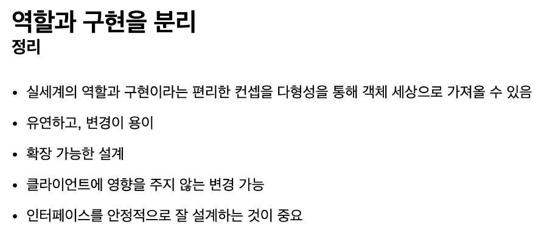
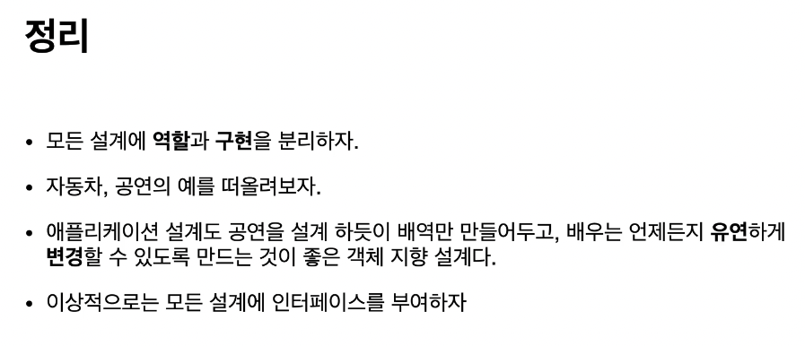

 
##  스프링 핵심 원리 - 기본편 #1(객체지향설계, 예제만들기, 객체지향 원리적용)

[기초부터 탄탄하게 연휴 스프링 복습 프로젝트]

### 1장. 객체 지향 설계와 스프링

#### 1-1장. 좋은 객체 지향 프로그래밍이란?

객체지향의 특징(추상화, 캡슐화, 상속, 다형성)

이중에서 가장 중요한 것은 <b style="color:mediumspringgreen">다형성(Polymorphism)</b>이다

객체지향 프로그래밍은 유연하고 변경이 용이하여 대규모 소프트웨어 개발에 많이 사용된다

<b style="color:lightgreen">유연하고 변경이 용이하다?</b>
 - 레고 블록 조립하듯이
 - 키보드, 마우스 갈아끼우듯이
 - 컴퓨터 부품 갈아 끼우듯이
 - 컴포넌트를 쉽고 유연하게 변경하면서 개발할 수 있는 방법

[핵심] 다형성의 실세계 비유 방법 : <b style="color:mediumspringgreen">역할</b>과 <b style="color:mediumspringgreen">구현</b>으로 세상을 구분


역할 : 운전자 역할 / 자동차 역할

구현 : K3 / 아반떼 / 테슬라 모델3

[요약] <b style="color:dodgerblue">운전자는 K3, 아반떼, 테슬라 모델3 차종에 상관없이 어떤 차든 운전을 할 수 있다</b>

어떻게 그렇게 할 수 있는가? 

사람은 자동차 운전을 하는 방법만 알면 되는거지 자동차 내부적으로 어떻게 동작하는지 알 필요가 없다

<b style="color:aquamarine">즉, K3든 아반떼든 테슬라 모델 3든 자동차 역할의 인터페이스에 따라서 구현이 되었고 운전자는 자동차 인터페이스만 알고있으면 운전이 가능하다.</b>

운전자는 K3 -> 테슬라 모델 3로 변경해도 새로운 운전자로 대체하는게 아니라 그대로 운전자가 변하지 않고 운전가능

<b style="color:aquamarine">[핵심] 새로운 자동차가 나와도 클라이언트를 바꿀필요가 없다</b>

<br>


로미오와 줄리엣을 보면 역할과 구현을 나누었다

역할 : 로미오 대본 / 줄리엣 대본

구현 : 장동건 / 원빈 / 김태희 / 송혜교

<b style="color:aquamarine">사실 구현은 장동건, 원빈이 아니라 무명배우가 될 수도 있다. 갑자기 모두 아프면 무명배우가 해야하는데 로미오 역할이 무명배우로 바뀐다고 해서 줄리엣이 변경될 필요는 없다.</b>

<br>

<b style="color:cornflowerblue">키보드를 기계식 키보드를 쓰다가 리얼포스 무접점으로 변경해도 그대로 사용할 수 것을 다형성이라 한다</b>


* 클라이언트는 구현 대상의 내부구조를 몰라도 된다(인터페이스만 알면 된다)
  
* 클라이언트는 구현 대상 자체를 변경해도 영향을 받지 않는다(갑자기 전기차로 바껴도 운전자가 기존대로 운전 가능)


<b style="color:lightgreen">역할 = 인터페이스 / 구현 = 인터페이스를 구현한 클래스, 객체</b>


<b style="color:aquamarine">[핵심] 객체 설계시 역할(인터페이스)을 먼저 부여하고, 그 역할을 수행하는 구현 객체 만들기</b>

객체의 협력이라는 관계 부터 생각

혼자 있는 객체는 없다.

클라이언트 : 요청, 서버 : 응답

수 많은 객체 클라이언트와 객체 서버는 서로 협력 관계를 가진다


<b style="color:aquamarine">[핵심] 클라이언트(파란색)은 MemoryDB(빨간색)이든 JdbcDB(초록색)이든 유연하게 변경해서 사용할 수 있으며 여기서 변경이 될 때 클라이언트에서는 변경을 해줄 필요가 없다는것이 중요하다</b>


인터페이스를 안정적으로 잘 설계하는게 정말 중요하다



만약 인터페이스가 변경이 되면, 클라이언트 뿐 아니라 구현체도 모두 변경이 되기 때문에 인터페이스는 안정적으로 잘 설계 해야한다

<b style="color:aquamarine">1. 객체 지향에서 가장 중요한 것은 다형성</b>


<b style="color:aquamarine">2. 스프링은 다형성을 극대화 해서 이용할 수 있게 도와준다</b>


<b style="color:aquamarine">3. 스프링 IOC, DI등은 다형성을 활용해서 역할과 구현을 편리하게 다룰 수 있도록 지원 하는 기능</b>


<b style="color:aquamarine">4. 스프링을 사용하면 마치 레고 블록 조립하듯이, 공연 무대의 배우를 선택하듯이, 구현을 편리하게 변경 가능</b>

<br>

#### 1-2장. 좋은 객체 지향 설계의 5가지 원칙(SOLID)


1. SRP(단일책임원칙)
    : 한 클래스는 하나의 책임만 가져야 한다
> 하나의 책임이라는 것은 모호하다.
>
> UI를 하나 변경하는데 SQL코드, 어플리케이션 모두 변경이 필요하면 잘못설계한 경우

<b style="color:aquamarine">단일 JSP 파일안에 뷰, 비즈니스로직, 쿼리 모두 들어가 있는 경우는 SRP 원칙에 위배된다고 볼 수 있다</b>

범위를 잘 적정하게 조절하는게 객체지향의 묘미

<br>

2. OCP(개발폐쇄원칙)
    : 소프트웨어 요소는 확장에는 열려 있으나 변경에는 닫혀 있어야 한다
> 다형성을 생각해보자
>
> 자동차가 K3에서 테슬라로 변경되어도 운전자의 역할이 변경되지 않는다
>
> 이게 바로 개방폐쇄 원칙이라고 한다

<b style="color:aquamarine">다형성을 이용하면 확장에는 열려 있으나 변경에는 닫혀 있게 할 수 있다</b>

하지만 현재 단계에서는 MemoryDB 에서 JdbcDB로 변경할 때 MemberService를 변경하게 되는데 이 부분은 OCP가 지켜지지 않지만 추후에 스프링을 통해서 MemberService에 코드 변경 없이 OCP를 지킬수 있도록 변경 할 계획

<b style="color:aquamarine">(OCP + 다형성)을 해결하기 위한 방법 : 객체를 생성하고, 연관관계를 맺어주는 별도의 조립, 설정자가 필요하다(스프링)</b>

3. LSP(리스코프 치환 원칙)
    : 프로그램의 정확성을 깨뜨리지 않으면서 하위 타입의 인스턴스로 바꿀수 있어야 한다

> 단순히 컴파일에 성공하는 것이 아니라 해당 역할을 충실히 수행하여야 한다
>
> 자동차 구현체가 악셀을 구현 할때 앞으로(Speed + 10) 가는게 아니라 뒤로가게 만들어도(Speed - 10) 컴파일은 정상적으로 되지만 이 기능은 우리가 원래 구현하려고 했던 기능에 위반

<b style="color:aquamarine">자동차 앞으로 가능 구현하라고 했더니 뒤로가게 만들면 LSP 위반</b>

4. ISP(인터페이스 분리 원칙)
    : 특정 클라이언트를 위한 인터페이스 여러 개가 범용 인터페이스 하나보다 낫다

> 자동차 인터페이스 > 운전 인터페이스, 정비 인터페이스로 분리
> 
> 사용자 클라이언트 > 운전자 클라이언트, 정비사 클라이언트로 분리
> 
> 분리하면 정비 인터페이스 자체가 변해도 운전자 클라이언트에 영향을 주지 않음

<b style="color:aquamarine">인터페이스를 하나에 다 넣어서 구분하지 않을경우<br>(자동차 정비만 하면 되는데 운전 쪽과 다른쪽에도 모두 수정해야 하며 기능이 너무 많으면 복잡하니 구분이 필요하다)</b>

스프링 프레임워크는 정말 철저하게 인터페이스들이 분리되어 있다

5. DIP(의존관계 역전 원칙)
    : 프로그래머는 "추상화에 의존해야지, 구체화에 의존하면 안된다"

> 클라이언트 코드가 구현클래스를 바라보는게 아니라 인터페이스만 바라봐라
>
> MemberService는 repository 인터페이스만 보면 되지 JDBC, Memory 구현체에 어떤게 있는지 알 필요가 없다

<b style="color:aquamarine">역할(ROLE)에 의존하게 해야 하지 구현에 의존하면 안된다</b>

연글할 때도 역할에 의존해야지 배역에 의존하게 되면 상대 배역이 다른사람으로 대체하면 연극은 망할거다

[MemberService 클라이언트가 구현 클래스를 직접 선택]

> MemberRepository m = new MemoryMemberRepository();

위 부분은 <b style="color:deeppink">DIP 위반</b>이다

그렇다고 위에 new MemoryMemberRepository()를 안하게 되면 null exception 발생..

이러한 문제점을 해결하기 위해 고안된게 스프링 프레임워크 이다

#### 1-3장. 객체 지향 설계와 스프링

스프링은 다음 기술로 다형성 + OCP, DIP를 가능하게 지원

 - DI : 의존관계 주입, 의존성 주입
  
 - DI 컨테이너 제공

<b style="color:aquamarine">클라이언트 코드의 변경 없이 기능 확장</b>




### 2장. 스프링 핵심 원리 이해 - 예제 만들기
#### 2-1장. 프로젝트 생성

이번시간에는 순수한 JAVA만 이용하지만 프로젝트 생성의 편의성을 위해서 start.spring.io에서 프로젝트 생성


단순하게 프로젝트 생성 후 IDE(인텔리제이) 오픈

#### 2-2장. 비즈니스 요구사항과 설계


#### 2-3장. 회원 도메인 설계


#### 2-4장. 회원 도메인 개발

src/hello/core 아래에 member Package 생성 후 grade.enum 생성

```java
package hello.core.member;

public enum Grade {
    BASIC,
    VIP
}
```

같은 경로에 Member.class 만들기

```java
package hello.core.member;

public class Member {
    private Long id;
    private String name;
    private Grade grade;

    public Member(Long id, String name, Grade grade) {
        this.id = id;
        this.name = name;
        this.grade = grade;
    }

    public Long getId() {
        return id;
    }

    public void setId(Long id) {
        this.id = id;
    }

    public String getName() {
        return name;
    }

    public void setName(String name) {
        this.name = name;
    }

    public Grade getGrade() {
        return grade;
    }

    public void setGrade(Grade grade) {
        this.grade = grade;
    }
}
```

같은 경로에 MemberRepository interface 만들기

```java
package hello.core.member;

public interface MemberRepository {

    void save(Member member);

    Member findById(Long memberId);
}
```

같은 경로에 MemoryMemberRepository 클래스 만들기

```java
package hello.core.member;

import java.util.HashMap;
import java.util.Map;

public class MemoryMemberRepository implements MemberRepository{

    private static Map<Long, Member> store = new HashMap<>();

    @Override
    public void save(Member member) {
        store.put(member.getId(), member);
    }

    @Override
    public Member findById(Long memberId) {
        return store.get(memberId);
    }
}
```

같은 경로에 MemberService 인터페이스 만들기

```java
package hello.core.member;

public interface MemberService {

    void join(Member member);

    Member findMember(Long memberId);
}
```

같은 경로에 MemberServiceImpl 클래스 만들기

```java
package hello.core.member;

public class MemberServiceImpl implements MemberService{

    private MemberRepository memberRepository = new MemoryMemberRepository();

    @Override
    public void join(Member member) {
        memberRepository.save(member);
    }

    @Override
    public Member findMember(Long memberId) {
        return memberRepository.findById(memberId);
    }
}
```

#### 2-5장. 회원 도메인 실행과 테스트

hello.core 패키지 바로 아래에 MemberApp 클래스 파일을 만든다(테스트용)

```java
package hello.core;

import hello.core.member.Grade;
import hello.core.member.Member;
import hello.core.member.MemberService;
import hello.core.member.MemberServiceImpl;

public class MemberApp {
    public static void main(String[] args) {
        MemberService memberService = new MemberServiceImpl();
        Member member = new Member(1L, "memberA", Grade.VIP);

        memberService.join(member);
        Member findMember = memberService.findMember(1L);
        System.out.println("new member: "+member.getName());
        System.out.println("find member : "+findMember.getName());

    }

}
```

test > java > hello.core 패키지 아래에 member 패키지 만들고 MemberServiceTest 클래스 만들기

```java
package hello.core.member;

import org.assertj.core.api.Assertions;
import org.junit.jupiter.api.Test;

public class MemberServiceTest {

    MemberService memberService = new MemberServiceImpl();

    @Test
    void join(){
        //given
        Member member = new Member(1L, "MemberA", Grade.VIP);

        //when
        memberService.join(member);
        Member findMember = memberService.findMember(1L);

        //then
        Assertions.assertThat(member).isEqualTo(findMember);
    }
}
```

#### 2-6장. 주문과 할인 도메인 설계

<b style="color:cornflowerblue">이제부터 조금 복잡하지만 천천히 반복해보자</b>


<b style="color:aquamarine">[핵심] 먼저 역할을 구분하여 구현체는 아무거나 와도 사용할 수 있게끔 설계를 하였다</b>


#### 2-7장. 주문과 할인 도메인 개발

main > java > hello.core 패키지 아래에 discount라는 새로운 패키지 만들고 DiscountPolicy 인터페이스 만들기

```java
package hello.core.discount;

import hello.core.member.Member;

public interface DiscountPolicy {
    /**
     * @return 할인 대상 금액
     */
    int discount(Member member, int price);
}
```

동일 경로에 FixDiscountPolicy 클래스(구현체) 파일 만들기

```java
package hello.core.discount;

import hello.core.member.Grade;
import hello.core.member.Member;

public class FixDiscountPolicy implements DiscountPolicy{

    private int discountFixPrice = 1000; // 1000원 할인

    @Override
    public int discount(Member member, int price) {
        if(member.getGrade() == Grade.VIP){
            return discountFixPrice;
        }else{
            return 0;
        }
    }
}
```
main > java > hello.core 패키지 아래에 order라는 새로운 패키지 만들고 Order 클래스 만들기

```java
package hello.core.order;

public class Order {
    private Long memberId;
    private String itemName;
    private int itemPrice;
    private int discountPrice;

    //비즈니스 로직 추가
    public int calculatePrice(){
        return itemPrice - discountPrice;
    }

    @Override
    public String toString() {
        return "Order{" +
                "memberId=" + memberId +
                ", itemName='" + itemName + '\'' +
                ", itemPrice=" + itemPrice +
                ", discountPrice=" + discountPrice +
                '}';
    }

    public Order(Long memberId, String itemName, int itemPrice, int discountPrice) {
        this.memberId = memberId;
        this.itemName = itemName;
        this.itemPrice = itemPrice;
        this.discountPrice = discountPrice;
    }

    public Long getMemberId() {
        return memberId;
    }

    public void setMemberId(Long memberId) {
        this.memberId = memberId;
    }

    public String getItemName() {
        return itemName;
    }

    public void setItemName(String itemName) {
        this.itemName = itemName;
    }

    public int getItemPrice() {
        return itemPrice;
    }

    public void setItemPrice(int itemPrice) {
        this.itemPrice = itemPrice;
    }

    public int getDiscountPrice() {
        return discountPrice;
    }

    public void setDiscountPrice(int discountPrice) {
        this.discountPrice = discountPrice;
    }
}
```

동일 경로에 OrderService 인터페이스 클래스 만들기

```java
package hello.core.order;

public interface OrderService {

    Order createOrder(Long memberId, String itemName, int itemPrice);
}
```

동일 경로에 OrderServiceImpl 클래스 만들기

```java
package hello.core.order;

import hello.core.discount.DiscountPolicy;
import hello.core.discount.FixDiscountPolicy;
import hello.core.member.Member;
import hello.core.member.MemberRepository;
import hello.core.member.MemoryMemberRepository;

public class OrderServiceImpl implements OrderService{

    private final MemberRepository memberRepository = new MemoryMemberRepository();
    private final DiscountPolicy discountPolicy = new FixDiscountPolicy();

    @Override
    public Order createOrder(Long memberId, String itemName, int itemPrice) {
        Member member = memberRepository.findById(memberId);
        int discountPrice = discountPolicy.discount(member, itemPrice);

        return new Order(memberId, itemName, itemPrice, discountPrice);
    }
}
```


<b style="color:aquamarine">위 경우 설계가 아주 잘 되어 있음

1. OrderService 입장에서는 할인에 대해서 몰라도 된다.
2. DiscountPolicy 쪽에서 할인에 대해서 수행하고 결과만 OrderService쪽으로 넘겨준다
3. 이 경우 할인에 수정이 필요할 경우 DiscountPolicy쪽만 수정하면 되고 OrderService는 건드리지 않는다

</b>

단일 책임 원칙을 잘 지킨 경우이며, 이렇지 않으면 할인을 수정하는 경우 OrderService도 수정해주어야 한다

#### 2-8장. 주문과 할인 도메인 실행과 테스트

main > hello.core에 OrderApp 클래스 파일 생성

```java
package hello.core;

import hello.core.member.Grade;
import hello.core.member.Member;
import hello.core.member.MemberService;
import hello.core.member.MemberServiceImpl;
import hello.core.order.Order;
import hello.core.order.OrderService;
import hello.core.order.OrderServiceImpl;

public class OrderApp {
    public static void main(String[] args) {

        MemberService memberService = new MemberServiceImpl();
        OrderService orderService = new OrderServiceImpl();

        Long memberId = 1L;
        Member member = new Member(memberId, "memberA", Grade.VIP);
        memberService.join(member);

        Order order = orderService.createOrder(memberId, "itemA", 10000);

        System.out.println("Order = "+order);
        System.out.println("Order.calculate() = "+order.calculatePrice());
    }
}
```

test > hello.core에 order 패키지를 만들고 OrderServiceTest 클래스 만들기

```java
package hello.core.order;

import hello.core.member.Grade;
import hello.core.member.Member;
import hello.core.member.MemberService;
import hello.core.member.MemberServiceImpl;
import org.assertj.core.api.Assertions;
import org.junit.jupiter.api.Test;

public class OrderServiceTest {

    MemberService memberService = new MemberServiceImpl();
    OrderService orderService = new OrderServiceImpl();

    @Test
    void createOrder(){
        Long memberId = 1L;
        //primitive에는 null이 들어가지 않기 때문에 wrapper 클래스를 사용

        Member member = new Member(memberId, "memberA", Grade.VIP);
        memberService.join(member);

        Order order = orderService.createOrder(memberId, "itemA", 10000);
        Assertions.assertThat(order.getDiscountPrice()).isEqualTo(1000);
        Assertions.assertThat(order.calculatePrice()).isEqualTo(9000);
    }
}
```


<b style="color:aquamarine">프로젝트 구조</b>


참고  
 1. [스프링 핵심 원리 - 기본편 - 김영한](https://www.inflearn.com/course/%EC%8A%A4%ED%94%84%EB%A7%81-%ED%95%B5%EC%8B%AC-%EC%9B%90%EB%A6%AC-%EA%B8%B0%EB%B3%B8%ED%8E%B8/dashboard)


