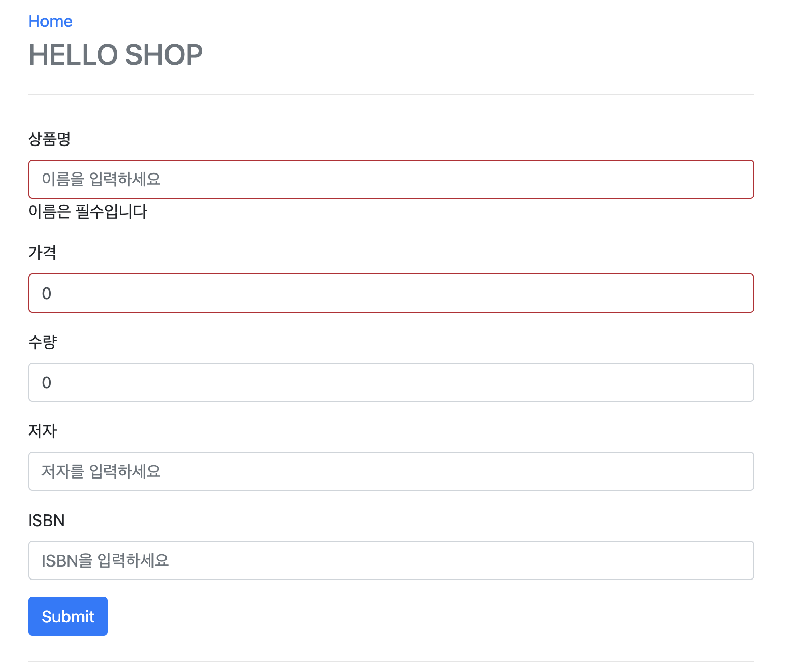
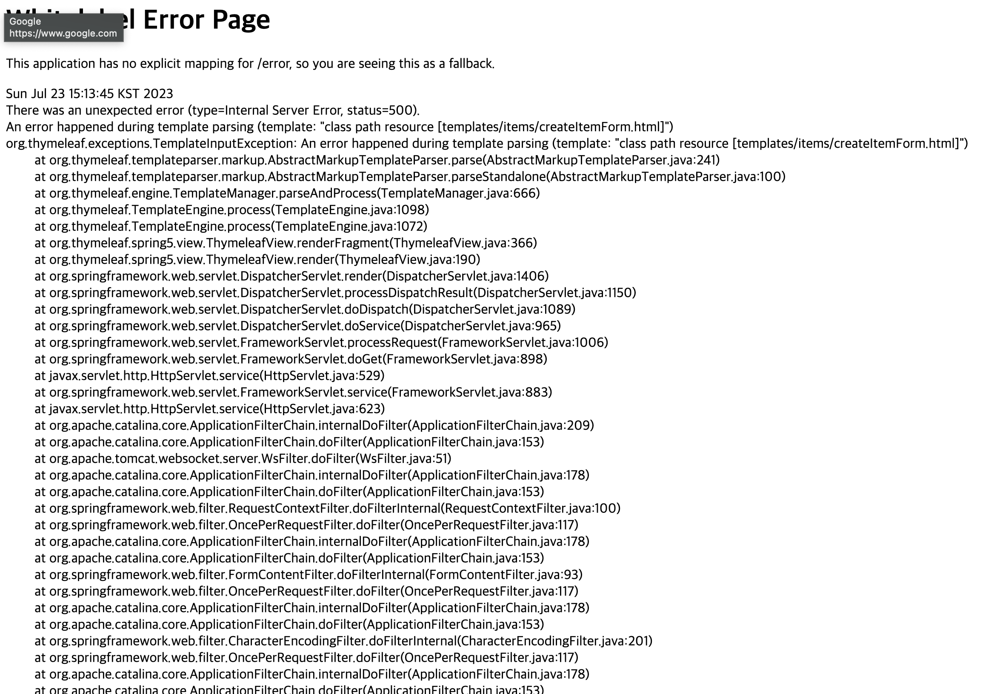

 
##  스프링 에러 모음

[나중에 또 시간낭비 하지 않기 위한 메모장]

### 1장. Form Validation 확인

스프링 부트 Form 유효성 검사를 위해서는 아래 dependency를 추가해야 한다(2.x 버전 이후부터)

```xml
<dependency>
    <groupId>org.springframework.boot</groupId>
    <artifactId>spring-boot-starter-validation</artifactId>
</dependency>
```

#### 1-1장. 도대체 왜 유효성 체크를 했는데 500 에러가 나는걸까?

[기대 화면]




[에러 화면]



위에 기대하는 화면처럼 NotEmpty 체크를 하고 화면에 보여주려고 하면 에러가 난다

```java
Caused by: org.thymeleaf.exceptions.TemplateProcessingException: Exception evaluating SpringEL expression: "#fields.hasErrors('name')" (template: "items/createItemForm" - line 14, col 20)

Caused by: java.lang.IllegalStateException: Neither BindingResult nor plain target object for bean name 'form' available as request attribute
```

이거 확인하려고 다른쪽 코드를 보고 동일하게 작업을 했는데, 다른곳은 되지만 현재 상품 추가 부분에서만 에러가 발생

원인 : 스프링 Valid와 BindingResult에 대해서 잘 몰라서 발생한 문제

[그럼 이제 해결 방법 설명] 
 1. BookForm.java 수정
 2. ItemController.java 수정
 3. createItemForm.html 수정


BookForm.java 수정
```java
@Getter
@Setter
public class BookForm {

    private Long id;

    @NotEmpty(message = "이름은 필수입니다")
    private String name;

    @NotNull(message = "가격은 필수입니다")
    private int price;

    private int stockQuantity;

    private String author;
    private String isbn;
}
```

먼저 유효성 검사할 부분에 NotEmpty, NotNull등 설정을 해준다

주의점 : 여기서 String, int 타입에 따라서 Not Empty, Not Null을 사용할 수 있는게 있고 없는게 있으니 여기서 에러가 나면 확인 해보자


[핵심] ItemController.java 수정
```java
@Controller
@RequiredArgsConstructor
public class ItemController {

    private final ItemService itemService;

    @GetMapping("/items/new")
    public String createForm(Model model){
        model.addAttribute("bookForm", new BookForm());

        return "items/createItemForm";
    }

    @PostMapping("/items/new")
    public String create(@Valid BookForm form, BindingResult result){

        if(result.hasErrors()){
            return "items/createItemForm";
        }

        Book book = new Book();
        book.setName(form.getName());
        book.setPrice(form.getPrice());
        book.setStockQuantity(form.getStockQuantity());
        book.setAuthor(form.getAuthor());
        book.setIsbn(form.getIsbn());

        itemService.saveItem(book);
        return "redirect:/";
    }
}
```

이렇게 코드가 있으면 신경써야 하는 부분은 아래 쪽만 신경쓰면 된다
```java
//1. 여기서 model.addAttibute("bookForm", new BookForm())쪽에 "bookForm"을 신경써야한다
//여기 bookForm을 쓰게 되면 뒤에도 똑같이 맞춰주는 작업이 필요하니 일단 bookForm 확인

public String createForm(Model model){
    model.addAttribute("bookForm", new BookForm());

    return "items/createItemForm";
}


/*
    2. 여기서 @Valid BookForm form 부분 주의

    유효성 검사 후 문제가 발생하면 자동으로 model.addAttribute로 추가되서 thymeleaf쪽으로 이동
    
    !![중요]!!
    기대) model.addAttribute("form", form)

    현실) model.addAttribute("bookForm", form) 
*/

@PostMapping("/items/new")
public String create(@Valid BookForm form, BindingResult result){

    if(result.hasErrors()){
        return "items/createItemForm";
    }

    ...
}


/*
    3. thymeleaf form(확인)
    
    <form role="form" action="/items/new" th:object="${form}" method="post">
    
    이렇게 사용하면 th:object="${form}"이라고 명시하면 model.addAttribute("form", form);

    넘어와야 하는데 실제로 에러가 발생했을때 2번처럼 form이 넘어오는게 아니라 bookForm(클래스명에 따라서)데이터가 넘어오니까 불일치에 따라서 에러가 발생함
*/
```

```html
<form role="form" action="/items/new" th:object="${bookForm}" method="post">
    <div class="form-group">
        <label th:for="name">상품명</label>

        <input type="text" th:field="*{name}" class="form-control" placeholder="이름을 입력하세요"
                th:class="${#fields.hasErrors('name')}? 'form-control fieldError' : 'form-control'">
        <p th:if="${#fields.hasErrors('name')}" th:errors="*{name}">Incorrect date</p>
    </div>
    
    ...
</form>
```

[최종 정리]

1. NotEmpty, NotNull과 같은건 데이터 타입에 유의해서 사용하자
2. valid 체크할때는 아래 3개를 신경써서 작업하자(이름 통일 필요)
 - (타임리프.html) >> th:object="${bookForm}"
 - (컨트롤러-GET메소드) >> model.addAttribute("bookForm", new BookForm());
 - (컨트롤러-POST메소드) >> public String create(@Valid BookForm form, ~)

컨트롤러 POST메소드에 public String create(@Valid BookForm form) 이렇게 되어 있으면 무조건 th:object도 bookForm으로 이름을 바꿔주면 에러를 해결 할 수 있을것 같다

(이거 해결하는데 1시간 30분 소요되었으니.. 다음부터는 이런 문제가 발생하지 않도록 기초를 확실히 갈고 닦자)


참고  
 1. [스프링 핵심 원리 - 기본편 - 김영한](https://www.inflearn.com/course/%EC%8A%A4%ED%94%84%EB%A7%81-%ED%95%B5%EC%8B%AC-%EC%9B%90%EB%A6%AC-%EA%B8%B0%EB%B3%B8%ED%8E%B8/dashboard)


