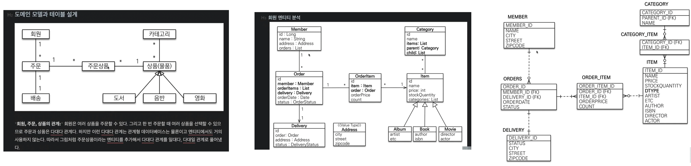
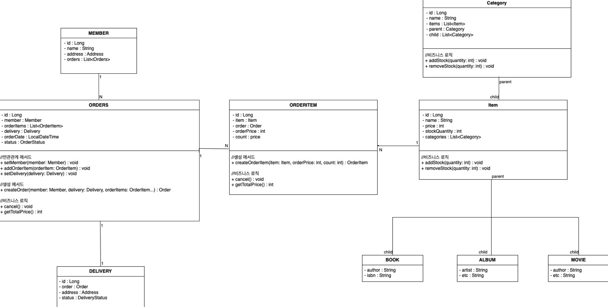
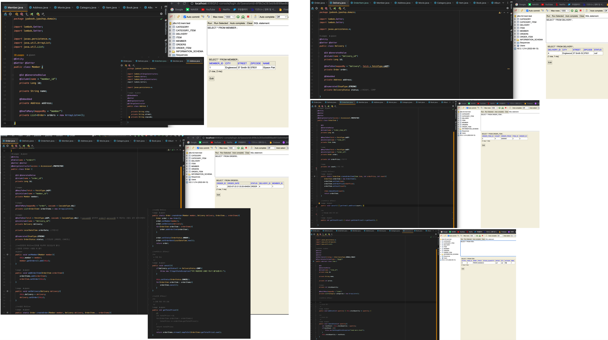
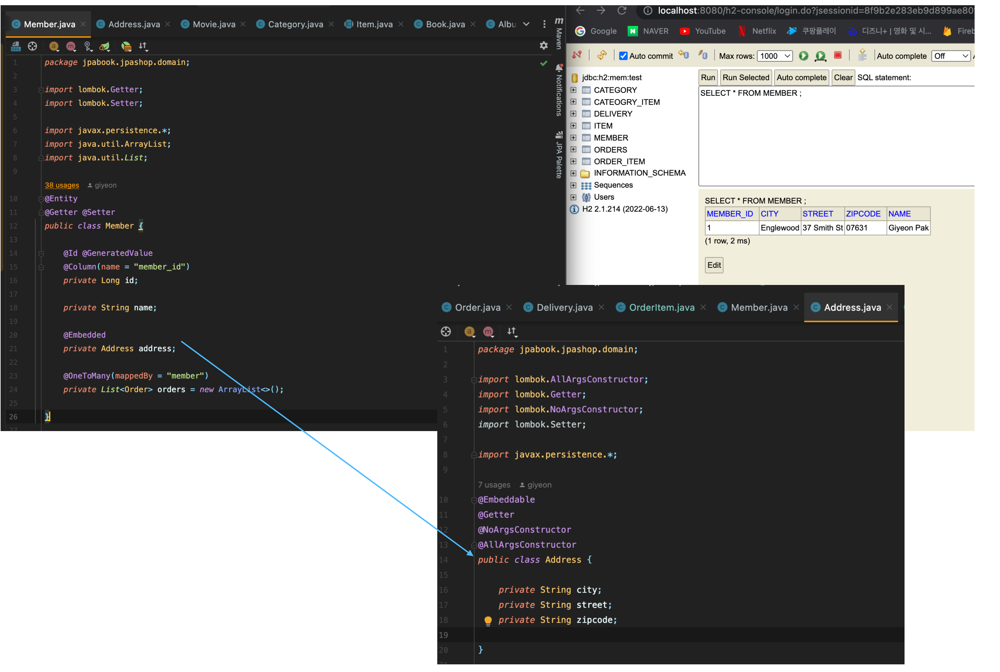
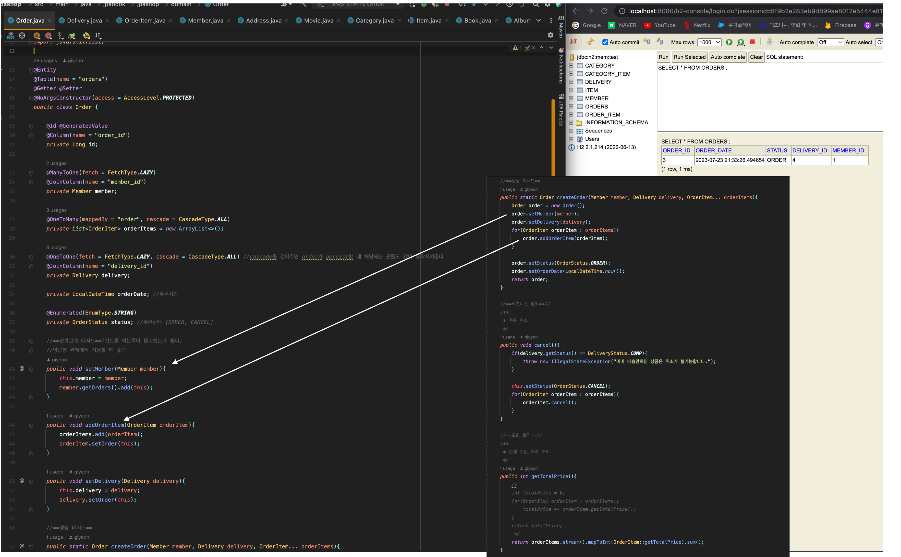
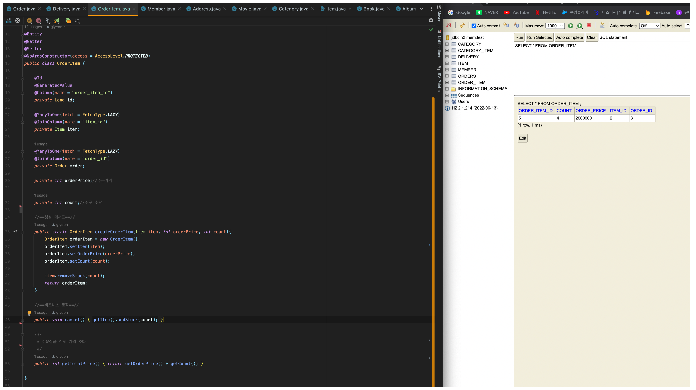
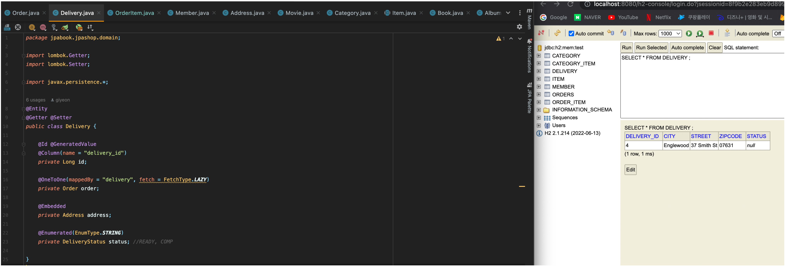
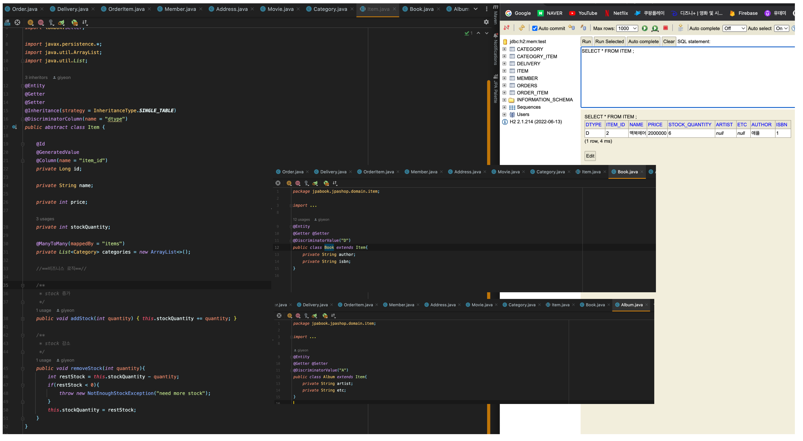

 
##  스프링 JPA SHOP 강의

JPA 사용 기초와 도메인 간의 관계에 대해서 학습

### 1장. 도메인 설계

#### 1-1장. JPA SHOP 도메인 설계

참고  
 1. [실전! 스프링 부트와 JPA 활용1 - 웹 애플리케이션 개발 - 김영한](https://www.inflearn.com/course/%EC%8A%A4%ED%94%84%EB%A7%81%EB%B6%80%ED%8A%B8-JPA-%ED%99%9C%EC%9A%A9-1/dashboard)

