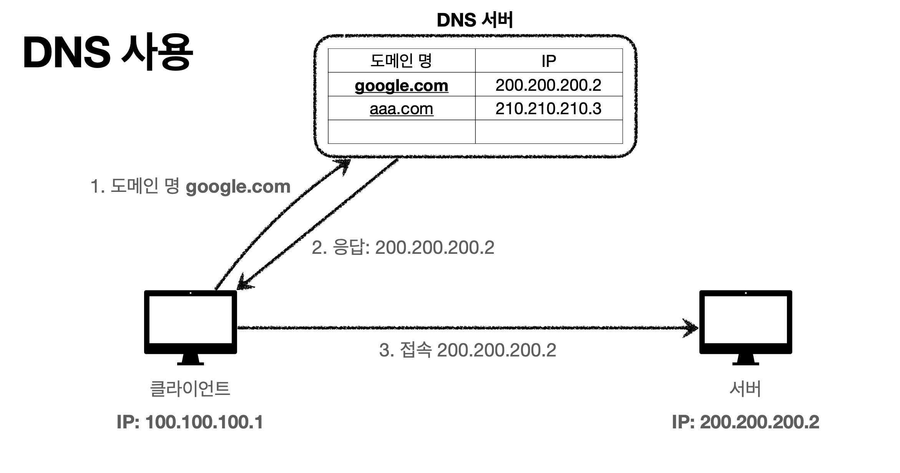

**[HTTP강좌]** [모든 개발자를 위한 HTTP 웹 기본지식](https://ihchoco.github.io/categories/#HTTP)
{: .notice--danger}

### 강의소개 

이번에는 인프런의 모든 개발자를 위한 HTTP 웹 기본 지식 내용을 정리해 보았습니다.

왜 갑자기 이 강의를 선택하였는가?(개발이 아닌 HTTP 지식을 왜 공부할까?)
 > 요즘은 모든것이 HTTP 기반 위에서 동작하며 \
 > WEB 개발을 한다면 당연히 HTTP에 대한 기본지식이 필수적으로 밑바탕이 되어야한다고 생각되서 입니다.
 > 
 > 개발을 할 때 단순한 기능 사용법만 숙지하는 것이 아닌 근본적인 원리를 파악하면 \
 > 좀 더 깊이있는 개발을 진행하실수 있을것 같습니다. 

이 강의의 강사님은 개발 세계에서 굉장히 유명하신 김영한(우아한형제들-개발팀장)님으로 굉장히 유명하고 잘 가르쳐주시는 분이라고 하며 현재 몇몇 강의를 듣고있는데 굉장히 큰 도움이 되고있습니다.

링크 : [모든 개발자를 위한 HTTP 웹 기본지식 - 김영한](https://www.inflearn.com/course/http-%EC%9B%B9-%EB%84%A4%ED%8A%B8%EC%9B%8C%ED%81%AC#)


> 또 사설이 길었는데 강의 내용을 챕터별로 정리해보겠습니다.


#### 1. 인터넷 네트워크
##### 1-1. 인터넷 통신
> 웹이나 HTTP도 전부 이런 인터넷 네트웍망에 기반해서 동작하므로 사전 학습이 필요. 편안하게 듣기

인터넷에서 컴퓨터 둘은 어떻게 통신할까?


이렇게 컴퓨터 두대가 바로 옆에 케이블로 연결되어 있으면 케이블로 통신하면 된다.\
하지만 내가 한국에 있고 친구가 미국에 있는데 메시지를 전달하려면? 인터넷을 이용해야한다.


이렇게 인터넷망은 엄청 많은 노드를 거쳐서 목적지에 도착하는데 그 과정에는 해저케이블, \
인공위성등 다양하게 데이터가 전달되게 되고 이것을 이해하기 위해서는 IP에 대한 개념을 알아야한다.

##### 1-2. (IP)인터넷 프로토콜
이 복잡한 구조에서 미국에 있는 친구에게 [Hello World] 라는 메시지를 보내야한다.\
최소한의 규칙이 필요한데 그게 바로 IP 주소이다.


IP(인터넷프로토콜 역할)
1. 지정한 IP 주소(IP Address)에 데이터 전달
2. 패킷(Packet)이라는 통신 단위로 데이터 전달

미국에 있는 친구 IP 주소로 패킷을 보내게 된다.\
그런데 패킷에는 단순히 넘기는 데이터 [Hello World]만 들어있는게 아니라 출발지 IP(내것), 목적지 IP(친구), \
기타...등등으로 감싸져있다.


클라이언트 패킷 전달\
모든 노드들은 같은 규약을 따르고 있어서 이 패킷이 출발지가 어디고 목적지가 어디인지 알기 때문에 목적지로 가려면\
어디로 보내야하는지 파악하고 그쪽으로 한칸 한칸씩 옮기게되고 최종적으로 목적지에 패킷이 도달한다.


그럼 친구가 메시지를 받고 다시 클라이언트에 메시지를 받았다는 패킷을 전달한다.\


하지만 IP 주소를 찾아가는 방식과 패킷에 담는 방식만으로는 한계가 있다.
  1. 비연결성
    - 패킷을 받을 대상이 없거나 서비스 불능 상태여도 패킷 전송
    
  2. 비신뢰성\
    - 중간에 패킷이 사라지면?\
    - 패킷이 순서대로 안오면?
    
  3. 프로그램 구분
    - 같은 IP를 사용하는 서버에서 통신하는 애플리케이션이 둘 이상이라면?\
    - (상대 서버로 노래도 듣고 원격요청도 받고 http문서도 여는등 한 서버에 여러개 요청보낼때 구분X)

패킷이 용량이 크면 잘라서 보내게 된다. 만약 3000바이트이면 1500바이트씩 짤라서 보낸다.\
이런 패킷들이 각각 다른 노드로 전달되면서 목적지에 도착될 수 도 있다. 중간에 이게 더빠른데? \
하고 다른노드 선택이러다 보면 2번이 먼저 도착하고 1번이 도착할 수도있다.

> 이러한 단점을 해결하기 위해 나온것이 TCP, UDP이다.

##### 1-2. TCP/UDP

IP 프로토콜의 단점들을 해결해주기 위해 나왔다.
> 인터넷 프로토콜 스택의 4계층
1. 애플리케이션 계층 - HTTP, FTP
2. 전송 계층 - TCP, UDP
3. 인터넷 계층 - IP
4. 네트워크 인터페이스 계층


ex) 프로세스

애플리케이션 
 - 크롬부라우저, 카카오톡, 채팅 프로그램 등에서 소켓통신으로 OS쪽에 메시지 데이터 전달

OS
 - (운영체제)윈도우10, 리눅스 등 에서 소켓으로 받은 HELLO 메시지 데이터를 TCP로 한번 깜싼다.
 - 그 이후 감싼 데이터를 한번더 IP 패킷으로 감싸고 네트워크 인터페이스 쪽으로 보낸다.
  
네트워크 인터페이스 
 - 데스크탑 NIC카드, 랜케이블 어댑터 연결부분

이렇게 IP 패킷 정보 뿐만 아니라 TCP정보도 감싸져 있는 패킷이 만들어 진다.(+포트정보, 전송 제어 등)


TCP 특징(전송 제어 프로토콜)

1. 연결지향 : TCP 3 way handshake (가상연결)
 : 쟤랑 나랑 연결을 먼저 하고 데이터를 보낸다. IP패킷 단점중 하나 해결(상대 서버 다운상태일때 전송X)
2. 데이터 전달 보증
 : 내가 데이터를 보냈는데 저쪽에서 패킷이 누락됬으면 내가 알 수가 있다. 저쪽에서 못받았네
3. 순서 보장
 :

TCP는 신뢰할 수 있는 프로토콜이며 현재는 대부분 애플리케이션에서 TCP를 사용한다.


(1) 클라이언트 > 서버로 접속 요청 보낸다.\
(2) 서버 > 클라이언트로 접속 받았고 나도 요청 보낸다.\
(3) 클라이언트 > 서버로 접속 받았고 내가 보낼 데이터를 요청한다.

[실제로는 물리적으로 연결된것은 아니고 개념적으로 연결됬다고만 생각하자]


(1) 클라이언트 > 서버로 패킷1,2,3 순서로 보낸다.\
(2) 서버에서는 패킷1,3,2 순서로 받았다. 클라이언트쪽으로 패킷2번부터 다시보내\
(3) OK > 서버로 패킷2번부터 다시 보낸다.\
[이게 순서정보를 확인 할 수 있는 이유는 TCP세그먼트에 전송제어 정보가 들어있어서 확인 가능하다.]

UDP 특징\
사용자 데이터그램 프로토콜(User Datagram Protocol)

1. 하얀 도화지에 비유(기능이 거의 없음)
2. 연결지향 - TCP 3 way handshake X
3. 데이터 전달 보증 X
4. 순서 보장 X
5. 데이터 전달 및 순서가 보장되지 않지만, 단순하고 빠름
6. 정리\
   IP와 거의 같다. + PORT , 체크섬 정도만 추가. + 애플리케이션에서 추가작업 필요

```
TIP : 포트 > 하나의 IP에서 여러 애플리케이션이 동작할때 구분하게 해주는것
상대쪽에서 내쪽으로 여러 패킷이 들어오는데 단순히 목적지 IP만 들어오면 이게 뭔지알수가 없다.
그러니 포트에 따라서 이게 게임패킷, 음악패킷, HTTP패킷 이렇게 구분할 수 있다.
```

UDP는 왜 쓸까? 
 : TCP는 이미 많은곳에서 공통적으로 쓰여서 수정이 불가능 하다. 하지만 UDP는 내가 원하는대로 커스텀 가능하다\
내가 더 애플리케이션에서 만들어서 최적화할 수 있다. 그래서 도화지와 같은 느낌.

> 최근에는 UDP가 뜨고있다. 더 최적화하면서 커스텀할 수 있고 빠르니까


##### 1-3. Port
Port : 항구라는 뜻

친구랑 게임하면서 화상통화도 같이 하고있는데 패킷이 나한테 올 때 이게 어떤 패킷인지 알수가 없다.\
반대로 보낼때도 내가 이게 어떤패킷인지 안보내면 받는쪽에서 이게 뭔지 알 수 없다. [이전에 설명]


여기 정보 외에 다양한 정보들이 더 들어있지만 일단 이것을 TCP/IP 패킷이라고 한다.


웹브라우저 요청 
 - 클라이언트 > 서버(200.200.200.3:80)으로 요청
 - 서버 > 클라이언트(100.100.100.1:10010)으로 응답한다
 - 어떻게 서버는 클라이언트 읍답 포트도 알 수 있을까? 위에 TCP/IP 패킷에 출발지 Port도 들어있기 때문이다.
   
IP = 아파트\
Port = 몇동 몇호


##### 1-4. DNS
IP 단점 : 기억하기 어렵다


DNS서버에 도메인을 등록할 수 있다.
google.com : 200.200.200.2로 등록해놓는다.

클라이언트에서 처음에 DNS서버로 google.com IP주세요 하고 하고 이것을 받으면 여기에 데이터 요청하게 된다.


#### 2. URI와 웹브라우저 요청 흐름
##### 2-1. URI
URI(Uniform Resource Identifier)\
 : 리소스를 식별하는 통합된 방법\
URI? URL? URN?

1. URI 는 로케이터(locator), 이름(name) 또는 둘다 추가로 분류될 수 있다.\
 : 자원(예시 : 주민번호)을 식별하는 방법에는 두개가 있을수 있다.


URL(Resource Locator)는 위치를 통해서 찾는 방법
 : 예시) 차가운핫초코가 살고 있는 주소를 찾아가면 차가운핫초코가 있다.

URN(Resource Name)는 이름으로 찾는 방법
 : 예시) 그냥 이름 차가운 핫초코 하면 바로 찾는것.


거의 URL만 쓰기 때문에 URN은 그냥 있다는 정도만 알고있자.\
[URI = URL]


URL 분석\
https://www.google.com/search?q=hello&hl=ko


scheme : http || https. 요즘은 거의 대부분 https 사용(보안강화)


userinfo : 거의 사용하지 않음.


host : 도메인명(or IP주소)


Port : 포트(http : 80 , https : 443)


path : 리소스 경로(계층적 구조)
> /member/100 > 멤버 컬렉션에 ID가 100번인 회원을 검색하겠다.


query : 쿼리(key=value형태) || 쿼리파라미터, 쿼리스트링으로도 불린다.


fragment : 서버에 전송되지는 않고 html문서 내부에서 움직일때 사용


##### 2-2. 웹 브라우저 요청 흐름
웹브라우저 흐름
처음에 클라이언트가 https://www.google.com/search?q=hello&hl=ko 를 브라우저에 입력하면\
웹브라우저는 먼저 구글서버를 찾아야하니 DNS서버에 google.com 주소 줘 라고 요청한다.\
그러니까 IP정보 200.200.200.2를 받았고 포트정보는 https이기 때문에 443포트 사용(생략가능)\
그렇게 주소를 찾았으면 HTTP 요청 메시지를 만들게 된다.


HTTP 요청 메시지 형태(딱 요렇게 생겼음)


1. 웹브라우저(애플리케이션)에서 HTTP 메시지 생성
2. 소켓라이브러리로 OS계층에 TCP/IP 패킷, 메시지 전달전에 먼저 TCP/IP 이용해서 보내려는 곳 IP확인\
   그다음 구글서버에 3way handshake (sync, async..)를 통해서 구글서버와 통신을 하고 나서\
   생성된 메시지를 OS에 전달한다.
3. 그리고 나서 OS에서 HTTP 메시지를 포함한 TCP/IP 패킷 생성하고 다음 전송하게 된다.


> 전송 데이터에 HTTP 메시지 포함시킨다.
> 

> 클라이언트에서 서버로 패킷 전달
> 

> 수신받는 서버에서는 온 패킷에 껍데기를 버리고 HTTP 메시지 확인\
> 그런 다음 요청 메시지가 원하는 쿼리 작업을 수행하고 HTTP 응답 메시지를 만든다.\
> Content-Type : text/html; charset=UTF-8\
> Content-Length : 3423(길이)


> 패킷을 다시 클라이언트쪽에 전달해준다
> 


