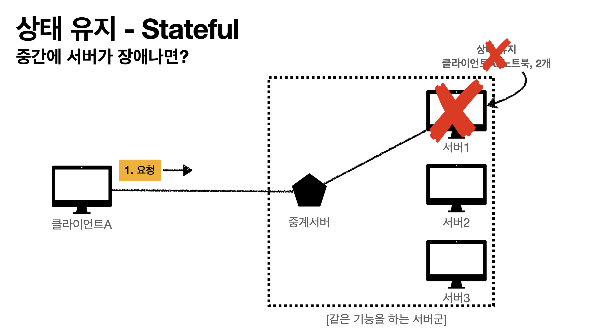
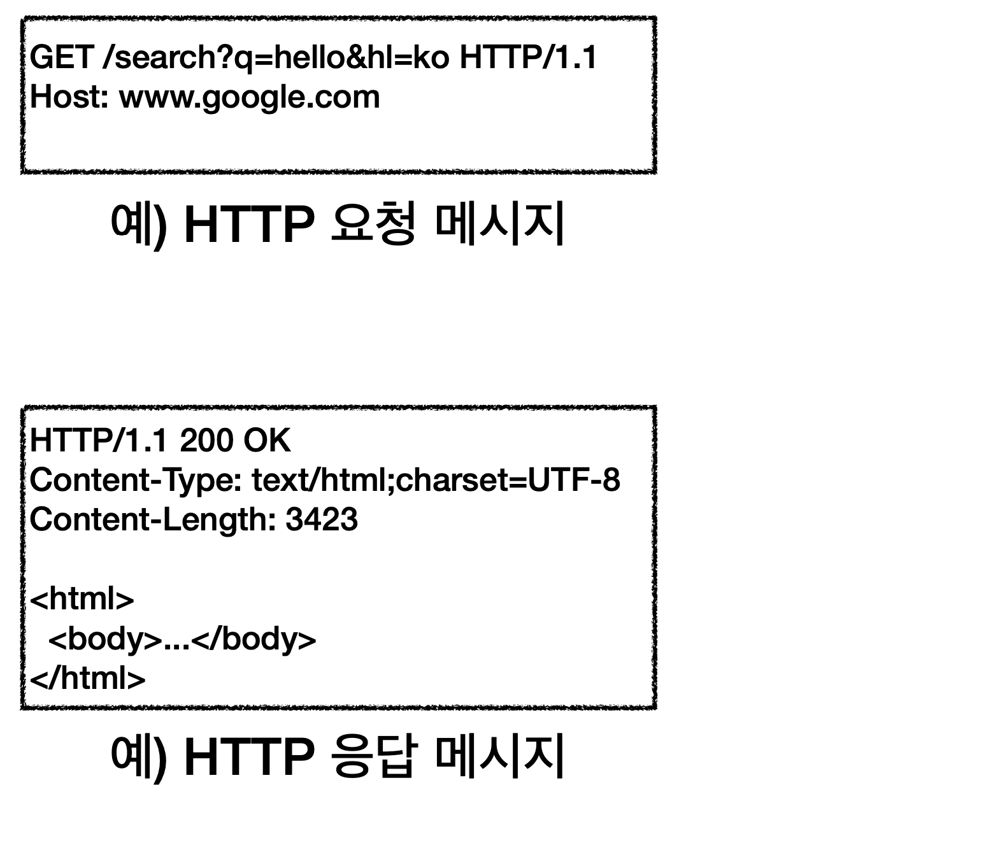
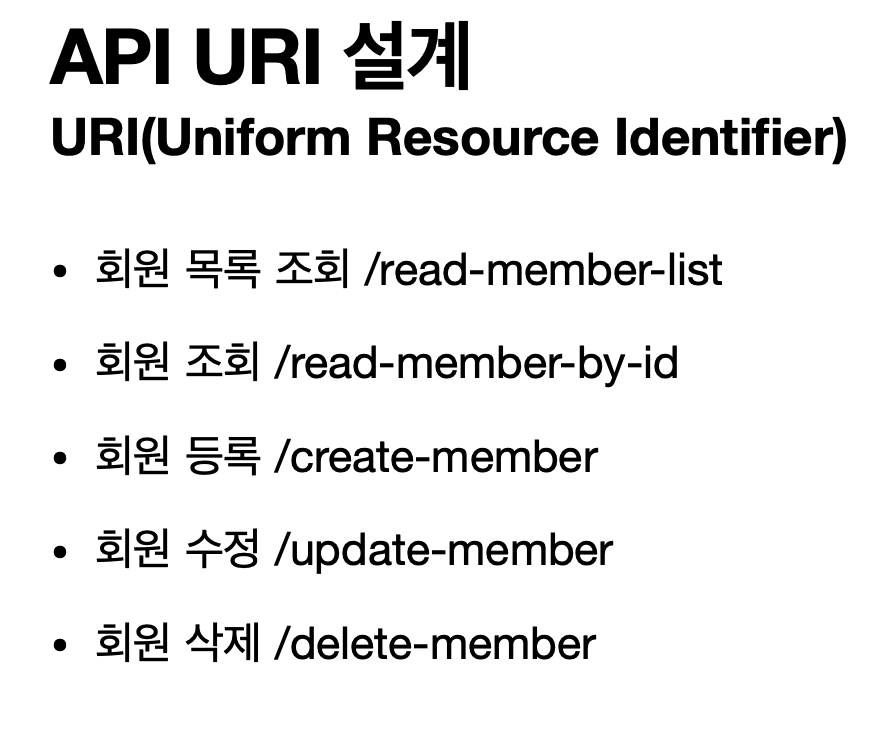
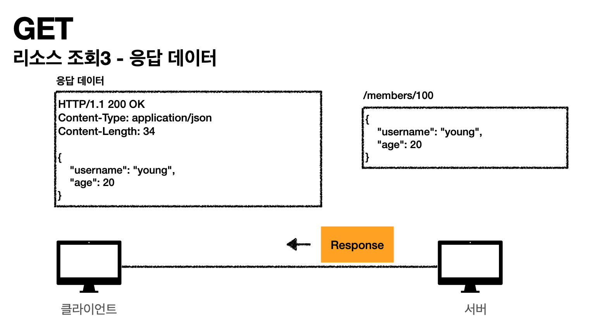

**[HTTP강좌]** [모든 개발자를 위한 HTTP 웹 기본지식](https://ihchoco.github.io/categories/#HTTP)
{: .notice--danger}

### 강의소개 

이번에는 인프런의 모든 개발자를 위한 HTTP 웹 기본 지식 내용을 정리해 보았습니다.

왜 갑자기 이 강의를 선택하였는가?(개발이 아닌 HTTP 지식을 왜 공부할까?)
 > 요즘은 모든것이 HTTP 기반 위에서 동작하며 \
 > WEB 개발을 한다면 당연히 HTTP에 대한 기본지식이 필수적으로 밑바탕이 되어야한다고 생각되서 입니다.
 > 
 > 개발을 할 때 단순한 기능 사용법만 숙지하는 것이 아닌 근본적인 원리를 파악하면 \
 > 좀 더 깊이있는 개발을 진행하실수 있을것 같습니다. 

이 강의의 강사님은 개발 세계에서 굉장히 유명하신 김영한(우아한형제들-개발팀장)님으로 굉장히 유명하고 잘 가르쳐주시는 분이라고 하며 현재 몇몇 강의를 듣고있는데 굉장히 큰 도움이 되고있습니다.

링크 : [모든 개발자를 위한 HTTP 웹 기본지식 - 김영한](https://www.inflearn.com/course/http-%EC%9B%B9-%EB%84%A4%ED%8A%B8%EC%9B%8C%ED%81%AC#)


> 또 사설이 길었는데 강의 내용을 챕터별로 정리해보겠습니다.


#### 3. 모든 것이 HTTP
##### 3-1. 모든 것이 HTTP

HTTP : HyperText Transfer Protocol 

문서간의 링크를 연결할 수 있는 HTML 문서를 전송하기 위한 프로토콜로 생성되었으나 현재는 \
HTML, TEXT, Image, 영상, Json, XML 등 거의 모든 형태의 데이터 전송 가능하다.

> 심지어 서버간의 데이터를 주고 받을 때도 대부분 HTTP 사용

게임서버 쪽에서만 TCP 통신으로 사용할 수 있지만 거의 대부분 HTTP 통신 사용

HTTP가 시간이 흐르면서 다양한 데이터를 전송할 수 있는 프로토콜로 변경.


초창기에 HTTP가 나오고 우리에게 중요한 것은 HTTP/1.1 버전이다.\
HTTP/2, 3은 성능 개선 버전일뿐 중요한 건 1.1이다.\
공부할 때는 HTTP 1.1버전으로 공부하자


HTTP1.1 , HTTP2 는 TCP를 사용
HTTP3 는 UDP를 사용(UDP는 TCP보다 빠르니까 성능 개선 하여 사용)


여기에서 보면 Protocol에 h2 : HTTP2 ,  h3 : Http3를 말한다.\


##### 3-2. 클라이언트 서버 구조
HTTP는 클라이언트가 HTTP 메시지를 통해서 서버에게 요청을 보내고 클라이언트는 대기를 한다.\
그 이후 서버에서 응답이 오면 클라이언트가 동작한다.\
이렇게 분리하는게 굉장히 중요하다. \
예전에는 클라이언트와 서버가 하나로 있었지만 현대에는 클라이언트와 서버가 따로 나누어졌다.\

> 이 개념이 굉장히 중요한데, 그 이유가 클라이언트는 단순히 UI를 그리는데 집중하고, 서버는 비즈니스로직이랑 데이터가 담겨있다. 이렇게 하면 클라이언트와 서버가 각각 독립적으로 진화할 수 있다.\
> 
> 1. 서버에서 PHP를 쓰다가 갑자기 JAVA로 변경. 그런데 클라이언트는 알 필요가 없다.
> 2. 회사가 잘되서 트래픽이 100배 증가했다. 백엔드만 손보면 된다. 클라이언트는 건드릴 필요가 없다.\
> 3. 이렇게 양쪽이 독립적으로 진행 할 수 있다.


##### 3-3. Stateful, Stateless
HTTP의 중요한 특징중 하나는 무상태 프로토콜을 지양한다.(Stateless)
 : 서버가 클라이언트의 상태를 보존하지 않는다.


예제를 확인해보자\
 > 일상적인 대화(상태유지)


  일상적인 대화(점원이 중간에 바뀌면)

 중간에 고객이 요구하는 상태를 유지하고 있음\
  이게 당연한 것 처럼 보여도 큰 차이를 만든다. 

  
  >일상적인 대화(무상태)


 여기서 큰차이가 없는것 같지만 고객이 마지막에 노트북 / 2개 /신용카드 이렇게 모든것을 말해주고 있음.\
 아까전(상태유지)에는 마지막에 그냥 신용카드로 구매할게요해서 C점원이 몇개 어떤거? 이랬는데 지금은 다름.\

 
 > 여기가 핵심
 > 1. 상태유지에서는 중간에 다른점원으로 바뀌면 장애나는거라고 생각하자. \
 개발자 입장에선 본인이 원하는 데이터가 없음
 > 2. 무상태에서는 고객이 필요한 데이터를 그때그때 다 넘겨주기 때문에 점원이 바뀌어도 크게 문제가 없다.\
 > 이게 클라이언트-서버 아키텍처에서는 엄청난 차이를 보인다.\
 > 이렇게 보면 무상태에서는 서버를 무한 증식 할 수 있다.(물론 한계는 있지만...)


1. 상태유지(Stateful - 항상 같은 서버 유지가 되야한다.)\
  클라이언트 A가 노트북 구매할게요 요청하면 서버 1번이 응답(노트북 기억)\
  클라이언트 A가 2개 구매할게요 요청하면 서버 1번이 응답(노트북 + 2개 기억)\
  이 구조에서 중간에 서버 1번이 아니라 2번으로 요청하면 2번의 경우 뭐가 2개지? 하면서 장애난다.\
  서버 1이 장애가 난다? 클라이언트는 또 처음부터 다시해야한다.\
  즉, 같은 서버를 유지해야하는게 상태유지(서버증설이 어려움)


2. 무상태(Stateless - 아무서버나 호출해도 된다)\
   클라이언트가 노트북, 2개, 신용카드로 구매하겠다고 요청하면 서버 1번이 응답(OK)\
   서버가 클라이언트 내용을 기억할 필요가 없다. 왜? 클라이언트가 요청할때 필요한 정보를 다 주니까  \
   갑자기 서버 1번이 장애난다? 노 프라블럼. 그냥 2번서버에 요청하도록 중계서버가 바꿔주면 되니깐.


 무상태는 스케일 아웃(수평 확장)에 굉장히 유리하다.\
 같은 기능을 하는 서버들을 엄청나게 추가 증설하는것.

```js
  Stateless 실무한계

  모든 것을 무상태로 설계 할 수 있는 경우도 있고 없는 경우도 있다.
  
  무상태
   예) 로그인이 필요없는 단순한 서비스 소개 화면
  
  상태 유지
   예) 로그인
  
  - 로그인한 사용자의 경우 로그인 했다는 상태를 서버에 유지
  - 일반적으로 브라우저 쿠키와 서버 세션등을 사용해서 상태 유지(세션서버가 죽으면 로그인이 모두 풀려버린다)
  - 상태 유지는 최소한만 사용

  한계가 있지만 상태유지는 최소한만 꼭 필요한곳에서만 사용하자.

  Stateful(상태유지) : 클라이언트에서 서버로 데이터 양이 상대적으로 적다.(이미 기존에 기억하고 있으니까)
  Stateless(무상태) : 클라리언트에서 서버로 데이터 양이 상대적으로 많다.(기존에 없으니 풀로 보내니깐) 
```


##### 3-4. 비연결성(connectionless)
기본적으로 TCP/IP는 연결 유지를 한다. \
예를 들면) TCP/IP 연결 후에 요청을 보내고 응답을 하는동안 계속 클라이언트와 서버간의 관계가 유지되고 있다.\
이렇게 관계를 유지하는 비용은 서버가 부담하고 있는데 클라이언트가 놀고만 있으면 이 비용이 부담스럽다..\

그렇다면 이번에 연결을 하지 않는 모델\
클라이언트에서 요청하고 서버에서 응답하자 마자 연결을 끊어버리기. 칼같은 관계\
서버는 연결 유지할 필요가 없으니, 최소한의 자원만 유지한다.\
클라이언트가 만약 수만대라면? 홀리쉣..유지비용 엄청날것같다.\


서버의 자원을 매우 효율적으로 사용 가능하다. 그런데 단점이 있다.\
클라이언트와 서버연결후에 거래 마치고 종료했는데 다시 그 서버와 클라이언트 통신이 필요하면\
TCP/IP통신을 한다면 3 way handshake가 또 필요하고 그만큼 시간이 추가 될 수 있다.\
구글에서 검색할때 네트워크 보면 엄청 많은 양의 데이터(js, css, 이미지등)파일을 받는데 그거 하나 받을때마다\
연결끊고 다시 연결하고 하면 오히려 손해 발생. \
 << 이점을 극복하기 위해 HTTP 지속 연결(Persistent Connections)로 문제 해결


이게 방금 위에서 말한 단점. 데이터 파일 하나 받을때마다 >> 연결 받고 종료 / 연결 받고 종료...반복

기본적으로 HTTP 지속연결하면 연결 / 다 받고 / 종료(이게 지속연결)


스테이트 리스를 기억하자. 같은 시간에 대용량 트래픽 발생. 이거 너무 어렵다.\
:: 진짜 00시 00분 00초에 수백만명 들어오면? 그래도 스테이스리스 하게 개발하자. 그러면 대응할 방법이 생긴다.

이벤트 페이지 설계할때 첫 페이지를 정적 페이지 뿌리기(정적상태의 순수 HTML) \
그리고 사람들이 그 안에서 놀게하고 보게한다음 이벤트 참여 버튼을 누르게 하는 방식도 사용한다.


##### 3-5. HTTP 메시지
지금은 바야흐로 HTTP 시대이다.\
HTTP는 요청메시지와 응답메시지의 구조가 아래 처럼 다르다.\


먼저 HTTP 메시지 구조에는 
 1. start-line(시작라인) 있고
 2. header 
 3. 무조건 필요한 공백
 4. 마지막으로 message body가 들어간다.
   
HTTP 요청 메시지
1. 처음에 GET을 넣고 이전 시간에 배운 패스를 넣고 HTTP 버전을 넣는다\(HTTP 시작라인)
2. 그다음 헤더가 온다(Host: www.google.com)
3. 그다음 메시지 바디에 공백(하지만 요청메시지도 body본문을 가질수 있다.)
  
HTTP 응답 메시지
  1. 시작라인에 HTTP 버전이 나오고 요청한게 200 OK
  2. 헤더값이 들어간다
  3. 공백라인 무조건 들어가고
  4. 메시지 바디가 들어간다(HTML 내용등) 


rfc7230 스펙에 HTTP-message 작성법이 나와있다.
1. start-line : 시작라인
2. *( header-field CRLF) : 여러개의 헤더 필드들
3. CRLF : 엔터한번
4. [message-body] : 메시지 바디가 올수도 안올수도 있다.

라고 공식 스펙이 나와있음. 


시작라인에 대해서 자세히 알아보자\

시작라인은 크게 request-line 과 status-line으로 나뉘어진다.
요청메시지는 request-line이라고 한다.\
request-line에는 처음에 method(GET/POST)를 넣고\ request-target(패스 : 요청대상) 들어가고 그다음 \HTTP-version이 들어간다. 


> HTTP요청 메시지(핵심)

GET은 서버에게 이 리소스를 달라고 하는것.\
POST는 내가 데이터를 줄게 너가 처리해줘 라는것.\
DEL는 삭제해달라는 의미


> 요청대상(패스)

절대 경로로 시작한다(absolute-path[?query]
/search?q=hello&hl=ko

그냥 절대경로로 시작한다는 것만 명심하자!!!


요청 메시지의 마지막은 HTTP version이 들어간다.


응답메시지는 
 start-line = request-line / status-line이 있는데 \
 앞에 요청은 request-line이었지만 응다브이 경우 status-line이다.\

 status-line : HTTP-version SP(스페이스) status-code SP(스페이스) reason-phrease CRLF(엔터) \
 여기서 status-code도 엄청 중요하다. 클라이언트가 보낸 요청이 성공했는지 실패했는지 알려주기에\
 200 : 성공 , 400 : 클라이언트가 뭔가 요청했으나 잘못함, 500 : 서버 내부 오류\

 reason-code : 그냥 짧게 상태 알려주기 위한 문구정도(OK 등)
 


header-field = field-name ":" OWS field-value OWS (OWS: 띄어쓰기 허용)
여기서 띄어쓰기도 굉장히 중요하다.\
Host: www.google.com < 이건 가능하다\
Host : www.google.com < 이건 불가능(Host 뒤에도 공백이 들어가면 NO)\
Host는 대소문자 구분 안하지만 www.google.com 여기는 대소문자 구분 한다.\
예시) HOST: www.google.com OK , HOST : www.Google.COM X\


HTTP 헤더의 용도는 HTTP 전송에 필요한 모든 부가 정보가 들어가 있다. \
 타입, 길이, 인증정보, 요청클라이언트(브라우저 크롬, 엣지)정보, 캐시 관리, 서버 정보 등...\
 메시지 바디 빼고 모든 메타정보가 다 들어가 있다.


메시지 바디\
 실제 전송할 데이터


HTTP는 단순하다.\
크게 성공하는 표준 기술은 단순하지만 확장 가능한 기술


챕터 정리


#### 4. HTTP 메서드
##### 4-1. HTTP API를 만들어보자

회원 정보를 관리하는 API를 만들어봐라 라는 요구사항\


처음에는 아래와 같이 생각(초보 개발자)\
그럴듯하게 이름을 지어서 생각해보자

그럼 이게 정말 좋은 URI설계일까?
>좋은 설계에서 가장 중요한것[핵심]\
> 무엇을 기준으로 설계? : 리소스 실별

그럼 리소스는 무엇일까?
 - 스타크래프트 예시로 미네랄을 캐라 라는게 있으면 미네랄을 캐라 라는게 리소스가 아니라 그 <b>미네랄</b> 자체가 리소스이다.
 - 회원을 조회해라 라는게 리소스가 아니라 <b>회원</b> 그 자체가 리소스이다.
 - 그냥 회원이라는 리소스를 URI에 매핑하면 된다.


그럼 아래와 같이 설계를 하게 된다.\
(일단 URI는 계층구조로 쓰자)\
여기서 계층구조는 /members하고 다시 / 하고 {id} 입력하는 구조


그런데 문제가 생긴다. 이게 똑같은건데 어떻게 구분하지?


> 여기서 왜 우리가 HTTP 메서드를 배우는지 알 수 있다.\
> URI는 리소스만 식별\
> 리소스와 해당 리소스를 대상으로 하는 행위를 분리\
> 그럼 행위(메서드)는 어떻게 구분?\
> 결국 메서드(GET,POST,DEL..)가 행위를 대신해주니 우리는 리소스만 식별해주면 된다


##### 4-2. HTTP 메서드 - GET, POST
주요 메서드 종류\
 GET : 조회\
 POST : 내가 데이터를 줄테니까 너가 치라해\
 PUT : 클라이언트에서 서버로 리소스를 보내는데 이 리소스로 대체해라\
(파일을 폴더에 복사해서 넣는거랑 비슷하다고 보면 된다.)\
 PATCH : 리소스를 부분적으로 변경(특정필드 변경)\
 DELETE : 리소스를 삭제

> TIP : 최근에는 리소스가 아니라 레프레젠테이션으로 변경되었으나 이해를 쉽게 하기 위해 리소스 사용


기타 메서드 종류(그냥 참고용)


본격적으로 GET부터 시작\
 이 패스에 있는 자원(+쿼리 파라미터)을 주세요. 라는 뜻.\
 데이터 전달시 패스와 쿼리파라미터로 요청한다.


1. 클라이언트가 서버로 데이터 요청 

2. 클라이언트가 (/members/100 조회)하는것을 보고 데이터 찾고, JSON타입(다른 타입 가능)으로 데이터 만들기

3. 서버에서 응답 메시지를 만들고 데이터 넣고 클라이언트로 보내기 


포스트는 요청할때 거의 데이터를 전달하지 않지만, \
클라이언트가 서버로 내가 데이터를 보낸다.\
ex) {"username" : "hello"....} 
> [핵심]메시지 바디를 통해 서버로 요청 데이터 전달\
> 데이터를 전달해서 처리해달라고 요청\
> 서버는 들어온 데이터를 처리하는 모든 기능을 수행한다.\
> (전달된 데이터로 신규 리소스 등록, 프로세스 처리에 사용)


1. 약속을 먼저 할 필요가 있다. \
   클라이언트가 Post로 /members라고 보내면 서버는 \
   그 데이터를 저장하겠다.라고 약속을 해둔다.

2. 서버에서 데이터를 받고 신규로 데이터베이스에 등록하고 \
   신규 식별자를 생성(/members/100) < 새로 생성된 리소스 번호 

3. 응답 데이터 보내기\
  201 Create는 신규로 데이터가 생성됬다는 의미\
  Location : /members/100은 자원이 생성된 경로를 보내준다.


POST 정리\
 HTML 양식에 입력된 필드(FORM)으로 전송된 데이터 처리\
1. 회원가입, 배달 주문등
2. 게시판 글쓰기, 댓글달기
3. 신규 주문 생성(아직 식별하지 않은 새 리소스)
4. 기존 자원에 데이터 추가(문서 끝에 내용 추가)
   


그래서 다시 정리해보면 \
POST는 주로 새 리소스를 생성하는데 사용하고 처리하는데 사용한다\
단순히 생성하는걸 넘어서 기존 데이터를 변경하는데에도 사용(상태 변경)\
결재완료 > 배달시작 > 배달완료(프로세스 처리 단계)에서도 POST를 사용\
단순히 값 하나를 바꾸는데도 POST 사용\
POST의 결과로 새로 리소스가 생성되지 않아도 사용 가능

예) Post/orders/{orderId}/start-delivery(컨트롤 URI)\
아까는 미네랄 리소스만 URI에 쓰라고 했으면서 왜 start-delivery가 들어가냐?\
> 그런데 그것만으로 안되는 경우에는 위와 같이 동사(start-delivery) URI를 추가할 수있는데 이런걸 <b>컨틀로 URI</b>라고 한다.
> 
>또 조회용으로 JSON에 데이터 담아서 쿼리스트링 방식이 아닌 HTML Body에넣어서 조회하고 싶을때에도(GET은 바디메시지를 넣을수는 있지만 지원하지 않는 서버가 많다..) 이런 경우에도 POST사용\
(조회이지만 POST사용 하는 경우)\
> POST는 모든것을 할 수 있지만 조회는 GET으로 사용하는게 좋다\
> (캐싱을 위해서)


##### 4-3. HTTP메서드 - PUT, PATCH, DELETE
PUT은 파일을 복사하여 폴더에 넣는것과 비슷하다.\
기존에 파일이 없으면 그대로 추가, 있으면 그대로 덮어씌운다.\
완전히 리소스를 대체한다.\
예시) PUT으로 /members/100번이라고 요청한다.\
그러면 /members/100번이라는 리소스가 없으면 신규 생성한다.\
그런데 만약에 기존에 있으면 그걸 삭제하고 이걸로 완전 대체한다.

클라이언트가 구체적인 리소스의 전체 위치를 알고 요청하는것.

1. 클라이언트 요청

2. 서버에서 응답


>> 


1. 클라이언트 요청(리소스 없는경우)

2. 서버(리소스 없는 경우)


>> 


1. 클라이언트(리소스를 완전히 대체한다)


2. 서버(리소스를 완전히 대체한다)\
  이렇게 되면 age만 생기게 된다. 기존에 age, username두개 였지만 기존거 삭제하고 완전히 age만 들어가게 된다.[핵심]


즉 PUT은 단순히 UPDATE가 아니다. 기존에 있는것을 삭제하고 새로 추가하는거라고 생각해야한다.

그렇다면 단순히 UPDATE는 어떻게 할까? PATCH를 쓰면된다.


 1. 클라이언트 요청

 2. 서버 응답(해당 부분만 변경)


>>

DELETE(리소스 제거)


1. 클라이언트 요청(members/100 요청 하면)

2. 서버 응답(서버는 member 100을 삭제한다)


> PATCH가 안되는 서버가 가아아끔 있다. \
> 그럼 POST를 사용하자. POST는 무적이다.

##### 4-4. HTTP 메서드의 속성


GET, HEAD : 안전하다(단순조회니깐)\
POST, PUT, PATCH, DEL... : 안전하지 않다.


리소스 요청을 해도 변경이 없는것을 한전하다고 한다(GET)\
안전하지만 만약 계속 조회하면? 로그가 계속 쌓이게 되고 터진다..\
하지만 그런 부분은 고려하지 않는다. 그래도 리소스 변경은 되지 않으니까 안전


멱등(Idempotent)\
한번 호출하든 두번 호출하든 100번 호출하든 결과가 똑같아야 한다.

클라이언트가 똑같은 파일을 요청할때 결과가 똑같아야한다.\
(PUT은 기존걸 날리고 요청하고 그것만 생성 결과는 같다.)

POST는 결재라고 생각하자. 두번 결재하면 두번 배송되는것.\
이런건 절대로 두번 호출하면 안된다. 중복결재되면 사람 화나지..


그럼 멱등은 언제 쓰냐? 이런 개념이 왜 필요한가?\
자동 복구 매커니즘을 위해서. 예를들어 DEL호출했는데 서버에 응답이 없다. 그럼 클라이언트에서 자동으로 서버에 다시 요청하는것.\
GET, PUT, DEL은 이런데 쓸수 있다.\
POST를 여기에 쓰면? 난리난다. 결재 100번 된다...\


멱등\
  Q : 재요청 중간에 다른곳에서 리소스를 변경해버리면?
  1. 사용자1 : GET -> username : A, age : 20
  2. 사용자2 : PUT -> username : A, age : 30
  3. 사용자1 : GET -> username : A, age : 30 \
  <- 사용자 2의 영향으로 바뀐 데이터 조회

  A : 멱등은 외부 요인으로 중간에 리소스가 변경되는 것 까지는 고려하지 않는다.

(이런부분은 그냥 멱등하지 않는다고 판단. 당연히 이게 맞는것. 내가 조회하다가 다른사람이 이걸 바꿨는데 다시 조회하면 당연히 바뀐데이터가 나와야지 그 이전 데이터가 나오는건 말이 안된다.) 

> 캐시가능(Cacheable)
1. 응답 결과 리소스를 캐시해서 사용해도 되는가?
2. GET, HEAD, POST, PATCH 캐시가능
3. 실제로는 GET,HEAD 정도만 캐시로 사용
   - POST, PATCH는 본문 내용까지 캐시 키로 고려해야 하는데, 구현이 어렵다.

캐시는 뒤에서 자세히 설명할건데.. 
> 응답 결과를 캐시에서 사용 가능한가?

웹브라우저에서 되게 큰 이미지를 요청 했는데 또 요청을 할 필요가 있을까?\
똑같은 이미지를 계속 반복해서 다운받으면 오래걸리니깐, 웹 브라우저가 내부에 이 이미지를 저장하고 있으면 편하다. 

GET, HEAD 정도만 캐시로 사용하고 POST, PATCH는 캐시 구현이 어렵다.\

GET은 딱 URL만 키로 잡고 캐시로 쓰면 된다.

>실무에서는 GET만 캐시로 잡고 사용한다는 점. 기억하자