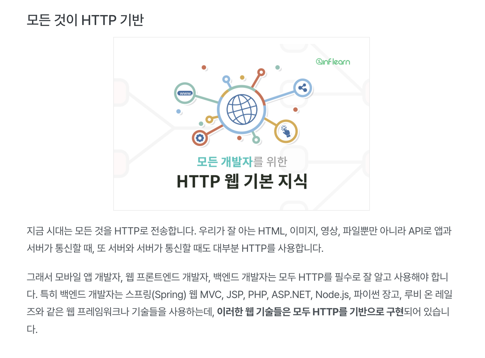

**[HTTP강좌]** [모든 개발자를 위한 HTTP 웹 기본지식](https://ihchoco.github.io/categories/#HTTP)
{: .notice--danger}

### 강의소개

이번에는 인프런의 모든 개발자를 위한 HTTP 웹 기본 지식 내용을 정리해 보았습니다.

왜 갑자기 이 강의를 선택하였는가?(개발이 아닌 HTTP 지식을 왜 공부할까?)
 > 요즘은 모든것이 HTTP 기반 위에서 동작하며 \
 > WEB 개발을 한다면 당연히 HTTP에 대한 기본지식이 필수적으로 밑바탕이 되어야한다고 생각되서 입니다.
 > 
 > 개발을 할 때 단순한 기능 사용법만 숙지하는 것이 아닌 근본적인 원리를 파악하면 \
 > 좀 더 깊이있는 개발을 진행하실수 있을것 같습니다. 

이 강의의 강사님은 개발 세계에서 굉장히 유명하신 김영한(우아한형제들-개발팀장)님으로 굉장히 유명하고 잘 가르쳐주시는 분이라고 하며 현재 몇몇 강의를 듣고있는데 굉장히 큰 도움이 되고있습니다.

링크 : [모든 개발자를 위한 HTTP 웹 기본지식 - 김영한](https://www.inflearn.com/course/http-%EC%9B%B9-%EB%84%A4%ED%8A%B8%EC%9B%8C%ED%81%AC#)



> 또 사설이 길었는데 강의 내용을 챕터별로 정리해보겠습니다.


#### 5. HTTP 메서드 활용
##### 5-1. 클라이언트에서 서버로 데이터 전송
클라이언트에서 서버로 데이터 전송(2가지 방법)
 1. 쿼리 파라미터를 통한 데이터 전송
    - GET
    - 주로 정렬 필터(검색어)
 2. 메시지 바디를 통한 데이터 전송
    - POST, PUT, PATCH
    - 회원가입, 상품 주문, 리소스 등록, 리소스 변경

크게 4가지 상황 예시
  1. 정적 데이터 조회
       - 쿼리 피라미터 미사용
       - 이미, 정적 텍스트 문서
       - 조회는 GET 사용
       - 정적 데이터는 일반적으로 쿼리 파라미터 없이 리소스 경로로 단순하게 조회가능
       - 예시) /system/image/logo.img 를 그냥 입력하면 서버에서는 이미지를 응답해준다.(정적데이터)

  2. 동적 데이터 조회
       - https://www.google.com/search?q=hello&hl=ko
       - 이때 쿼리 파라미터 사용
       - 클라이언트에서 q=hello&hl=ko 라고 보내면 서버에서는 key, value로 받아서 처리
       - 주로 검색, 게시판 목록에서 정렬 필터(껌색어)
       - 조회 조건을 줄여주는 필터, 조회 결과를 정렬하느 정렬 조건에 주로 사용
       - 조회는 GET 사용
       - GET은 쿼리 파라미터 사용해서 데이터를 전달

  3. HTML Form 데이터 전송
       - form action = "/save" method="post" 전송
       ```html
        <form action="/save" method="post">
          <input type="text" name="username">
          <input type="text" name="age">
          <button type="submit">전송</button>
        </form>
       ```
       - 웹브라우저가 생성한 요청 HTTP 메시지
       ```js
      POST /save HTTP/1.1
      HOST: localhost:8080
      Content-Type: application/x-www-form-urlencoded

      //HTTP Body
      username=kim&age=20
       ```
       - multipart/form-data
       ```html
      <form action="/save" method="multipart/form-data">
          <input type="text" name="username">
          <input type="text" name="age">
          <input type="file" name="file1">
          <button type="submit">전송</button>
        </form>
       ```
      - 웹브라우저가 생성한 요청 HTTP 메시지
       ```js
      POST /save HTTP/1.1
      HOST: localhost:8080
      Content-Type: multipart/form-data; boundary=-----XXX

      //boundary= -----XXX로 구분해서 멀티파트로 나눠서 보내준다.

      //HTTP Body
      ------XXX
      Content-Disposition: form-data; name="username"

      kim
      ------XXX
      Content-Displotion: form-data; name="age"

      20
      ------XXX
      Content-Disposition: form-data; name="file1"; filename="intro.png"
      Content-Type: image/png

      100xcjvadfsjklafjalkdsfj....
       ```
      - HTML Form submit 시 POST 전송 예) 회원가입, 상품주문, 데이터 변경
      - Content-Type: application/x-www-form-urlencoded 사용\
        : for의 내용을 메시지 바디를 통해서 전송(key=value. 쿼리 파라미터 형식)\
        전송 데이터를 url encoding 처리\
        예) abc김 -> abc%EA%B9%80
      - Content-Type: multipart/form-data\
        : 파일 업로드 같은 바이너리 데이터 전송시 사용\
        : 다른 종류의 여러 파일과 폼의 내용 함께 전송 가능(그래서 이름이 multipart)
      - 참고 : HTML Form 전송은 GET, POST 만 지원

HTTP API 데이터 전송\
 예) 안드로이드 앱에서 서버로 데이터를 바로 전송해야할때를 HTTP API로 데이터 전송한다고 말한다.\

POST /members HTTP/1.1\
Content-Type: application/json

{
  "username" : "young",
  "age" : 20
}

위 형식으로 넘긴다.

정리
```js
1. 서버 to 서버
 - 백엔드 시스템 통신
2. 앱 클라이언트
 - 아이폰, 안드로이드
3. 웹 클라이언트
 HTML에서 Form 전송 대신 자바 스크립트를 통한 통신에 사용(AJAX)
 예) React, ViewJS 같은 웹 클라이언트와 API 통신
 (프론트는 리액트로 만들고 백엔드는 API통신할수있게 만들어서 주고 받으면서 사용)
4. POST, PUT, PATCH : 메시지 바디를 통해 데이터 전송
5. GET : 조회, 쿼리 파라미터로 데이터 전달
6. Content-Type: application/json을 주로 사용(사실상 표준)
   - TEXT,XML,JSON 등등
```

##### 5-2. HTTP API 설계 예시
HTTP API - 컬렉션
 - POST 기반 등록
 - 예) 회원 관리 API 제공

HTTP API - 스토어
 - PUT 기반 등록
 - 예) 정적 컨텐츠 관리, 원격 파일 관리

HTML FORM 사용
 - 웹 페이지 회원 관리
 - GET, POST만 지원


API 설계 - POST 기반 등록
1. 회원 목록 /members -> GET
2. 회원 등록 /members -> POST
3. 회원 조회 /members/{id} -> GET
4. 회원 수정 /members/{id} -> PATCH, PUT, POST < 여기서는 PATCH를 쓰는게 제일 좋다
5. 회원 삭제 /members/{id} -> DELETE

>POST - 신규자원 등록 특징[핵심]

클아이언트는 등록될 리소스의 URI를 모른다.
1. 회원 등록 /members -> POST
2. POST /members
   
서버가 새로 등록된 리소스 URI를 생성해준다.\
HTTP/1.1 201 Created
Location: /members/100

POST로 등록할때는 서버에서 등록하고 나서 그 ID를 찾아서 Location을 클라이언트에 알려준다.\
[서버가 새로 등록된 리소스 URI를 생성해준다.]\
예) Location : /members/100

>컬렉션(Collection)
 1. 서버가 관리하는 리소스 디렉토리
 2. 서버가 리소스의 URI를 생성하고 관리
 3. 여기서 컬렉션은 /members

>API 설계 - PUT 기본 등록

파일 등록 /files/{filename} -> PUT \
파일을 등록할때는 기존에 있으면 덮어씌우고 없으면 새로 추가하니까 PUT이 딱맞는다.

파일 삭제 /files/{filename} -> DELETE\
파일 대량 등록 /files -> POST
파일 목록 /files -> GET
파일 조회 /files/{filename} -> GET

파일을 등록할 때 클라이언트가 리소스 URI를 알고 있어야 한다.
 - 파일 등록 /files/{filename} -> PUT
 - PUT /files/star.jpg >> 여기서 star.jpg가 리소스 URI

클라이언트가 직접 리소스의 URI를 지정한다.\
>스토어(Store)
 - 클라이언트가 관리하는 리소스 저장소
 - 클라이언트가 리소스의 URI를 알고 관리
 - 여기서 스토어는 /files

TIP : POST는 URI를 몰라서 서버가 생성하고 Location을 알려주지만, PUT은 클라이언트가 URI를 알고있는경우\
거의 대부분 POST기반의 컬렉션을 사용한다.

HTML FORM 사용
 - HTML FORM은 GET, POST만 지원
 - AJAX 같은 기술을 사용해서 해결 가능

```html
회원 목록 /members -> GET
회원 등록 폼 /members/new -> GET
회원 등록 /members/new, /members -> POST
회원 조회 /members/{id} -> GET
회원 수정 폼 /members/{id}/edit ->GET
회원 수정 /members/{id}/edit, /members/{id} -> POST
회원 삭제 /members/{id}/delete -> POST
```

HTML FORM은 GET, POST만 지원\
>컨트롤 URI[핵심] : 꼭 동사로 사용하자
 - GET, POST만 지원하므로 제약이 있다.
 - 이런 제약을 해결하기 위해 동사로 된 리소스 경로 사용
 - POST의 /new, /edit, /delete가 컨틀로 URI
 - HTTP 메서드로 해결하기 애매한 경우 사용(HTTP API 포함)

> 최대한 리소스라는 개념을 가지고 URI를 설계하고 그게 안될때 컨트롤 URI를 대체적으로 사용한다고 생각하자.

```html
정리[참고하면 좋은 URI 설계 개념]

문서(document)
 - 단일 개념(파일 하나, 객체 인스턴스, 데이터베이스 row)
 - 예) /members/100, /files/star.jpg <=== 이렇게 하나를 딱 찍은것.

컬렉션(collection)
 - 서버가 관리하는 리소스 디렉터리
 - 서버가 리소스의 URI를 생성하고 관리
 - 예) /members

스토어(store)
 - 클라이언트가 관리하는 자원 저장소
 - 클라이언트가 리소스의 URI를 알고 관리
 - 예) /files

컨트롤러(controller), 컨트롤 URI
- 문서, 컬렉션, 스토어로 해결하기 어려운 추가 프로세스 실행
- 동사를 직접 사용
- 예) /members/{id}/delete
```


#### 6. HTTP 상태코드
##### 6-1. 상태 코드 소개

1xx : 요청이 수신되어 처리중\
2xx : 요청 정상 처리\
3xx : 요청을 완료하려면 추가 행동이 필요\
4xx : 클라이언트 오류, 잘못된 문법등으로 서버가 요청 수행 x\
5xx : 서버 오류, 서버가 정상 요청을 처리하지 못함

만약 모르는 상태 코드가 나타나면?\
ex) 미래의 상태코드가 나타나도 아래와 같이 생각하자
1. 299 ??? > 2xx(Successful)
2. 451 ??? > 4xx(Client Error)
3. 599 ??? > 5xx(Server Error)


1xx : 요청 수신중(거의 사용X PASS)\
2xx : 성공\
2xx(Successful) : 클라이언트의 요청을 성공적으로 처리\
1. 200 OK : 요청성공
2. 201 Created : 요청 성공해서 새로운 리소스가 생성됨\(클라이언트가 POST요청하면 서버에서 생성하고 리소스 생성)
3. 202 Accepted : 요청이 접수되었으나 처리가 완료되지 않았음
4. 204 No Content : 서버가 요청을 성공적으로 수행했지만, 응답 페이로드 본문에 보낼 데이터가 없음\
 ex) 웹 문서 편집기에서 save 버튼\
 (중간중간 저장할때마다 Redirect로 새로 저장된것을 보여주는것보다 편집하다가 바로 저장누르고 계속 작업하고 다시 저장하고..) save버튼을 누르고 그냥 계속 작업해야 하는 경우
  

3xx(Redirection) : 요청을 완료하기 위해 유저 에이전트(웹 브라우저)의 추가 조치 필요\

리다이렉션 이해 : 웹 브라우저는 3xx 응답의 결과에 Location 헤더가 있으면, Location 위치로 자동 이동(리다이렉트)\

1.영구 리다이렉션 - 특정 리소스의 URI가 영구적으로 이동\
예) /members -> /users\
예) /event -> /new-event

2.일시 리다이렉션 - 일시적인 변경\
 주문 완료 후 주문 내역 화면으로 이동\
 PRG : Post/Redirect/Get

3.특수 리다이렉션\
결과 대신 캐시를 사용

301로 리다이렉션 하게되면 처음에 POST로 바디에 담아서 보내지만 서버에서 301 Moved Permanet 리다이렉트로\
클라이언트가 다시 새로 바뀐 URL로 요청하게 되나 이때 POST->GET으로 변하게 되고 body내용을 잃어버리게 된다.

301 Moved Permanently\
 : 리다이렉트시 요청 메서드가 GET으로 변하고, 본문이 제거 될 수 있음(MAY)

308 Permanet Redirect\
 : 301과 기능은 같음, 리다이렉트시 요청 메서드와 본문 유지(처음 POST를 보내면 리다이렉트도 POST)
 


#### 7. HTTP 헤더1 - 일반 헤
##### 7-1. 표현


```html
[헤더]
HTTP/1.1 200 OK\
Content-Type: text/html; charset=UTF-8\
Content-Length: 342

[바디 - 표현부분]
<html>
    <body>...</body>
</html>
```

Content-Type : 표현 데이터의 형식\
Content-Encoding : 표현 데이터의 압축 방식\
Content-Language : 표현 데이터의 자연 언어\
Content-Length : 표현 데이터의 길이

표현은 리소스가 있는데 HTML, JSON 표현으로 전달할거야?\
라고 해서 표현이라는 말 사용

1. Content-Type : 미디어 타입, 문자 인코딩\
   예) text/html; charset=utf-8\
      application/json\
      image/png

2. Content-Encoding : 표현 데이터 인코딩\
   표현 데이터를 압축하기 위해서 사용\
  Content-Encoding : gzip,identity 등

 3. Content-Language : 표현 데이터의 자연 언어\
  예) ko, en, en-US

 4. Content-Length : 표현 데이터의 길이(바이트 단위)


[협상] 콘텐츠 네고시에이션\
클라이언트가 선호하는 표현 요청\
Accept : 클라이언트가 선호하는 미디어 타입 전달\
Accept-Charset : 클라이언트가 선호하는 문자 인코딩\
Accept-Encoding : 클라이언트가 선호하는 압축 인코딩\
Accept-Lanugage : 클라이언트가 선호하는 자연 언어

전송 4가지 방식
1. 단순 전송 : Content-Length
2. 압축 전송 : Content-Encoding
3. 분할 전송 : Transfer-Encoding : chunked
4. 범위 전송 : Range, Content-Range


쿠키 (로그인)\
웹브라우저 내에는 쿠키를 저장하는 저장소가 있다.\
URL에 사용자 정보를 넣을 필요없이 COOKIE를 이용해서 사용자를 구분할 수 있다.

예) set-cooike: sessionId=abcde1234; expires=SAT, 26~;
PATH=/; domain=.google.com; Secure

사용처 : 사용자 로그인 세션관리, 광고 정보 트래킹\
쿠키 정보는 항상 서버에 전송됨 
- 네트워크 트래픽 추가 유발
- 쵯소한의 정보만 사용(세션 id, 인증 토큰)
- 서버에 전송하지 않고, 웹브라우저 내부에 데이터를 저장하고 싶으면 웹스토리지 참고
- 보안에 민감한 데이터는 저장하면 안됨(주민번호, 신용카드 번호)

 
캐시 : 캐시가 없을때\
이미지를 요청할때 1.1M 전송

캐시가 없을때는 한번더 요청하면 또 1.1M전송 데이터 필요

캐시가 없으면?
1. 데이터가 변경되지 않아도 계속 네트워크를 통해서 데이터를 다운로드 받아야한다.
2. 인터넷 네트워크는 매우 느리고 비싸다
3. 브라우저 로딩 속도가 느리다.
4. 느린 사용자 경험

캐시 적용\
서버에서 HTTP헤더에 아래와 같이 추가\
cache-control: max-age=60

웹브라우저에는 캐시를 보관하는곳이 있고 캐시를 적용한 데이터는 저기서 보관하게 된다. 추후 요청할때 캐쉬에서 먼저 있는지 찾아보기 때문에 속도가 빠르다.

캐시 시간 초과 : 이럴 경우에는 당연히 다시 요청해야 한다.\
다시 응답 결과를 캐시에 저장


