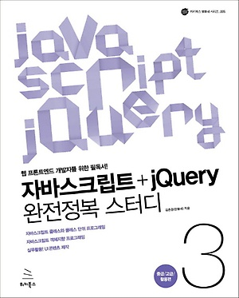

### 책소개

> 이전에 포스팅했던 Javascript 내용의 경우 인프런의 (자바스크립트+jquery 기초부터 실무까지[고급편])
강의를 통해 학습한 내용을 복습 및 정리하였고 이번 포스팅의 경우에는 같은 강사님이 
작성하신 책 (자바스크립트+jQuery 완전정복 스터디 3: 중급 고급 활용편)의 내용을 정리해보았다.
이전 포스팅과 비슷한 내용이 반복되는이유는 인강과 책에 나오는 예제가 비슷하기 때문이다.\
그러면 도대체 왜 똑같은 내용을 계속 반복해서 설명하는가? \
한번에 모든것을 이해하지 못하기 때문에 최대한 많이 반복하고 보면서 내것으로 만들기 위해서이다.




> 많은 책을 보지는 않았지만 이 책의 경우는 다른 javascript 책과는 조금 달랐다.
> 
> 현재 코어 자바스크립트, 더글라스 크락포드, 모던 자바스크립트 핵심가이드등 다양한 JS서적을 가지고 있지만 개인적으로 이 책과 더글라스 크락포드 책이 가장 마음에 든다.
>
>이 책의 경우 html,css,js의 문법의 경우는 전혀 설명하지 않지만 나에게 정말 필요했던 자바스크립트를 현업에서 어떻게 작성해야하는지 플러그인은 어떻게 만들어야하는지에 대해서 아주 잘 설명이 되어있다구 생각한다.
>
>인강과 책을 통해서 회사에서 기존에 작성되어 있던 플러그인 코드가 어떻게 동작되고 있는지 좀 더 이해가 잘 되었고 많은 도움이 되었다.
>
> 또 사설이 길었는데 이제부터 책에 대한 내용을 다시한번 정리해보겠다. 


#### 1. 자바스크립트 클래스 기초
##### 클래스 소개

함수 : 특정 기능을 하는 구문\
클래스 : 연관있는 변수와 함수를 그룹화

프로젝트를 진행하다 보면 함수 개수가 적게는 수백개에서 수천 수만개가 기본으로 만들어진다.\
이렇게 많아지다 보면 문제가 발생한 경우 코드 수정이 관리가 어려워진다.

ex) 우리나라가 만약 시도군으로 나누지 않고 산다면? \
서울사는 김철수를 찾고싶을때? 우리나라 전국에서 검색을 해야한다.\
but 현재처럼 시도군으로 잘 나눠져 있으면? 서울에서만 김철수를 검색하면 된다.

> 프로그래밍에서 메인페이지를 만들때
> 
> 1. 메인 메뉴 기능은 메인메뉴 클래스
> 2. 이미지 슬라이더 기능은 이미지 슬라이더 클래스
> 3. 탭패널 기능은 탭패널 클래스
> 4. 아코디언 메뉴기능은 아코디언 메뉴 클래스
> 5. 롤링 베너 기능은 롤링 배너 클래스
> 
> 각각의 요소를 객체 단위로 나누어 작업할 수 있다.

[참고용]함수단위 코딩
```js
$(document).ready(function(){
    tabMenu('#tabMenu1');
});

function tabMenu(selector){
    var $tabMenu = null;
    var $menuItems = null;
    var $selectMenuItem = null;

    function init(selector){
        $tabMenu = $(selector);
        $menuItems = $tabMenu.find("li");
    }

    function initEvent(){
        $menuItems.on("click", function(){
            setSelectItem($(this));
        })
    }

    function setSelectItem($menuItem){
        //기존 아이템 비활성화 처리
        if($selectMenuItem){
            $selectMenuItem.removeClass("select");
        }

        $selectMenuItem = $menuItem;
        $selectMenuItem.addClass("select");
    }

    function setSelectionItemAt(index){
        setSelectItem($menuItems.eq(index));
    }

    init(selector);
    initEvent();
}
```

> 이렇게 작성하였을때 외부에서 수동으로 버튼을 클릭해서 setSelectionItemAt(index)를 호출할 수 있을까?
결과는 NO

그러면 어떻게 해야 사용할 수 있을까?

```js
function tabMenu(selector){
    .....

    init(selector);
    initEvent();

    return {
        "setSelectItemAt" : setSelectItemAt
    }
}

//이렇게 return에 외부에서 사용할 수 있게 해주고 싶은 메서드를 return에 객체를 만들고 거기에 넣어준다.
```

위의 코드를 클래스 단위 코드로 바꿔보자\
[참고용]클래스 단위 코딩
```js
$(document).ready(function(){
    new TabMenu('#tabMenu1');
});

//탭메뉴 클래스 정의(설계)
function TabMenu(selector){
    //this는 new라는 연산자로 메모리에 객체가 올라갔을때 사용할 수 있는것이다.
    this.init(selector);
    this.initEvent();
}

//요소 초기화
TabMenu.prototype.init = function(selector){
    console.log("init호출");
    //인스턴스가 생성이 되면 탭메뉴가 생성이 되고 li태그를 찾아와라.
    this.tabMenu = $(selector);
    this.$menuItems = this.tabMenu.find("li");
}

//이벤트 초기화
TabMenu.prototype.initEvent = function(){
    console.log("initEvent호출");
    var localThis = this;
    this.$menuItems.on("click", function(){
        console.log(this);
        //선택된 아이템의 인덱스를 가지고 메서드를 호출하고 있다.
        localThis.setSelectMenuItemAt($(this).index());
    });
}

//n번째 탬메뉴 선택
TabMenu.prototype.setSelectMenuItemAt = function(index){
    this.$menuItems.removeClass("select");
    this.$menuItems.eq(index).addClass("select");
}

//초기화 클릭시 이벤트 발생
TabMenu.prototype.clearItems = function(){
    this.$menuItems.removeClass("select");
}       
```

##### 클래스 프로퍼티와 메서드란?
인스턴스를 생성하지 않고도 사용할 수 있는 프로퍼티와 메서드. 이를 클래스 프로퍼티와 메서드라고 부른다.\
(JAVA에서의 static메서드와 유사하다)

만드는법
```js
function 클래스이름(){
    ...
}
클래스이름.프로퍼티 = 값;
클래스이름.메서드이름 = function(){}
```
사용법 : 인스턴스 생성 필요없이 접근연산자(.)를 이용하여 사용\
클래스이름.프로퍼티;
클래스이름.메서드이름();

그럼 이걸 왜 사용하는걸까?

주로 도움을 주는 유틸리티성 기능 or 실행하더라도 내부 데이터에 영향을 주지 않고 독집적으로 실행되는 기능\
ex)
```js
function TabMenu(){
    ....
} 

TabMenu.version = "1.0";
TabMenu.getInfo = function(){
    var info = {
        developer : "개발자",
        email : "test@gmail.com",
        desc : "탭메ㅠ를 구현한 클래스입니다."
    }
    return info;
}
//기존 탭메뉴 버전 정보가 담긴 version 클래스 프로퍼티와 제작자 정보를 알 수 있는 getinfo()라는 클래스 메서드를 추가하였음.


//이미 js에는 클래스 프로퍼티와 메서드를 많이 사용하고 있다.
Math.floor(Math.random()*10);

Math.max(10, 20);
```

##### 패키지란?
패키지 : 연관 있는 클래스를 묶을 때 사용하는 기술이다.\
라이브러리 : 여러 패키지가 모여 하나의 커다란 라이브러리가 된다.

자바스크립트에서는 패키니 문법을 제공하지 않아 흉내 내어 사용한다.
```js
var packageName = {}
or
var packageName = new Object()

packageName.className = function(){
    .....
}
```
```js
// 유틸리티 성격의 클래스 그룹
var ddan = {};
ddan.utils = {};
ddan.utils.String = function();
ddan.utils.Format = function();
....
//인스턴스 생성
var myStr = new ddan.utils.String();

//UI 컨트롤 클래스 그룹
var ddan = {};
ddan.ui = {};
ddan.ui.ImageSlider = function();
ddan.ui.tabMenu = function();
ddan.ui.tabPanel = function();

//인스턴스 생성
var imgSlider = new ddan.ui.ImageSlider()
```

#### 2. jQuery 플러그인 제작
##### jQuery 확장 소개
jQuery는 jQuery가 제공하는 기능 이외의 기능이 필요할 경우 다른 개발자가 만들어 놓은 기능을 아주 손쉽게 확장해서 사용할 수 있다.

```js
//자바스크립트 방식
var tab1 = new TabMenu("#tabMenu1");
tab1.setSelectMenuItemAt(1);

//jQuery 플러그인 방식
$("#tabMenu1").selectTabItemAt(1);
```
```js
//유틸리티
//문자열의 앞 뒤 공백을 없애주는 jQuery의 trim() 메서드와 같은 유틸리티로 주로 도움을 주는 기능
//사용법 : jQuery 인스턴스를 생성하지 않고 다음과 같이 jQuery 클래스에 직접 접근해서 사용한다.
jQuery.dbxlfflxl()
$.유틸리티()

//플러그인
//아코디언 메뉴나 탭 메뉴와 같이 주로 노드를 다루는 특정 기능을 재사용하고자 할 때 사용하는 포장 기능.
//사용법 : jQuery 객체르르 생성한 후 사용한다.
$("선택자").플러그인(옵션);
         or
var $결과 = $("선택자");
$결과.플러그인(옵션);
```

##### 유틸리티 소개
문법
```js
(function($){
    $.유틸리티 = function(){
        //기능구현
    }
})(jQuery);
jQuery.유틸리티(); //사용하기
        or
$.유틸리티(); //이렇게도 사용 가능
```

예시) 숫자 입력시 콤마 입력해서 리턴해주는 jQuery 유틸리티 만들기\
input : 1234 \
output : 1,234 
```js
(function($){
    $.addComma = function(value){
        //숫자를 문자로 형변환
        var data = value+"";
        
        //문자를 배열로 만들기
        var aryResult = data.split("");

        //배열 요소를 뒤에서 3자리 수마다 콤마 추가하기
        var startIndex = aryResult.length - 3;
        for(var i = startIndex; i > 0; i -= 3){
            aryResult.splice(i, 0, ",");
        }

        //결과값 리턴
        return aryResult.join("");
    }
})(jQuery);

$(document).ready(function(){
    document.write("1234 => ", $.addComma("1234"), "<br>");
    document.write("1234567 => ", $.addComma("1234567"), "<br>");
})
```

##### jQuery 플러그인
앞에서도 언급한 것처럼 플러그인은 아코디언 메뉴나 탭 메뉴와 같이 특정 기능을 재사용하고자 할 때 사용하는 포장 기능이다.

쉽게 말해 JQuery 기능 중 유틸리티를 제외한 모든 기능은 jQuery 플러그인이라고 생각하면 된다.

```js
//jQuery 플러그인 구조
(function($){
    $.fn.플러그인이름 = function(속성값){
        this.each(function(index){
            //기능구현
        })
        return this;
    }
})(jQuery)
```

jQuery 플러그인은 jQuery 클래스의 fn 이란 곳에 플러그인을 만든다.
여기서 fn은 여러분이 이미 알고 있는 prototype을 줄여 쓴 닉네임이다.

예를 들어 지금까지 즐겨 사용한 find(), filter(), cildren() 등의 기능은 다음과 같이 표현 가능하다.
```js
function jQuery(){

}
jQuery.prototype.find = function(){
    
}
jQuery.prototype.filter = function(){

}
jQuery.prototype.children = function(){

}
//즉, 우리가 사용하는 JQuery 플러그인은 모두 jQuery의 인스턴스 메서드일 뿐이다.
```

> 예제01. 다음 실행화면과 같이 선택한 노드의 외각선을 빨간색으로 표현하는 플러그인 만들기


```js
//redColor 플러그인 정의
(function($){
    $.fn.redColor = function(){
        this.each(function(index){
            $(this).css("border", "4px solid #f00");
        })
        return this;
    }
})

$(document).ready(function(){
    //redColor 플러그인 사용
    $("p").redColor();
})
```

this.each()\
일단 this.each()를 해석하기 위해서 앞에 위치하는 this가 정확히 무엇을 의미하는지 파악해야 한다.
앞에서도 본 것처럼 $.fn.redColor를 풀어서 표현하면 다음과 같이 표현할 수 있다.

```js
jQuery.prototype.redColor = function(){
    this.each(function(index){
        $(this).css("border", "4px solid #foo");
    })

    return this;
}

//정리하자면 $("p")에 의해서 인스턴스가 생성되고 접근연산자(.)를 활용해 신규 생성한 redColor()
//메서드 (플러그인)를 호출한 것이 됩니다.

// jQuery 객체에 on(), click(), filter(), post() 처럼 redColor()가 추가 되었다.
// $("").redColor를 어디서나 사용 가능
// 여기서 return this는 chainStyle로 $("p").redColor().on(...)처럼 표현하기 위해서이다.
```


```js
//참고용[this]

.each()는 선택한 요소가 여러 개일 때 각각에 대하여 반복하여 함수를 실행시킵니다.

문법
.each( function )
특정 조건을 만족할 때 반복 작업에서 빠져려면 return false

ARRAYSvar arr = [ "one", "two", "three", "four", "five" ];
jQuery.each(arr, function(index, value) {
    console.log(this);       
    return (this != "three"); 
    // will stop running after "three"   });
    //outputs: one two three

each 루프 내에서 this의 포인터는 jQuery 오브젝트가 아닌 DOM 오브젝트이다.
때문에 each내에서 jQuery의 메소드를 사용하고 싶다면,$(this)로 jQuery오브젝드로 콜을 해야 한다.
// 출처: https://hamait.tistory.com/244 [HAMA 블로그:티스토리]
```


> 예제02. 다음 문서에서 li 태그 노드를 찾아 하나씩 차례대로 제거하는 플러그인을 만들어 보자. \
> 단, 노드 제거시 노드의 높이를 0으로 서서히 줄이는 애니메이션 적용후 지우기

```html
<body>
    <ul class="menu">
        <li>menu1</li>
        <li>menu2</li>
        <li>menu3</li>
        <li>menu4</li>
        <li>menu5</li>
    </ul>
</body>
```

```js
(function($){
    $.fn.removeAni = function(){
        this.each(function(index){
            var $target = $(this);
            $target.delay(index*1000).animate({
                height : 0
            }, 500, function(){
                $target.remove();
            })
        })
        return this;
    }
})(jQuery)

$(document).ready(function(){
    //플러그인 호출
    $(".menu li").removeAni();
})

//여기서 delay(index * 1000)을 줌으로써 차례대로 사라지는 효과를 보여줄 수 있다.
```

함수 기반 플러그인 만들기

> 프러그인 구현 코드를 each()메서드의 매개변수 값으로 넘기는 함수 내부에 작성하는 구조.\
> 가장 일반적인 플러그인을 제작하는 방법이기도 하다.


```js
(function($){
    $.fn.tabMenu = function(){
        this.each(function(index){
            $tabMenu : null,
            $menuItems : null,
            $selectMenuItem : null,

            //요소의 값 지정하는 메서드
            init : function(){
                pr("init 호출");
                pr(this);
                this.$tabMenu = $("#tabMenu1");
                this.$menuItems = this.$tabMenu.find("li");
                this.initEvent();
            },

            //이벤트 등록
            initEvent : function(){
                var objThis = this;
                console.log("objThis : "+objThis);
                console.log(objThis);
                this.$menuItems.on("click", function(){
                    console.log("click이벤트 안에 있는 this : "+this);
                    console.log(this);
                    objThis.setSelectItem($(this));
                })
            },

            //탭메뉴 활성화
            setSelectItem : function($menuItem){
                console.log("setSelectItem 에 있는 this : "+this);
                pr(this);
                console.log("setSelectItem 에 있는 $menuItem : "+$menuItem);
                pr($menuItem)
                if(this.$selectMenuItem){
                    this.$selectMenuItem.removeClass("select");
                }
                this.$selectMenuItem = $menuItem;
                this.$selectMenuItem.addClass("select");
            }

            init(this); //여기가 중요하다
            initEvent();
        })

        return this;
    }

})(jQuery)

//하지만 이 방법은 앞에 있던 각 객체마다 똑같은 함수를 계속 가지고 있다는 단점이 있다.
```

클래스 기반 플러그인 만들기

```js
//플러그인 기본 구조
(function($){
    $.fn.tabMenu = function(){
        this.each(function(index){
            //구현코드 위치
            console.log(this);
        })

        return this;
    }
})(jQuery)

$(document).ready(function(){
    //플러그인 호출
    $(".tab-menu").tabMenu();
})
```

[핵심 프로토타입 기반 플러그인 방법]
```js
(function($){
    //Tab메뉴 클래스 설계
    function TabMenu(selector) {
        //프로퍼티의 초기화
        this.$tabMenu = null;
        this.$menuItems = null;
        this.$selectedMenuItem = null;
!
        this.init(selector);
        this.initEvent();
    }

    //초기화 멤버메서드 init()만들기
    TabMenu.prototype.init = function (selector) {
        this.$tabMenu = $(selector);
        this.$menuItems = this.$tabMenu.find("li");
    }

    //이벤트 등록 멤버 메서드 initEvent() 만들기
    TabMenu.prototype.initEvent = function () {
        var _this = this;
        this.$menuItems.on("click", function () {
            _this.setSelectItem($(this)); 
        })
    };

    TabMenu.prototype.setSelectItem = function (selectedMenu) {
        console.log(this.$selectedMenuItem);
        if (this.$selectedMenuItem) {
            this.$selectedMenuItem.removeClass("select");
            console.log(this.$selectedMenuItem);
        }
        this.$selectedMenuItem = selectedMenu;
        this.$selectedMenuItem.addClass("select");
        console.log(this.$selectedMenuItem);
    }


    $.fn.tabMenu = function(){
        this.each(function(index){
            //구현코드 위치
            var tabMenu = new TabMenu(this); //중요부분
        })

        return this;
    }
})(jQuery)

$(document).ready(function(){
    //플러그인 호출
    $(".tab-menu").tabMenu();
})
```

플러그인 그룹 만들기 \
jQuery 플러그인 TIP[필수암기]

```js
(function($){
    ....
    $.fn.tabMenu = function(){
        this.each(function(index){
            //구현 코드 위치
            var tabMenu = new TabMenu(this);
            
            //먼저 기존 tabMenu 플러그인 구문에 생성한 TabMenu클래스
            //인스턴스를 data()를 활용해 저장
            $(this).data("tabMenu", tabMenu);
        })
        return this;
    }


    //n번째 탭메뉴 아이템 선택하기
    $.fn.selectTabMenuItemAt = function(selectIndex){
        this.each(function(index){
            //저장한 TabMenu 객체 구하기
            var tabMenu = $(this).data("tabMenu");

            if(tabMenu){
                //n번째 메뉴 아이템 선택하기
                tabMenu.setSelectItem(tabMenu.$menuItems.eq(selectIndex));
            }
        })
        return this;
    }

})(jQuery)
```

extend() 메서드를 활용한 플러그인 옵션 처리[핵심파트]

플러그인을 만들다 보면 호출 시 넘겨야 하는 매개변수 값이 많은 경우가 있다.\
이 값들은 주로 옵션값인데 플러그인을 만들때 기본 옵션값을 만들어 사용하고 사용자가 필요로 할 때\
원하는 값으로 변경할 수 있는 구조로 만든다

```js
//플러그인 만들기
(function($){
    //오브젝트 리터럴을 이용해 기본 옵션값을 만든다.
    $.defaultOptions = {
        duration : 500,
        easing : "easeInQuint",
        delayTime: 1000
    }
    $.fn.removeAni = function(duration, easing, delayTime){
        //사용자 옵션 정보 유무 판단 후 , 값이 없는 경우 기본값으로 설정
        duration = duration || $.defaultOptions.duration;
        easing = easing || $.defaultOptions.easing;
        delayTime = dealyTime || $.defaultOptions.delayTime;

        //옵션값을 변경
        this.each(function(index){
            var $target = $(this);
            $target.delay(index*delayTime).animate({
                height : 0
            }, duration, easing, function(){
                $target.remove();
            })
        })
        return this;
    }

    $(document).ready(function(){
        //플러그인 호출
        $(".menu li").removeAni(5000);
    });
})
```

플러그인 extend 사용
> 사용법 : var result = jQuery.extend(target[,object1][objectN]);

매개변수
1. target : 합쳐진 기능을 최종적으로 저장할 객체\
2. object1, objectN : 합쳐질 기능을 가진 객체

리턴값 : 리턴값은 target에 저장되는 값과 같습니다.

```js
var target = {
    property1 : 'a',
    property2 : 'b'
}

var object1 = {
    property1 : '1_a',
    property2 : '1_b'
};

var result = jQuery.extend(target, object1);

//결과를 보면
result = {
    property1 : '1_a',
    property2 : '1_b'    
}
// 위에처럼 들어가는데 주의할 점은 target의 값도 a -> 1_a , b -> 1_b로 result와 같이 변경되었다

//해결법
var result = jQuery.extend(null, target, object1);
//               or
var result = jQuery.extend({}, target, object1);
```

최종 extend 정리
```js
(function($){
    //오브젝트 리터럴을 이용해 기본 옵션값을 만든다.
    $.defaultOptions = {
        duration : 500,
        easing : "easeInQuint",
        delayTime: 1000
    }
    $.fn.removeAni = function(optinos){
        //사용자 옵션 정보 유무 판단 후 , 값이 없는 경우 기본값으로 설정
        options = $.extend(null., $.defaultOptions, options);

        //옵션값을 변경
        this.each(function(index){
            var $target = $(this);
            $target.delay(index * options.delayTime).animate({
                height : 0
            }, options.duration, options.easing, function(){
                $target.remove();
            })
        })
        return this;
    }

    $(document).ready(function(){
        //플러그인 호출
        $(".menu li").removeAni(1000);
    });
})

```


